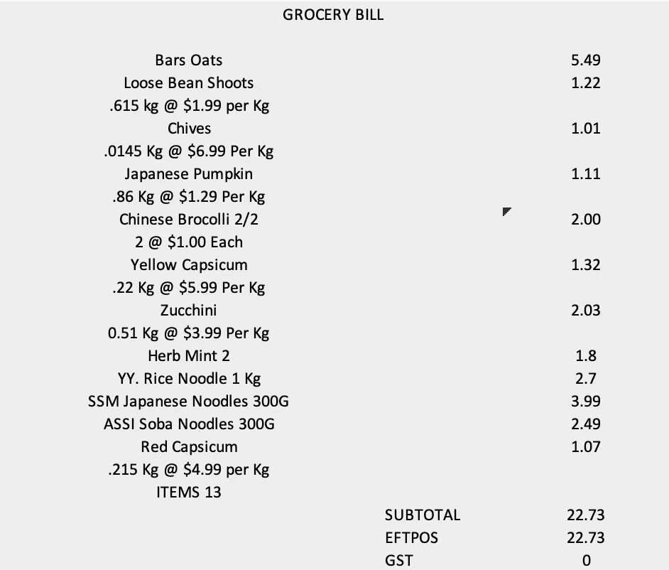

# 如何进行市场篮子分析

> 原文：<https://towardsdatascience.com/how-to-conduct-market-basket-analysis-f14f391a8625?source=collection_archive---------17----------------------->

## 通过关联分析研究消费者偏好和生活方式


罗布·麦克斯韦在 [Unsplash](https://unsplash.com/s/photos/shopping-grocery?utm_source=unsplash&utm_medium=referral&utm_content=creditCopyText) 上的照片

购物篮分析是大型零售商用来发现商品之间隐藏关联的关键技术之一。市场购物篮分析使用交易数据，即客户在一次购买中购买的所有商品的列表，来确定一起订购或购买的商品，并确定共现模式。这种强有力的分析有助于揭示消费者的偏好，而通过在线调查获取这些偏好是非常具有挑战性的。零售商使用市场购物篮分析的结果来指导商店中的产品放置、跨类别和联合营销促销等。

## 介绍

我上次购物的经历相当不可预测。我在一家亚洲商店买了一些东西。这是我的购物篮。



该列表将与其他顾客的数千次购物或购物篮一起进入商店数据库的一行。关联规则挖掘是从存储在数据库中的交易数据中提取有用信息的最流行的方法之一。项目集是从杂货店所有待售项目中选择的项目集合。一个项目集可以包含 2、3 个项目，依此类推。关联规则确定项目集中项目之间的关系。然后，这些关系被用于构建包含所购买商品的 IF-Then 规则的配置文件。

这些规则可以写成:

```
If {A} Then {B}
```

规则的 IF 部分称为前提，规则的 THEN 部分称为结果。因此，前因是条件，结果是结果。关联规则有三个共同决定规则强度的关键度量:支持度、置信度和提升度。

让我们假设有 100 个客户。其中 10 个人带了牛奶，8 个人买了黄油，6 个人两个都买了。如果我们要评估关联规则“如果有人买牛奶，他们也会买黄油”，那么关联规则的**支持度**可以计算为:

(牛奶和黄油的概率)或者换句话说(包含牛奶和黄油的篮子的数量)/(总篮子的数量)

```
Support = (Probability of Milk and Butter) = 6/100 = 0.06
```

0.06 的支持标准意味着每一百个市场篮子中有六个既有牛奶又有黄油。

**置信度** =前件中项目集的支持度除以项目集的支持度。换句话说，它是条件概率 P(黄油|牛奶),计算如下:

```
Confidence of P(B|A) = P(AB) / P(A) => (Probability of Milk and Butter) / (Probability of Milk)
OR
Confidence = Support / P (Milk)
OR
Confidence = 0.06 / (10/100) = 0.06/0.1 = 0.6
```

最后， **lift** 是相对预测置信度的度量。在关联规则“如果牛奶那么黄油”中，假设顾客已经购买了牛奶，我们可以用这种信心来预测他将购买黄油。

```
Lift = P(B|A) / P(B)
or
Lift = Confidence / P(Butter) = 0.6 / (8/100) = 0.6/0.08 = 7.5
```

提升值大于 1 反映了更强的关联性。

## 数据集和探索性数据分析

为了这个分析，我利用了一个由 Hahsler，Hornik 和 Reutterer (2006)分析的食品杂货数据集。总共有 9835 笔交易，包含 169 个不同的杂货项目。

```
grocery_data = data("Groceries")
#Show dimensions of the dataset
print(dim(Groceries))
print(dim(Groceries)[1]) # 9835 market baskets for shopping trips
print(dim(Groceries)[2]) # 169 initial store itemssummary(Groceries)
```

仔细观察数据集，可以发现每一行都有一个项目子集。

```
# Let's take a look at the first 5 transactions
inspect(Groceries[1:5])
    items                                                                
[1] {citrus fruit,semi-finished bread,margarine,ready soups}             
[2] {tropical fruit,yogurt,coffee}                                       
[3] {whole milk}                                                         
[4] {pip fruit,yogurt,cream cheese ,meat spreads}                        
[5] {other vegetables,whole milk,condensed milk,long life bakery product}
```

让我们看一下频率图，以确定商品出现在市场购物篮中的频率。我们将支持度设置为 0。确保地块中的每个项目至少出现在每 10 个购物篮中

```
itemFrequencyPlot(Groceries, support = 0.025, cex.names=0.8, xlim = c(0,0.3),type = "relative", horiz = TRUE, col = "dark red", las = 1,
xlab = paste("Proportion of Market Baskets Containing Item",
"\n(Item Relative Frequency or Support)"))
```


R 中的项目频率图

让我们来看看购物篮中最常出现的 20 种商品。

```
# Plot the frequency of top 20 items
itemFrequencyPlot(Groceries,topN = 20)
```


R 中的项目频率图

所以全脂牛奶、蔬菜、面包卷、苏打水和酸奶是商店里最常购买的五种商品。

## 关联规则挖掘

R 中 arules 包实现的 Apriori 算法有助于挖掘关联规则。通过将支持度和置信度的阈值设置为 0.025 和 0.05，获得一组 344 个规则。

```
rules <- apriori(groceries, parameter = list(support = 0.025 , confidence = 0.05))AprioriParameter specification:
 confidence minval smax arem  aval originalSupport maxtime support minlen maxlen target  ext
       0.05    0.1    1 none FALSE            TRUE       5   0.025      1     10  rules TRUEAlgorithmic control:
 filter tree heap memopt load sort verbose
    0.1 TRUE TRUE  FALSE TRUE    2    TRUEAbsolute minimum support count: 245set item appearances ...[0 item(s)] done [0.00s].
set transactions ...[55 item(s), 9835 transaction(s)] done [0.03s].
sorting and recoding items ... [32 item(s)] done [0.00s].
creating transaction tree ... done [0.01s].
checking subsets of size 1 2 3 4 done [0.00s].
writing ... [344 rule(s)] done [0.00s].
creating S4 object  ... done [0.00s].> rules
set of 344 rules
```

让我们研究一下按提升值排序的前 10 个关联规则。

```
inspect(sort(rules,by="lift")[1:10])
```


手动检查所有 344 个关联规则将是极其令人厌烦的，并且不是可行的选择。使用 R 包 arulesViz，我们将实现可视化技术来探索这些关系。

## 关联规则可视化

可以查看水平轴为支撑、垂直轴为提升的散点图。点的颜色编码与置信度有关。

```
plot(rules,measure = c("support","lift"),shading="confidence")
```


Unwin、Hofmann 和 Bernt (2001)介绍了一种特殊版本的散点图，称为双键图。这里，支持度和置信度分别代表 X 轴和 Y 轴，色点用于指示“顺序”，即每个规则中包含的项目数。

```
plot(rules,shading="order",control=list(main="Two-Key plot"))
```


从上面的情节可以清楚地看出，顺序和支持度是成反比的。

下图以矩阵气泡图的形式提供了已识别关联规则的更清晰视图。关联规则的前件(左侧)中的项目表示在矩阵顶部的标签中，而关联规则的后件(右侧)中的项目表示在矩阵的右侧。支持度由每个气泡的大小表示，提升度由颜色强度反映。

```
plot(rules,method="grouped",control=list(col=rev(brewer.pal(9,"Greens")[4:9])))
```


现在，如果我要确定哪些产品是通常与蔬菜一起购买的，我可以从总体关联规则中过滤并报告数据。下面我按照 lift 对这些规则进行排序，并找出前 10 个关联规则。

```
vegie.rules <- subset(rules,subset=rhs %pin% "vegetables")
inspect(sort(vegie.rules,by="lift")[1:10])
```


接下来，我在下面的网络图中表示了经常购买的蔬菜产品的关联规则。

```
plot(top.vegie.rules,method = "graph",control = list(type="items"),shading = "lift" )
```


从网络图中可以明显看出，顾客在购买蔬菜时可能会购买牛肉、奶制品、农产品、面包和香肠。

## 结论

作为相对频率或概率估计，支持值位于 0 到 1 之间。只要不是非常低，较低的支持值是可以的。置信度也取 0 到 1 之间的值，因为它是一个条件概率度量。更高的置信度值通常是优选的。最后，提升值需要大于 1.0 才能被管理层重视。

我们上面所做的分析本质上是描述性的，因为分析购物数据是为了研究购物行为。将这一分析带入下一步，就是在商场和地面上实施这项研究的见解。

零售商经常使用关联规则的发现来做出关于商店布局、产品捆绑或交叉销售的决策。商店经理也在进行地面实验，如 A/B 测试，以研究购物者对新商店布局的反应。这是一项正在进行的令人着迷的研究，旨在真正测试购物篮预测模型的性能。

所以下次你走进当地超市，发现安排已经改变，你现在知道为什么了。

## 参考

我要特别感谢米勒教授的指导和启发。我在西北大学攻读数据科学硕士课程期间曾在他的课上学习过，他的书和他的课对我的数据科学生涯产生了深远的影响。我的工作借鉴了以下文献:

托马斯·w·米勒(2014) [预测分析中的建模技术](https://www.amazon.com/s?k=modeling+techniques+in+predictive+analytics&i=digital-text&ref=nb_sb_noss_2)

米（meter 的缩写））Hahsler，S. Chelluboina (2015) [可视化关联规则:R-extension aruleviz 简介](https://www.researchgate.net/publication/228961197_Visualizing_Association_Rules_Introduction_to_the_R-extension_Package_arulesViz)

[Rstat 构建菜篮子模型](https://webfocusinfocenter.informationbuilders.com/wfappent/TLs/TL_rstat/source/marketbasket49.htm)