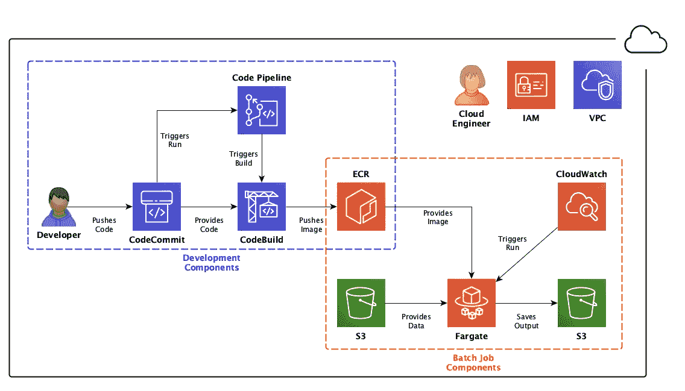

# 如何在 AWS 上为 Fargate 任务配置 IAM 角色

> 原文：<https://towardsdatascience.com/how-to-configure-iam-roles-for-fargate-tasks-on-aws-76ad54f11314?source=collection_archive---------18----------------------->

## 基本思想和具体实现

这篇博文是关于 AWS 上无服务器批处理作业的特定类型架构的三篇技术深度文章之一。如果你想了解更多关于云设置的背景，请点击[这里](https://blog.codecentric.de/en/2020/06/cost-effective-batch-jobs-on-aws-serverless-infrastructure/)了解更多细节。已实现服务的总体情况如下所示:

完整的架构(作者插图)。

简而言之，该架构由一个用于开发的组件块和另一个用于执行批处理作业的组件块组成。对于这篇博文，我们只关注这个架构的**角色和策略**。还有一个[公共代码库](https://github.com/timo-boehm/serverless_batch_aws)，允许你基于 Cloudformation 脚本复制完整的服务及其所有部分。

当我们谈到角色和策略时，我们会谈到**身份和访问管理(IAM)** 。It 构成了每个 AWS 云架构的主要安全块。IAM 限制了在给定的云环境中哪个实体可以做什么。对于这篇博文，您需要理解两个概念:**角色**和**策略**。

当用户或服务想要在云中做一些事情时，他们承担**角色**。当您指定一个角色时，您可以限制可以使用它的实体的类型。例如，您可以为人类用户定义一个角色，允许他们查看所有内容，但不能更改任何内容。如果 AWS 服务试图使用该角色，它会失败。将角色视为用户或服务在您的云环境中可以做什么的组织保护伞。

**策略**，相反，列出了角色可以执行的具体动作。与角色限制哪个实体可以承担它们一样，策略也限制它们可以使用哪些资源。

当你设计你的角色和政策时，坚持最小特权原则。也就是说，只允许服务需要的访问和操作。超出这个范围的任何扩展都是潜在的安全问题。例如，如果服务需要将数据写入 S3 存储桶，您不应该实现允许所有 S3 操作的策略。

在我们进入大图之前，让我们先从云形成脚本的小入门开始。如果你已经有了云形成或者类似概念的经验，你可以略读或者跳过下面三段。

**CloudFormation** 是针对*基础设施的 AWS 服务，代码为*。也就是说，您定义一个目标基础设施，将其推送给 AWS，AWS 为您提供它。您将资源组织在所谓的堆栈中，这使得调整、监控或删除它们变得非常容易。

您可以在 JSON 或 YAML 文件中编写 CloudFormation 脚本。这里和代码库中的所有例子都是 YAML 文件，但是您也可以在 JSON 中做同样的事情。

还有一组专门针对 CloudFormation 的命令可供您使用。在接下来的例子中，我使用了其中的三个:

1.  **！Ref** 是内部参考；也就是说，CloudFormation 从同一个脚本中插入一个值。
2.  **！Sub** 用于将变量替换成字符串。
3.  **！GetAtt** 类似于“！Ref”但是指向资源的特定属性，而不是一般的引用。

# 大局

从角色和策略的角度来看，我们必须考虑服务的两个组成部分。对于每个部分，我们需要确定哪些服务需要与其他服务进行交互。没有传出交互的服务，如 S3 或代码库，可以保持原样。需要与其他组件进行交互的服务需要允许它们这样做的策略。

对于**开发组件**，我们需要确保我们可以构建一个容器映像并将其推送到注册表中。对于**批处理作业组件**，我们需要确保触发器可以运行来自注册表的最新容器映像。

为了避免抽象的思考，让我们深入实现细节。我为每个构建块提供了一个概览图，以便您可以直观地了解。

# 实施细节

如前所述，角色是策略的组织保护伞。为了简单起见，本例中的每个角色都只与一个策略相关。在我们研究每个策略之前，让我向您介绍一下角色的两个主要属性:

1.  AssumeRolePolicyDocument 定义了哪个服务可以承担这个角色。文档的*主体*部分(参见下面的代码片段以了解详细信息)描述了这一点。*动作*部分的 *sts* 是 **AWS 安全令牌服务**的缩写。该服务提供临时凭据来验证操作。
2.  ManagedPolicyArns 指的是与该角色相关联的策略文档。ARN 是一个亚马逊资源名称，作为在 AWS 上创建的资源的 ID。

下面是以 CodeBuild 角色为例的 CloudFormation 中的情况:

最佳实践是为架构的每个组件定义一个角色。从技术上讲，您可以将策略嵌入到您的角色定义中。但是，如果创建一个单独的策略资源，阅读和维护起来会更容易。

# 发展部分的政策

开发工作流中涉及到两个服务:**代码管道**和**代码构建**。CodePipeline 是一个编排工具，每当开发人员将新版本的主分支推送到代码存储库时，它就会触发 CodeBuild 项目。

代码管道策略(作者举例说明)。

首先，让我们看看**代码管道**。在我们的场景中，服务需要与三个服务交互:

*   它需要从 **CodeCommit** 接收更新，以在主分支中注册更改。
*   反过来，它需要触发相关的 **CodeBuild** 项目的新运行。
*   它需要能够保存和收集从 **S3** 工件。

下面是 CodePipeline 在 CloudFormation 中的角色和相关策略:

> **注意:**为了简单起见，在这个例子和下面的例子中，我没有限制资源。在现实世界的实现中，最小特权原则也要求您最小化被访问的资源！

代码构建策略(作者举例说明)。

其次，还有 **CodeBuild** 。它涉及四种不同的服务。

*   它需要从 **CodeCommit** 中克隆存储库。
*   它需要读写来自 **S3** 的工件。
*   它需要将新图像推送到**弹性容器注册中心(ECR)** 。
*   它需要将日志信息写入 **CloudWatch** 。

最后一点是可选的，但是我保证如果你漏掉了它，你会后悔的。相应的 CloudFormation 脚本如下所示:

开发组件的两个角色应该是不言自明的。现在事情变得有点复杂了。

# 批处理作业组件的策略

我们现在要为批处理作业定义角色和策略。也就是说，对于 Fargate 任务和触发它的 CloudWatch 规则。让我们先从稍微令人困惑的一个开始:Fargate 任务。

虽然在架构图中一个盒子代表了 **Fargat 任务**，但是它需要两个角色。想想你和老板的关系。你的老板有权给你分配任务。你需要工具来完成指定的工作。这也是你为法盖特所需要的。一个执行角色，也称为“老板角色”，一个任务角色，也称为“员工角色”

Fargate policies(作者插图)。

**执行角色**包含对两个服务的访问:

*   它需要访问**弹性容器注册表(ECR)** 中的容器图像。否则，它将无法加载和启动批处理作业的容器映像。
*   与 CodeBuild 类似，它需要将日志信息写入 **CloudWatch** 。

下面是 CloudFormation 中执行角色及其策略的样子:

**任务角色**的重要策略取决于开发人员在容器映像中放入了什么。也就是说，不知道开发人员实现了什么，您就不能决定正确的策略集。让我们假设该任务从 S3 加载一些数据，对其进行转换，并将其写回到另一个桶中。在这个简单的例子中，您需要为任务角色配置两个服务:

*   它需要访问 **S3** 桶来获取数据并保存输出。
*   它需要将日志信息写入 **CloudWatch** 。

有关详细信息，请查看 CloudFormation 规范:

同样，特定的资源和操作完全取决于容器映像中实现的业务逻辑。

CloudWatch 政策(作者插图)。

最后是 **CloudWatch 规则**，它触发批处理作业。它的角色和政策也很简单，涉及两种服务:

*   如果需要，它需要访问 **IAM** 来将角色传递给 Fargate 任务。
*   它需要访问**弹性容器服务(ECS)** ，这是 **Fargate** 背后的编排服务。

这是云形成规范:

在这一点上，一个自然的问题是:为什么有几个地方允许访问 CloudWatch 日志？为什么不为日志记录定义一个策略，并将它附加到所有需要它的角色上呢？

避免这种情况的一个主要原因是:共享策略增加了资源之间的依赖性。这些依赖会在以后反噬你。如果您更改由几个角色承担的策略，您可能会在没有意识到的情况下破坏东西。

我希望这篇文章能帮助你更好地理解如何思考和构建 IAM 角色和策略。同样，如果你想了解更多关于架构的知识，请参考[概念文章](https://blog.codecentric.de/en/2020/06/cost-effective-batch-jobs-on-aws-serverless-infrastructure/)。如果你打算重建它，看看[公共代码库](https://github.com/timo-boehm/serverless_batch_aws)。此外，很快还会有一篇文章将这一讨论扩展到整个服务的具体构建块。如果你对这种服务的网络方面更感兴趣，我已经给[写了一篇关于这个](/network-configurations-for-fargate-tasks-6333314c4001)的博文。

请在评论中告诉我你的想法和经历。我也很乐意在 [Twitter](https://twitter.com/timo_data) 和 [LinkedIn](https://www.linkedin.com/in/timo-boehm-datascience/) 上联系。感谢您的阅读！