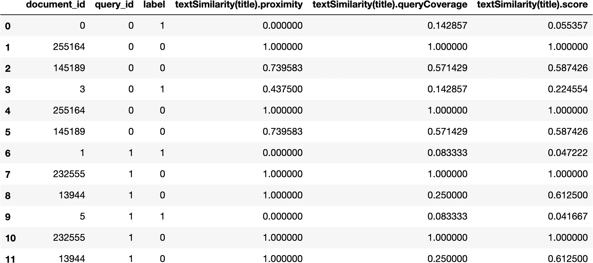
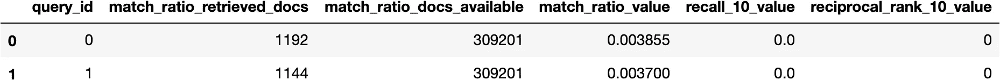

# 如何从 python 连接搜索应用程序并与之交互

> 原文：<https://towardsdatascience.com/how-to-connect-and-interact-with-search-applications-from-python-520118139f69?source=collection_archive---------59----------------------->

## 一个 [pyvespa](https://pyvespa.readthedocs.io/en/latest/index.html) 图书馆概述:连接、查询、收集数据和评估查询模型。

[Vespa](https://vespa.ai/) 是目前可用的更快、更具扩展性和更先进的搜索引擎，imho。它有一个原生张量评估框架，可以执行[近似最近邻搜索](https://blog.vespa.ai/approximate-nearest-neighbor-search-in-vespa-part-1/)并部署 NLP 建模的最新进展，如 [BERT 模型](https://blog.vespa.ai/efficient-open-domain-question-answering-on-vespa/)。

*这篇文章将通过* [*pyvespa 库*](https://pyvespa.readthedocs.io/en/latest/index.html) *向您概述 Vespa python API。* ***该库的主要目标是允许更快的原型开发，并促进 Vespa 应用的机器学习实验。***


[大卫·克洛德](https://unsplash.com/@davidclode?utm_source=unsplash&utm_medium=referral&utm_content=creditCopyText)在 [Unsplash](https://unsplash.com/s/photos/python?utm_source=unsplash&utm_medium=referral&utm_content=creditCopyText) 上的照片

我们将连接到 [CORD-19 搜索应用](https://cord19.vespa.ai/)，并在此将其作为示例。您可以稍后使用自己的应用程序来复制以下步骤。未来的帖子将会更深入地讨论本概述教程中描述的每个主题。

你也可以从 [Google Colab](https://colab.research.google.com/github/vespa-engine/pyvespa/blob/master/docs/sphinx/source/connect-to-vespa-instance.ipynb) 运行这里包含的步骤。

## 安装

警告:库正在开发中，可能会发生向后不兼容的变化。欢迎反馈和贡献。

这个库可以在 PyPI 上获得，因此可以和`pip`一起安装。

```
!pip install pyvespa
```

## 连接到正在运行的 Vespa 应用程序

我们可以通过使用适当的 url 创建一个 [Vespa](/reference-api.rst#vespa.application.Vespa) 的实例来连接到一个正在运行的 Vespa 应用程序。产生的`app`将用于与应用程序通信。

```
from vespa.application import Vespa

app = Vespa(url = "https://api.cord19.vespa.ai")
```

## 定义查询模型

> 轻松定义匹配和排名标准

在构建搜索应用程序时，我们通常希望尝试不同的查询模型。一个[查询](/reference-api.rst#vespa.query.Query)模型由匹配阶段和排序阶段组成。匹配阶段将定义如何基于发送的查询匹配文档，排名阶段将定义如何对匹配的文档进行排名。这两个阶段都可能变得相当复杂，能够轻松地表达和试验它们是非常有价值的。

在下面的例子中，我们将匹配阶段定义为[weak](/reference-api.rst#vespa.query.WeakAnd)和 [ANN](/reference-api.rst#vespa.query.ANN) 操作符的[联合](/reference-api.rst#vespa.query.Union)。`WeakAnd`将根据查询术语匹配文档，而近似最近邻(`ANN`)操作符将根据查询和文档嵌入之间的距离匹配文档。这说明了在 Vespa 中结合术语和语义匹配是多么容易。

```
from vespa.query import Union, WeakAnd, ANN
from random import random

match_phase = Union(
    WeakAnd(hits = 10), 
    ANN(
        doc_vector="title_embedding", 
        query_vector="title_vector", 
        embedding_model=lambda x: [random() for x in range(768)],
        hits = 10,
        label="title"
    )
)
```

然后，我们定义由已经在[应用程序模式](https://github.com/vespa-engine/sample-apps/blob/master/vespa-cloud/cord-19-search/src/main/application/schemas/doc.sd)中定义的`bm25` rank-profile 完成的排名。在本教程的后面，我们将`list_features=True`设置为能够收集排名特征。在定义了`match_phase`和`rank_profile`之后，我们可以实例化`Query`模型。

```
from vespa.query import Query, RankProfile

rank_profile = RankProfile(name="bm25", list_features=True)

query_model = Query(match_phase=match_phase, rank_profile=rank_profile)
```

## 查询 vespa 应用程序

> 通过查询 API 发送查询。更多示例参见[查询页面](/query.ipynb)。

我们可以使用刚刚定义的`query_model`通过`query`方法向应用程序发出查询。

```
query_result = app.query(
    query="Is remdesivir an effective treatment for COVID-19?", 
    query_model=query_model
)
```

我们可以看到 Vespa 检索到的文档数量:

```
query_result.number_documents_retrieved1121
```

以及返还给我们的文件数量:

```
len(query_result.hits)10
```

## 标记数据

> 如何构造标签数据

我们经常需要通过 ML 评估查询模型或者收集数据来改进查询模型。在这两种情况下，我们通常需要带标签的数据。让我们创建一些带标签的数据来说明它们的预期格式以及它们在库中的用法。

每个数据点包含一个与查询相关的`query_id`、一个`query`和`relevant_docs`。

```
labelled_data = [
    {
        "query_id": 0, 
        "query": "Intrauterine virus infections and congenital heart disease",
        "relevant_docs": [{"id": 0, "score": 1}, {"id": 3, "score": 1}]
    },
    {
        "query_id": 1, 
        "query": "Clinical and immunologic studies in identical twins discordant for systemic lupus erythematosus",
        "relevant_docs": [{"id": 1, "score": 1}, {"id": 5, "score": 1}]
    }
]
```

默认分配`"score": 0`不相关的文档。如果标签数据中缺少该字段，相关文档将默认分配`"score": 1`。相关和不相关文档的默认值都可以通过适当的方法进行修改。

## 收集培训数据

> 收集培训数据以分析和/或改进排名功能。更多示例参见[收集训练数据页面](/collect-training-data.ipynb)。

我们可以根据具体的[查询](/reference-api.rst#vespa.query.Query)模型，用 [collect_training_data](/reference-api.rst#vespa.application.Vespa.collect_training_data) 方法收集训练数据。下面我们将为每个查询收集两个文档，以及相关的文档。

```
training_data_batch = app.collect_training_data(
    labelled_data = labelled_data,
    id_field = "id",
    query_model = query_model,
    number_additional_docs = 2,
    fields = ["rankfeatures"]
)
```

默认情况下，会返回许多等级要素。我们可以选择其中的一些进行检查:

```
training_data_batch[
    [
        "document_id", "query_id", "label", 
        "textSimilarity(title).proximity", 
        "textSimilarity(title).queryCoverage", 
        "textSimilarity(title).score"
    ]
]
```



## 评估查询模型

> 定义度量并评估查询模型。更多示例参见[评估页](/evaluation.ipynb)。

我们将定义以下评估指标:

*   每次查询检索到的文档百分比
*   每次查询召回 10 次
*   每次查询 MRR @ 10

```
from vespa.evaluation import MatchRatio, Recall, ReciprocalRank

eval_metrics = [MatchRatio(), Recall(at=10), ReciprocalRank(at=10)]
```

评估:

```
evaluation = app.evaluate(
    labelled_data = labelled_data,
    eval_metrics = eval_metrics, 
    query_model = query_model, 
    id_field = "id",
)
evaluation
```

