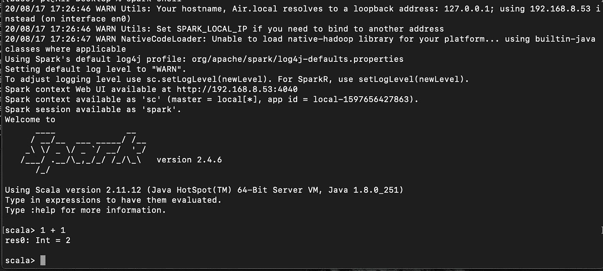
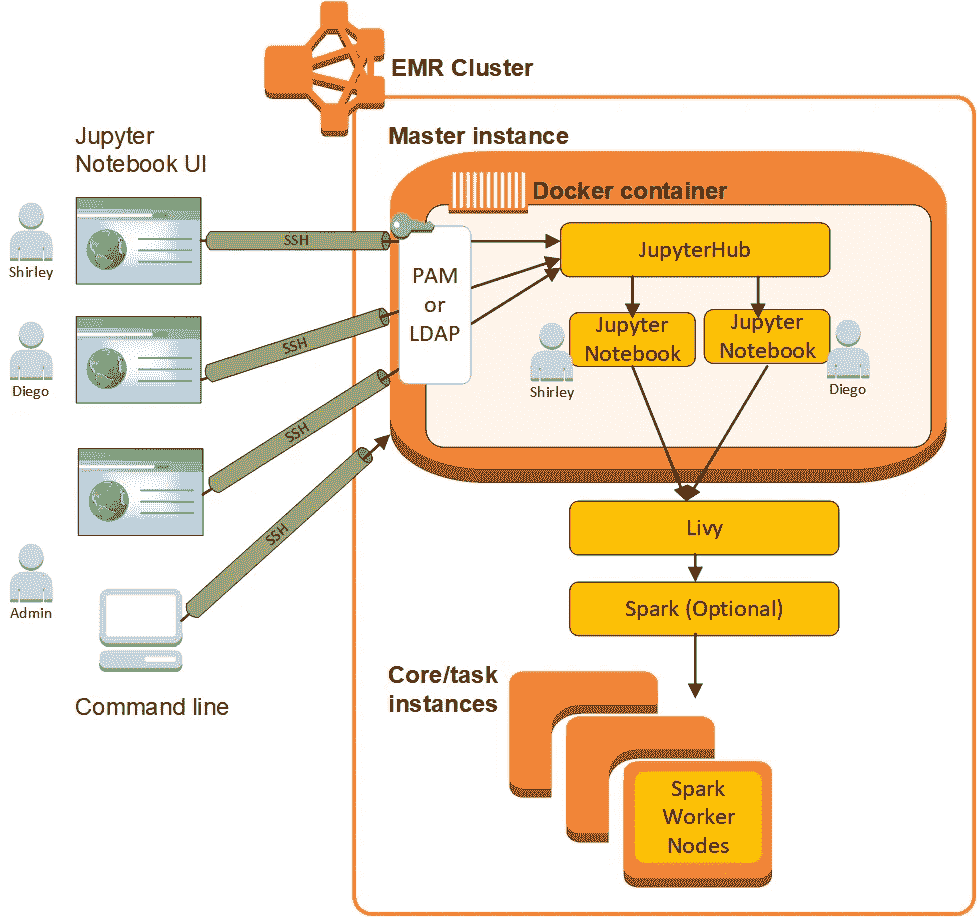
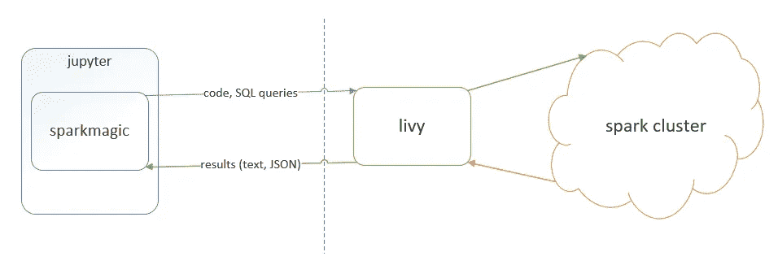
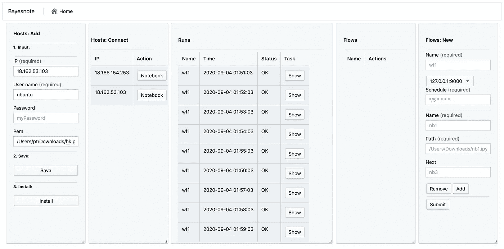

# 如何将 Jupyter 笔记本连接到远程 spark 集群，每天运行 spark 作业？

> 原文：<https://towardsdatascience.com/how-to-connect-jupyter-notebook-to-remote-spark-clusters-and-run-spark-jobs-every-day-2c5a0c1b61df?source=collection_archive---------8----------------------->

作为一名数据科学家，您正在开发笔记本电脑，用于处理不适合使用 Spark 的笔记本电脑的大量数据。你会怎么做？这不是一个微不足道的问题。

让我们从最简单的解决方案开始，不用在你的笔记本电脑上安装任何东西。

1.  “无笔记本”:SSH 进入远程集群，并在远程集群上使用 Spark shell。
2.  “本地笔记本”:对数据进行下采样，并将数据提取到您的笔记本电脑中。

“没有笔记本”的问题是开发者体验在 Spark shell 上是不可接受的:

1.  你不能像在 Jupyter 笔记本或 Zeppelin 笔记本上那样轻易地修改代码并打印出结果。
2.  很难显示 Shell 中的图像/图表。
3.  在远程机器上用 git 进行版本控制是很痛苦的，因为你必须从头开始设置，并像 git diff 一样进行 git 操作。



火花壳截图

第二个选项“本地笔记本”:您必须对数据进行下采样，并将数据拖到您的笔记本电脑上(下采样:如果您的集群上有 100GB 的数据，您可以将数据下采样到 1GB，而不会丢失太多重要信息)。然后你可以在本地的 Jupyter 笔记本上处理数据。

它产生了一些新的令人痛苦的问题:

1.  您必须编写额外的代码来缩减数据采样。
2.  缩减采样可能会丢失有关数据的重要信息，尤其是在处理可视化模型或机器学习模型时。
3.  你必须花费额外的时间来确保你的代码为原始数据。如果没有，就要花额外的时间来找出问题所在。
4.  您必须保证本地开发环境与远程集群相同。否则，它很容易出错，并可能导致难以检测的数据问题。

好吧，“无笔记本”和“本地笔记本”显然不是最好的做法。如果您的数据团队可以访问云，例如 AWS，会怎么样？是的，AWS 在其 EMR 集群和 SageMaker 上提供 Jupyter 笔记本。笔记本服务器通过 AWS Web 控制台进行访问，当集群准备就绪时，它就可以使用了。

这种方法被称为“云上远程笔记本”。



AWS EMR 和由 AWS 提供的 Jupyter 笔记本电脑

“云上的远程笔记本电脑”的问题有

1.  每次集群开始运转时，您都必须设置您的开发环境。
2.  如果你想让你的笔记本运行在不同的集群或区域，你必须手动&重复地完成。
3.  如果集群意外终止，您将丢失在这些集群上所做的工作。

具有讽刺意味的是，这种方法是可以访问 AWS 的数据科学家中最受欢迎的方法。这可以用**最省力的**原理**来解释:**它提供了对远程集群的一键式访问，以便数据科学家可以专注于他们的机器学习模型、可视化和业务影响，而无需在集群上花费太多时间。

除了“无笔记本”、“本地笔记本”和“云上的远程笔记本”，还有将笔记本电脑上的 spark 指向远程 spark 集群的选项。代码通过本地笔记本提交，并发送到远程 spark 集群。这种方法被称为“桥接本地和远程火花”。

创建 sparkSession 时，可以使用 set remote master

```
val spark = SparkSession.builder()
.appName(“SparkSample”)
.master(“spark://123.456.789:7077”)
.getOrCreate()
```

这些问题是

1.  你必须找出如何认证你的笔记本电脑远程火花集群。
2.  仅当 Spark 作为独立部署而不是 YARN 部署时，它才有效。如果您的 spark 集群部署在 YARN 上，那么您必须将远程集群上的配置文件`/etc/hadoop/conf`复制到您的笔记本电脑上，并重启您的本地 spark，假设您已经知道如何在您的笔记本电脑上安装 Spark。

如果您有多个 spark 集群，那么您必须通过复制配置文件来来回切换。如果集群在云上是短暂的，那么它很容易变成一场噩梦。

“桥接本地和远程火花”对大多数数据科学家来说并不奏效。幸运的是，我们可以把注意力转回到 Jupyter 笔记本上。有一个名为“Sparkmagic”的 Jupyter 笔记本内核，它可以将您的代码发送到远程集群，假设 Livy 安装在远程 spark 集群上。这一假设适用于所有云提供商，在 Apache Ambari 的帮助下，在内部 spark 集群上安装并不困难。



火花魔法建筑

看起来“火花魔法”是目前最好的解决方案，但为什么它不是最受欢迎的。有两个原因:

1.  很多数据科学家都没有听说过“Sparkmagic”。
2.  数据科学家很难解决安装、连接和认证问题。

为了解决问题 2，sparkmagic 推出了随时可用的 Docker 容器。Docker 容器确实解决了安装中的一些问题，但它也给数据科学家带来了新的问题:

1.  docker 容器是为航运应用程序设计的，它的学习曲线对数据科学家来说并不友好。
2.  它不是为来自不同技术背景的数据科学家直观使用而设计的。

关于 docker 容器的讨论就到此为止，另一篇解释如何让 Docker 容器真正为数据科学家工作的文章将在几天后发表。

总而言之，我们有两类解决方案:

1.  笔记本&笔记本内核:“无笔记本”、“本地笔记本”、“云上远程笔记本”、“Sparkmagic”
2.  Spark 本身:“连接本地和远程 spark”。

尽管存在安装和连接问题，“Sparkmagic”仍是推荐的解决方案。然而，通常还有其他未解决的问题会降低生产率并损害开发人员的体验:

1.  如果需要其他语言 python 和 R 在集群上运行呢？
2.  如果笔记本要每天运行会怎样？如果只有在另一台笔记本运行成功时才运行该笔记本，该怎么办？

让我们回顾一下当前的解决方案:

1.  设置远程 Jupyter 服务器和 SSH 隧道(R[reference](https://www.digitalocean.com/community/tutorials/how-to-install-run-connect-to-jupyter-notebook-on-remote-server))。这肯定是可行的，但设置起来需要时间，而且笔记本电脑都在远程服务器上。
2.  设置 cron 调度程序。大多数数据科学家都接受 cron scheduler，但是如果笔记本无法运行呢？是的，shell 脚本会有所帮助，但是大多数数据科学家都愿意编写 shell 脚本吗？即使答案是肯定的，数据科学家也不得不 1。访问已完成的笔记本 2。获取状态更新。即使有数据科学家乐于编写 shell 脚本，为什么每个数据科学家都要编写自己的脚本来自动化完全相同的东西呢？
3.  设置气流。这是一个在数据工程师中非常受欢迎的解决方案，它可以完成工作。如果有数据工程师或数据平台工程师支持的 Airflow 服务器，数据科学家可以设法学习 Airflow 的操作人员，并让它为 Jupyter Notebook 工作。
4.  设置 Kubeflow 和其他基于 Kubernetes 的解决方案。诚然，kubeflow 可以完成工作，但实际上有多少数据科学家可以访问 Kubernetes 集群，包括运行在云上的托管解决方案？

让我们重新定义这些问题:

1.  如何在能够访问远程集群的本地笔记本电脑上进行开发？
2.  如何在远程集群上操作？

Bayesnote 实施的解决方案可以在 5 分钟内完成所有工作。Bayesnote 是用于 Jupyter 笔记本的笔记本编排平台:

*   在 5 分钟内协调不同集群上的笔记本电脑
*   一键访问远程 Jupyter 笔记本电脑
*   运行具有依赖性的 Jupyter 笔记本，然后重试
*   一键查看输出笔记本

那儿有

*   没有学习曲线。不需要学习抽象概念，也不需要 docker/Kubernetes 知识。
*   无运营成本。没有额外的数据库安装，没有端口打开。它可以毫无困难地将自己安装到集群中。



Bayesnote

教程可以在 https://github.com/Bayesnote/Bayesnote[找到](https://github.com/Bayesnote/Bayesnote)