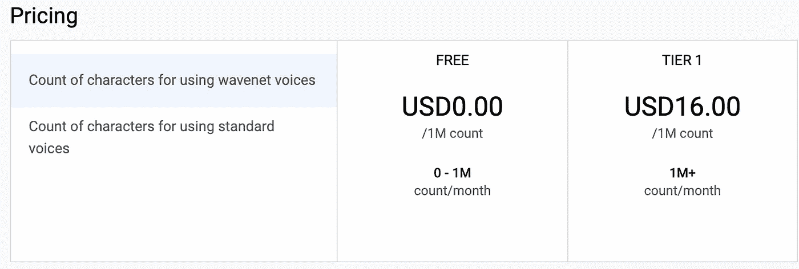

# 如何将 Python 连接到 Google Cloud 的文本到语音转换

> 原文：<https://towardsdatascience.com/how-to-connect-python-to-google-clouds-text-to-speech-d918dc6a393b?source=collection_archive---------20----------------------->


布雷特·乔丹在 [Unsplash](https://unsplash.com?utm_source=medium&utm_medium=referral) 上的照片

所以你可能想知道[谷歌云的文本到语音](https://cloud.google.com/text-to-speech)和其他文本到语音有什么不同。首先，由于人工智能的力量(这些被称为 wavenet voices)，它可以将文本转换为听起来更自然的语音。

所以我实际上遇到了这项技术，因为我想在 YouTube 上制作教学视频。自从在家工作发生后，我一直无法创造一个可以创作画外音的空间。最棒的是它附带的免费层，所以任何人都可以尝试这段代码！



如果你想继续下去，谷歌 Colab 笔记本的副本可以在这里找到。

## 设置

没有任何进一步的犹豫，让我们继续前进，并开始设置它。我们要做的第一件事是登录我们的谷歌账户，然后进入[谷歌云的文本到语音转换 API](https://console.cloud.google.com/marketplace/product/google/texttospeech.googleapis.com?q=text&id=d0bc4aeb-b91e-47bc-bd5a-01894bf3a648&project=deep-lore-292922) 。我们现在要通过单击“enable”来激活它。它会要求你付费，但不要担心，除非你超过免费层，否则它不会向你收费。

因为我是在 Google Colab 笔记本上运行的，所以您需要创建一个服务帐户并下载一个 JSON 密钥文件。这样做的指令将位于[这里](https://cloud.google.com/storage/docs/authentication#generating-a-private-key)。我现在把 JSON 文件放在我的 Google Drive 中。请记住，我希望这完全在线。所以我想运行的第一部分代码是连接到 Google Drive。

```
from google.colab import drivedrive.mount('/content/drive')
```

一旦我连接到驱动器，我现在想找到那个 JSON 文件。我创建了一个名为 text2speech 的文件夹，放在那里。这是我们进行身份验证所需要的。

```
import osos.environ['GOOGLE_APPLICATION_CREDENTIALS'] = '/content/drive/My Drive/text2speech project/My Project-e0a97add923c.json'!echo $GOOGLE_APPLICATION_CREDENTIALS
```

我们现在想安装谷歌云文本到语音库。我们可以通过在代码块中运行 pip 安装来实现这一点。

```
pip install --upgrade google-cloud-texttospeech
```

所以谷歌云的文本到语音转换很酷的一点是我们可以定制它。从音高到音调，甚至翻译语言。点击查看语音演示[。我勉强接受了`Wavenet J`的男声。既然我们已经选好了声音，剩下的就容易了。我们只需设置它并发送文本。我们将为此创建一个函数，它将文本输出到 mp3 文件。](https://cloud.google.com/text-to-speech/docs/voices)

```
def synthesize_text(text):"""Synthesizes speech from the input string of text."""from google.cloud import texttospeechclient = texttospeech.TextToSpeechClient()input_text = texttospeech.SynthesisInput(text=text)# Note: the voice can also be specified by name.# Names of voices can be retrieved with client.list_voices().voice = texttospeech.VoiceSelectionParams(language_code="en-US",name="en-US-Wavenet-J",ssml_gender=texttospeech.SsmlVoiceGender.MALE,)audio_config = texttospeech.AudioConfig(audio_encoding=texttospeech.AudioEncoding.MP3)response = client.synthesize_speech(request={"input": input_text, "voice": voice, "audio_config": audio_config})# The response's audio_content is binary.with open("output.mp3", "wb") as out:out.write(response.audio_content)print('Audio content written to file "output.mp3"')
```

非常容易。我们现在将向该函数发送一个文本字符串。这是文本字符串。

```
text = "Hello! My name is Wavenet J and I am running on Google Cloud's Text To Speech! Nice to meet you and thank you for reading my friend's article!"
```

现在我们把所有东西都装满了，准备好了。

```
mp3file = synthesize_text(text)
```

现在在最左边，我们想选择文件夹图标，现在可以下载我们的 mp3 文件，并听取一个舒缓的人工智能的声音！

## 结论

我向目前正在使用语音的人推荐这种方法。即使是从事自然语言处理的人。此外，如果你是一名教师，这将是一个完美的方式把讲座视频格式。这也很神奇，因为你可以翻译讲座和任何其他文本！