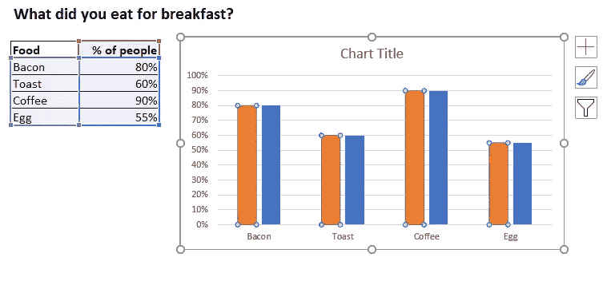

# 我是如何让学习数据变得有趣的！

> 原文：<https://towardsdatascience.com/how-to-construct-a-bar-chart-that-looks-like-a-fork-8163c35536e2?source=collection_archive---------64----------------------->

## 那是叉子还是条形图？为什么不两者都要？！

当你想到你在教授数据可视化的研讨会、视频和网站上看到的数据例子时，你会想到什么主题？销售，利润，计算部件……唉。无意义、枯燥、枯燥的数据。我们肯定能做得更好？

## 为什么这么严肃？

为普通观众设计学习练习意味着你需要找到每个人都能理解的数据。这可能很棘手，我明白了——金融方面的例子很有意义——每个人都知道钱和买东西，金融听起来对培训课程来说足够公司化了。但是我真的在乎西北区销量比南方多吗？不。这门课的其他人也不知道。我们什么时候再吃午饭？

相比之下，任何看过汉斯·罗斯林展示数据的人都会同意，即使是最严肃的数据也能以鼓舞人心、引人入胜的方式展示。现在我并不是建议数据可视化培训应该像汉斯展示他的材料一样以同样的兴趣和热情来展示，没有人能持续 8 个小时！

但是我们如何找到教授数据技能的中间地带呢？我们是否有足够的勇气以一种不把自己看得太重的方式教授严肃的技能？我们可以！

## 数据技能是严肃的，但是学习它并不否定乐趣！

以学习仪表板设计为例。我可能想教授的常见技能和技术包括:

*   比较数字(条形图)和整体部分(饼图或圆环图)的良好图表选择
*   通过直接标注数据而不是使用图例来减少混乱
*   有目的地使用颜色，例如用于不同图表中的共同元素

我可以使用以下简单的仪表板来演示这些内容:

运筹学

我可以用这个来做:

在每种情况下都需要同样的技能。两个仪表板展示了相同的关键数据可视化概念。但是制作一个更有趣！当你的同事问你在昨天的课程中学到了什么时，你更容易想起这些。

是的，我们可以坚持公司的颜色、严肃的展示风格，以及让首席财务官满意的东西。但是这有什么意思呢？把这些留到明天，当你在日常工作中运用新技能的时候。今天让我们享受自由吧！

## 所以，我们来学习一下如何做一个叉形条形图吧！

我在培训课程中使用这个练习作为我的基本条形图的补充练习。它旨在为已经在定期创建条形图或只想从数据中获得乐趣的学员增加一些新的技能。我通常不会像下面这样提供解决方案或步骤，因为我也喜欢把它作为创建可重用设计的一课。这使得这个练习更具挑战性！

如果你想挑战自己——不要继续读下去，现在就停下来，试着创建图表。不要使用任何文本框或形状(除了刀或叉子的手柄)。您应该能够自动更新类别名称或值和图形更新！然后回来看看你的解决方案是否和我的相似。 ]

让我们从构建一个基本条形图开始:

现在我想把条形的顶部做成圆形，但是如果只是使用圆形，当数据改变时它们不会移动。相反，我可以在图表上创建第二个系列，使用相同的数据，并用圆形标记绘制成折线图。

首先，通过单击条形复制图表系列，按 Ctrl-C，然后按 Ctrl-V。

然后，我可以通过右键单击第二个系列来更改其图表类型，选择“更改系列图表类型”:

对于第二个系列的图表类型，您需要选择“带标记线”并取消选中“次坐标轴”复选框。

现在让我们改进造型。单击条形，使用“格式化数据系列”面板将条形间距缩小到 50%。

在我们对折线图进行样式化之前，我们需要将整个图表区域重新调整到它的最终纵横比。当我们在这，让我们删除网格线，两个轴和边界。

我们快到了。现在调整折线图样式。使用“格式化数据系列”面板将标记类型更改为“内置”，选择一个圆形并调整标记大小，直到它与条形宽度匹配。当你在那里的时候，不要忘记移除连接线。

功能元素的最后一步是添加数据标签。我们可以利用我们有两个数据系列的事实来添加两组标签。我们将向圆圈添加标准数据标签，将标签放置在圆点上方:

对于类别标签，我们将使用类别名称作为条形图的数据标签，并将它们放置在“内部基准”处。

要将它们转向侧面，我们将单击此面板的对齐部分，并将文本方向更改为“将所有文本旋转 270 度”:

最后一些颜色和字体的调整:

请记住，您可以通过单击两次来改变单个数据点的颜色，第一次单击会选择整个系列，第二次单击只会隔离该数据点。您会注意到，只有该数据点被突出显示:

最后一步，添加形状来创建叉子的手柄。这里我展示了我在最终设计中使用的蓝色边框和间隔，然后重叠的形状:

就是这样。一个完全可重复使用的 12 步叉形条形图！谁知道 Excel 能做到这一点！