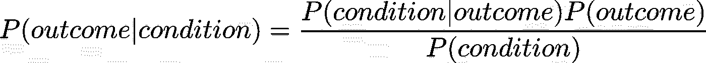
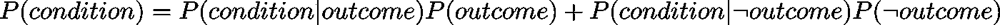
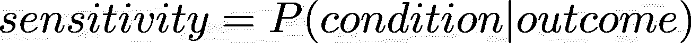
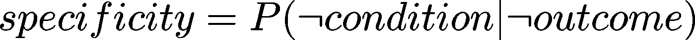
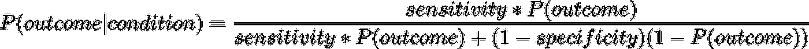

# 如何利用贝叶斯定理更智能地消费新闻

> 原文：<https://towardsdatascience.com/how-to-consume-news-more-intelligently-using-bayes-theorem-a3273d0fff5e?source=collection_archive---------33----------------------->

## 基础利率、边际概率、敏感性和特异性

马库斯·斯皮斯克在 [Unsplash](https://unsplash.com/s/photos/news?utm_source=unsplash&utm_medium=referral&utm_content=creditCopyText) 上的照片

当谈到在不确定的情况下更新信念和做出决策时，[贝叶斯定理](https://arbital.com/p/bayes_rule/?l=1zq)几乎是可用的最佳工具。然而，当它应该为我们的日常生活带来价值时，它却经常被归入学术教科书和机器学习应用程序。

这篇文章是写给那些熟悉贝叶斯定理，但在阅读诸如“红酒降低痴呆症风险”这样的标题时，可能难以记住哪些术语出现在哪里，并且不会立即想到它的人的。

首先，我将回顾贝叶斯定理，谈谈为什么我认为在确实不应该记住的时候很难记住，并根据敏感性和特异性(我将定义它)来阐述它。接下来，我将讨论几种使用该公式对新闻中经常出现的挑衅性言论做出适当反应的方法。最后，我将留给你一些关于在日常生活中使用贝叶斯定理的注意事项，以及其他最后的想法。

关键要点如下。我将定义所有出现的术语:

1.  贝叶斯定理告诉我们，在给定一些新的条件下，如何修正一些结果的概率估计。在日常生活中，当有更多证据时，它可以简单地更新我们的信念，或者确定某个结果(如癌症)是否更有可能在某种情况下(如吸烟)出现。
2.  你需要**三条**信息来正确更新你对结果的信念:结果的基本比率，证据的[敏感性和特异性](https://en.wikipedia.org/wiki/Sensitivity_and_specificity)。新闻往往只会给你敏感。
3.  在缺乏所有三条信息的情况下，尝试自己填补空白，并警惕极端(高/低)基本利率或证据的高边际概率的情况。

## 敏感性和特异性方面的贝叶斯定理

贝叶斯定理告诉我们，在给定新证据的情况下，如何计算结果的后验概率。这被表示为 P(A|B)形式的条件概率。

当公式被表示为一堆混乱的字母时，很容易把它们弄混，忘记分子和分母分别是什么。由于这个原因，我喜欢用结果和条件来写。

从数学上来说，没有理由把一个事件称为“结果”，而把另一个事件称为“条件”。但在现实生活中，有些事情我们想知道却无法直接测量——比如，你得癌症的概率。这将是一个结果。像医学诊断结果这样的证据是用来估计这种结果概率的条件。

p(结果)是我们感兴趣的事情的已知的*先验概率*或*基本概率*。这是有道理的，它将与我们更新的概率成比例，因为否则，我们将在每次遇到新证据时翻转我们的信念。

p(条件)称为条件的边际概率，把它看作一个实体可能有点奇怪。它是在结果为真和不为真的两个世界中，观察到我们所观察到的条件或证据的总概率。

现在，我想再介绍两个术语:敏感性和特异性。假设你读到 70%的医学生弹钢琴。也就是说，弹钢琴作为学医的证据，其敏感度为 70%。

但是，是否是钢琴演奏者肯定不是一个人是否是医科学生的有力指标。其中一个原因是它的低特异性。也就是说，很多不是医学生的人也会弹钢琴。

为了使一个条件强烈地影响结果的概率，它必须同时具有高敏感性和高特异性。此外，为了得出一个后验概率估计，除了证据的敏感性和特异性，我们还必须对结果的基本比率有一个概念。下面是贝叶斯公式的改写，与这些直觉一致:

我发现新闻文章通常不会提供所有必要的细节来得出一个完全基于数据的观点。贝叶斯定理告诉我们调整信念的数量往往是反直觉的，尤其是在处理罕见事件时。在下一节中，我将描述如何避免对类似“90%的新冠肺炎病例发生在穿有鞋带的鞋子的人身上”的陈述反应过度

## 需要注意的场景

同样，计算结果的后验概率需要三条信息:结果的基础率、条件的敏感性和条件的特异性。特别是，如果敏感性或特异性没有什么特别的(~0.5)，那么这就是后验概率不会与基础概率有太大差异的标志。在这种情况下，假设你当前的行为是基于你的信念，你可能不需要调整你正在做的事情来解释新的数据。

但是当新闻只提供一两条的时候，你该怎么办？好吧，你的选择是:

1.  承认你不能有意义地吸收新数据，忽略它。
2.  估计缺失的部分。

虽然有些情况下你真的无法估计缺失的部分，但是过分依赖这个选项是很危险的。我发现，敏感性通常是新闻中提供的信息，而基本利率和边际概率(以及特异性)可以毫不费力地找到。

在这种情况下，每当我的估计出现低基本利率、高边际概率或高基本利率时，我都学会了保持警惕。让我们使用虚构的例子依次检查每种情况。

**低基本利率**

" 90%有天才级智商孩子的母亲报告说在怀孕期间吃贝类."

在像上面例子这样的情况下，我们感兴趣的结果(有一个天才水平智商的孩子)是非常罕见的。这意味着，除非我们测试的条件在灵敏度和特异性方面非常精确(如果没有在科学杂志上直接报道，可能就不是这样)，否则我们的后验概率也可能非常低。

**高边际概率**

"几乎每个寻求抑郁症咨询的美国大学生都拥有一部智能手机."

就像拥有带鞋带的鞋子一样，除了抑郁症咨询，拥有一部智能手机现在已经很普遍了。换句话说，拥有智能手机的边际概率很高。这可能是疾病特异性低的警告信号。

换句话说，我们可以假设几乎每一个没有寻求抑郁症咨询的大学生*也*拥有一部智能手机，这意味着拥有一部智能手机本身并不是一个学生将寻求咨询的强有力指标。

**高基本利率**

“95%坐过飞机的人在 100 岁之前就去世了。”

在你读到这样的文章并决定你的飞行时代结束之前，考虑一下在 100 岁之前死亡已经很普遍了。在第 100 次旋转之前死亡的后验概率有可能比基本概率低**。无论如何，后路可能不会有足够的不同来保证生活方式的改变。**

## **警告和结论**

**我希望我已经设法提供了另一个角度来看待贝叶斯定理，这将使它在日常生活中更直观和更容易使用。但是权力越大，责任越大，所以要注意以下几点。**

*   **即使你确定一些新的信息不足以调整你的信念来改变你的行为，那也不等于它根本没有调整你的信念。如果越来越多的证据指向同一件事，最终会改变你的整体观点。忘记每一个证据并回复到你之前的状态对你没有好处，因为你认为它是不充分的。**
*   **再次提醒，不要断然拒绝新闻，因为它没有明确提供运行贝叶斯法则所需的所有要素。如果你只对你不喜欢的新闻应用这样的过滤器，这就有导致[动机怀疑](https://en.wikipedia.org/wiki/Motivated_reasoning)的风险。**
*   **虽然在我上面的例子中，我直接做出了敏感性声明，但标题通常会直接对结果做出声明(例如，“智能手机增加了抑郁症的可能性”)，但随后只报告了证据在体内的敏感性。看过去这样的标题，找到数字。**

**记住这几点，你应该准备好以一种更有分寸和数据意识的方式对你遇到的信息做出反应。干杯！**

**附注[轶事证据](https://en.wikipedia.org/wiki/Anecdotal_evidence)在这个框架内仍然毫无价值。**