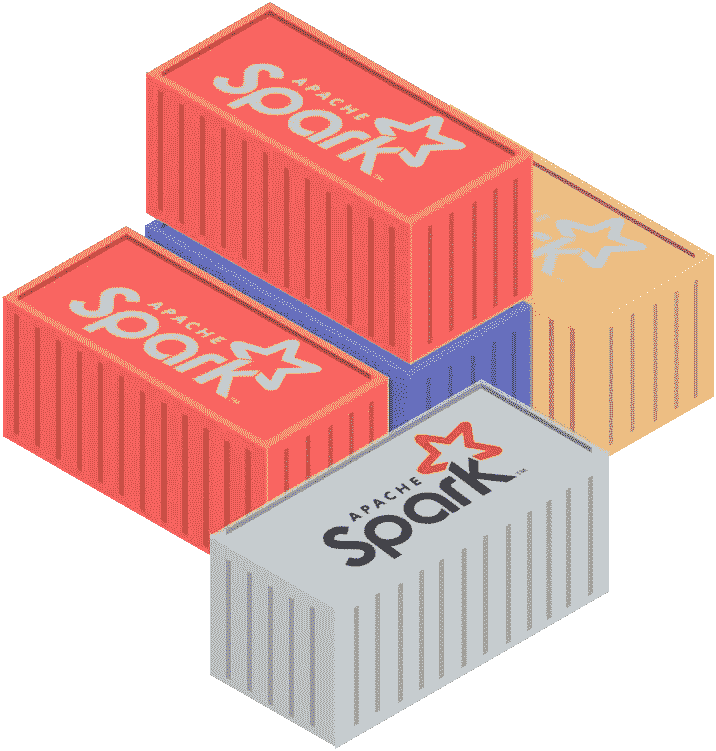
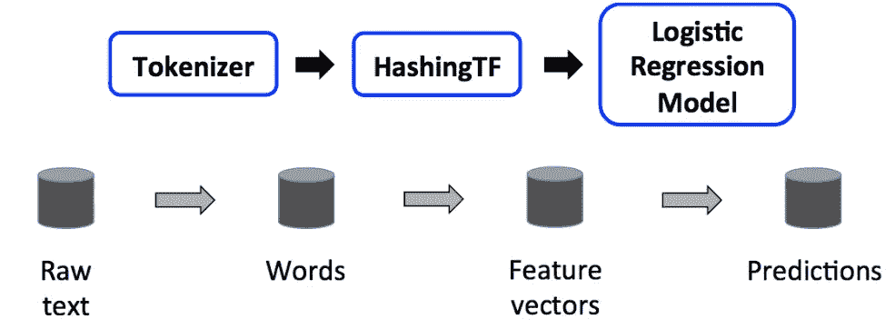
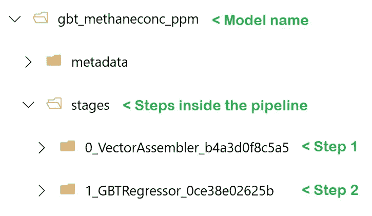

# 如何将 Spark 中训练的模型容器化:MLLib、ONNX 等等

> 原文：<https://towardsdatascience.com/how-to-containerize-models-trained-in-spark-f7ed9265f5c9?source=collection_archive---------21----------------------->

## 将 ML 运送到生产部门

## 以经济高效的方式包装 Spark 模型的替代方案

如果我们要说出现代应用中的两个趋势，其中一个应该提到**容器**和**机器学习**。越来越多的应用程序正在利用容器化的微服务架构来提高弹性、容错能力和可扩展性，无论是在内部还是在云中。同时，机器学习越来越成为任何应用的基本要求。



然而，这两件事并不总是能和谐相处，Spark 就是这种情况。通过使用 Cloudera、Azure Databricks、AWS EMR 或任何其他工具，Spark 现在已经成为大数据分析的行业事实标准。**但是如果您想在集群之外的某个地方使用您在 Spark 中训练的模型呢？**

## 您的选择，**按菜单点菜**

对此有几个选项:

1.  如果您**使用 TensorFlow、PyTorch、Scikit-Learn 等工具训练您的模型，**那么您可以将您的模型打包成不同的可移植格式。因为这些框架并不直接依赖于 Spark，所以您可以开始了。我不会在这篇文章中谈论这个选项。
2.  如果**使用 MLLib** (比如在 pyspark.ml.*)训练模型，那么可以将模型导出为可移植的格式，比如 **ONNX** ，然后使用 ONNX 运行时来运行模型。这有一些限制，因为不是所有的模型都支持 ONNX。
3.  如果您**使用 MLLib** 训练您的模型，那么您可以通过创建一个*无集群* Spark 上下文对象来持久化您的模型并从容器内部加载它。
4.  **(2022 年 2 月更新)**使用 MLFlow 持久化您的模型，并使用 MLModel 规范打包它。MLFlow 目前支持 Spark，它能够使用 MLModel 规范打包您的模型。您可以使用 MLFlow 将您的模型部署到任何您想要的地方。关于这个策略的更多细节请看我的帖子:[使用 MLFlow](https://santiagof.medium.com/effortless-models-deployment-with-mlflow-2b1b443ff157) 轻松部署。

> ONNX 是机器学习模型的序列化和规范的开放标准。由于该格式描述了计算图(输入、输出和操作)，所以它是独立的。它专注于深度学习，主要由微软和脸书倡导。在 TensorFlow 和 PyTorch 等许多框架中得到支持。

## Spark 中的模型是如何工作的？

在 Spark 中，[一个 ML 模型由一个](https://spark.apache.org/docs/latest/ml-pipeline.html) `[Transformer](https://spark.apache.org/docs/latest/ml-pipeline.html)`表示，它将一个具有特征的输入`DataFrame`转换成另一个具有预测的`DataFrame`。一个`Transformer`还可以输出另一组特征。因为在机器学习中，你通常必须执行几个步骤来产生想要的预测，Spark 有一个`PipelineModel`对象，它是一系列步骤或`Transformers`(注意，管道对象有点复杂，但为了本文的简单起见，我们将假设它是这样)。它将多个`Transformers`链接在一起，以指定一个 ML 工作流。

考虑下面这个来自[spark.apache.org](https://spark.apache.org/docs/1.6.1/ml-guide.html)的例子，其中我们有一个包含三个阶段的`PipelineModel`:一个**标记器**(获取文本并返回单词)、一个**散列函数**(获取单词并返回向量)和一个**逻辑回归模型**(获取特征并返回预测)。



文本分析的 PipelineModel 示例。来源:[spark.apache.org](https://spark.apache.org/docs/1.6.1/ml-guide.html)

您可以通过使用方法`fit()`训练管道来获得 PipelineModel。这里有一个例子:

```
tokenizer = Tokenizer(inputCol="text", outputCol="words")
hashingTF = HashingTF(inputCol=tokenizer.getOutputCol(), outputCol="features")
lr = LogisticRegression(maxIter=10, regParam=0.01)
pipeline = Pipeline(stages=[tokenizer, hashingTF, lr])model = pipeline.fit(training)
```

现在的问题是，如何在 Spark 之外运行这个 PipelineModel 对象？

# 选项 1:导出到 ONNX 并使用 ONNX 运行时运行模型

ONNX 是为深度学习模型设计的，然而，它在某些方面支持更“传统”的机器学习技术。Spark 通常用于那些更传统的方法。[在 Spark 中这包括](https://github.com/onnx/onnxmltools/tree/master/onnxmltools/convert/sparkml):

*   矢量器和编码(字符串索引、OneHotEncoding、Word2Vec)
*   定标器(定标器、输入器、二进制化器、存储桶)
*   模型:线性模型，随机森林，梯度推进，朴素贝叶斯，SVM，主成分分析

要将您的模型导出为 ONNX 格式，您需要首先安装 [onnxmltools](https://pypi.org/project/onnxmltools/) **，该工具目前仅适用于 PySpark** 。安装库的方式取决于您使用的平台。在我的例子中，我使用的是 Azure Databricks，所以我将使用集群中的 Install library 选项来安装这个库。

一旦安装了库，就可以通过以下方式将管线模型导出到 ONNX 中:

```
from onnxmltools import convert_sparkml
from onnxmltools.convert.sparkml.utils import buildInitialTypesSimpleinitial_types = buildInitialTypesSimple(test_df.drop("label"))
onnx_model = convert_sparkml(model, 'Pyspark model', initial_types, spark_session = spark)
```

在哪里，

*   `buildInitialTypesSimple`函数创建一个来自模型(特征)的所有预期输入的列表。它接受一个样本数据帧作为参数。在我的例子中，我使用了 test_df 数据帧，删除了 label 列，只保留了所有的特性。
*   型号是安装管道的名称(`PipelineModel`)
*   “Pyspark 模型”是模型的描述
*   initial_types 是预期的输入要素名称和类型。正如我所说的，这可以通过使用`buildInitialTypesSimple`函数来提供，或者通过手工构建来提供，比如[ ('education '，string sensortype([1，1])]
*   `spark_session=spark`将 SparkSession 上下文传递给该方法。

> 注意:**这最后一个参数没有记录在 GitHub** 库中，但是在调试**之后，我需要指定它以避免使用空的 spark 上下文。在我的例子中，我使用的是 Azure Databricks，所以我不知道这是否特定于 Databricks。**

一旦模型被转换，您可以通过以下方式将其保存到文件中:

```
with open(os.path.join("/tmp/", "model.onnx"), "wb") as f:
    f.write(onnx_model.SerializeToString())
```

您可以使用 Python 中的 ONNX 运行时轻松加载该模型，如下所示:

```
import onnxruntime 
session = onnxruntime.InferenceSession(model_file_path, None)
output = session.get_outputs()[0]
inputs = session.get_inputs()input_data= {i.name: v for i, v in zip(inputs, input_sample.values.reshape(len(inputs),1,1).astype(np.float32))}}results = session.run([output.name], input_data)
```

> **注** : `input_data`是以键为特征名，以张量(1，1)为值的字典。`reshape`函数将输入转换为一个形状为(feature_count，1，1)的张量数组，这是所期望的。将值转换为`float32`也很重要。

然后，您可以将这个模型放在 docker 容器中，并安装 Python 和以下库:

*   [onnxruntime](https://pypi.org/project/onnxmltools/)

您的评分文件将使用`onnxruntime.InferenceSession()`方法加载模型。你通常只做一次。另一方面，您的计分例程将调用`session.run()`。

在下面的 GitHub 链接中，我有[一个样本评分文件。](https://github.com/santiagxf/portable-sparkml/blob/master/score_onnx.py)

## **ONNX 在 Spark 中的局限性:**

在撰写本文时，Spark-ONNX 转换器缺少以下特性:

*   缺少功能哈希、TFIDF、RFormula、NGram、SQLTransformer 和某些模型(聚类、FP、ALS 等)的导出程序
*   仅支持 PySpark
*   一些问题:ONNX 规范不支持 Tokenizer

# 选项 2:打包 PipelineModel 并使用 Spark 上下文运行它

在容器内部运行 PipelineModel 的另一种方法是导出模型，并在容器内部创建一个 Spark 上下文，即使没有可用的集群。

如果你想持久化这个 PipelineModel，这个对象实现了接口`MLWritable`，它扩展了方法`save(path)`和`write().overwrite().save(path)`。此方法将模型保存在如下所示的文件夹结构中:



piepline 模型的文件夹结构，由 VectorAssembler 和 GradientBoostedRegressor 组成。

在这种结构中，PipelineModel 保存在一个文件夹结构中，其中详细描述了管道中的所有步骤。在这种情况下，我创建的这个模型有两个阶段:一个 VectorAssembler 和一个 GradientBoostedRegressor。与您可能习惯的相反，所有的结构都需要加载和恢复训练好的模型。如果你使用的是一个模型注册中心，比如 MLFlow 或者 Azure 机器学习服务，我建议你把目录压缩到一个归档文件中。下面一行有助于做到这一点:

```
import shutilmodel.write().overwrite().save(model_path)
path_drv = shutil.make_archive(model_name, format='zip', base_dir=model_path)
```

请注意`shutil.make_archive`将在本地文件系统的驱动节点中创建文件。

## 如何在您的容器内使用它？

因为您将直接加载 Spark 模型，所以您需要在容器映像中安装`pyspark` Python 库。然后，在您的评分脚本中，您将创建一个 spark 会话，将归档文件解压缩到一个文件夹中，并加载 PipelineModel 对象。

```
import pyspark
from pyspark.ml import PipelineModelspark = pyspark.sql.SparkSession
               .builder.appName("pyspark_runtime").getOrCreate()model_unpacked = "./" + model_name
shutil.unpack_archive(model_path, model_unpacked)trainedModel = PipelineModel.load(model_unpacked)
```

变量`spark`和`trainedModel`必须在所有程序中可用。我个人认为这两个变量是全局变量。

然后，通过以下方式运行您的模型:

```
input_df = spark.createDataFrame(pandas_df)predictions = trainedModel.transform(input_df).collect()
preds = [x['prediction'] for x in predictioprint('[INFO] Results was ' + json.dumps(preds))
```

我在下面的 GitHub 链接中有一个样本评分文件。

# 结论

在本文中，我们回顾了两种不同的方法来移植在 Spark 集群中训练的模型，以便在容器中运行它们。使用开放标准 ONNX 或在 Spark 上下文中加载持久模型。如果你想看到例子的完整代码，你可以查看 GitHub 库。还有一个 Databricks 记事本可以生成 ONNX 文件和 MLLib zip 文件。希望有帮助。