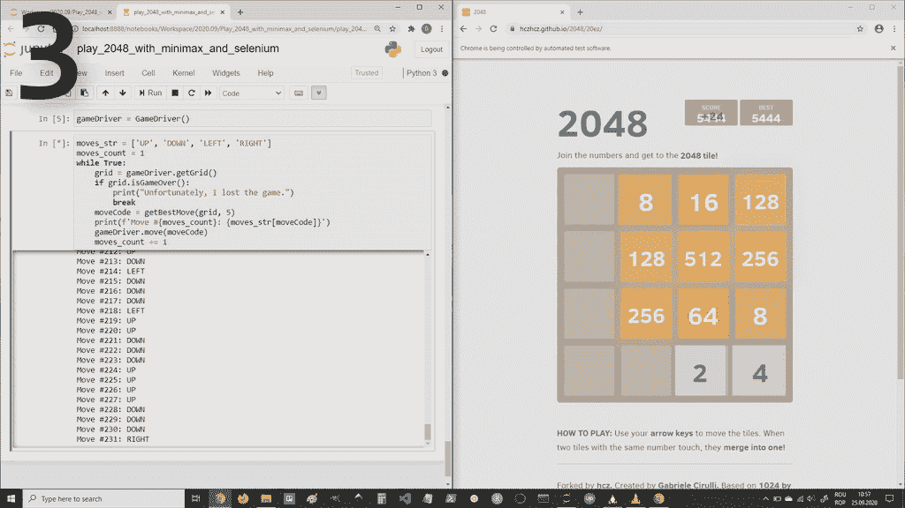

# 如何控制 2048 的游戏板

> 原文：<https://towardsdatascience.com/how-to-control-the-game-board-of-2048-ec2793db3fa9?source=collection_archive---------33----------------------->

## [用极大极小算法玩 2048](https://towardsdatascience.com/tagged/playing-2048-with-minimax)

## …并完成最小最大算法的实现



作者图片

在本文中，我们将完成玩 2048 游戏的 minimax 算法的实现，然后我们将使用这个实现来自动玩这个游戏的 web 版本，这个版本可以在 Github 页面上找到。

这里是之前关于这个主题的文章，我在其中展示了如何表现 2048 年的游戏状态。如果您错过了，请查看:

[](/how-to-represent-the-game-state-of-2048-a1518c9775eb) [## 如何表现 2048 年的游戏状态

### …以及如何以面向对象的方式做到这一点

towardsdatascience.com](/how-to-represent-the-game-state-of-2048-a1518c9775eb) 

为此，我们将首先创建`GameDriver`类，它将作为我们的 minimax 实现和网页上的游戏之间的中间人。`GameDriver`类负责与游戏交互。我们需要处理两个操作:获取游戏当前状态的数据，并做出一个动作:上、下、左、右。这两种操作通过以下方法实现:

*   `.getGrid()` —这将获取游戏状态数据，并将其作为`Grid`对象返回。
*   `.move()` —这将把移动方向代码作为参数，并模拟适当箭头键的按键。

我们在实施中选择的移动方向代码是:

*   0 =向上
*   1 =向下
*   2 =左
*   3 =右

对于这个`GameDriver`类的实现，我们将使用 Selenium，它是做这种事情的一个好库:与 web 浏览器交互。如果你不知道，看看这篇文章。

现在，我们开始导入一些东西。从 Selenium 库中，我们需要 webdriver 和 Keys，它们将用于为您想要的 web 浏览器创建一个驱动程序实例，分别用于使用箭头键。我们还将 int 类型的最大大小作为`MAX_INT`和`time`包导入；过一段时间我们就会知道我们需要什么了。

```
from selenium import webdriverfrom selenium.webdriver.common.keys import Keysfrom sys import maxsize as MAX_INTimport time
```

接下来，我们为`GameDriver`类创建实例化方法。我们存储游戏页面的 URL，创建 Chrome 驱动程序的实例，并打开游戏 URL。然后，我们需要存储对页面主体元素的引用，以便稍后能够发送箭头键命令。我们还存储了一个字典，将移动方向代码映射到相应的箭头键。

`.getGrid()`方法提取关于游戏状态的数据并返回一个`Grid`对象。我们将数据存储为一个矩阵，并在返回时将其传递给`Grid`的构造函数。首先，用 0 初始化矩阵，然后当我们在页面上找到瓦片时更新它。

稍微考察了一下，Chrome 开发者工具里的游戏页面(CTRL+SHIFT+I)，我的结论是:

*   图块可以通过“图块”类名来识别。
*   网格上每个图块的位置(行号和列号)可以从每个图块的类属性中的“图块-位置- **列** - **行**”形式的类名中提取。
*   图块编号是可以从“tile- **num** ”形式的类名中提取的最大值，它位于每个图块的类属性中。

下面是实现上述想法的代码:

下面的`.move()`方法向 body 元素发送适当的箭头键信号，以便按照它所采用的参数指示的方向移动。然后，我们使用`time.sleep(0.1)`在移动信号发出后暂停 0.1 秒，以便页面有时间更新自己。

```
def move(self, moveCode): self.body.send_keys(self.moves[moveCode]) time.sleep(0.1)
```

下面是`GameDriver`类的完整代码:

现在是实现 minimax 算法的时候了，它由 3 个函数组成:`maximize()`、`minimize()`和`getBestMove()`。如果你不熟悉极大极小算法，你可以查看这篇文章，以确保你理解这里发生了什么。

`maximize()`函数取参数:`state`为网格对象，`a`和`b`为来自α-β剪枝的α和β，`d`为最大允许深度。该函数返回一个形式为`(maxChild, maxUtility)`的元组，其中`maxChild`是使效用最大化的当前状态对象(在 minimax 算法树中)的子对象，`maxUtility`是`maxChild`游戏状态的效用值。

`maxUtility`变量将保存到目前为止遇到的节点的最大效用。在函数开始时，我们不知道任何效用值，所以我们认为最大值比任何效用值都小。我选择了-1。

然后，我们检查当前状态是否是一个终端节点，或者我们是否达到了最大深度。如果是，我们返回 None 作为`maxChild`并评估当前状态的效用，否则，我们继续迭代当前状态的所有子节点。在每一次迭代中，我们复制当前的游戏状态，并在一个可用的移动中移动；for 循环中的`child`变量是一个移动方向代码，用于进行该移动。

然后我们让 Min 通过`minimize()`函数完成他的移动，并从这个函数中获得当前迭代的子状态的效用。如果我们选择移动到循环中的当前子节点，这就是我们将得到的工具。如果这个效用大于我们之前的`maxUtility`，那么我们相应地更新`maxChild`和`maxUtility`。在这之后，我们根据α-β剪枝算法再做 2 次检查，这样我们就跳过了博弈树中那些我们事先知道它们不会给出最佳走法的路径。

`minimize()`函数类似于`maximize()`，但现在我们处于最小玩家的位置，我们试图选择效用最小化的移动。

`getBestMove()`函数调用`maximize()`并返回我们必须采取的行动的代码，以最大化我们的分数/效用。

下面是我们的 minimax 实现的代码:

现在，是时候创建一个游戏循环了，在这个循环中，我们重复以下三件事，直到游戏结束:获取游戏数据，使用极大极小法来确定什么是最好的走法，并实际执行这个走法。

当我们运行这个游戏循环时，我们的屏幕上应该会出现一个 2048 年的游戏，它会像页面顶部的 GIF 那样自动播放。

你可以在 [Github](https://github.com/lazuxd/playing-2048-with-minimax) 上找到这个项目的完整代码。

*我希望您对这些信息感兴趣，感谢您的阅读！*

这篇文章也贴在我自己的网站[这里](https://www.nablasquared.com/how-to-control-the-game-board-of-2048/)。随便看看吧！