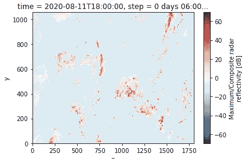
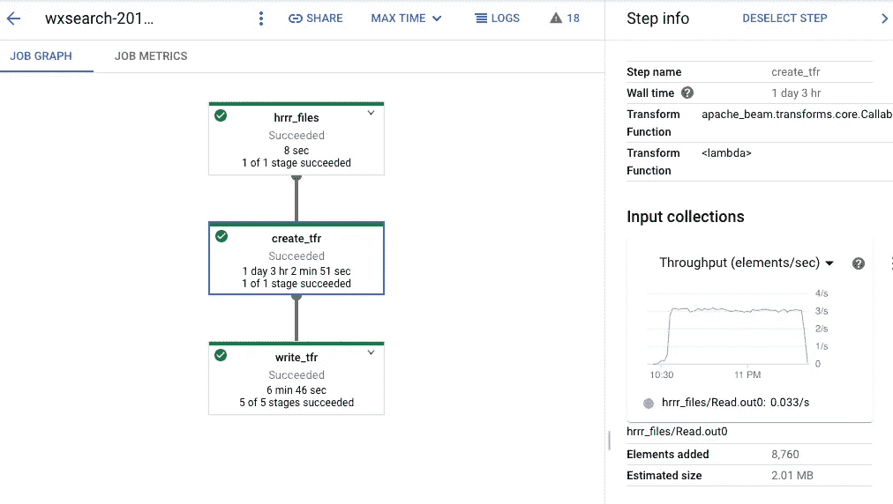

# 如何将二进制文件转换成张量流记录

> 原文：<https://towardsdatascience.com/how-to-convert-binary-files-into-tensorflow-records-3150d7236341?source=collection_archive---------36----------------------->

## 使用 Apache Beam 大规模转换自定义二进制文件

如果你有 JPEG 或者 PNG 的图片，可以使用 [tf.io.decode_image](https://www.tensorflow.org/api_docs/python/tf/io/decode_image) 直接读入 TensorFlow。如果您的数据是某种特定于行业的二进制格式，该怎么办？

## 为什么 HRRR 要做张量流记录？

高分辨率快速更新(HRRR)模式是一个数值天气模式。因为当世界各国汇集它们的观测数据时，天气模型工作得最好，所以天气数据的格式由世界气象组织决定，并且极难改变。所以，HRRR 的数据是以#@的方式传播的！$@&=称为 GRIB 的二进制格式。

不管你在哪个行业——制造、发电、制药研究、基因组学、天文学——你可能都有这样的格式。一种现代软件框架都不支持的格式。尽管这篇文章是关于 HRRR 的，但是这里的技术将适用于您拥有的任何二进制文件。

张量流训练最有效的格式是张量流记录。这是一种 protobuf 格式，使训练程序能够缓冲、预取和并行读取记录。因此，机器学习的第一步是将特定行业的二进制格式文件转换为 TensorFlow 记录。

## 阅读 HRRR 文件

阅读 HRRR·GRIB 文件最简单的方法是使用一个名为 cfgrib 的软件包。这个包将底层数据作为自描述的 numpy 数组返回，这些数组被打包成一种称为 xarray 的格式。要使用 cfgrib，您需要一个名为 libecccodes0 的 Linux 库，它通常不安装在任何 Linux 发行版上。非常棘手的事情，但底线是我们需要在 bog 标准的 Google 计算引擎虚拟机上进行以下设置:

```
sudo apt-get -y --quiet install libeccodes0
python3 -m pip install -q cfgrib xarray
```

一旦我们安装了这两个，我们可以读取一个 GRIB 文件，并提取其中一个感兴趣的图像(在一个文件中有许多预测字段)，如下所示:

```
import xarray as xr
ds = xr.open_dataset(FILENAME, engine='cfgrib', backend_kwargs={'filter_by_keys': {'typeOfLevel': 'atmosphere', 'stepType': 'instant'}})
refc = ds.data_vars['refc']
refc.plot()
```



## 从云存储中读取

不幸的是，我们使用的 Python 包只适用于本地文件。它不读取云存储。谷歌云存储上有一个 HRRR 档案，网址如下:

```
gs://high-resolution-rapid-refresh/hrrr.20200811/conus/hrrr.*
```

预测文件非常庞大。我们希望从云存储中即时读取数据，这样我们就不必再为永久磁盘付费了。

要创建一个只处理从云存储中读取的本地文件的库，我们可以使用一个简单的技巧——创建一个临时目录，将文件从云存储中复制到本地磁盘，读取文件，并在完成后删除临时目录。这听起来有点拗口，但实际上很容易做到，因为 Python 的 tempfile 和 TensorFlow 的 tf.io.gfile 模块完成了所有繁重的工作:

```
import xarray as xr
import tensorflow as tf
import tempfile
import cfgrib**with tempfile.TemporaryDirectory()** as tmpdirname:
    TMPFILE="{}/read_grib".format(tmpdirname)
    **tf.io.gfile.copy**(FILENAME, TMPFILE, overwrite=True)

    ds = xr.open_dataset(TMPFILE, engine='cfgrib', backend_kwargs={'filter_by_keys': {'typeOfLevel': 'atmosphere', 'stepType': 'instant'}})
    refc = ds.data_vars['refc']
    refc.plot()
```

## 转换为张量流记录

我们不希望只是读取数据，我们希望将其转换为 TensorFlow 记录。为此，我们必须创建一个 tf.train.Example:

```
refc = ds.data_vars['refc']
size = np.array([ds.data_vars['refc'].sizes['y'],
                 ds.data_vars['refc'].sizes['x']])
tfexample = tf.train.Example(features=tf.train.Features(
      feature={
         'size': tf.train.Feature(int64_list=tf.train.Int64List(value=size)),
         'ref': _array_feature(refc.data),
         'time': _string_feature(str(refc.time.data)[:19]),
         'valid_time': _string_feature(str(refc.valid_time.data)[:19])
 }))
```

TensorFlow 记录只能保存 bytes、int64、floats 类型的要素。所以，我们必须把其他所有东西都转换成这些类型。它也不了解 IEEE 类型，如-inf 或 nan。因此，要将一个 2D 数组转换成一组浮点数，我们必须做:

```
def _array_feature(value):
    if isinstance(value, type(tf.constant(0))): # if value is tensor
        value = value.numpy() # get value of tensor

    value = np.nan_to_num(value.flatten())
    return tf.train.Feature(float_list=tf.train.FloatList(value=value))
```

## 使用 Apache Beam 缩放它

这很好，但它只是一个文件。对于 ML 训练，我们需要转换大量的文件。我们需要进行大规模的转换。一个好的方法是使用 Apache Beam。管道将如下所示:



它应该花费 27 个小时，但我只花了 1 个小时，因为管道扩展到了许多机器上(在云上，在一台机器上花费 27 个小时的管道和在 27 台机器上花费 1 个小时的管道成本是相同的)。

完整的代码是[这里是](https://github.com/GoogleCloudPlatform/ml-design-patterns/blob/master/02_data_representation/weather_search/wxsearch/hrrr_to_tfrecord.py)，但它的核心是:

```
p | 'hrrr_files' >> beam.Create(
          **generate_filenames**(options['startdate'], options['enddate']))
  | 'create_tfr' >>
          beam.FlatMap(**create_tfrecord**)
  | 'write_tfr' >> **beam.io.tfrecordio.WriteToTFRecord**(
          os.path.join(options['outdir'], 'tfrecord')))
```

基本上，第一步是生成我想要转换的所有文件的名称(我可以列出 GCS 目录，但我想每小时对天气预报进行一次采样，因为天气在 15 分钟内不会发生太大变化):

```
def generate_filenames(startdate: str, enddate: str):
    start_dt = datetime.strptime(startdate, '%Y%m%d')
    end_dt = datetime.strptime(enddate, '%Y%m%d')
    logging.info('Hourly records from {} to {}'.format(start_dt, end_dt))
    dt = start_dt
    while dt < end_dt:
        # gs://high-resolution-rapid-refresh/hrrr.20200811/conus/hrrr.t04z.wrfsfcf00.grib2
        f = '{}/hrrr.{:4}{:02}{:02}/conus/hrrr.t{:02}z.wrfsfcf00.grib2'.format(
                'gs://high-resolution-rapid-refresh',
                dt.year, dt.month, dt.day, dt.hour)
        dt = dt + timedelta(hours=1)
        yield f
```

第二步是创建 TF 示例，最后一步是将示例写到云存储中。

现在，还记得我们为了让 cfgrid 在我们的机器上工作所做的所有恶作剧吗？我们必须告诉 Beam runner 如何在每个 worker 节点上安装它需要的包。我们通过指定一个 [setup.py](https://github.com/GoogleCloudPlatform/ml-design-patterns/blob/master/02_data_representation/weather_search/wxsearch/setup.py) 来实现，并在那里声明:

```
CUSTOM_COMMANDS = [
    'apt-get update'.split(),
    'apt-get --assume-yes install libeccodes0'.split()
]
```

和

```
REQUIRED_PACKAGES = [
    'cfgrib',
    'xarray'
]
```

## 在数据流上运行它

要在 Dataflow 上运行上述代码，我们只需运行代码。它将负责提交代码，自动缩放工人，并在完成后关闭一切。

```
python3 -m wxsearch.hrrr_to_tfrecord -- \
        --startdate 20190101 --enddate 20200101 \
        --outdir gs://{BUCKET}/wxsearch/data/2019 \
        --project {PROJECT}
```

大约 60 分钟后，您将获得 2019 年 HRRR 反射率文件的相应 TF 记录。

## 链接

1.  进行转换的代码: [hrrr_to_tfrecord.py](https://github.com/GoogleCloudPlatform/ml-design-patterns/blob/master/02_data_representation/weather_search/wxsearch/hrrr_to_tfrecord.py) 。
2.  在数据流工作器上安装必要软件的 [setup.py](https://github.com/GoogleCloudPlatform/ml-design-patterns/blob/master/02_data_representation/weather_search/wxsearch/setup.py) 。
3.  阅读本系列接下来的两篇文章:如何[在 HRRR 数据上训练自动编码器](/how-to-create-a-concise-image-representation-using-machine-learning-20156c1e0c19)，以及如何[使用结果嵌入](https://lakshmanok.medium.com/compression-search-interpolation-and-clustering-of-images-using-machine-learning-eb65fcf0abbb)。

尽情享受吧！