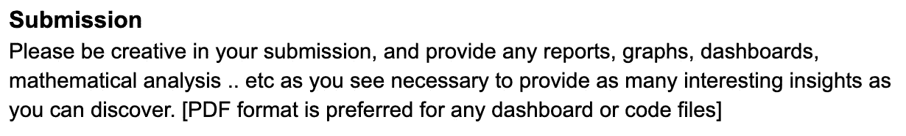
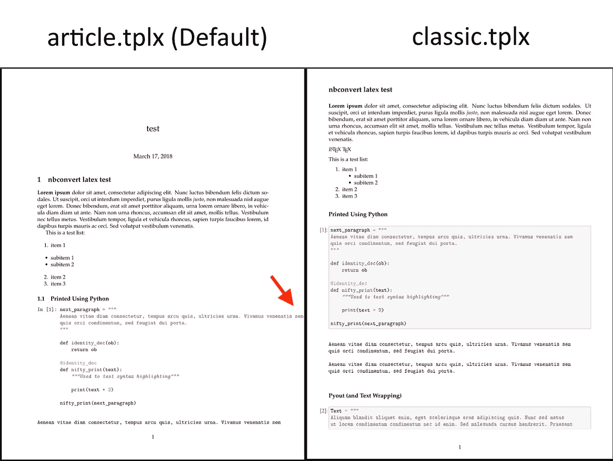

# 如何将 Jupyter 笔记本转换成 pdf

> 原文：<https://towardsdatascience.com/how-to-convert-jupyter-notebooks-into-pdf-5accaef3758?source=collection_archive---------4----------------------->

## 用几行代码将 Jupyter 笔记本转换为 pdf(调试“500:内部服务器错误”)


照片由[Cookie Pom](https://unsplash.com/@cookiethepom?utm_source=unsplash&utm_medium=referral&utm_content=creditCopyText)在 [Unsplash](https://unsplash.com/s/photos/laptop?utm_source=unsplash&utm_medium=referral&utm_content=creditCopyText) 拍摄

如果你是许多正在找工作的数据科学家中的一员，你可能会发现自己正在从事数据科学的家庭作业。如果您能够转换笔记本并提交 pdf 版本，而不是共享您的 Jupyter 笔记本，将会更加整洁。在这篇博客中，我想分享你如何用几行代码将 Jupyter 笔记本变成 pdf 格式！



之前的一次课后作业让我学会了如何做这件事

# 安装 nbconvert 和 LaTeX

[nbconvert](https://nbconvert.readthedocs.io/en/latest/) 允许用户将笔记本转换成其他格式。安装 nbconvert 后你会想，你可以开始了…对吗？如果这么简单，我为什么要写这篇文章？

在我安装了 nbconvert 之后，我收到了一个错误，上面写着“500:内部服务器错误。”之所以会看到这个错误，是因为你还没有安装 [LaTeX](https://www.latex-project.org/) 或者 [Pandoc](https://pandoc.org/) 。我决定下载 LaTeX。下载 LaTeX 的好处是，它让你的分析看起来像一篇研究论文，这非常合法。

# 从命令行运行 nbconvert

安装这两个软件包后，您可以尝试使用以下命令行将笔记本转换为您想要的格式:

```
$ jupyter nbconvert --to FORMAT notebook.ipynb
```

这个命令行将把 Jupyter 笔记本文件转换成由`FORMAT`字符串给出的输出格式。出于本文的目的，我们将把它转换成 pdf，但是您也可以把它转换成 HTML、Markdown 等。如果你想把笔记本文件转换成 HTML，只需把`pdf`替换成`html`，反之亦然。

```
$ jupyter nbconvert --to pdf notebook.ipynb
```

根据您之前安装的软件包，您可能需要降级或升级其中的一些软件包。

例如，如果您看到以下错误消息…

```
spyder 3.3.6 has requirement pyqt5<5.13; python_version >= "3", but you'll have pyqt5 5.13.0 which is incompatible
```

您可以通过卸载 pyqt5 并安装 pyqt5==5.12.0 来解决此错误。

# 安装 nbconvert 模板

在我成功地将笔记本转换成 pdf 文件后，我意识到文件的边距是关闭的！幸运的是，我在提交之前仔细检查了文件！

下面是对比。默认情况下，我们可以看到保证金是非常关闭。默认的 pdf 格式会切掉页面的一边。



泰勒·马卡罗在他的 [Github](https://github.com/t-makaro/nbconvert) 上的照片

为了解决这个问题，我找到了一个由泰勒·马卡罗创建的[模板](https://github.com/t-makaro/nb_pdf_template)。我首先通过运行命令行安装了他的`nb_pdf_template`:`pip install nb_pdf_template.`，然后我将`cd`放入 LaTeX 文件夹，并添加了 Tyler 创建的两个模板:classic.tplx 和 classicm.tplx。最后但同样重要的是，不要忘记从 LaTeX 文件夹中删除默认的 article.tplx。

完成后，您将能够通过运行以下命令行获得格式良好的 pdf:

```
$ jupyter nbconvert --to pdf notebook.ipynb --template classic
```

# 结论

以下是您需要的所有软件包:

1.  安装 [nbconvert](https://nbconvert.readthedocs.io/en/latest/)
2.  安装[乳胶](https://www.latex-project.org/)或 [Pandoc](https://pandoc.org/)
3.  安装一个 nbconvert [模板](https://github.com/t-makaro/nb_pdf_template)

你有它！如果你觉得这很有帮助，请分享并关注我的博客，这样你就不会错过了！

下次见，快乐学习！[👩🏻‍💻](https://emojipedia.org/woman-technologist-light-skin-tone/)

如果你喜欢我的内容，请关注我❤️，看看我最近的博客:

[](/understanding-and-choosing-the-right-probability-distributions-with-examples-5051b59b5211) [## 用例子理解和选择正确的概率分布

### 举例说明最常见的离散概率分布

towardsdatascience.com](/understanding-and-choosing-the-right-probability-distributions-with-examples-5051b59b5211) [](/how-to-prepare-for-business-case-interview-as-an-analyst-6e9d68ce2fd8) [## 作为分析师如何准备商业案例面试？

### 作为数据分析师或数据科学家，我们不仅需要知道概率和统计，机器学习算法…

towardsdatascience.com](/how-to-prepare-for-business-case-interview-as-an-analyst-6e9d68ce2fd8) [](https://medium.com/@kessiezhang/building-a-product-recommendation-system-for-e-commerce-part-ii-model-building-8b23a9b3ac27) [## 构建电子商务产品推荐系统:第二部分——模型构建

### 这个博客是我之前工作的延续，在我之前的工作中，我谈到了我是如何收集产品评论和…

medium.com](https://medium.com/@kessiezhang/building-a-product-recommendation-system-for-e-commerce-part-ii-model-building-8b23a9b3ac27) [](https://medium.com/@kessiezhang/building-a-product-recommendation-system-for-e-commerce-part-i-web-scraping-798b6251ab51) [## 为电子商务建立一个产品推荐系统:第一部分——网络搜集

### 今天，如果我们想到机器学习在商业中最成功和最广泛的应用，推荐者…

medium.com](https://medium.com/@kessiezhang/building-a-product-recommendation-system-for-e-commerce-part-i-web-scraping-798b6251ab51)