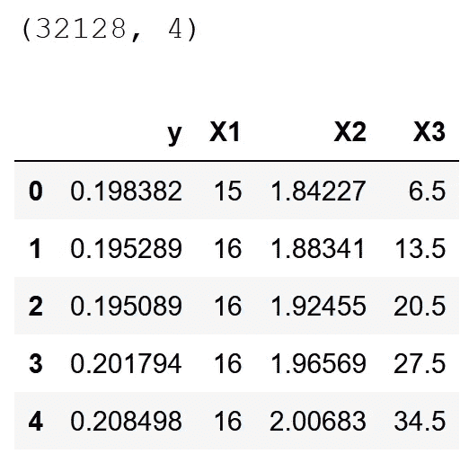
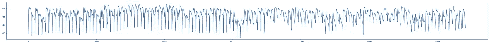
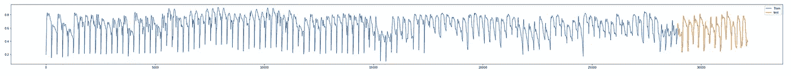
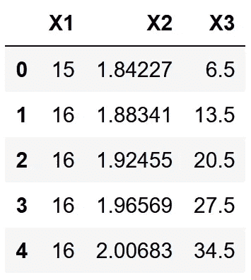
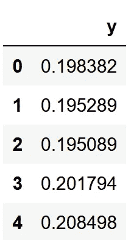
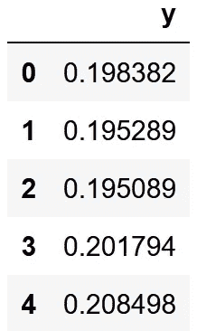
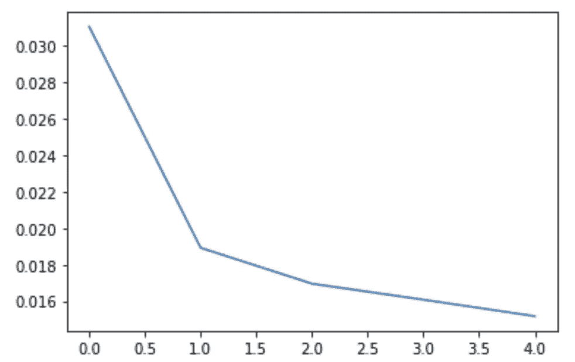
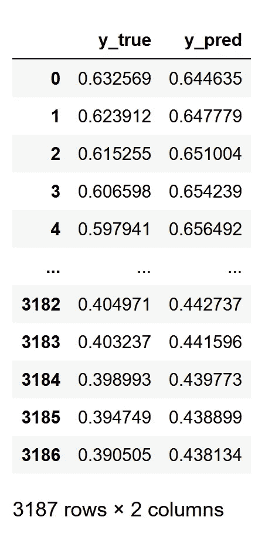
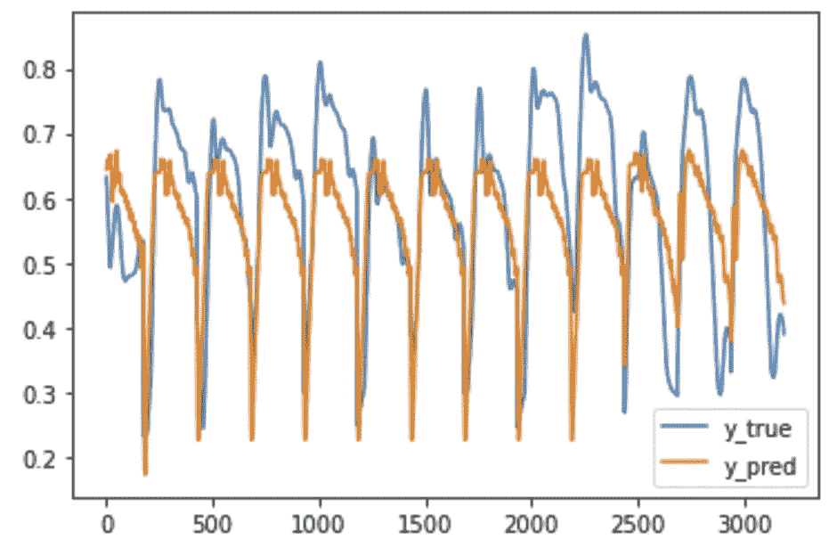

# 对于多元回归问题，如何将 Pandas 数据框架转换为 Keras RNN，然后再转换回 Pandas

> 原文：<https://towardsdatascience.com/how-to-convert-pandas-dataframe-to-keras-rnn-and-back-to-pandas-for-multivariate-regression-dcc34c991df9?source=collection_archive---------10----------------------->

## 这篇文章提供了一个简单的 Python 代码，它采用熊猫数据帧中的数据，并使用 Keras RNN LSTM 模型以相同的格式输出预测。

我遇到的问题相当普遍(我认为):以`pandas` `dataframe`格式获取数据，并使用带有`keras` RNN 的时间序列回归模型进行预测，其中我有不止一个独立的`X`(也称为特征或预测器)和一个依赖的`y`。更准确地说，问题不是构建模型，而是将数据从`pandas` `dataframe`格式转换成 RNN 模型(在`keras`中)需要的格式，并从`keras`模型中获得预测作为`pandas` `dataframe`。

感觉无论我在哪里寻找解决方案，我都能得到关于 RNN 如何工作的解释或者单变量回归问题的解决方案。因此，我会尽量保持这篇文章的简洁和集中。这里的编码假设您已经做了所有必要的预处理(例如，数据清理、特征工程等。)并以`pandas` `dataframe`格式准备好用于分析的时间序列。

你**不会**在这里找到的:

理论解释

RNN 模型的精美插图

预处理技术

复杂或精密的模型

网上有很多资源可以很好地解释这些问题，我强烈推荐查看一下 [StackOverflow](https://stackoverflow.com/) 的问题和杰森·布朗利[的博客帖子。](https://machinelearningmastery.com/)

你**会在这里**找到什么:

一个简单的 Python 代码，采用一个`pandas` `dataframe`并使用一个`keras` RNN LSTM 模型以相同的格式输出预测，用于多元回归问题。

这篇文章将描述代码片段和解释，并在最后提供完整的无缝代码。

让我们开始吧:

第一步，让我们导入所有需要的包并检查`keras`版本

如你所见，我的`keras`版本是`2.3.1`，所以如果你对我在这里发布的代码有一些问题，请检查你是否有相同或更高的版本。

第二步，读取数据



如你所见，我有 32，128 行 4 列，有一个`y` 和三个`X`。这里的代码可以在任意数量的`X` 上运行，包括一个`X` *。*注意，你需要定义你的`y`列，以使事情变得更简单和通用。

可选步骤-绘制数据



我知道，这里的分辨率不是很高，但是你可以想象我的数据是什么样子的。

第三步，拆分数据进行训练和测试

请注意第三行的注释。让我们再次策划，看看我们的分裂是否有意义。



还是那句话，不要介意分辨率，这不重要。图看起来不错，过去(蓝色)是我们的训练数据，最近的日期是我们的测试数据(橙色)。

第四步，只对训练数据分开`X`和`y`。我们将稍后处理测试数据。

现在，`X_train`看起来像这样:



而`y_train`看起来是这样的:



步骤 5，为`keras`缩放并准备`X`和`y`数据

这部分需要一些解释。这里我们将数据从`pandas`数据帧转换成`keras`所需的`numpy`数组。在第 1–8 行中，我们首先使用`sklearn MinMaxScaler`模型缩放`X`和`y`，使它们的范围从 0 到 1。接下来的几行是对`y`的一些形状处理，以使其适用于`keras`。我们需要`y`的形状是`(n, )`，其中`n`是行数。第 12 行通过在第一个位置添加零将`y`数据向前“推”一步，第 13 行通过删除最后一个时间步(最后一行)保持`y`的形状。下面是第 12–13 行中发生的情况的一个简化示例:

```
#let's say y = [1,2,3,4]
# y = np.insert(y,0,0) --> [0,1,2,3,4]
# y = np.delete(y,-1) --> [0,1,2,3]
```

如果这个解释不够清楚，我建议你参考 Jason Brownlee 的博客文章。查找标题为:*多元输入和相关系列示例的部分。*

总结一下`y`的形状操控，让我们快速看一下发生了什么。我们从作为数据帧的`y`数据开始:



现在它应该是这样的:

```
array([0\.        , 0.12779697, 0.12401905, ..., 0.59237795, 0.6018512 , 0.61132446])
```

第六步，使用`keras`和`TimeseriesGenerator`组合`X`和`y`

`TimeseriesGenerator`将分离的`X`和`y`转换成样本结构，准备训练深度学习模型。我建议打印生成器对象的形状，以确保它能够工作。形状应该与第 8 行第 6 步中显示的完全一样。

将我们的数据从`pandas` `dataframe`转换成可用于深度学习模型的东西的困难部分已经过去了。现在我们可以进入第 7 步，实例化模型:

请注意，我在这里使用了一个非常简单的模型，只有一个隐藏层，没有脱落层。这是因为我想保持这篇文章的简洁，实际的模型架构不是这里的重点。但是可以随意尝试更多的层。

第八步，拟合模型并绘制损失图



同样在这里，我使用了简单的设置，只有 5 个时期，只是为了说明整个过程。

现在模型可以使用了，我们可以在测试集上进行预测。

第一行通过从测试集中删除`y` 来生成`X_test`数据，我们不希望`y` 数据包含在`X`中。然后我们根据之前安装在`X_train`上的`MinMaxScaler`模型来缩放`X_test`。第 3 行很重要，因为我们需要为测试数据创建一个`TimeseriesGenerator`。我很纠结这部分，因为在我看到的例子中，这里包含了`y_test`，但是我不希望模型有任何关于`y_test`数据的知识。我不希望有任何可能导致预测偏差的数据泄露。多亏了 Marco Cerliani 在 [StackOverflow](https://stackoverflow.com/questions/62876780/how-to-shape-test-data-in-keras-lstm-prediction-for-multivariate-inputs-and-depe?noredirect=1#comment111192708_62876780) 上给了我很大的帮助，我明白了`TimeseriesGenerator`中的第二个参数，也就是`y_test`只是一种预测方法，并且`y_test`的实际值并不重要(在这个特定的地方)，所以你可以插入一个虚拟的`y_test` →一个与实际`y_test`数据形状相同的零数组。`TimeseriesGenerator`的其余部分类似于训练数据，这里我也打印了形状以确保它没问题。

第 10 行调用预测方法，第 11 行重新调整预测。记住，我们之前在 0 和 1 之间缩放了`y`数据，所以我们需要将它缩放回来。在第 12 行，我们从`y_true`和`y_pred`构造了一个`dataframe`。注意，我们只调用了`y_true` ( `test[y_col].values[n_input:]`)的子集，这是因为模型需要`n_input`时间步长(行或观察值)来开始预测，所以它从`X_test`中取出这些`n_input` (在本例中为 25 个时间步长)，然后才开始预测。例如，如果我们的测试集中有 50 个时间步长(或 50 行或 50 个观察值)，那么我们将只有 25 个预测，因为前 25 个是模型根据我们设置的体系结构使用的。

现在我们有了一个很好的熊猫数据帧结构:



我们可以使用`results.plot();`来绘制它们:



就这样，我们以`pandas` `dataframe`格式的数据开始，以同样格式的预测结束。

这是一个块中的全部代码

我希望这是有用的，将有助于您的机器学习任务。如果你有任何意见，请写在下面给我。