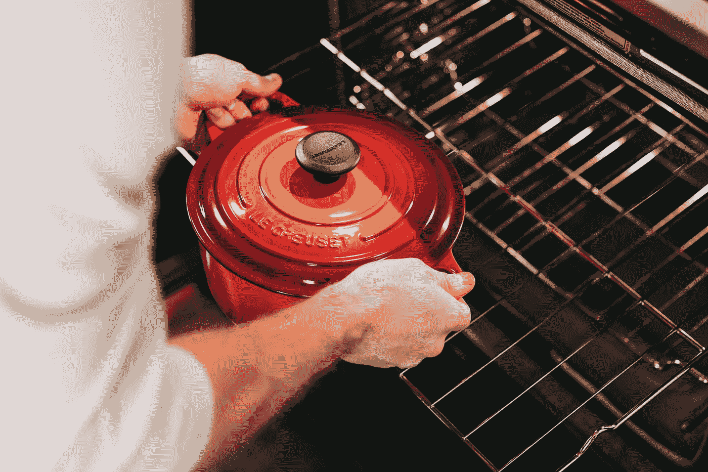

# 如何用 PyTorch 烹饪神经网络

> 原文：<https://towardsdatascience.com/how-to-cook-neural-nets-with-pytorch-7954c1e62e16?source=collection_archive---------19----------------------->

## 使用 PyTorch 的深度学习项目的诀窍


[Icons8 团队](https://unsplash.com/@icons8?utm_source=medium&utm_medium=referral)在 [Unsplash](https://unsplash.com?utm_source=medium&utm_medium=referral) 上的照片

# **py torch 训练配方**

好了，你已经决定了这道菜(你的神经网络)，现在你需要用 PyTorch 来烹饪(训练)它。但是等等，这不是一个简单的“快餐”任务，不像其他流行的 python 机器学习库(例如 *Scikit Learn* ， *Keras* )那样运行`fit()`和`eval()`方法的一些变体。你需要遵循一个食谱(过程)并自己定义这些方法。你可能会问，为什么？嗯，这里当然有一个权衡。虽然 PyTorch 以其可解释性、pythonic 式和可调试代码以及创建动态计算图的能力而闻名，但它不像 *Keras* 那样实用，因为它缺乏更高级别的 API，尤其是在训练和评估模型方面。同样，这是一个权衡:灵活性与实用性。PyTorch 侧重于前者，但也有让训练和评估更容易的库，比如 *ignite* 、 *fastai* 和 *lightning* (举几个例子)。

所以回到我们的食谱…我们先看一下大图，然后放大到每一步。让我们后退一步，看看一个典型的 ML 过程可能是什么样子。原来有一个简单的食谱你可以遵循。事情是这样的:

1.  加载和预处理数据
2.  定义模型、优化器和损失
3.  训练和验证模型
4.  评估模型

现在让我们看看如何在 PyTorch 中实现这一点。我将向您展示一个包含一些样板代码(没有双关的意思)的菜谱，您可以按照它来开发和训练您自己的模型。然后，它将取决于你改变配料和香料的食谱在这里和那里！

## **1。数据加载和预处理**


照片由[凯蒂·史密斯](https://unsplash.com/@kate5oh3?utm_source=medium&utm_medium=referral)在 [Unsplash](https://unsplash.com?utm_source=medium&utm_medium=referral) 上拍摄

**定义变换(*仅用于图像分类* )**

如果您正在进行影像分类，您可能需要转换数据。PyTorch 的`torchvision`模块有一个很好的子模块叫做`transforms`，可以让你构建一个转换管道。不像在 *Keras* 中，这里你可以定义变换的顺序。这些变换可以包括图像增强技术，如调整大小、裁剪、颜色抖动、图像翻转等。转换的详细列表可以在 PyTorch 网站的[这里](https://pytorch.org/docs/stable/torchvision/transforms.html)找到。

如果你的数据集很好并且标准化了(所有的图像都有相同的大小，几乎都在中心，没有颜色变化，图像没有旋转或翻转)，就像 *MNIST* 一样，那么你可能只需要将你的图像转换成张量并标准化它们。下面是一个简单的转换管道的例子，您可以使用`transforms`模块将它用于标准化数据集。

在上面的例子中，`ToTensor()`转换将图像作为输入，然后通过将每个通道的值除以 255，在 0 和 1 之间缩放每个像素值(我们正在处理上面的灰度图像，它只有一个通道)。接下来，张量被归一化，使得值在-1 和 1 之间(从 0.5 的平均值中减去先前缩放的像素，然后除以 0.5 的标准偏差)。这就像一个管道，对于预处理图像非常方便。

但是，如果您试图对猫和狗的图像或任何真实世界的数据集进行分类，您可能会从数据扩充中受益。主要思想是，当你的模型在更多种类的数据上被训练时，它将更好地概括。数据扩充是一种通过对原始内容进行变化(或转换)来利用现有数据的技术。这里有一个如何完成这项任务的例子:

变形金刚的名字非常直观，你可以通过浏览 [PyTorch 文档](https://pytorch.org/docs/stable/torchvision/transforms.html)查看这些和其他变形金刚的定义。请注意如何为训练集和测试集定义不同的转换。此外，请注意，在标准化步骤中，我们现在有三个通道，而不是一个。

**下载数据集**

PyTorch 为您提供了一些包含或下载数据集的选项。`torchvision`包包含预加载的数据集，如 *CIFAR10* 和 *MNIST* ，如果你想对你的模型进行基准测试或只是想学习图像分类，这将非常方便。如果你想对你自己的图片进行分类或者从网上下载，你需要另一种方式来加载数据集。为此，PyTorch 提供了`ImageFolder`类，该类假设您已经将所有图像存储到以每个类标签命名的目录中(即文件夹‘dog’将包含狗的图像，文件夹‘cat’将包含猫的图像)。您应该有一个结构相同的 train 和一个 test 文件夹。这样，您可以像这样加载数据:

现在，假设您需要对您的图像进行一些清理和预处理，或者如果您不进行图像分类，而是需要编写一个基于文本的分类器，要求对文本进行预处理，或者您需要在表格数据集上预测销售额，要求在将数据输入模型之前进行清理或某种数据争论。对于这些情况，您可以通过从`torch.utils.data`扩展`Dataset`类来创建自己的数据集。您需要定义三个方法，遵循如下的模板:

这是一种更优雅、更灵活的定义数据集的方法，也是通用的，适用于任何类型的数据集。一旦定义了数据集，就可以实例化该类并为多个集合传递参数，比如 train 和 test。所以你会有类似于…

你可以在这里获得更多关于创建自定义类以及其他自定义数据相关类[的信息。](https://pytorch.org/tutorials/beginner/data_loading_tutorial.html)

**创建验证集**

好了，是时候拆分并创建一个验证集来帮助你实现目标了。注意这是一个可选步骤，但绝对是一个最佳实践，强烈推荐**用于评估和优化您的模型。创建验证集的一种方法是使用`torch.utils.data`中的`random_split`函数。这非常简单，只需要您想要分割的数据集和每次分割的大小。**

**定义数据加载器**

一旦定义了数据集，就需要将它们包装在一个名为`DataLoader`的类中。这个类基本上是一个简单的方法，可以让你加载批量数据，并且包括免费的并行处理，不需要做任何额外的编码。很酷的东西。让我们来看看:

## **2。定义模型、优化器和损失**


照片由[贝卡·泰普特](https://unsplash.com/@beccatapert?utm_source=medium&utm_medium=referral)在 [Unsplash](https://unsplash.com?utm_source=medium&utm_medium=referral) 上拍摄

很好，现在您已经准备好开始定义您的模型了。定义模型有几种不同的方法，我将在另一篇文章中介绍。但是现在，我们只选择类方法，因为它是 PyTorch 中最流行的方法之一，而且非常直观。这是你发挥创造力的地方。根据您的问题，您可以尝试不同类型的神经网络和架构。为了便于说明，我选择实现一个简单的 CNN。

你可以在这里找到更多关于创建你的定制模型[的信息。好了，现在你已经定义了你的模型，你可以实例化它，并定义优化器和损失函数。这些都是一行程序，很容易实现。让我们先实例化模型。](https://pytorch.org/tutorials/beginner/examples_nn/two_layer_net_module.html)

输出:

```
MyCNN(
  (fc1): Linear(in_features=32, out_features=16, bias=True)
  (fc2): Linear(in_features=16, out_features=8, bias=True)
  (fc3): Linear(in_features=8, out_features=2, bias=True)
)
```

接下来，要定义优化器，您需要从 PyTorch 导入`optim`模块。PyTorch 有很多优化器，你可以在这里查找完整的列表[来看看使用哪一个。每个优化器都有不同的参数，但是大多数都需要至少一个学习率，称为`lr`。为了让 PyTorch 优化您的网络，您首先需要传递模型参数。它应该是这样的:](https://pytorch.org/docs/stable/optim.html?highlight=optim#module-torch.optim)

然后，您需要定义 PyTorch 将使用的损失函数，以了解您的模型预测离实际目标有多远。损失函数的选择取决于你试图解决的问题的类型，你可以在这里找到更详细的损失列表。现在，我们将使用二元交叉熵损失，适用于二元分类问题。我们将该损失标准称为*标准*，如下所示:

## **3。训练并验证模型**



Becca Tapert 在 [Unsplash](https://unsplash.com?utm_source=medium&utm_medium=referral) 上拍摄的照片

好了，现在你开始真正的烹饪了。如果与我之前提到的 *sklearn* 或 *keras* 相比，火车循环并不直接，但它非常直观，可以帮助您了解引擎盖下发生了什么，另外您可以通过插入跟踪来非常容易地调试它。你基本上只需几步就能完成一个火车环…

你在上面看到的是一个带验证的简单 PyTorch 训练循环。然而，在实践中，您可能希望累积精度或您选择的度量和/或在每个时期结束时应用早期停止。好的方面是这是完全可定制的。真的，天空才是极限。尽管出于本文的目的，我们将保持简单。

## **4。评估模型**


斯蒂芬·约翰逊在 [Unsplash](https://unsplash.com?utm_source=medium&utm_medium=referral) 上拍摄的照片

训练完模型后，最后一步是预测和评估结果。测试循环与验证循环非常相似，但是相反，您将查询`test_loader`来读取测试数据，并且只运行一次测试数据来评估模型。换句话说，您不需要担心 epochs，因为您只想查看模型在每个实例上的执行情况。

## **结束语**

既然您已经看到了它有多简单，那么您可以自己尝试用 PyTorch 构建一个神经网络！食谱基本上是一样的，但你可以在这里或那里改变一些成分，根据你的味蕾进行定制。还有其他方法可以实现这些步骤，但是我决定向您展示我认为最简单的一种方法。让我知道你的想法，我很想知道你是怎么做这道菜的！