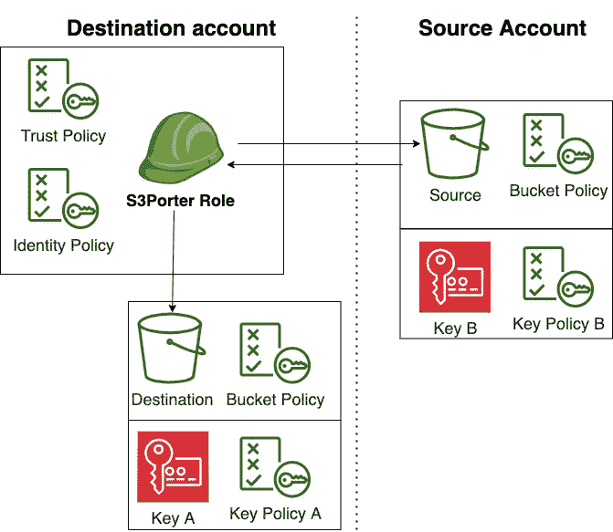

# 如何在加密的 S3 桶交叉帐户之间复制

> 原文：<https://towardsdatascience.com/how-to-copy-between-encrypted-s3-buckets-cross-account-e4e3096d1a8a?source=collection_archive---------6----------------------->

## 包括一步一步的教程

在加密存储桶、交叉帐户之间复制时涉及的所有资源的概述。用 [Draw.io](https://desk.draw.io/support/solutions/articles/16000042494-usage-terms-for-diagrams-created-in-diagrams-net) 创建

加密很棘手，即使你使用的是 AWS 这样的托管服务。

在[我的上一篇文章](/aws-iam-introduction-20c1f017c43)中，我讲述了你需要了解的关于 IAM 的内容，IAM 是 AWS 提供的身份和访问管理服务。在这篇文章中，我想更具体一点，介绍一个常见的场景，其中有大量不同的权限在起作用。在这里，您将看到我之前谈到的所有不同类型的资源都在运行，希望一切都会顺利。

> 如果你需要 AWS 中权限如何工作的基础知识，请阅读我的[对 IAM 的介绍帖子](/aws-iam-introduction-20c1f017c43)。

# 概观

假设我们使用几个 AWS 账户，我们想将某个 S3 桶中的数据从一个*源*账户复制到某个*目的地*账户，如上图所示。此外，让我们想象我们的数据必须在静态下加密，出于监管目的；这意味着我们在*和*账户中的桶也必须被加密。

在 AWS 上实现上述目标有很多方法，但我将讨论以下组合:

*   KMS 用于主密钥的加密/解密。一种替代方法是实现客户端加密并自己管理主密钥。
*   [使用客户管理密钥的 S3 服务器端加密](https://docs.aws.amazon.com/AmazonS3/latest/dev/UsingKMSEncryption.html)适合您的使用案例。与 S3 托管密钥相比，客户托管密钥有几个优点，比如审计跟踪。
*   [S3 默认加密](https://docs.aws.amazon.com/AmazonS3/latest/dev/bucket-encryption.html)适合你的桶对象；这意味着添加到 bucket 中的对象将被自动加密，而不需要您指定一个标志来加密它们。
*   作为执行复制的身份的角色，与用户相对。

# 政策

这里有 5 个主要的资源:我们的两个处理桶加密的主密钥，我们的两个 S3 桶，以及我们的角色。这意味着您需要 4 个资源策略(不包括角色的信任策略)和 1 个身份策略才能正常工作。

注意:你不能复制/粘贴下面的所有内容。对于每个策略，您必须将资源 ARNs 和帐户 id 更改为属于您的源/目标的资源 ARNs 和帐户 id。

## 角色身份策略

这是我们将附加到我们的`S3Porter`角色的身份策略，以便让它联系 S3 和 KMS。这里有 4 个必要的语句:顶部图表中的每个资源一个。

1.  从跨帐户来源时段复制。跨帐户访问要求*发送方的身份策略*和接收方的资源策略*都允许访问。在本例中，我们允许发送者发出请求。*
2.  复制到同一个 AWS 帐户中的 bucket。请注意下面的策略是如何将资源限制在单个 S3 存储桶中的:作为一种最佳实践，重要的是将您的策略限制在它们绝对需要的资源上。
3.  使用跨帐户 KMS 密钥来解密我们的源桶中的对象。
4.  加密到我们的目的地账户。这可能看起来很有趣，我们仍然需要对我们的目的地 bucket 的`kms:Decrypt`权限，因为我们只是将数据复制到其中。我们需要`kms:Decrypt` 是因为，[在幕后，S3 可能会把你的文件分成块，然后重新组合](https://aws.amazon.com/premiumsupport/knowledge-center/s3-multipart-kms-decrypt/#:~:text=Because%20the%20parts%20are%20encrypted,Amazon%20S3%20with%20SSE%2DKMS.)以便把它们复制到一个桶里。重组过程可能需要您的角色具有解密权限，因为文件的大部分在最初上传时将被加密，并且在重组前需要再次解密。您可能会注意到该策略需要`kms:GenerateDataKey`权限；之所以需要这些，是因为 S3 会用从你的主密钥导出的唯一密钥来加密你的每个对象，这个过程被称为信封加密。

## 目标存储桶资源策略

我们的目的地 bucket 不需要资源策略，因为对它的请求来自同一个 AWS 帐户中的 S3Porter 角色，并且我们已经在我们的身份策略中添加了对目的地 bucket 的`s3:PutObject`权限。

值得注意的是，我们还可以在目的地桶上添加一个资源策略，而不是在上面的`S3Porter`身份策略上添加它。

## 目标加密密钥资源策略

下面实际上是[默认的密钥策略](https://docs.aws.amazon.com/kms/latest/developerguide/key-policies.html#key-policy-default)。有点无聊。

然而，值得注意的是，KMS 的关键政策不同于大多数资源政策。如果没有显式访问权限，则不允许仅身份策略上的 IAM 权限访问 CMK，即使在同一个 AWS 帐户中也是如此。在 KMS 密钥策略中，赋予帐户内策略访问密钥的能力的默认方式是允许根帐户用户访问密钥；这也将使其他 IAM 策略能够关键地采取行动，如下所示。

## 源时段资源策略

为了允许跨帐户访问 S3 存储桶，我们需要添加一个资源策略，称为*存储桶策略，*到我们的 S3 存储桶。这个策略相对简单:

*   在主体部分中，我们指定要授予权限的交叉帐户角色的 ARN。
*   在 actions 部分，我们提供了`s3:GetObject`和`s3:ListObject`权限。这两个都是获取我们桶中所有内容所必需的。
*   作为资源，我们指定了 bucket 本身`arn:aws:s3:::source`以及 bucket 中的所有对象 t `arn:aws:s3:::source/*`。

缺少任何这些东西都可能导致一个相当模糊的 403(拒绝访问)。

更复杂的 bucket 策略可能使用[条件](https://docs.aws.amazon.com/AmazonS3/latest/dev/amazon-s3-policy-keys.html)来限制 IP 地址范围或缩小我们的`S3Porter`角色可以访问的对象。

授予以下权限的另一种方式是使用[访问控制列表(ACL)](https://docs.aws.amazon.com/AmazonS3/latest/dev/acl-overview.html)。ACL 是 IAM 之前 S3 管理权限的“老方法”。ACL 没有被弃用，但是它们*是*遗留的，并且 [AWS 推荐使用桶策略来代替](https://aws.amazon.com/blogs/security/iam-policies-and-bucket-policies-and-acls-oh-my-controlling-access-to-s3-resources/)。

## 源加密密钥资源策略

最后，我们还有一个策略，允许我们的`S3Porter`从我们的跨帐户源桶中解密数据。

# 漫游教程

下面我设置并执行两个桶之间的复制，交叉帐户。

我建议在自动化或使用[基础设施即代码](https://en.wikipedia.org/wiki/Infrastructure_as_code)签入东西之前，自己完成下面的内容，以获得跨帐户存储桶访问的舒适性。

*   为了隐私，我已经把所有的 id，ARNs，账户等等的名字都改了。
*   当然，首先您必须拥有创建所有必要对象的权限。对于本教程，我假设您有两个概要文件:`source-admin`和`destination-admin`。你可以看到我是如何用下面的`~/.aws/credential`文件建立这些档案的。

**注意:**这里值得一提的是，我们使用的是 AWS CLI 的第 2 版。AWS CLI 很棒，因为默认情况下，它使用 TLS 1.2 对我们传输中的数据进行加密，所以不用担心我们在这里通过网络发送明文。

为我们的教程创建和设置所有的资源。

接下来，我们需要编辑我们的`~/.aws/credentials`文件；这将让我们使用我们的搬运工角色作为个人资料。

这是 AWS 概要文件在设置了上述所有用户和 S3Porter 角色后的样子。请注意来自承担角色的凭证是如何手动添加的。

## 最后的步骤

**如果你遵循了上面的例子，记得在这么做的时候拆掉你创造的任何资源！**

感谢阅读！如果你想聊天或对帖子有反馈，你可以随时通过 Twitter、LinkedIn 或 evankozliner@gmail.com 联系我

# 笔记

[1]对信封加密的全面概述超出了本文的范围，但是信封加密是一个重要的(也是有趣的)话题。信封加密很方便的原因有很多:从简化主密钥的轮换并确保它们留在 [HSMs](https://en.wikipedia.org/wiki/Hardware_security_module) 中，到通过允许使用不同的算法来存储对象和密钥来加速加密。