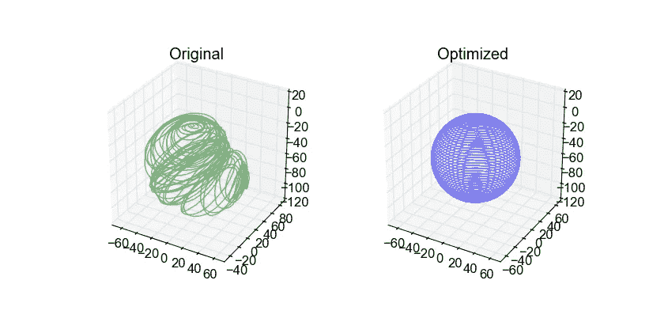
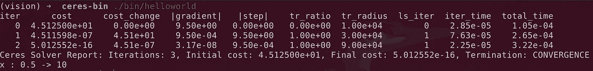

# 如何使用 Ceres Solver 创建一个 C++项目？

> 原文：<https://towardsdatascience.com/how-to-create-a-c-project-using-ceres-solver-f3d67c8044f3?source=collection_archive---------49----------------------->

## 开始使用 Ceres 解算器的逐步步骤



使用 Ceres 优化的 3D 姿势图示例。来源:[谷神星教程](http://ceres-solver.org/nnls_tutorial.html)

我猜你们大多数人已经知道一点谷神星解算器是什么。对于那些没有听说过它的人来说， [Ceres Solver](http://ceres-solver.org/) 是最受欢迎的开源库之一，用于解决大型复杂的优化问题。Ceres Solver 的一个突出特点是能够解决带有边界约束的[非线性最小二乘](http://en.wikipedia.org/wiki/Non-linear_least_squares)问题。它在机器人学中广泛用于解决束调整和 SLAM 等问题。用户和应用程序的集合可以在官方网站上找到。

尽管 Ceres Solver(在本文的其余部分称为 Ceres)有很好的文档和实践教程来帮助新用户入门。我发现关于如何使用 Ceres 创建一个新项目的信息隐藏在官方指南中。这正是这个故事的内容。

## 安装 Ceres

首先，我们需要安装 Ceres 才能使用。在这一节中，我们将讨论如何在 Ubuntu 机器上构建和安装 Ceres 作为静态库。如果您正在使用不同的操作系统，或者您更喜欢将 Ceres 构建为共享库，请遵循[安装页面](http://ceres-solver.org/installation.html)上的说明。

我们从推荐给 Ubuntu 的依赖项开始:

在 Ubuntu 上安装 Ceres 的依赖项

然后我们从 [Ceres 的网站上获取源代码。](http://ceres-solver.org/installation.html#getting-the-source-code)在撰写本文时，最新的稳定版本是 1.14.0。请在以下命令中相应地调整版本:

将 Ceres 构建为静态库

现在我们已经成功编译了谷神星。我们应该能够运行谷神星的 HelloWorld 示例。



运行 Ceres 附带的 Hello World 示例

最后一步是将 Ceres 安装到之前指定的安装目录中:

根据安装目录，您可能需要也可能不需要`sudo`权限。

## 使用 Ceres-Solver 创建一个项目

在上一节中，我们已经讨论了将 Ceres-Solver 作为静态库来构建和安装。我们还运行了 Ceres 附带的 [HelloWorld](http://ceres-solver.org/nnls_tutorial.html#hello-world) 示例。下一步是能够编译我们自己的 HelloWorld 程序，并开始探索谷神星的魔法世界。

为此，我们将创建一个简单的项目，如下所示:

```
my_project
├── CMakeLists.txt
└── helloworld.cc
```

`helloworld.cc`只是我们之前运行的 HellowWorld 示例的源代码。你可以从 [Ceres 的 git 库](https://ceres-solver.googlesource.com/ceres-solver/+/master/examples)获得。还有许多其他可用的示例，包括但不限于圆拟合示例、束调整示例、姿势图优化的 2D & 3D 示例等。

`CMakeLists.txt`包含关于如何使用[CMake 构建系统](https://cmake.org/cmake/help/latest/guide/tutorial/index.html)构建我们的`helloworld.cc`的信息:

helloworld.cc 的 CMakeLists.txt

注意 Ceres 官方支持 CMake 2.8 向后兼容。但 2020 年采用 CMake 3.x 风格对我们来说并无大碍。

如果你不熟悉 CMake 构建系统，我强烈推荐 [Aakash Mallik](https://medium.com/@aakashmallik?source=post_page-----e415b5b387dc----------------------) 的 [C++应用开发系列](https://medium.com/heuristics/c-application-development-part-2-cmakelists-txt-e415b5b387dc)。

如果您想发布使用 Ceres 的项目，请参考[安装/导出使用 Ceres 的项目](http://ceres-solver.org/installation.html#installing-exporting-a-project-that-uses-ceres)了解更多信息。

希望这个简写版的 [Ceres 安装指南](http://ceres-solver.org/installation.html#)对那些不熟悉 CMake 的人有所帮助。

## 参考

 [## Ceres 求解器——一个大规模非线性优化库

### Ceres Solver [1]是一个开源的 C++库，用于建模和解决大型复杂的优化问题。它…

ceres-solver.org](http://ceres-solver.org/index.html)  [## 安装- Ceres 解算器

### 您可以从最新的稳定版本开始。或者如果你想要最新的版本，你可以克隆 git 库 git…

ceres-solver.org](http://ceres-solver.org/installation.html) [](https://medium.com/heuristics/c-application-development-part-2-cmakelists-txt-e415b5b387dc) [## C++应用程序开发(第二部分— CMakeLists.txt)

### 如果你曾经做过一个比较大的 C++项目，那么你一定听说过这个工具。它可能看起来会做一些…

medium.com](https://medium.com/heuristics/c-application-development-part-2-cmakelists-txt-e415b5b387dc)  [## CMake 教程- CMake 3.17.3 文档

### CMake 教程提供了一个分步指南，涵盖了 CMake 帮助解决的常见构建系统问题…

cmake.org](https://cmake.org/cmake/help/latest/guide/tutorial/index.html)