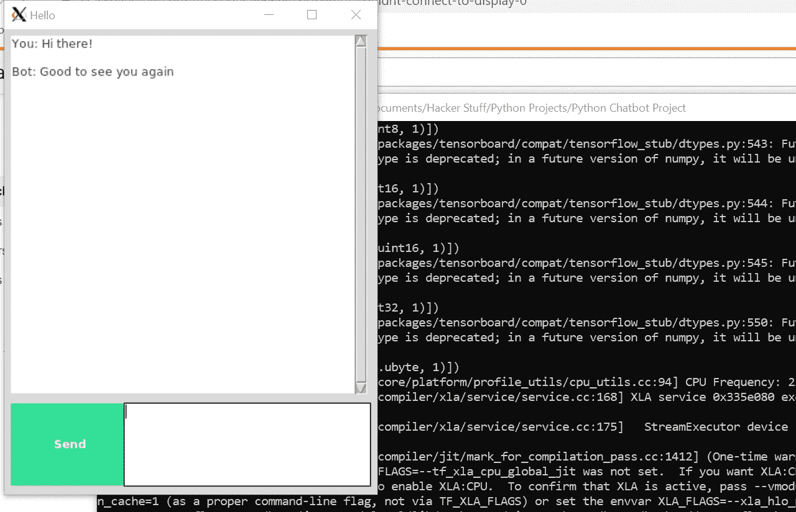
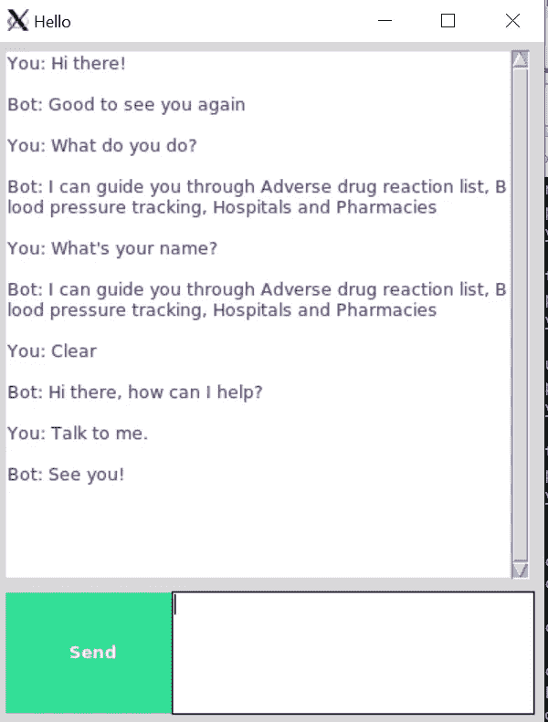
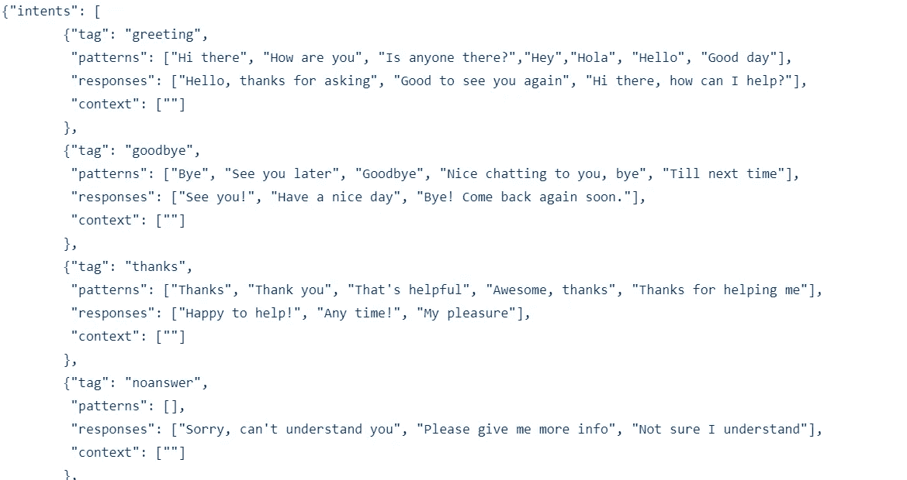

# 如何在不到一小时的时间内用 Python 和深度学习创建聊天机器人

> 原文：<https://towardsdatascience.com/how-to-create-a-chatbot-with-python-deep-learning-in-less-than-an-hour-56a063bdfc44?source=collection_archive---------0----------------------->

## 显然不要指望会是 Siri 或者 Alexa…

希望有一天 BB-8 会成为现实…

有些人真的不喜欢人际交往。每当他们被迫参加社交活动或有很多人参加的活动时，他们会感到孤立和尴尬。就我个人而言，我相信我是最外向的，因为我从与其他人的互动中获得能量。在这个地球上有很多人恰恰相反，他们在社会交往中变得非常疲惫。

我想起了一部非常独特的电影，叫做*她(2013)* 。这部电影的基本前提是，一个遭受孤独、抑郁、无聊的工作和即将离婚的男人最终爱上了他计算机操作系统上的一个 AI(人工智能)。也许在当时这是一个非常科幻的概念，因为那时人工智能还没有先进到足以成为代理人，但现在呢？2020?事情发生了很大的变化。我担心人们会放弃在人类中寻找爱情(甚至是社会交往),转而在数字领域寻找爱情。不相信我？我不会告诉你这是什么意思，但只要搜索一下术语*和*畏缩* ***的定义就可以了。****

**

*对于一个简单的机器学习项目，这难道不是一个过于冗长的介绍吗？可能吧。既然我已经详细描述了这个世界上许多男人(和女人)有理由实际关注的问题，让我们换个话题，做些简单有趣的事情吧！*

*这是成品的样子。*

**

*漂亮简单的界面*

**

*显然，这个聊天机器人的反应极其有限*

# *议程*

1.  *图书馆和数据*
2.  *初始化聊天机器人训练*
3.  *构建深度学习模型*
4.  *构建聊天机器人 GUI*
5.  *运行聊天机器人*
6.  *结论*
7.  *需要改进的地方*

**如果你想更深入地了解这个项目，或者如果你想添加代码，查看一下* [*GitHub 库*](https://github.com/jerrytigerxu/Simple-Python-Chatbot) *。**

# *图书馆和数据*

*运行这个项目所需的所有组件都在 GitHub 存储库中。您可以随意派生存储库并将其克隆到您的本地机器上。下面是组件的快速分类:*

*   ***train_chatbot.py** —将自然语言数据读入训练集并使用 Keras 顺序神经网络创建模型的代码*
*   ***chatgui.py** —基于模型的预测清理响应并创建与聊天机器人交互的图形界面的代码*
*   ***classes.pkl** —不同类型的响应类别列表*
*   ***words.pkl** —可用于模式识别的不同单词的列表*
*   ***intents . JSON**—JavaScript 对象的集合，列出了对应于不同类型单词模式的不同标签*
*   ***chatbot_model.h5** —由 train_chatbot.py 创建并由 chatgui.py 使用的实际模型*

*完整的代码在 GitHub 库中，但是为了透明和更好的理解，我将遍历代码的细节。*

*现在让我们从导入必要的库开始。(当您在终端上运行 python 文件时，请确保它们安装正确。我使用 pip3 来安装包。)*

*我们有一大堆库，如 *nltk* (自然语言工具包)，其中包含一大堆用于清理文本并为深度学习算法做准备的工具， *json* ，它将 json 文件直接加载到 Python 中， *pickle* ，它加载 pickle 文件， *numpy* ，它可以非常高效地执行线性代数运算，以及 *keras* ，这是我们将使用的深度学习框架。*

# *初始化聊天机器人训练*

*现在是时候初始化所有存储自然语言数据的列表了。我们有我前面提到的 json 文件，其中包含“意图”。下面是 json 文件的一个片段。*

**

*典型的 json 格式*

*我们使用 json 模块加载文件并将其保存为变量 *intents。**

*如果仔细观察 json 文件，可以看到对象中有子对象。例如，“模式”是“意图”中的一个属性。因此，我们将使用一个嵌套的 for 循环来提取“模式”中的所有单词，并将它们添加到我们的**单词**列表中。然后，我们将每对模式添加到我们的**文档**中，列出它们对应的标签。我们还将标签添加到我们的**类**列表中，并使用一个简单的条件语句来防止重复。*

*接下来，我们将获取**单词**列表，并对其中的所有单词进行词汇化和小写。如果你还不知道的话， **lemmatize** 的意思是把一个单词变成它的基本意思，或者它的**引理。**比如“走”、“走了”、“走了”这些词都有同一个引理，就是“走了”。将我们的词语词汇化的目的是将所有的东西缩小到尽可能简单的程度。当我们实际处理这些词进行机器学习时，它将节省我们大量的时间和不必要的错误。这与**词干**非常相似，都是将一个屈折的单词缩减到它的基础或词根形式。*

*接下来，我们对列表进行排序，并打印出结果。好了，看起来我们要建立我们的深度学习模型了！*

# *构建深度学习模型*

*让我们用变量 *training* 初始化我们的训练数据。我们正在创建一个巨大的嵌套列表，其中包含每个文档的单词包。我们有一个名为 *output_row* 的特性，它只是作为列表的一个键。然后，我们洗牌我们的训练集，做一个训练-测试-分裂，模式是 X 变量，意图是 Y 变量。*

*现在我们已经准备好了我们的训练和测试数据，我们现在将使用来自 keras 的深度学习模型，称为 Sequential。我不想用深度学习模型如何工作的所有细节来淹没你，但如果你好奇，请查看文章底部的参考资料。*

*keras 中的序列模型实际上是最简单的神经网络之一，一个多层感知器。如果你不知道那是什么，我不怪你。这里是喀拉斯的[文档](https://keras.io/getting-started/sequential-model-guide/)。*

*这个特定的网络具有 3 层，第一层具有 128 个神经元，第二层具有 64 个神经元，第三层具有作为神经元数量的意图数量。请记住，这个网络的要点是能够预测给定一些数据的选择意图。*

*模型会用随机梯度下降进行训练，这也是一个非常复杂的课题。随机梯度下降比正常梯度下降更有效，你只需要知道这些。*

*在模型被训练之后，整个东西被转换成一个 numpy 数组并保存为 *chatbot_model.h5\.**

*我们将使用这个模型来形成我们的聊天机器人界面！*

# *构建聊天机器人 GUI*

*同样，我们需要从文件中提取信息。*

*下面是一些函数，包含了运行 GUI 的所有必要过程，并将它们封装成单元。我们有 *clean_up_sentence()* 函数，它清理输入的任何句子。这个函数用在 *bow()* 函数中，该函数提取被清理的句子，并创建一个单词包，用于预测类别(基于我们之前训练模型得到的结果)。*

*在我们的 *predict_class()* 函数中，我们使用 0.25 的误差阈值来避免过多的过拟合。这个函数将输出一个意图和概率的列表，以及它们与正确意图匹配的可能性。函数 *getResponse()* 获取输出的列表并检查 json 文件，以最高的概率输出最多的响应。*

*最后，我们的 *chatbot_response()* 接收一条消息(将通过我们的 chatbot GUI 输入)，用我们的 *predict_class()* 函数预测类，将输出列表放入 *getResponse()* ，然后输出响应。我们得到的是我们聊天机器人的基础。我们现在可以告诉机器人一些事情，然后它会作出回应。*

*有趣的部分来了(如果其他部分还不有趣的话)。我们可以用 tkinter 创建我们的 GUI，tkinter 是一个 Python 库，它允许我们创建自定义接口。*

*我们创建了一个名为 *send()* 的函数，它设置了聊天机器人的基本功能。如果我们输入到聊天机器人的消息不是空字符串，机器人将根据我们的 *chatbot_response()* 函数输出一个响应。*

*之后，我们构建聊天窗口、滚动条、发送消息的按钮和创建消息的文本框。我们用简单的坐标和高度将所有组件放置在屏幕上。*

# *运行聊天机器人*

*终于是时候运行我们的聊天机器人了！*

*因为我在 Windows 10 机器上运行我的程序，所以我必须下载一个名为 Xming 的服务器。如果你运行你的程序，它给你一些关于程序失败的奇怪错误，你可以下载 [Xming](https://sourceforge.net/projects/xming/) 。*

*在运行你的程序之前，你需要确保你安装了 python 或者 python3 和 pip(或者 pip3)。如果您不熟悉命令行命令，请查看下面的参考资料。*

*一旦你运行你的程序，你应该得到这个。*

**

# *结论*

*祝贺您完成这个项目！构建一个简单的聊天机器人会让您接触到各种数据科学和一般编程的有用技能。我觉得学习任何东西的最好方法(至少对我来说)就是建造和修补。如果你想变得擅长某件事，你需要大量的练习，而最好的练习方法就是亲自动手去做。*

# *需要改进的地方*

*感谢您花时间通读这篇文章！请随意查看我的[作品集网站](https://jerrytigerxu.github.io/?source=post_page---------------------------)或[我的 GitHub](https://github.com/jerrytigerxu?source=post_page---------------------------) 。*

## *1.尝试不同的神经网络*

*我们用的是最简单的 keras 神经网络，所以有很大的改进空间。你可以在你的项目中随意尝试卷积网络或递归网络。*

## *2.使用更多数据*

*就各种可能的意图和响应而言，我们的 json 文件非常小。人类语言比这要复杂几十亿倍，所以从头开始创建 JARVIS 需要更多的东西。*

## *3.使用不同的框架*

*深度学习框架不只是 keras，还有很多。有 tensorflow，Apache Spark，PyTorch，Sonnet 等等。不要把自己局限在一个工具上！*

# *资源*

*   *[深度学习](https://machinelearningmastery.com/what-is-deep-learning/)*
*   *[自然语言处理](https://becominghuman.ai/a-simple-introduction-to-natural-language-processing-ea66a1747b32?gi=2610d4885f73)*
*   *[命令行](https://tutorials.ubuntu.com/tutorial/command-line-for-beginners#0)*
*   *[神经网络](/understanding-neural-networks-19020b758230)*
*   *[Tkinter](https://docs.python.org/3/library/tkinter.html)*