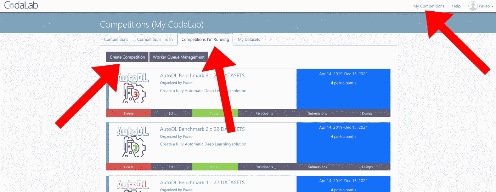
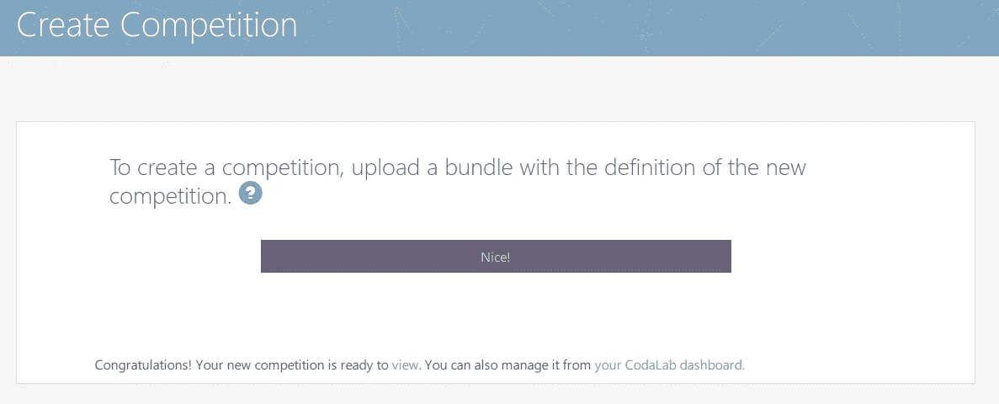
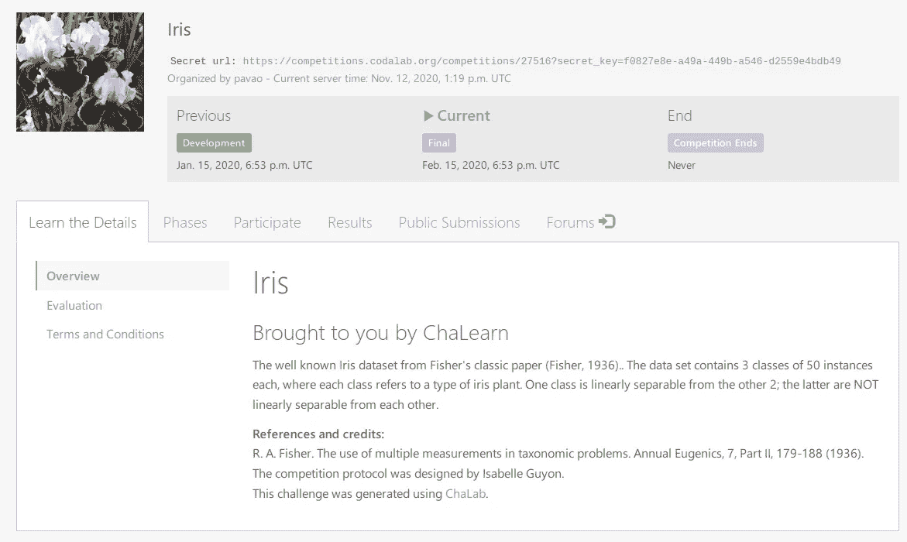
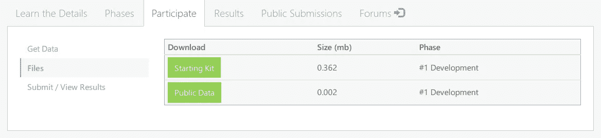
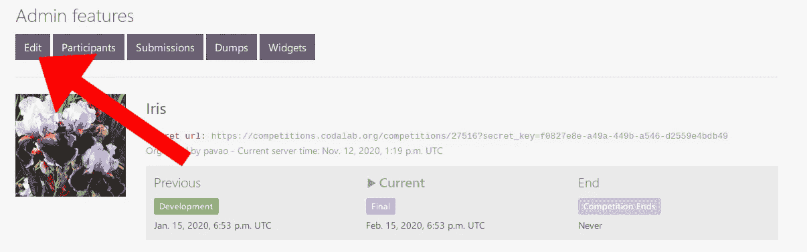
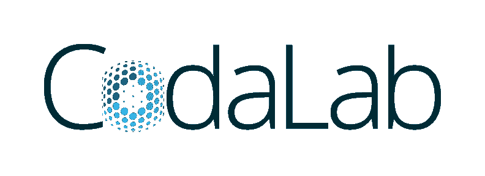

# 如何在 CodaLab 上创建你的第一个比赛

> 原文：<https://towardsdatascience.com/how-to-create-a-competition-on-codalab-85d69580f9c8?source=collection_archive---------23----------------------->

## 很洒脱！

来源:[istockphoto.com](https://www.istockphoto.com/fr/photo/concept-de-strat%C3%A9gie-dentreprise-et-plan-daction-main-mettant-le-bloc-en-bois-de-gm1189750888-336978330)(作者购买)

组织一次挑战可以让你众包最困难的机器学习问题。这也是[学习数据科学](/designing-a-data-science-competition-is-an-excellent-way-to-learn-69e6fd582702)的绝佳方式。这份简短的实践教程将为你提供创建你的第一个竞赛所需的一切——就在今天！

# 为什么是 Codalab？

Codalab 是一个[开源](https://github.com/codalab/codalab-competitions/)网络平台，举办数据科学竞赛。这意味着你可以建立自己的实例，或者使用 codalab.lisn.fr 上的主实例。Codalab 强调科学，每年都有数百项挑战发生在科学上，挑战许多领域的极限:物理、医学、计算机视觉、自然语言处理甚至机器学习本身。它的灵活性允许解决各种各样的任务！

**一旦你有了账号，你就可以发布你的第一场比赛了！唯一的限制是你的想象力。**

# 开始

要创建你的第一个机器学习挑战，你需要做的就是上传一个**竞赛捆绑包**。竞赛包是一个ZIP 文件，包含竞赛的所有部分:数据、文档、评分程序和配置设置。

先从一个例子说起；这是最简单的方法。这里是 *Iris Challenge* 的比赛捆绑，基于著名的 Fisher 的数据集；只需点击链接: [Iris 竞赛捆绑](https://github.com/codalab/competition-examples/tree/master/codalab/Iris)。

现在只需将名为“[iris _ competition _ bundle . zip](https://github.com/codalab/competition-examples/blob/master/codalab/Iris/iris_competition_bundle.zip)”的文件上传到 Codalab 中，如下所示:

转到“我的比赛”，然后是“我正在参加的比赛”，最后是“创建比赛”

就是这样！您的竞争对手已经准备好接受提交。

# 定制您的比赛

> 这很酷，但我刚刚重新创建了虹膜挑战。我想设计我自己的任务，包括我的数据集！—你

要定制您的比赛，您需要更改捆绑包中包含的文件并重新上传。让我们仔细看看包里有什么。

## HTML 文件

HTML 文件定义了参与者在参加比赛时可以看到的各种页面。使用它们来提供文档和规则，以及您认为重要的任何信息。

Iris 挑战赛主页。网页是由包中的 HTML 文件定义的。

## 标志；徽标

把“*logo.png*”换成你酷炫的 logo！

Iris 竞赛包中的“logo.png”

## 数据

如果你在设计一个机器学习问题，很可能你已经有数据了。**公共数据**(或输入数据)文件夹用于参与者将访问的数据，**参考数据**文件夹用于地面真相，通常是来自测试集的您想要保密的标签。您可以使用与提供的示例相同的数据格式，或者您喜欢的任何其他格式。为了确保兼容性，您需要更新评分程序——我们将在下一节讨论它。

*如果你的问题不涉及数据，不用担心！Codalab 非常灵活，可以根据您的需要定义您的问题(例如强化学习任务)。*

## 摄取和评分计划

摄取和评分程序是你的竞赛代码的主要部分:它们定义了提交的内容将被评估的方式。如果你想只允许**成绩提交**，那么你只需要评分程序；摄取程序对于**代码提交**很有用。

*   摄取程序:定义如何训练模型并保存它们的预测。
*   评分程序:定义如何将预测与实际情况进行比较。

## 启动套件

如果你已经作为竞争对手参加了挑战，你就知道拥有一套好的出发装备有多重要。在这里，您只需包括参与者轻松投入挑战所需的一切:一些提交的示例、Jupyter 笔记本等。他们可以从网页“*参与>文件*”下载。

用户可以从网页“参与>文件”下载启动工具包

## competition.yaml 文件

最后但同样重要的是，[**competition . YAML**](https://github.com/codalab/competition-examples/blob/master/codalab/Iris/iris_competition_bundle/competition.yaml)文件定义了你挑战的**设置**。标题、描述、Docker 图片(*只需输入 DockerHub 名称，提交的内容将在其中运行*)、日期、奖品等等。

# 编辑现有竞赛

你的比赛开始了！但是，您希望编辑它。还是有可能的。作为您自己挑战的管理员，您可以访问“编辑”菜单；点击如下按钮:

管理功能包括编辑现有的竞争

然后，您将访问一个面板，在这里您可以编辑每个设置。如果您希望更改数据集或评分程序，首先需要从“*我的数据集*”页面上传新版本。

# 走得更远

恭喜你！你知道如何在 Codalab 上创造竞争！然而，我们仅仅触及了软件提供的所有可能性的表面。想了解更多，可以参考 [**Codalab 的 Wiki**](https://github.com/codalab/codalab-competitions/wiki) 。例如，您将了解如何将您的个人计算机工作人员(CPU、GPU)联系起来，或者如何使用多个标准定义复杂的排行榜。你甚至可以加入努力，发展自己的特色！

来源:[codalab.org](https://competitions.codalab.org/)