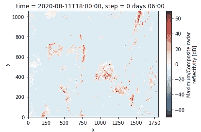
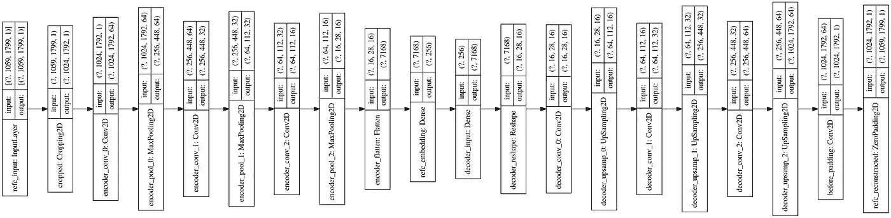

# 如何使用机器学习创建简洁的图像表示

> 原文：<https://towardsdatascience.com/how-to-create-a-concise-image-representation-using-machine-learning-20156c1e0c19?source=collection_archive---------30----------------------->

## Keras 中 HRRR 图像自动编码器的设计与训练

互联网上的 Autoencoder 示例似乎要么是关于玩具示例(MNIST，28x28 图像)，要么是利用了 ImageNet 瓶颈层的迁移学习。我将向您展示如何从头开始训练自动编码器，如果您有足够的数据和完全不同于 ImageNet 组成的照片的数据，您将会这样做。

在之前的一篇文章中，我展示了如何获取天气预报图像并从中创建张量流记录，以使它们为机器学习做好准备。

在本文中，我将展示如何对这些图像执行一项机器学习任务:使用自动编码器从高分辨率快速刷新(HRRR)模型创建雷达反射率“分析”场的简明表示。HRRR 的图像是 1059x1799，看起来像这样:



## 在 Keras 中设计自动编码器

自动编码器由通常如下所示的体系结构组成:


自动编码器架构。来源:维基百科上的 Chervinskii([https://commons . wikimedia . org/wiki/File:auto encoder _ structure . png](https://commons.wikimedia.org/wiki/File:Autoencoder_structure.png))

编码器试图将输入图像表示为一个更小的数字数组。解码器从代码中重建图像。整个模型被训练以最小化输入和输出的差异。

有几个陷阱需要注意:

1.  代码(或嵌入)需要比输入小得多。否则，ML 模型可以简单地将输入像素复制到代码中。不会有一概而论。
2.  具有一百万像素输入的参数数量可能会失控。传统上，减少参数数量的方法是使用卷积层。
3.  然而，卷积层保留位置信息。所以，从本质上来说，这些层所做的就是让图像越来越模糊。为了超越单纯的模糊，你应该在每个阶段增加卷积滤波器中“通道”的数量。这样，您就可以在各层之间保存信息。
4.  此外，你至少需要一个密集的连接，在图像的不同部分之间带来“远程连接”。我选择在创建嵌入时这样做。
5.  仔细考虑你是否需要短路层，注意力等。这取决于您正在处理的图像类型和层数。在我的例子中，这些是带有很强的位置约束的地理图像。所以，我决定不使用这些伎俩。
6.  减小卷积滤波器大小的方法是使用池层。在解码器中，相反的操作是进行上采样。

这是我最后的建筑:



让我们用代码浏览一下([完整代码在 GitHub](https://github.com/GoogleCloudPlatform/ml-design-patterns/tree/master/02_data_representation/weather_search) 上)。第一层是输入层:

```
input_img = tf.keras.Input(shape=(1059, 1799, 1), name='refc_input')
```

我更喜欢大小是 2 的幂，这样更容易得到更小的层。我可以将 1059 一直填充到 2048，但裁剪到 1024 似乎更合理——无论如何，HRRR 图像的边缘分辨率都很差。因此，第二层是一个裁剪层:

```
x = tf.keras.layers.Cropping2D(cropping=((17, 18),(4, 3)), name='cropped')(input_img)
```

我们不知道需要多少个卷积层，所以让层数(nlayers)成为一个超参数。此外，我们将使过滤器的数量(或通道的数量)成为超参数，因为这控制了从一层到下一层传递多少信息。最后，poolsize 也将是一个超参数，因为它控制着图像大小从一层到下一层的缩减量:

```
 last_pool_layer = None
    for layerno in range(**nlayers**):
        x = tf.keras.layers.Conv2D(2**(layerno + **numfilters**), poolsize, activation='relu', padding='same', name='encoder_conv_{}'.format(layerno))(x)
        last_pool_layer = tf.keras.layers.MaxPooling2D(**poolsize**, padding='same', name='encoder_pool_{}'.format(layerno))
        x = last_pool_layer(x)
    output_shape = last_pool_layer.output_shape[1:]
```

我还确保捕捉最后一层，以便在嵌入层之前获得输出形状(原因将变得明显)。

一旦卷积层完成，我们可以让它通过一个密集层。我还将密集节点的数量(本质上是嵌入的长度)作为一个超参数:

```
 # flatten, send through dense layer to create the embedding
        x = tf.keras.layers.Flatten(name='encoder_flatten')(x)
        x = tf.keras.layers.Dense(**num_dense**, name='refc_embedding')(x)
        x = tf.keras.layers.Dense(output_shape[0] * output_shape[1] * output_shape[2], name='decoder_dense')(x)
        embed_size = num_dense
```

请注意，我是如何使用输出形状预嵌入来恢复解码器第一层中的原始展平长度的。

然后，我们一个接一个地颠倒操作。首先是对解码器进行整形，以获得最后一个 conv 池块的输出形状:

```
x = tf.keras.layers.Reshape(output_shape, name='decoder_reshape')(x)
```

然后，创建一个解码器模块，由长度相反的卷积和上采样组成:

```
for layerno in range(nlayers):
        x = tf.keras.layers.Conv2D(2**(nlayers-layerno-1 + numfilters), poolsize, activation='relu', padding='same', name='decoder_conv_{}'.format(layerno))(x)
        x = tf.keras.layers.UpSampling2D(poolsize, name='decoder_upsamp_{}'.format(layerno))(x)
    before_padding_layer = tf.keras.layers.Conv2D(1, 3, activation='relu', padding='same', name='before_padding')
    x = before_padding_layer(x)
    htdiff = 1059 - before_padding_layer.output_shape[1]
    wddiff = 1799 - before_padding_layer.output_shape[2]
```

我们在编码器中进行裁剪的地方，现在需要进行零填充:

```
before_padding_layer = tf.keras.layers.Conv2D(1, 3, activation='relu', padding='same', name='before_padding')
    x = before_padding_layer(x)
    htdiff = 1059 - before_padding_layer.output_shape[1]
    wddiff = 1799 - before_padding_layer.output_shape[2]
    decoded = tf.keras.layers.ZeroPadding2D(padding=((htdiff//2,htdiff - htdiff//2),
                                                     (wddiff//2,wddiff - wddiff//2)), name='refc_reconstructed')(x)
```

现在，创建自动编码器:

```
autoencoder = tf.keras.Model(input_img, decoded, name='autoencoder')
autoencoder.compile(optimizer='adam',loss=tf.keras.losses.LogCosh())
```

为什么是 LogCosh？因为我们做的是回归，而 LogCosh 对异常值的容忍度比均方差高。

## 编写培训师

一旦模型写好了，培训师([完整代码](https://github.com/GoogleCloudPlatform/ml-design-patterns/blob/master/02_data_representation/weather_search/wxsearch/train_autoencoder.py):检查一下)就成了样板。我们所有的图像都是 TFRecord，所以我们创建一个 TF record 数据集，创建模型并调用 model.fit。

创建 TFRecord 数据集:

```
def parse_tfrecord(example_data):
    parsed = tf.io.parse_single_example(example_data, {
        'size': tf.io.VarLenFeature(tf.int64),
        'ref': tf.io.VarLenFeature(tf.float32),
        'time': tf.io.FixedLenFeature([], tf.string),
        'valid_time': tf.io.FixedLenFeature([], tf.string)
     })
    parsed['size'] = tf.sparse.to_dense(parsed['size'])
    parsed['ref'] = tf.reshape(tf.sparse.to_dense(parsed['ref']), (1059, 1799))/60\. # 0 to 1
    return parseddef read_dataset(pattern):
    filenames = tf.io.gfile.glob(pattern)
    ds = tf.data.TFRecordDataset(filenames, compression_type=None, buffer_size=None, num_parallel_reads=None)
    return ds.prefetch(tf.data.experimental.AUTOTUNE).map(parse_tfrecord)
```

要创建模型并对其进行训练:

```
def run_job(opts):
    def input_and_label(rec):
        return rec['ref'], rec['ref']
    ds = read_dataset(opts['input']).map(input_and_label).batch(opts['batch_size']).repeat()

    checkpoint = tf.keras.callbacks.ModelCheckpoint(os.path.join(opts['job_dir'], 'checkpoints'))

    strategy = tf.distribute.MirroredStrategy()
    with strategy.scope():
        autoencoder, error = create_model(opts['num_layers'], opts['pool_size'], opts['num_filters'], opts['num_dense'])

        history = autoencoder.fit(ds, steps_per_epoch=opts['num_steps']//opts['num_checkpoints'],
                              epochs=opts['num_checkpoints'], shuffle=True, callbacks=[checkpoint, HptCallback()])

        autoencoder.save(os.path.join(opts['job_dir'], 'savedmodel'))
```

这里有几点:

1.  我获取 TFRecord 并返回与输入和标签相同的反射率图像数据。这是因为我们正在进行自动编码。
2.  MirroredStrategy 将允许我创建一个具有多个 GPU 的机器，并获得快速的分布式训练。
3.  我创建模型检查点(检查点是[机器学习设计模式书](https://www.amazon.com/Machine-Learning-Design-Patterns-Preparation/dp/1098115783)中的设计模式之一；这有助于使分布式培训更有弹性)
4.  在 fit()方法中，我处理了 steps_per_epoch 和 epoch 的数量。这是检查点模式的虚拟纪元变体。再次，阅读这本书，了解为什么这很重要。
5.  因为我们正在进行自动编码，所以我不会为验证数据集而烦恼。我们越能接近地表现输入，就越好。

## 批量过装

像我一样设计一个模型架构的最佳实践是确保最终的架构足够强大，能够学习我们需要它学习的东西。做到这一点的方法是有用的过度拟合(我们书中的另一个模式)。基本上，取一个非常小的数据集(我用了 4 张图片)并在这个数据集上过度拟合模型。如果你能让误差变得非常小，那么这个模型就足够强大了。

所以，我是这么做的。我写了我的 ML 模型，然后我在超参数空间上做了网格搜索，并选择了最小的嵌入大小，这允许我尽可能完美地学习 4 幅图像(这不会是完美的，因为图像表示将是模糊的)。

因此，还有一个超参数回调:

```
class HptCallback(tf.keras.callbacks.Callback):
    def __init__(self):
        self.hpt = hypertune.HyperTune()

    def on_epoch_end(self, epoch, logs):
        self.hpt.report_hyperparameter_tuning_metric(
            hyperparameter_metric_tag='final_loss',
            metric_value=logs['loss'],   #history.history['loss'][-1],
            global_step=epoch
        )
```

我现在可以在谷歌云人工智能平台上进行培训:

```
gcloud ai-platform jobs submit training $JOB_NAME \
        --package-path $PACKAGE_PATH \
        --module-name $MODULE_NAME \
        --job-dir gs://${BUCKET}/wxsearch/trained \
        --region $REGION \
        --config hyperparam.yaml \
        --input gs://${BUCKET}/wxsearch/data/2019/tfrecord-00000-* \
        --project ${PROJECT} \
        --batch_size 4 --num_steps 1000 --num_checkpoints 4
```

结果，我发现这个架构已经足够了:

```
--num_layers 4 --pool_size 4 --num_filters 4 --num_dense 50
```

仅仅 50 个数字代表 100 万像素！

## 训练自动编码器

一旦我们决定了小批量超拟合的超参数，我们就可以采用该模型并在整个 HRRR 2019 数据集上训练它:

```
gcloud ai-platform jobs submit training $JOB_NAME \
        --package-path $PACKAGE_PATH \
        --module-name $MODULE_NAME \
        --job-dir gs://${BUCKET}/wxsearch/trained \
        --region $REGION \
        --config train.yaml -- \
       ** --input gs://${BUCKET}/wxsearch/data/2019/tfrecord-* \**
        --project ${PROJECT} \
        --batch_size 4 --num_steps **50000** --num_checkpoints 10
```

train.yaml 在哪里:

```
trainingInput:
  scaleTier: CUSTOM
  masterType: n1-highmem-2
  masterConfig:
    acceleratorConfig:
      count: 2
      type: NVIDIA_TESLA_K80
  runtimeVersion: '2.2'
  pythonVersion: '3.7'
  scheduling:
    maxWaitTime: 3600s
```

这以 0.0023 的最终损失结束，实际上甚至比微小数据集上的过度拟合损失更好。

## 后续步骤:

试用一下(GitHub 的所有链接)

1.  从 HRRR 图像创建张量流记录: [hrrr_to_tfrecord.sh](https://github.com/GoogleCloudPlatform/ml-design-patterns/blob/master/02_data_representation/weather_search/01_hrrr_to_tfrecord.sh)
2.  [可选] Overfit batch 查找最佳超参数集:overfit_batch.sh
3.  在 2019 年 HRRR 数据集上训练自动编码器: [train_autoencoder](https://github.com/GoogleCloudPlatform/ml-design-patterns/blob/master/02_data_representation/weather_search/03_train_autoencoder.sh) 。嘘
4.  在我的[系列的下一篇文章](https://lakshmanok.medium.com/compression-search-interpolation-and-clustering-of-images-using-machine-learning-eb65fcf0abbb)中，我将展示如何采用训练好的模型，并为整个 2019 数据集创建嵌入。然后做一个嵌入，告诉你如何从中重建 HRRR 图像。