# 如何在 Power BI 中创建控制图

> 原文：<https://towardsdatascience.com/how-to-create-a-control-chart-in-power-bi-fccc98d3a8f9?source=collection_archive---------6----------------------->

## 在本文中，我将向您展示如何在 Power BI 中构建动态控制图，帮助您的团队查明任何异常值或失控的流程。

随着公司实施精益六适马实践，跟踪流程如何随着时间的推移而变化是必不可少的。控制图可以帮助企业可视化一段时间内的过程测量。

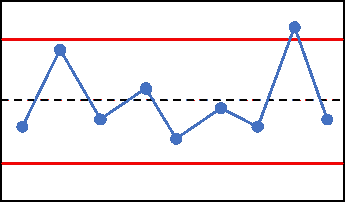

控制图(图片来自 r-bar.net)

对于不知道什么是控制图的人来说，首先要做的是。

# 🚩**控制图由 4 个主要特征组成:**

1.  **X 轴和 Y 轴数值**:数据值为 Y 轴。这可以是客户数量、票据数量、收入、成本或企业想要测量的任何数据值。时间将是 X 轴。
2.  **中心线** ( **又名平均值)**:这是数据点的平均值。它在图表的中间部分用实线表示。
3.  **控制下限** (LCL):低于平均值，称为-3 sigma 线，作为下限。
4.  **控制上限** (UCL):高于平均值，称为+3 sigma 线，作为上限。


这是我在 Power BI 中创建的控制图(图片由作者提供)

# 🚩让我们从在 Power BI 中构建控制图开始

***为了实现控制图的主要特性，我们首先创建一些 DAX 度量:***

对于平均值计算，您只需使用 Average 函数。我们包含了 ALLSELECTED 函数，以便根据用户在日期切片器中的选择进行动态计算。

```
AVERAGE CASES = CALCULATE(AVERAGEX(CONTROL_CHART_DATE,[TotalCases]), ALLSELECTED(CONTROL_CHART_DATE))
```

为了得出 UCL 和 LCL，我们首先需要计算标准差。标准差的语法如下:

```
STDEV = CALCULATE(STDEVX.P(CONTROL_CHART_DATE,[TotalCases]),ALLSELECTED(CONTROL_CHART_DATE[DATE]))
```

现在我们有了标准差，我们可以在 UCL 和 LCL 语法中输入这段。

对于 UCL，我们将“平均案例”度量与“标准偏差”度量相加，然后乘以 3(因此，3 sigmas)。

```
Upper Control Limit (UCL) = AVERAGE CASES + [STDEV]*3
```

对于 LCL，我们的做法与 UCL 相反。我们用 STDDEV 度量值减去 AVERAGE CASES 度量值，然后乘以 3。

```
Lower Control Limit (LCL) = AVERAGE CASES - [STDEV]*3
```

**用度量创建折线图:**

一旦创建了这些度量，就创建一个折线图。将 LCL、UCL 和平均案例拖到数值中。选择轴的日期。

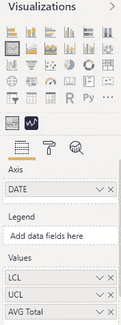

下面的操作应该可以让您了解控制图的主要组成部分。别忘了带上你的日期切片器。日期切片器将允许用户根据历史日期查看下限和上限。

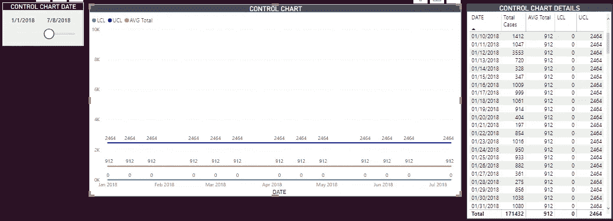

现在是剩下的部分:在仪表板上添加当前数据。您需要创建另一个独立的日期表，用于第二个日期切片器。这两个数据表应该连接到从中获取主值的表。

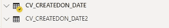

创建第二个日期表后，使用该表添加一个日期切片器。

现在是有趣的部分。你们中的一些人可能想知道如何将当年的数据反映在一个使用历史数据的带有日期轴的图表上？

该解决方案是一个创造性的变通办法。创建另一个折线图，将日期 2 作为 x 轴，并将正在分析的值作为 Y 轴。如果折线图中没有显示任何值，那么拍拍自己的背，因为 Power BI 正在工作。您将需要编辑日期切片器和图表之间的交互，方法是选择一个日期切片器，然后单击格式选项卡下的**编辑交互**。

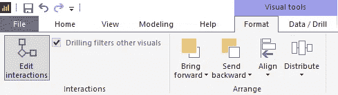

现在，您想选择第一个日期，在我的例子中是“控制图日期”，并在第二个日期通过选择右边的圆形图标点击“无”。

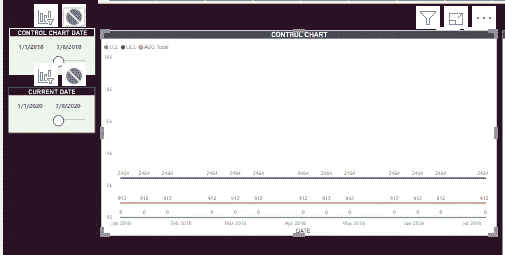

选择第二个日期切片器，并通过选择右边的圆形图标确保第一个日期没有被过滤。

在第二个日期切片器上选中时，您会希望在您创建的最后一个折线图上单击过滤器，方法是选择左侧图标，该图标看起来像旁边带有过滤器的图形。

确保在带有控制件的第一个图表上选择“无”。通过这些交互，您应该会看到第二个折线图最终出现。

现在，我们实际上有一个影响控制图(UCL、LCL、平均值)的日期限幅器和一个影响图表的日期限幅器，在本例中，它包含总计值。


**相应调整折线图格式:**

那么，如何让图表上下重叠呢？单击第二个图表，将背景设置为透明，这样它就能清楚地显示在第一个图表上。将图表放在另一个的上面。

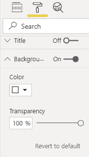

确保调整两个图表，使 Y 轴具有相同的刻度，否则总值可能无法调整到控制图的刻度。

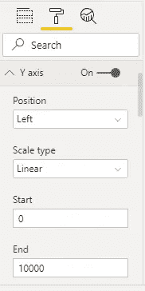

通过按住 CTRL 键选择两个图表并单击视图下的**锁定对象**，将两个图表锁定在一起以保持格式，这样缩放就不会受到影响。

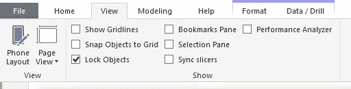

瞧啊。这就是最终的结果。我能够选择 2019 年和 2018 年的日期范围，这些日期范围会影响控制图，同时将其与我当前的 2020 年数据进行比较。

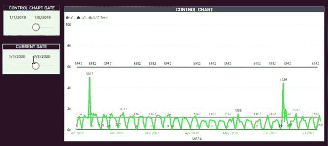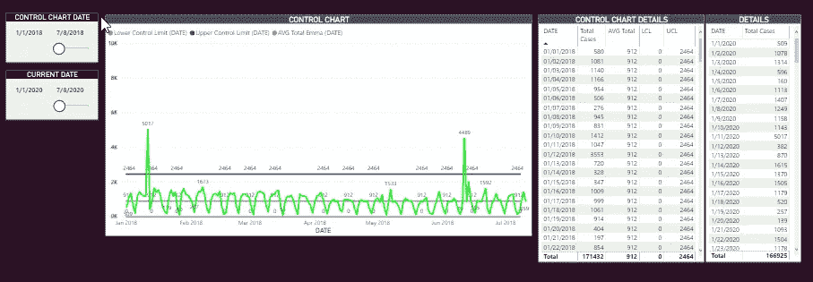

最终结果是一个控制图，您可以将当前数据与历史平均值、控制上限和控制下限进行比较。因为日期切片器和图表相互独立，所以您可以比较不同的日期范围，而不像 SAMEPERIODLASTYEAR 之类的函数将用户限制为只能比较去年的数据。

报告愉快，希望这个创造性的解决方案可以帮助其他 Power BI 开发人员更轻松地制作控制图！

—

娜塔莉·加尔塞斯是一名来自大西雅图地区的数据分析师。她获得了华盛顿大学的商业和 MSBA 学士学位。她写作并热衷于数据可视化、投资和所有科技方面的东西。