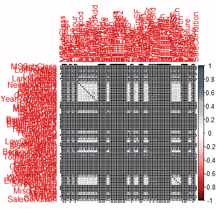
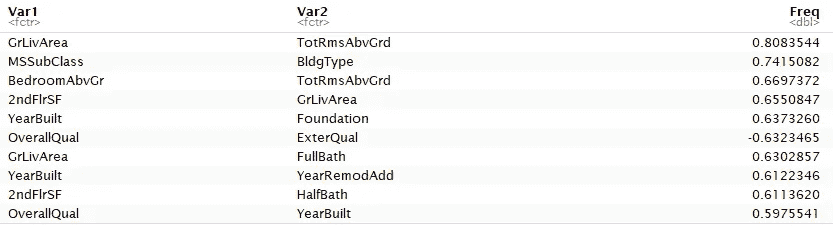
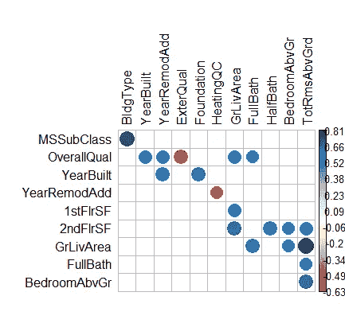

# 如何创建 R 中变量过多的相关矩阵

> 原文：<https://towardsdatascience.com/how-to-create-a-correlation-matrix-with-too-many-variables-309cc0c0a57?source=collection_archive---------8----------------------->

## 有效地过滤掉不相关的变量，以查看更相关的结果。

我使用了 [Kaggle 房价数据集](https://www.kaggle.com/c/house-prices-advanced-regression-techniques)，它有 79 个解释变量。在我的分析中，我试图查看所有变量之间的相关性，并意识到有太多的变量使任何典型的视觉辅助工具变得有意义。

我尝试了几种不同的软件包和工具，并决定我可以操纵 [corrplot](https://cran.r-project.org/web/packages/corrplot/vignettes/corrplot-intro.html) 做我最想要的事情。没有任何处理，这就是相关矩阵的样子。这显然是一种非常无益的视觉化。肯定有方法可以改变包中内置的视图，但是没有一种方法可以真正处理这么多的变量。

```
library(corrplot)df_cor <- cor(df)
corrplot(df_cor)
```



corrplot 中的初始图表

经过大量的反复试验和对堆栈溢出的清理，我能够创建一个函数来简化这个过程。首先，它会将所有变量转换成数值(如果还没有)。然后，它会丢弃重复项并完善相关性(与自身的相关性)。这些显然是没用的。

```
corr_simple <- function(data=df,sig=0.5){
  #convert data to numeric in order to run correlations
  #convert to factor first to keep the integrity of the data - each value will become a number rather than turn into NA
  df_cor <- data %>% mutate_if(is.character, as.factor)
  df_cor <- df_cor %>% mutate_if(is.factor, as.numeric) #run a correlation and drop the insignificant ones
  corr <- cor(df_cor)
  #prepare to drop duplicates and correlations of 1     
  corr[lower.tri(corr,diag=TRUE)] <- NA 
  #drop perfect correlations
  corr[corr == 1] <- NA  #turn into a 3-column table
  corr <- as.data.frame(as.table(corr))
  #remove the NA values from above 
  corr <- na.omit(corr)   #select significant values  
  corr <- subset(corr, abs(Freq) > sig) 
  #sort by highest correlation
  corr <- corr[order(-abs(corr$Freq)),]   #print table
  print(corr) #turn corr back into matrix in order to plot with corrplot
  mtx_corr <- reshape2::acast(corr, Var1~Var2, value.var="Freq")

  #plot correlations visually
  corrplot(mtx_corr, is.corr=FALSE, tl.col="black", na.label=" ")
}corr_simple()
```

接下来，它将设置数据框以查看表中的原始相关性，因为原始数据可能会有所帮助。数据帧首先按照最高相关性排序。



相关表

为了减少变量的绝对数量(无需手动挑选)，只选择高于特定显著性水平阈值的变量。初始默认值设置为 0.5。

生成表格后，它将返回以下经过筛选的相关矩阵图。只有显著性水平足够高的相关性才会有彩色圆圈。如果仍然有许多剩余变量，这进一步有助于去除噪声。



使用 corr_simple 函数过滤掉有用的相关矩阵

## 结论

这个“corr_simple”函数可以在一些特征工程之后反复运行，或者具有不同的显著性水平。这确实有助于更快的分析和只查看相关数据。对于更多的变量，可能需要使用不同的显著性水平和/或使用更多的特征工程来减少相关变量的数量，然后重新运行函数，直到结果可读且有用。