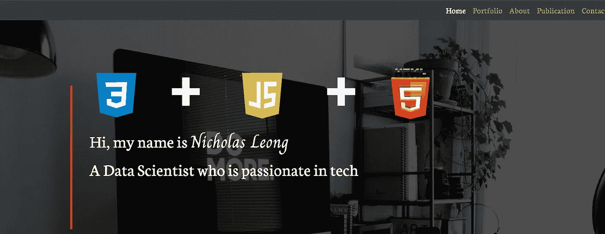
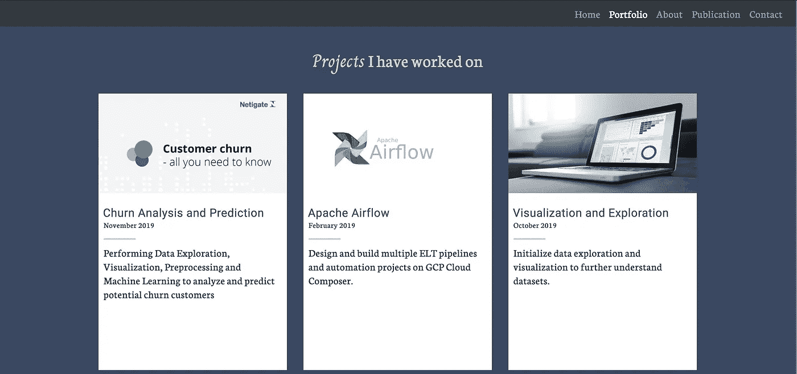
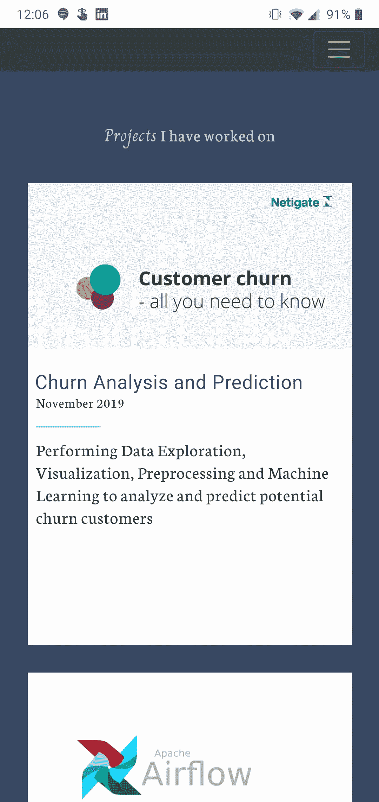
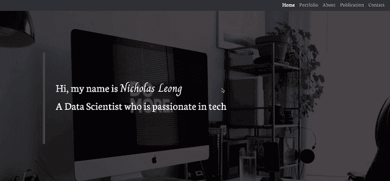
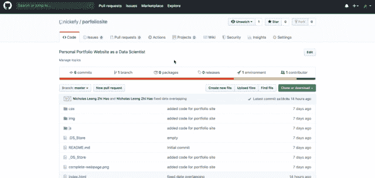

# 如何创建数据科学产品组合—由数据科学家讲述

> 原文：<https://towardsdatascience.com/how-to-create-a-data-science-portfolio-by-a-data-scientist-2aed3f473cf0?source=collection_archive---------17----------------------->

## 展示数据科学项目的网站



尼古拉斯的作品集网站

读者您好，
我希望每个人都保持**安全**和**洗手**。真的是在这样的时候，精神和身体健康对我们的前进极其重要。

正如我在之前的[文章](/data-science-interview-questions-beginners-guide-7b3034373ccb)中提到的，
**数据科学不会与经济**发生碰撞。
数据行业仍然有需求，有些人甚至会说，由于环境的原因，现在需求很大。当事情开始变得棘手时，企业主开始向我们求助。

来源: [reddit](https://www.reddit.com/r/reactiongifs/comments/4k4qv6/mrw_i_log_on_to_facebook_and_see_the_latest/)

也就是说，对数据科学职业的兴趣仍然很高。人们想进入这个领域，我明白。谁不想被称为 21 世纪最性感的工作？

> 21 世纪最性感的新工作，数据科学家——LinkedIn

然而并不全是彩虹和鲜花。你必须面对一些艰难的筛选和面试，那些你不知道会发生什么的面试。我已经在这里写下了所有的内容。看一看。

[](/data-science-interview-questions-beginners-guide-7b3034373ccb) [## 数据科学面试问题—初学者指南

### 在数据科学面试中，你应该期待什么样的问题？

towardsdatascience.com](/data-science-interview-questions-beginners-guide-7b3034373ccb) 

作为一个已经在这个领域工作了两年的人，我给我的初级数据科学家同事的第一个建议是拥有一个**数据科学组合**。没有什么比拥有一个展示你所有作品的网站更好的了。雇主会立刻对你的工作和专业素养有所了解，让你在获得这份工作时有额外的优势。

有趣的是，我是一个真正的伪君子。我自己没有投资组合，直到现在。

[gif](https://giphy.com/gifs/chuber-hypocrisy-hypocrite-lN2gYvEifKSxG2OpIN) by [chuber](https://giphy.com/chuber/)

等等，我有很好的理由来解释为什么我不得不推迟制作我的个人投资组合网站。先别生气。

## 有一个稳定的朝九晚五

我知道。我知道。谁没有呢？我不希望这成为“我没有足够的时间”的借口。然而，我必须平衡我的日常工作，同时也在媒体上写作。在过去的一年里，我已经写了 20 多篇文章。技术报道的制作并不简单。产生干净的代码并用通俗易懂的语言向读者解释需要时间。我会说这几乎就像一个侧面的骗局。

gif by[big brotherafterdark](https://giphy.com/bigbrotherafterdark/)

## 网络开发新秀

我是一名**精算**毕业生。实习期间掌握了 **SQL** 。
我在做数据科学家期间，掌握了 **Python** 。在这么短的时间内，我能学的语言就这么多。

我全心全意地想用我自己写的代码来制作我的作品集网站。有好几个选择，比如 Wix 和 Squarespace，你可以简单地在运行中建立自己的网站，但是我更喜欢自己做。

说到这里，我的网站运行在 **HTML** 、 **CSS、**和 **Javascript** 上。我不得不自学所有的语言，这需要一些时间。

## 没有值得骄傲的工作

这个很有意思。作品集网站的唯一目的就是展示你的作品，但是如果你没有作品可以展示呢？

当你刚刚开始你的职业生涯时，这更令人沮丧。是的，你可以展示自己发起的项目，但是雇主喜欢看你在真实环境中的实际成就。此外，我对自己的工作感到自豪。我不会展示我不引以为豪的东西。

我花了很多时间来积累出色的工作。我越专注于我的工作，我做的工作就越多，因此就有了延迟

# 我的投资组合网站

[](https://nickefy.github.io/porfoliosite/) [## 尼克的作品集

### 你好，我叫梁家杰。我是一名数据科学家，目前在一家在线分类广告技术公司工作。在我的…

nickefy.github.io](https://nickefy.github.io/porfoliosite/) 

这是我的网站的样子。
简单明了，开门见山。

有 5 个主页。

## 主页

登录页面。你的名字总是被期待在这里。这个页面为整个网站定下基调。我已经默认使用一个设计，在中间有一些巨大的文本来吸引注意力。
我的名字和激情在这里展示。没什么。

## 投资组合

在这个页面上，我展示了我所有的作品，以及适当的**文档**和**代码**。我只包括我认为有价值的项目。我还努力包含了各种各样的项目。我有项目在

*   机器学习
*   ETL/ELT 管道
*   数据可视化
*   数据分析

这些都与数据科学有关。我很感激能够接触到许多类型的项目，这让我能够展示我工作中的多样性。各种各样的项目展示了我在数据方面的技能，从工程到可视化。它有助于设定对雇主的期望。

确保到**文档**和**代码**的链接做得很好并且正常工作。你的代码应该是可读的。我们不期望雇主理解守则，但我们希望在面试时用通俗易懂的语言向雇主解释我们的守则。

确保在代码中包含**注释**、**空格**和适当的**缩进**，以表明你知道自己在做什么。你永远不知道谁会阅读你的代码，可能是从产品经理到高级软件工程师。因此，请保持你的代码整洁和专业。

## 关于

关于部分。在这里，你可以讲一点关于你的故事。介绍你自己，谈谈你的激情、目标和成就。相反，雇主想知道他们在雇佣谁。

站在他们的角度想想。你会雇佣一个你一无所知的人吗？还是对自己的工作充满热情的人？公司是由人组成的，人们想知道他们在和谁一起工作。个性是你想在这里展示的，尽量简短。

## 出版物

这是我的额外部分。作为一名媒体作家，我有出版物可以炫耀。我写我感兴趣的东西，我想表现出来。再一次，这是为了显示我对工作的热情。

这也很容易成为**话题的引子。雇主可能会问，你参与过自己的项目吗？你可以回答说，是的，我已经写了关于它的一切，你可以在这里找到它。这当然比只是说说要好，因为雇主可以实际看到你做了什么。**

## 接触

浏览完网站后，你已经给访问者留下了好奇心。他/她想更多地了解你，甚至想和你一起工作。这一部分提供了联系你的方法，以便他们能进一步发展这种关系。

gif by [原稿](https://giphy.com/originals/)

# 密码

我用 **HTML** 、 **CSS、**和 **Javascript** 对网站进行编码。
我用了 [**Bootstrap**](https://getbootstrap.com/) **，**一个免费和**开源的 HTML CSS 框架**来提供响应式布局。完成这个项目后，我发现 bootstrap 非常容易使用，因为它为你的网站提供了响应能力，你需要做的就是给元素分配正确的 **CSS** 类。这里有一个例子。

```
<div class="col-sm-4 col-xs-12>
    <p>Apache Airflow</p>
</div>
```

我在这里定义了一个 div，在这里我为每个项目插入了标题文本。
Bootstrap 的工作方式类似于网格系统，它将浏览器页面划分为页面上的行和列。设置类***col-xs-12******col-sm-4***告诉浏览器，当屏幕很小时，这个 div 应该占据 4 列的宽度。当屏幕特别小时，它应该占据 12 列，这几乎是整个页面。

这意味着对于一个普通的桌面窗口，这个 div 将占据浏览器页面的 1/3。当你用手机浏览页面时，div 会展开并占据整个页面。这非常有用，因为你会希望一些元素在手机上显示得更大，因为这样看起来更好。

这是我的项目卡片在桌面上的样子。



项目卡(桌面)

这是我的项目卡在手机上的样子。



项目卡(手机)

巨大的差异。确保网页的手机版看起来不错是非常重要的，因为谷歌声称 70%的流量来自手机。在我看来， **Bootstrap** 是一个很好的起点，如果你想尝试 **web 开发**，因为它简单易学，容易实现，资源丰富。

## java 描述语言

我还使用 javascript 在网站上添加一些动画、平滑滚动和页面导航。当你滚动到投资组合部分时，你看到的最明显的是淡入。



项目卡动画

这些动画很好，但不是必需的。这当然让网站看起来更漂亮，但是如果你在短时间内负担不起学习 Javascript 的费用，那就以后再来。你可以把整个网站布局好，以后再添加动画。

## 主办；主持

我使用 [**Github 页面**](https://pages.github.com/) 托管站点。
Github Pages 提供免费的解决方案来展示你的网站，而无需设置任何**服务器和数据库**。它在 git repo 的特定分支中查找项目内容。它还会为你生成一个唯一的网址，这样你就不必购买域名了。下面是怎么做的。



进入你的 Github 库->设置-> Github 页面->选择分支。在我的例子中，我只有一个主分支，所以这就是我运行的内容。

如果 **SEO** 是你的顾虑之一，我建议不要使用 Github 页面。
如果你想在谷歌上被发现，你会想要建立自己的域名，并手动建立搜索引擎优化。Github 页面有专门的搜索引擎优化插件，但是我不能保证它的有效性。我以前试过 **WIX SEO** ，它要复杂和有效得多。

# 恭喜


照片由 [Cytonn 摄影](https://unsplash.com/@cytonn_photography?utm_source=medium&utm_medium=referral)在 [Unsplash](https://unsplash.com?utm_source=medium&utm_medium=referral) 上拍摄

现在我们有了。
建立自己的**数据科学组合**的简单、免费且有效的方法。

你基本上已经完成了向世界展示你有多有才华的第一步。剩下的其实就是做工作了。

此外，这是非常酷的。

# 在你走之前

我们的数据之旅还没有结束。在这个行业缺乏人才的情况下，用适当的数据和机器学习知识来教育自己将使你在获得数据角色方面具有优势。敬请关注，我正在撰写关于**更多数据科学项目**，以及更多数据行业的故事、指南和经验。与此同时，请随意查看我的其他[文章](https://medium.com/@nickmydata)来暂时填补您对数据的渴望。

像往常一样，我引用一句话作为结束。

> 世界是一个大数据问题。安德鲁·迈克菲，麻省理工学院项目的联合主任

## 订阅我的时事通讯，保持联系。

也可以通过 [**我的链接**](https://nickefy.medium.com/membership) 注册一个中等会员来支持我。你将能够从我和其他不可思议的作家那里读到无限量的故事！

我正在撰写更多关于数据行业的故事、文章和指南。你绝对可以期待更多这样的帖子。与此同时，你可以随时查看我的其他 [**文章**](https://medium.com/@nickmydata) 来暂时填补你对数据的渴望。

***感谢*** *的阅读！如果你想和我联系，请随时通过 nickmydata@gmail.com 联系我或者我的* [*LinkedIn 个人资料*](https://www.linkedin.com/in/nickefy/) *。你也可以在我的*[*Github*](https://github.com/nickefy)*中查看之前写的代码。*