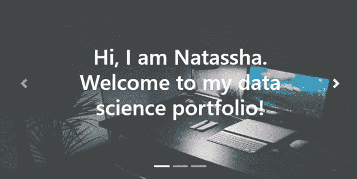
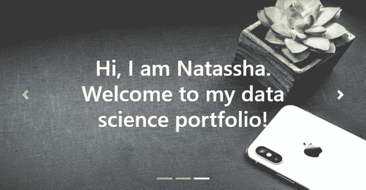
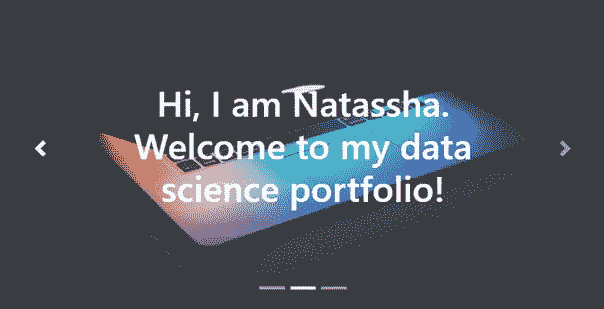
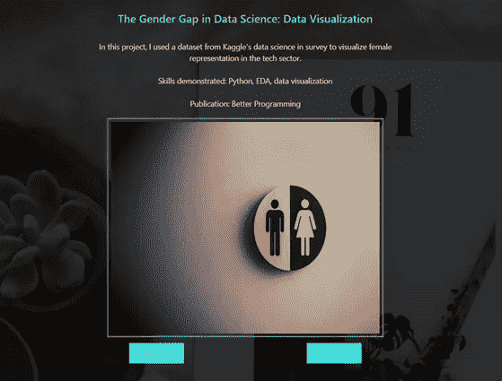

# 如何创建数据科学作品集网站

> 原文：<https://towardsdatascience.com/how-to-create-a-data-science-portfolio-website-dcba6bf00994?source=collection_archive---------16----------------------->

## 从头开始构建和部署您自己的数据科学组合网站

照片由阿毛里·梅希亚在 [Unsplash](/s/photos/create?utm_source=unsplash&utm_medium=referral&utm_content=creditCopyText) 上拍摄

如果你像我一样是一名有抱负的数据科学家，你已经知道拥有一个突出的数据科学组合的重要性。

您参加了在线课程，获得了一些技能，并参与了数据科学项目。你也偶尔写博客，展示你在 Medium 上的工作。

所有这些都会让你的简历看起来很棒。然而，在你的简历上放多个链接是很麻烦的，可能会让招聘人员很难找到并正确理解你的工作。

我强烈建议建立一个数据科学作品集网站，展示你所做的所有工作。当潜在的雇主正在寻找雇员时，他们所要做的就是点击你的网站链接来了解你的一切！

拥有自己的网站肯定会让你在找工作时更有优势，也是讲述自己故事的好方法。

本·科尔德在 [Unsplash](/s/photos/portfolio-website?utm_source=unsplash&utm_medium=referral&utm_content=creditCopyText) 上的照片

我一直在考虑为自己创建一个数据科学网站，几天前终于开始着手做了。以下是给你的一些建议:

## 从头开始构建

当决定创建一个数据科学组合网站时，我不确定是否要从头开始构建它。

作为数据科学家，我们的重点不是网页设计，而是开发模型。我们也不太熟悉 HTML 之类的标记语言，使用 Wix 之类的网站构建器要快很多。

但是，我决定以此为契机，学习一些网页设计，并决定使用 HTML，CSS 和 Jquery 从头开始构建。

从头开始构建也给了我很大的自由来定制我的网站，使它看起来完全像我想要的那样。如果你有时间，我建议你也从头开始。

学习新东西总是很有趣的！

此外，从头开始构建并不一定意味着你必须自己绘制出整个设计并写出 HTML 的每一行。我强烈推荐使用 [Bootstrap](https://getbootstrap.com/) ，一个开源的 HTML CSS 框架用于你的布局。

这将给你的网站一个响应性的设计和结构，你可以很容易地使用它。

以下是我发现的一些有用的教程:

1.  [如何用 HTML 和 CSS 制作网站](https://www.youtube.com/watch?v=99vHH_6F0Ko&t=5674s)
2.  [如何创建作品集画廊](https://www.w3schools.com/howto/howto_css_portfolio_gallery.asp)
3.  用 HTML 和 CSS 编写一个时尚的作品集设计

您也可以使用具有漂亮、响应性设计的模板。HTML、CSS 和 Jquery 都为您提供了。你所要做的就是调整代码来满足你的需求。

一些我认为不错的**模板**:

1.  [W3 CSS 模板](https://www.w3schools.com/w3css/w3css_templates.asp)
2.  [作品集网站模板](https://www.free-css.com/template-categories/portfolio)
3.  [面向所有创意专业人士的 38 个免费作品集网站模板](https://uicookies.com/free-portfolio-website-templates/)

一些**参考网站获取灵感**:

1.  [朱莉娅·尼库尔斯基的数据科学作品集](http://julianikulski.com/about)
2.  [大卫·文丘里的数据科学作品集](http://davidventuri.com/)
3.  [我的数据科学作品集](https://natassha.github.io/natasshaselvaraj/)(我仍在调整和添加新的部分，并在此过程中学习新的东西)。

然而，比你的布局更重要的是你的内容。如果你只有一次机会给潜在雇主留下深刻印象，你会展示什么？

所有让你脱颖而出的地方都要突出出来。你最热衷于什么？为什么是数据科学？你拥有的最重要的技能是什么？你做过什么重要的项目吗？

## 这里有一个关于如何构建你的网站的建议:

1.  首页:这是人们访问你的网站时看到的第一页。确保它能吸引人们的注意力，并提供一些关于网站内容的信息。例如:

作者图片

作者图片

作者图片

这是一个有三个页面的响应滑块，我用 Bootstrap 为我的主页创建的。

2.**关于:**这是你讲述自己故事的部分。简要描述你的技能、兴趣以及你能带来什么。保持简洁明了！

3.**项目:**这可能是最重要的一个板块。作为一名有抱负的数据科学家，我们中的许多人可能没有在大公司展示技能的工作经验。

这就是项目发挥作用的地方。它们是展示您作为数据科学家所获得的技能的绝佳方式。这样，你不仅是在告诉人们你有技能，而且是在展示给他们看。

我建议在这部分只展示有有趣发现的独特项目。不要把你刚开始做的简单项目，没有故事可讲的项目，或者其他人都在做的项目放在上面。

一些你不应该添加到你的投资组合中的项目的例子:泰坦尼克号卡格尔竞赛，鸢尾花数据集，MNIST 数字分类与张量流。

这些不会帮助你的简历脱颖而出，这正是你应该避免的。

此外，试着增加一些能帮助你展示各种技能的项目。例如，包括展示您在以下方面技能的项目:

*   数据收集
*   数据预处理
*   数据可视化
*   数据分析
*   ETL 管道
*   机器学习

展示你在所有这些领域的能力将让招聘人员了解你能完成的各种任务。

例如:

作者图片

以上是我添加到我的作品集网站的一个项目的例子。我在[媒体](https://medium.com/better-programming/the-gender-gap-in-data-science-what-the-data-says-2a74892655f1)上发表了一篇关于我的项目的博文，并将代码放在 Github 中。

我把它们都链接到了我的网站上，并附上了我的项目简介。

4.**认证:**如果你是一名有抱负的数据科学家，但没有扎实的教育背景(比如数据科学的硕士或博士)，那么你必须自学。

在你的作品集上添加任何在线课程、MOOC 或证书。这将显示你对学习这门学科的奉献精神。

5.技能:这是你告诉潜在雇主你能做什么的部分。添加您在此过程中获得的所有技能，如数据辩论、分析和可视化。

您可以用您在前面部分展示的项目来支持这些技能，以进一步突出您带来的东西。

6.**联系:**让潜在雇主尽可能容易地与你联系。在网站底部添加您的联系方式。

最后，在你的简历上添加你想添加的所有内容的链接。提供你的 Kaggle、LinkedIn、Github 或 Medium 个人资料的链接，以便于访问。

## 部署您的网站

托管网站的传统方式是首先购买一个域名。然后，你需要选择一个主机提供商，并上传你的网站。

一些受欢迎的虚拟主机提供商包括 Bluehost 和 T2 host gator，你可以查看他们的价格计划。

对于我的作品集网站，我决定使用 [Github 页面](https://help.github.com/en/github/working-with-github-pages/about-github-pages)作为主机。它是完全免费的。你不需要购买域名，它会为你生成一个网址。我的是:[https://natassha.github.io/natasshaselvaraj/](https://natassha.github.io/natasshaselvaraj/)。

**如果你选择在 Github 页面上托管你的站点，你会发现** [**这个**](https://medium.com/@blondiebytes/get-your-website-on-the-web-with-github-pages-9bdc2886ae7a) **教程很有用。你所需要做的就是创建一个新的存储库，并将你的代码添加到其中。**

Github pages 将直接从您的存储库中获取文件，通过构建过程运行它，然后发布它。

## 还有…就是这样！

现在，您已经了解了如何创建和部署自己的数据科学产品组合。如果你有时间并且有兴趣学习新的东西，你一定要试一试。

从头开始创建自己的网站(即使只是一个简单、静态的网站)可能是一个令人沮丧且耗时的过程。

但是，我觉得满足感是值得的。另外，你现在有了一个展示你技能的新的很酷的方式，这很棒。