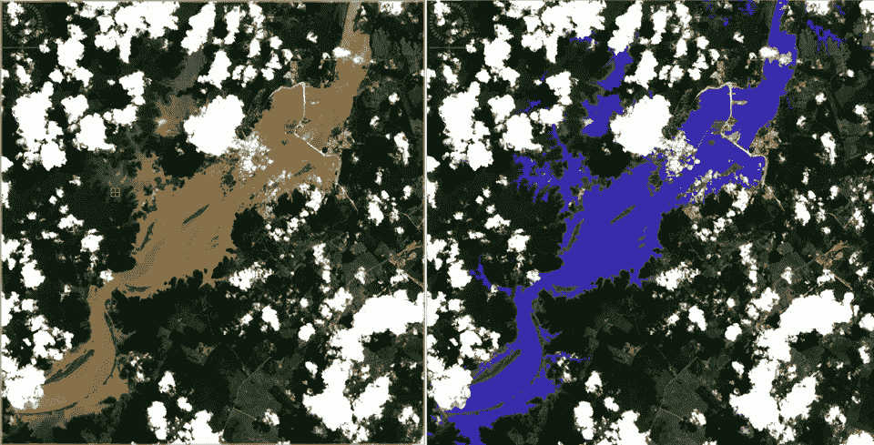
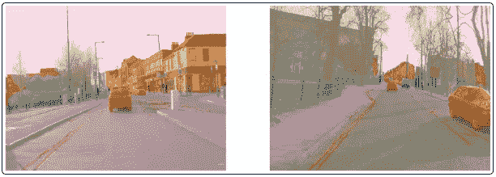
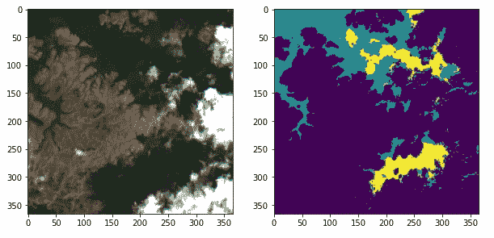
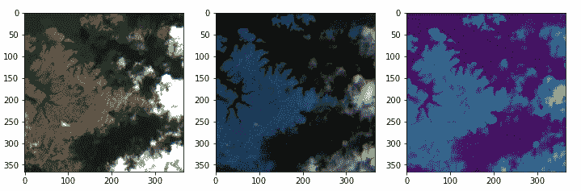
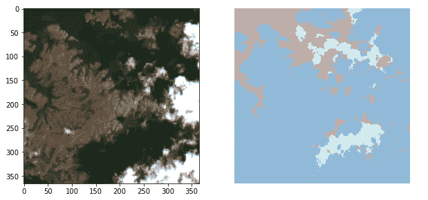
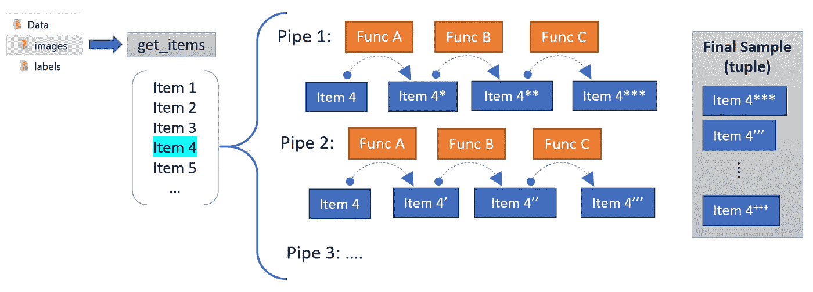
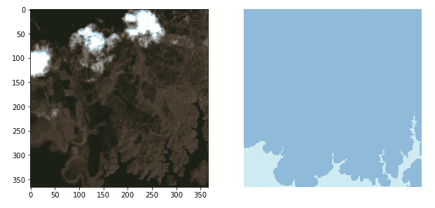
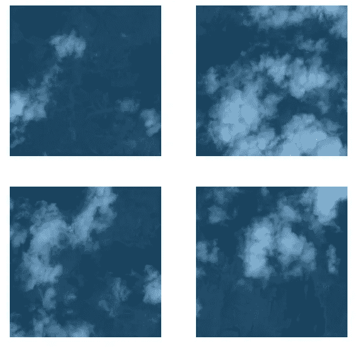

# 如何使用 Fastai-v2 为多光谱卫星图像分割创建数据块

> 原文：<https://towardsdatascience.com/how-to-create-a-datablock-for-multispectral-satellite-image-segmentation-with-the-fastai-v2-bc5e82f4eb5?source=collection_archive---------9----------------------->

## 通过简单的编码和 Fastai 的深度学习 API，在您的地球观测任务中享受最先进的结果。



Jirau 水库(巴西)水域像素分割示例，使用 U-Net 架构和 Fastai-v2。

## 更新

关于课程**科学家 Python 入门** ( [可在 YouTube](https://youtu.be/oQaoj6LE5E4) ) 和其他类似文章的信息，请访问我的网站[cordmaur.carrd.co](http://cordmaur.carrd.co/)。

# 介绍

[Fastai](https://www.fast.ai/2020/02/13/fastai-A-Layered-API-for-Deep-Learning/) 是一个开源的深度学习库，它为 PyTorch 添加了更高级别的功能，并且更容易通过少量编码实现最先进的结果。

当我们需要快速创建图像数据集、应用数据扩充、调整大小、裁剪甚至覆盖分割蒙版时，视觉模块非常方便(图 1)。然而，所有这些简化都是有代价的。这些用于计算机视觉的高级 API 大多针对 RGB 图像进行了优化，这些图像库不支持多光谱或多通道图像。



图 1- Fastai 在分割任务上叠加遮罩的例子(来源:[https://www.fast.ai/images/fastai_paper/show_batch_seg.png](https://www.fast.ai/images/fastai_paper/show_batch_seg.png)

近年来，由于数据可访问性的增加，地球观测研究人员一直非常关注深度学习技术，如图像识别、图像分割、物体检测等。[1].问题是卫星图像通常由许多不同的光谱带(波长)组成，不适合深度学习社区使用的大多数视觉库。出于这个原因，我直接与 PyTorch 一起工作来创建数据集([这里](https://medium.com/analytics-vidhya/how-to-create-a-custom-dataset-loader-in-pytorch-from-scratch-for-multi-band-satellite-images-c5924e908edf))并训练“自制”的 U-Net 架构([这里](https://medium.com/analytics-vidhya/creating-a-very-simple-u-net-model-with-pytorch-for-semantic-segmentation-of-satellite-images-223aa216e705))。

随着 Fastai-v2(承诺在下周发布)[2]的即将到来，我想测试一下是否有可能使用它的数据块结构来创建一个多光谱图像数据集来训练 U-Net 模型。这比我以前的故事更高级，因为我们必须创建一些自定义子类，但我试图尽可能简单。包含所有代码的笔记本在 [GitHub](https://github.com/cordmaur/Fastai2-Medium) 项目中可用(笔记本[此处](https://github.com/cordmaur/Fastai2-Medium/blob/master/01_Create_Datablock.ipynb))。

在我们开始之前，有必要按照 [https://dev.fast.ai](https://dev.fast.ai/) 上的安装指南安装 fastai2 库。

## 步骤 1 —准备数据

为了继续，我们将需要一些多光谱图像的训练补丁。这可能是一个 Kaggle 数据集，就像这个[故事](https://medium.com/analytics-vidhya/a-simple-cloud-detection-walk-through-using-convolutional-neural-network-cnn-and-u-net-and-bc745dda4b04)中使用的 38 云数据集一样，或者是一个全新的数据集。在故事[使用谷歌地球引擎(GEE)为卫星(Sentinel 2)图像的深度学习图像分割创建训练补丁](https://medium.com/analytics-vidhya/creating-training-patches-for-deep-learning-image-segmentation-of-satellite-sentinel-2-imagery-d3dd368c9c64)中，我展示了如何从谷歌地球引擎创建训练补丁，并将它们作为 NumPy 数组使用。

对于本教程，我在 GitHub 资源库([https://github.com/cordmaur/Fastai2-Medium](https://github.com/cordmaur/Fastai2-Medium)**)，`/data`文件夹下的**中提供了一些来自巴西 Orós 水库的示例补丁。数据被保存为 NumPy 的数组，并被分为两个文件夹`/data/images`用于多光谱补丁和`/data/labels`用于目标遮罩。

```
Checking number of files - images:40      masks:40
Checking shapes - image: (13, 366, 366) mask: (366, 366)
```

正如我们从输出中看到的，图像被裁剪为 366x366 像素，训练面片有 13 个通道。这是按顺序排列的 12 个 Sentinel-2 波段，我添加了一个额外的波段来表示“无数据”标志。通道被放在第一个轴上，因为这是 PyTorch 和 Fastai 的标准，与其他图像库不同。遮罩值为 0-无水，1-水和 2-水阴影。我们将使用 Matplotlib 检查一个图像样本。为此，我们需要使用 Numpy.transpose 将通道轴移动到最后一个位置，并选择相应的红色、绿色和蓝色轴。



代码输出

## 步骤 2——子类化`TensorImage`类

现在我们已经检查了我们的图像，我们需要一种在 Fastai 中打开它们的方法。由于 Fastai 使用的是 Python 图像库(PIL ),它无法处理这样的多光谱图像。然后，我们将从原来的`TensorImage` 继承一个名为`MSTensorImage` 的新类，它能够打开`.npy`扩展并可视化地显示它。让我们来看看代码。

首先，我们定义一个打开 Numpy 数组并将其作为给定类返回的函数(`open_npy` 函数)。

然后，我们用一个`create`方法定义了`MSTensorImage`类，该方法接收文件名(或 numpy 数组，或张量)、所需的通道(如果我们不想加载所有 13 个通道的话)和一个指示通道是否在第一轴的标志。

最后，我们定义了一个显示方法来正确显示该图像。我们可以向 show 方法传递不同的通道来创建假彩色合成和 Matplotlib 轴，以便进行多重显示。在下面的例子中，我们可以看到图像被正确加载和显示。



代码输出

## 步骤 3 —张量掩码类

为了处理掩码，我们将使用已经在 Fastai2 中定义的`TensorMask` 类，而不是像以前那样创建一个新类。在这种情况下，唯一的区别是`TensorMask`不知道如何打开`.npy` 扩展。在这种情况下，我们将通过新定义的`open_npy` 函数的结果来创建它，就像这样。



代码输出

## 步骤 4-创建数据块

`DataBlock` 是一个抽象，为您的源数据提供转换以适应您的模型。记住，为了训练神经网络，我们必须为模型提供一组输入(x)和相应的目标(y)。成本和优化函数会处理剩下的事情。更复杂的架构可能有多个 x 作为输入，甚至多个目标，所以`DataBlock` 接受多个管道(图 2)。



图 2:数据块简化示意图。在本例中，我们获取第四个项目(项目 4)。

在我们的例子中，这是最常见的，我们需要创建一个`DataBlock` ，它只提供两个块，Xs 和 Ys。对于每个块，我们可以创建一个`TransformBlock` (就像一个处理管道)来操作每个组(Xs 或 Ys)，直到它们达到加载到模型中所需的格式。

为了创建一个`DataBlock`，除了`TransformBlocks`之外，我们还必须提供一个函数负责获取给定来源的项目。在我们的例子中，由于文件已经保存在磁盘中，`get_items` 函数将只读取目录并返回文件名。文件列表将是我们转换管道的起点。

如果遮罩是从同一原始文件创建的(例如，如果遮罩是第 14 通道)，则 X 变换管道将负责排除该通道，而 Y 变换管道将负责从原始图像中提取该信息。由于我们将文件分开保存，我们将提供一个名为`get_lbl_fn`的新函数，它将接收图像文件的名称，然后返回相应目标文件的名称。现在我们对数据块有了一些了解，让我们来看看代码。

最后一个命令`DataBlock.summary`，将检查是否一切正常，并给我们一个数据样本:

```
Setting-up type transforms pipelines
Collecting items from Data\images
Found 40 items
2 datasets of sizes 36,4
Setting up Pipeline: partial
Setting up Pipeline: get_lbl_fn -> partial

Building one sample
  Pipeline: partial
    starting from
      Data\images\Oros_1_19.npy
    applying partial gives
      MSTensorImage of size 13x366x366
  Pipeline: get_lbl_fn -> partial
    starting from
      Data\images\Oros_1_19.npy
    applying get_lbl_fn gives
      Data\labels\Oros_1_19.npy
    applying partial gives
      TensorMask of size 366x366

Final sample: (MSTensorImage: torch.Size([13, 366, 366]), TensorMask([[0., 0., 0.,  ..., 0., 0., 0.],
        [0., 0., 0.,  ..., 0., 0., 0.],
        [0., 0., 0.,  ..., 0., 0., 0.],
        ...,
        [0., 0., 0.,  ..., 0., 0., 0.],
        [0., 0., 0.,  ..., 0., 0., 0.],
        [0., 0., 0.,  ..., 0., 0., 0.]]))

Setting up after_item: Pipeline: AddMaskCodes -> ToTensor
Setting up before_batch: Pipeline: 
Setting up after_batch: Pipeline: 

Building one batch
Applying item_tfms to the first sample:
  Pipeline: AddMaskCodes -> ToTensor
    starting from
      (MSTensorImage of size 13x366x366, TensorMask of size 366x366)
    applying AddMaskCodes gives
      (MSTensorImage of size 13x366x366, TensorMask of size 366x366)
    applying ToTensor gives
      (MSTensorImage of size 13x366x366, TensorMask of size 366x366)

Adding the next 3 samples

No before_batch transform to apply

Collating items in a batch

No batch_tfms to apply
```

正如我们在结果中看到的，在处理完所有转换后，最终的样本由一个包含两个项目(X，Y)的元组组成。在我们的例子中(`MSTensorImage`，`TensorMask`)。

## 最终-数据集和数据加载器

一旦我们完成了`DataBlock`的创建，那么`DataSet`或`DataLoader`的创建就非常简单了。考虑到拆分器功能(在我们的例子中，随机拆分器有 10%用于验证)，数据集将被拆分为训练和验证数据集，并且可以通过订阅直接访问数据:



代码输出

同样适用于`DataLoaders`。此外,`show_batch`方法自动理解我们正在执行分割任务(因为 TensorMask 类),并覆盖 Xs 和 ys:



代码输出

## 结论

在今天的故事中，我们看到了基本概念以及如何使用 Fastai 2 的`DataBlock`来准备多光谱卫星数据，以适应深度学习模型。`TensorImage` 类的子类化和`open_npy` 函数的使用足以处理多个通道。可以注意到，Fastai 创建数据加载器和显示批处理样本的基本功能被成功地保留了下来。

使用 Fastai 2 执行这些地球观测任务非常方便，与 Fastai 1 和其他高级 API 不同，Fastai 2 的内置视觉架构接受输入通道作为参数。但这是下一个故事的主题。

GitHub 资源库[https://github.com/cordmaur/Fastai2-Medium](https://github.com/cordmaur/Fastai2-Medium)提供了遵循该“操作方法”的笔记本和示例数据。

下一个故事再见。

## 参考

[1]t .赫泽，库恩泽，c .，2020 年。利用对地观测数据的深度学习进行目标探测和图像分割:综述-第一部分:发展和最近趋势。遥感 121667。https://doi.org/10.3390/rs12101667

[2]霍华德，j .，古格，s .，2020 年。fastai:深度学习的分层 API。信息 11108。【https://doi.org/10.3390/info11020108 