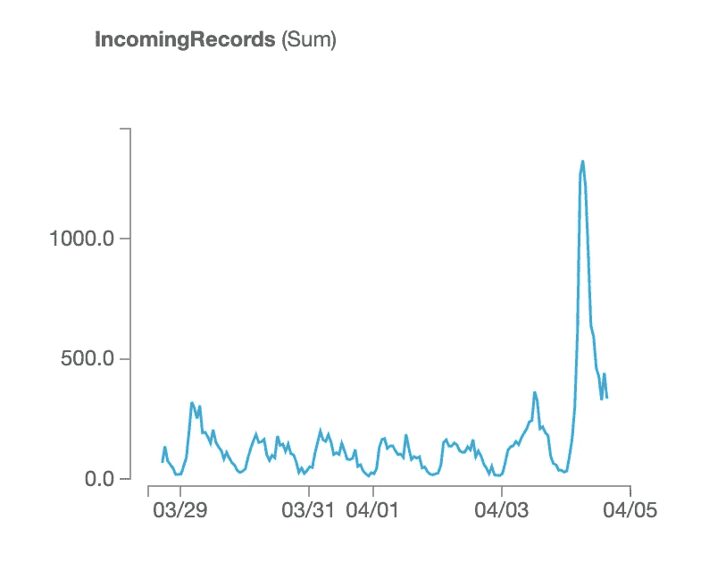
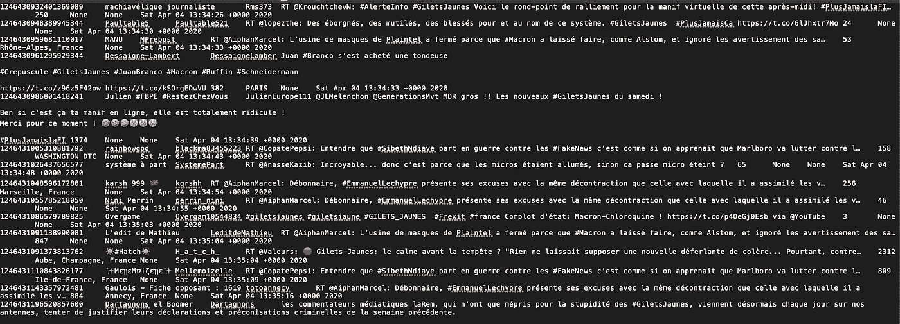

# 如何通过云计算从 Twitter 中提取数据

> 原文：<https://towardsdatascience.com/how-to-create-a-dataset-with-twitter-and-cloud-computing-fcd82837d313?source=collection_archive---------22----------------------->

## 通过使用 Python 和 Tweepy 库。

照片由 [Unsplash](https://unsplash.com?utm_source=medium&utm_medium=referral) 上的 [dole777](https://unsplash.com/@dole777?utm_source=medium&utm_medium=referral) 拍摄

对于有抱负的数据分析师和数据科学家来说，Twitter 是一个很好的信息来源。它也是辩论和争论的场所。此外，Twitter 可以成为文本数据的良好资源；它有一个 API，凭证很容易获得，并且有许多 Python 库可以帮助调用 Twitter 的 API。

建立投资组合的一种方式是获得自己的自然语言处理项目，但就像每个项目一样，第一步是获得数据，然后通过使用亚马逊网络服务(AWS)将这些数据保存在本地计算机或云上。

总的来说，建立这个管道的资源是很棒的，但是它们有一些很容易让人头疼的怪癖。在本文中，我将向您展示如何建立一个简单的管道流程，并帮助您浏览该流程，避免那些令人头痛的问题。考虑这篇文章你的赛前泰诺！

这很好，对吗？所以，坚持住。

通过四个步骤，我将演示如何建立下面的管道。第一步包括使用来自 Twitter 的 API 收集数据，然后向您展示如何启动 EC2 实例，将其连接到 kinesis，最后使用 Python 脚本将数据传输到 AWS 上的 S3(数据湖)。

从 Twitter 到 S3 的管道

你准备好掌握所有这些了吗？

# 第一步:在 Twitter 上建立你的开发者账户，并获得你的证书

**给自己弄一个账号:**一个 Twitter 用户账号是拥有一个“开发者”账号的要求，所以要么注册一个新账号，要么登录一个现有账号，简直易如反掌。

**创建 app:** 在[https://developer.twitter.com/en/apps](https://developer.twitter.com/en/apps)注册 app。设置好之后，转到“令牌和密钥”来生成访问令牌和秘密令牌。连同消费者 API 密钥(已经生成)，这些是我们将用来与 Twitter API 通信的凭证。我也将这些凭证用于 Python 脚本。我建议将凭证保存在文本文件中，因为我们将在后面的阶段使用这些凭证。

# 步骤 2:创建一个 AWS 帐户

在这个项目中，你需要使用来自亚马逊的三个不同的服务: **EC2 实例**、 **Kinesis** (数据流)和 **S3** (数据湖)来建立管道。您需要创建一个帐户，并在此帐户下注册您的信用卡；亚马逊根据你对服务的使用情况收费。关于费用，不用担心。你在这个项目中使用的服务并不昂贵；在我的项目中，我每月花费不到**5-6 加元**。如果你需要使用其他服务，我建议你事先检查一下费用。请注意，偶尔查看一下您的账单总是一个好习惯，以确保您不会对此感到惊讶，并且如果您不再需要它，不要忘记终止服务或实例。

首先，在 EC2 管理控制台中，创建一个私钥对，您将使用它来设置 EC2 实例。此外，在接下来的步骤中，正确设置“安全组”以允许您的 IP 进行 SSH 访问。

接下来，通过 7 个步骤启动一个 **EC2 实例。在我的项目中，我使用了一个简单的 t2.micro，它足以提取 tweets，你可以只使用一个实例，大小为 8gb。如果你想知道更多关于如何建立 EC2 的细节，我建议你看看下面 Connor Leech 的这篇好文章。请注意，您的第一年 EC2 **t2.micro** 实例将是免费的，直到达到某个阈值。**

 [## 如何启动 Amazon EC2 实例

### 在这篇文章中，我们将在 Amazon Web Services 托管的云中创建一个 Linux 虚拟机。我们打算…

medium.com](https://medium.com/employbl/how-to-launch-an-ec2-instance-de568295205d) 

EC2 实例是一个处理器或 CPU，在这个项目中，我们通过使用 python 脚本来收集数据(我将在下面解释)。

EC2 实例是一个处理器或 CPU，在这个项目中，您的实例通过使用 Python 脚本从 Twitter 中提取数据来收集数据(我将在下面解释)。

**S3** 是一个数据湖，对于阅读本文的新手来说，这是存储由 EC2 实例收集的原始数据的服务。在我的项目中，我决定让我的 S3 公开，以便连接其他软件，比如 Apache Spark，并减少访问问题。我知道这不是最好的做法，因为其他人可以访问你的数据，但在这个项目中，这是可以的，我不处理敏感数据。

**亚马逊 Kinesis 数据流** (KDS)是一个极具扩展性和可持续性的实时数据交付服务。该服务是 EC2 实例和 S3 之间的“管道”。因此，在设置此服务的过程中，您需要将其链接到您的 S3，方法是指明存储桶(即文件夹)的名称，并指明您希望如何保存收集的数据。

一旦所有的服务都准备好并链接起来，我们就可以进入下一步了。

# **第三步:了解 API 和 Tweepy**

Twitter 上关于 API 的文档相当不错，但是对于该领域的初学者来说可能有点混乱。我有几个问题要理解 API 是如何工作的，我希望您在阅读完这一部分后会清楚。

您可以在下面的链接中找到开展这个项目的大部分信息:

 [## 推文更新

### 本文档概述了开发者对已经到位的 Tweets 的更改的指导，以允许人们…

developer.twitter.com](https://developer.twitter.com/en/docs/tweets/tweet-updates) 

Twitter 的 API 允许你提取不同的数据字段，包含每个用户的推文内容、用户名、位置、日期和关注者数量。在这个项目中，我将提取所有这些字段。

为了提取推文，你需要我们使用 Tweepy 包。这是一个 Python 库，可以方便地使用 Twitter API。首先，您需要使用之前创建并存储在文本文件中的身份验证凭证来设置 API 对象。这是一个带有数据和一些帮助方法的 Tweepy 模型类实例。

 [## API 参考- tweepy 3.5.0 文档

### 本页包含 Tweepy 模块的一些基本文档。模块中直接提供了例外情况…

docs.tweepy.org](http://docs.tweepy.org/en/v3.6.0/api.html#tweepy-api-twitter-api-wrapper) 

由[卢卡·布拉沃](https://unsplash.com/@lucabravo?utm_source=medium&utm_medium=referral)在 [Unsplash](https://unsplash.com?utm_source=medium&utm_medium=referral) 上拍摄

脚本的第一步包括加载您想要使用的不同 Python 库，它们是 *tweepy* 、 *json* 、 *boto3* 和 *time* 。然后，您输入来自 Twitter 的凭证。

接下来，输入代码来解析 tweets 并将其导出到 json/text 文件中。该脚本分为两个主要部分。

第一部分叫做听众。正是在这个块中，我们从 API 中提取数据并打印出来。以下是脚本将为此项目记录的信息:

*   用户名
*   用户屏幕名称
*   推特内容
*   用户关注者计数
*   用户位置
*   地理定位
*   推特时间

根据您进行的项目，我鼓励您根据自己的方便来修改这一部分(例如，删除不需要的字段)。

我在这个项目中了解到的一个奇怪的方面是，Twitter 最初限制其用户只能发 140 个字符的推文，2017 年 11 月，Twitter 开始允许其用户发最多 240 个字符的推文。

为了使 API 适应这一新变化，Twitter 创建了另一个新的字段，称为“extended tweet ”,其中显示了长 tweet 的所有内容。因此，如果一条 tweet 超过 180 个字符，并且您想要提取整个 tweet，您需要提取这个字段，而如果 tweet 少于 180 个字符，您需要提取最初的 tweet 字段，名为“text”。不完全是本能，对吧？

现在让我们回到剧本上。为了容纳和提取扩展的 tweet，我创建了一个 if/elif 条件。如果 API 有一个“extended tweet”字段(这意味着 tweet 超过 180 个字符)，提取它；否则，提取“文本”字段。

第一部分是身份验证和与 Twitter 流媒体 API 的连接，然后在下面输入您的 AWS 凭据(请注意，这不是推荐的)，并输入您在上一步中设置的 kinesis 的名称。

然后，你需要输入你想要追踪和收集的关键词，用哪种语言。在我的项目中，我决定用英语和法语关注包含#giletsJaunes 的推文。你可以追踪多个标签。

这里是[完整脚本](https://github.com/walkyrie67/project2_big_data_gilets_jaunes/blob/master/script_python_twitter_extended_nokeys.py)的链接。

# 步骤 4:使用 screen 在 AWS 上运行代码

现在，管道和 Python 脚本已经准备好了，您可以使用之前在步骤 2 中创建的 EC2 实例开始运行脚本。

首先使用下面的命令登录到 EC2:

然后，在你的 EC2 上安装几个包: *python3* 和 *tweepy* ，以便顺利运行你的 python 脚本。然后，通过在终端上使用以下命令，将位于本地机器上的 Python 脚本上传到 EC2:

因为您需要长时间运行脚本，所以您可能希望在 EC2 上打开一个“屏幕”,在后台运行作业。这允许您关闭 EC2 的终端并运行它而不进行检查。

以下是使用*屏幕*的主要命令:

因此，一旦您的“屏幕”设置完毕，您只需通过输入以下命令来运行您的脚本:

> python3 my_script.py

一旦您输入它，您应该看到 EC2 实例收集的所有 tweetss，这些 tweet 将保存在您的 S3 中。

# **第五步:监控你的渠道**

通过登录 AWS，您将能够看到您的管道活动。一个很酷的功能是 kinesis 中的“监控”标签。

Kinesis 消防水管输送流中的输入记录

在该图中，您可以看到一段时间内收集的推文活动。在我的项目中，看起来#giletsjaunes 标签在周六和周日比平时更活跃。你也可以查看在你的 S3 数据湖中创建的文件，把文件下载到你的本地机器上，然后查看保存的推文。

现在，您已经准备好进入下一步，通过使用另一个 AWS 服务或 Apache Spark 来分析本地机器中的数据。