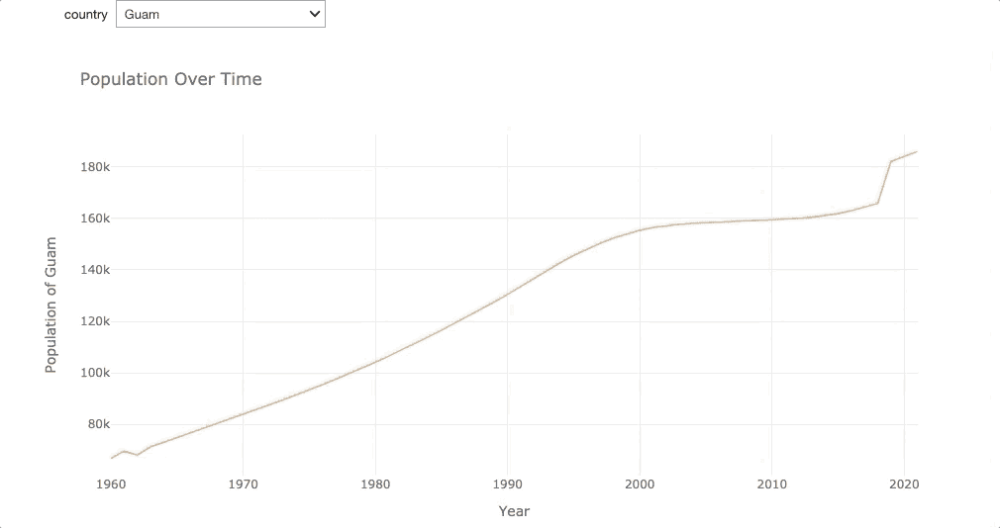
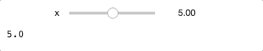
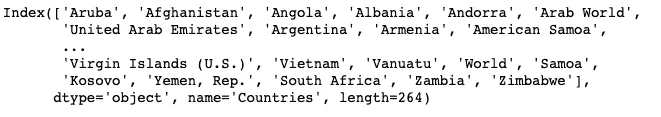
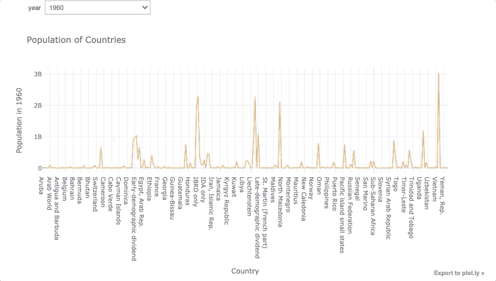
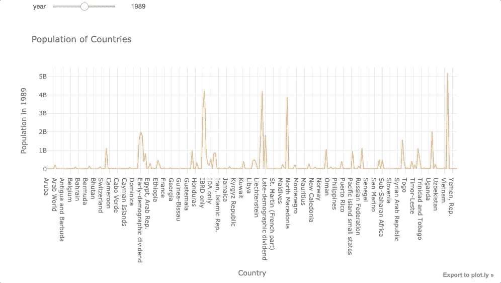

# 如何为你最喜欢的可视化工具创建下拉菜单和滑动条

> 原文：<https://towardsdatascience.com/how-to-create-a-drop-down-menu-and-a-slide-bar-for-your-favorite-visualization-tool-3a50b7c9ea01?source=collection_archive---------8----------------------->

## 使用 Python Widget，您可以用 3 行代码升级可视化

# 动机

想象一下，我们正在分析世界各国从 1960 年到 2018 年的趋势人口，以预测未来几年的人口。

为了可视化国家的趋势，我们选择 Plotly，因为它简单而美丽的可视化。从“越南”开始

```
import pandas as pd 
import datapane as dp 
import plotly.express as pxdata = pd.read_csv('population.csv')fig = px.line(data.set_index('Countries').loc['Vietnam'],
              labels={'index': 'Year', 'value': 'Population'},
              title='Population Over Time',
             )
fig.show()
```

然后是美国

```
fig = px.line(data.set_index('Countries').loc['United States'],
              labels={'index': 'Year', 'value': 'Population'},
              title='Population Over Time',
              )
fig.show()
```

看起来曲线是线性增长的，但我们不确定曲线是否对每个国家都是线性的，所以我们想继续可视化更多的国家。有没有更快的方法来可视化这些国家，而不是在`df.loc['location']?`中更改国家的名称，如果有一个**下拉菜单**来选择您想要可视化的国家不是很好吗？



这可以通过一个小插件 Jupyter 小部件轻松完成。

# Jupyter 小工具

[Widgets](https://ipywidgets.readthedocs.io/en/latest/examples/Widget%20Basics.html) 是多事件的 python 对象，可以提供像滑块、文本框等控件。我们可以使用小部件为我们的笔记本电脑构建交互式图形用户界面。

从安装开始

**带 pip**

```
pip install ipywidgets
jupyter nbextension enable --py widgetsnbextension
```

**带康达**

```
conda install -c conda-forge ipywidgets
```

查看此[链接](https://ipywidgets.readthedocs.io/en/latest/user_install.html)以获取关于安装的更多信息。

## 使用 Interact

导入有用的库

```
from ipywidgets import interact, interactive, fixed, interact_manual
import ipywidgets as widgets
```

探索我们可以用`interact`做的基本事情。首先，定义一个您想要探索的函数。当参数 x 改变时，下面的函数返回 x。

```
def f(x):
    return x
```

通过向`x`传递一个元组`(min, max)`来创建一个滑动条

```
interact(f, x=(0.0,10.0))
```



通过传递字符串列表创建下拉菜单

```
interact(f, x=['love','hate'])
```


基于此，也许我们可以为我们的情节创建一个基于国家变化的函数？

```
def f(country):
    df.loc[country].iplot(
                    xTitle='Year', 
                    yTitle='Population of {}'.format(country),
                    title='Population Over Time'
                     )
```

用`df.index`代表国家

```
df.index
```



用一个简单的代码创建交互。

```
interact(f, country=df.index)
```


厉害！似乎有些国家的人口曲线是线性的。但是我们也很好奇每年世界上人口的分布是如何变化的，我们能创造另一个函数作为参数吗？绝对的！

对我们之前的图表进行转置，将`country`改为`year.`

```
def f(year):
    fig = px.line(data.set_index('Countries').T.loc[str(year)],
              labels={'value':'Population in {}'.format(str(year))},
              title= 'Population over time')
    fig.show()

interact(f, year=list(data.T.index)[1:] )
```



如果我们喜欢滑动条，我们可以简单地将年份列表转换成元组`(min year, max year)`

```
interact(f, year=(1960, 2018))
```



就是这样！现在，我们可以有效地检查每年的分布，看看分布是否随时间而改变。

# 结论

恭喜你！您已经学习了如何利用 Python 小部件来创建滑动条和下拉菜单，以实现高效的可视化。我鼓励你用你最喜欢的可视化工具来尝试一下，比如 Matplotlib，Seaborn。只需在代码中做一点小小的改动，就可以为您节省大量时间，让您可以投入到数据科学项目的其他重要任务中。

在 [this Github repo](https://github.com/khuyentran1401/Data-science/blob/master/visualization/dropdown/dropdown.ipynb) 中，您可以随意使用本文的代码。

我喜欢写一些基本的数据科学概念，并尝试不同的算法和数据科学工具。你可以通过 [LinkedIn](https://www.linkedin.com/in/khuyen-tran-1401/) 和 [Twitter](https://twitter.com/KhuyenTran16) 与我联系。

如果你想查看我写的所有文章的代码，请点击这里。在 Medium 上关注我，了解我的最新数据科学文章，例如:

[](/how-to-share-your-jupyter-notebook-in-3-lines-of-code-with-ngrok-bfe1495a9c0c) [## 如何用 Ngrok 用 3 行代码分享你的 Jupyter 笔记本

### 想象一下，让你的朋友在远程机器上使用你的本地 Jupyter 笔记本

towardsdatascience.com](/how-to-share-your-jupyter-notebook-in-3-lines-of-code-with-ngrok-bfe1495a9c0c) [](/how-to-turn-a-dinosaur-dataset-into-a-circle-dataset-with-the-same-statistics-64136c2e2ca0) [## 恐龙和圆圈的数据集可以有相同的统计数据吗？

### 它们有相同的中位数和标准差，但它们是两个明显不同的数据集！

towardsdatascience.com](/how-to-turn-a-dinosaur-dataset-into-a-circle-dataset-with-the-same-statistics-64136c2e2ca0) [](/how-to-monitor-and-log-your-machine-learning-experiment-remotely-with-hyperdash-aa7106b15509) [## 如何使用 HyperDash 远程监控和记录您的机器学习实验

### 培训需要很长时间才能完成，但你需要去洗手间休息一下…

towardsdatascience.com](/how-to-monitor-and-log-your-machine-learning-experiment-remotely-with-hyperdash-aa7106b15509) [](/how-to-create-fake-data-with-faker-a835e5b7a9d9) [## 如何用 Faker 创建假数据

### 您可以收集数据或创建自己的数据

towardsdatascience.com](/how-to-create-fake-data-with-faker-a835e5b7a9d9) [](/how-to-create-an-elegant-website-for-your-data-science-portfolio-in-10-minutes-577f77d1f693) [## 如何在 10 分钟内为您的数据科学产品组合创建一个优雅的网站

### 你需要做的就是编辑

towardsdatascience.com](/how-to-create-an-elegant-website-for-your-data-science-portfolio-in-10-minutes-577f77d1f693)