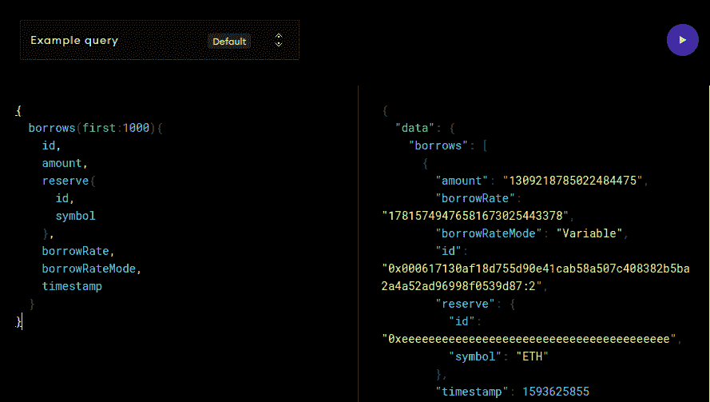
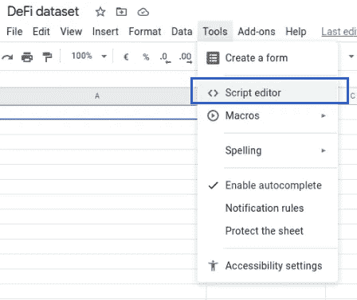
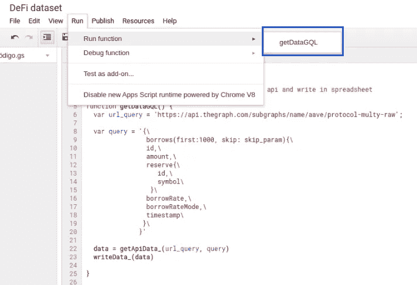
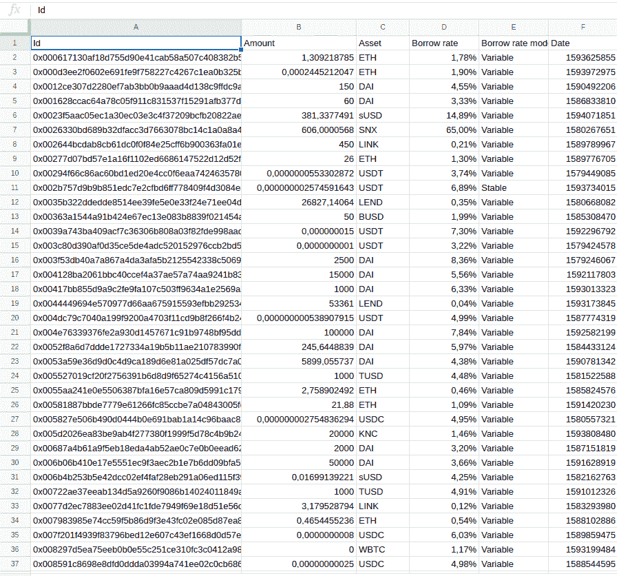
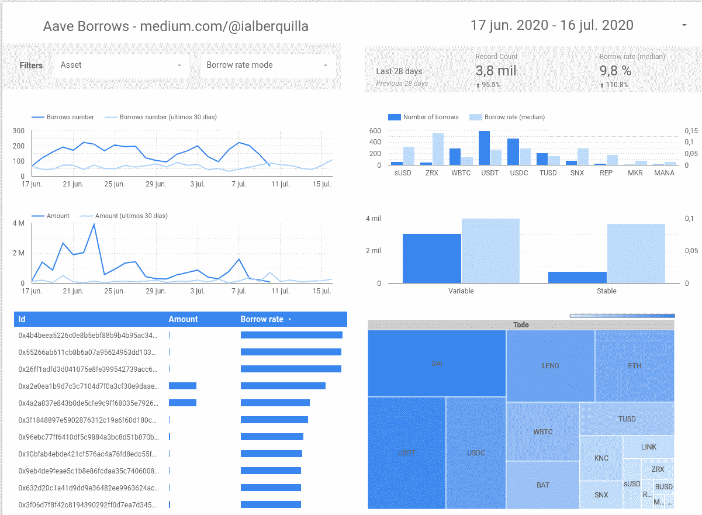

# 如何创建以太坊定义实时仪表板

> 原文：<https://towardsdatascience.com/how-to-create-a-ethereum-defi-realtime-dashboard-a60c23b527f7?source=collection_archive---------25----------------------->

## 使用图形和谷歌电子表格来存储数据，并使用谷歌数据工作室创建一个实时仪表板

获取区块链数据越来越容易，速度也越来越快。在本帖中，我们将看到如何从 DeFi(分散金融)协议中提取数据，用 Google 电子表格创建数据集。有了它，我们将创建一个仪表板，实时显示这些数据，为我们提供 Aave 协议中请求的贷款信息。

# **获取数据**

为了获得数据，我们将使用图形的 Api，如[这篇文章中所解释的。](https://medium.com/coinmonks/defi-protocol-data-how-to-query-618c934dbbe2)

我们要提取的是与所请求的贷款相关的数据，所有的历史记录，以便能够在以后进行分析。为此，我们必须创建如下所示的查询:

```
{
  borrows (first: 1000) {
    id,
    amount,
    reserve {
      id,
      symbol
    },
    borrowRate,
    borrowRateMode,
    timestamp
   }
}
```

通过这个查询，我们获得了前 1000 个结果，这是图形在一个数据块中允许的最大值，然后我们将继续迭代以获得以下结果，直到我们恢复所有结果。

如果我们在[这个游乐场](https://thegraph.com/explorer/subgraph/aave/protocol-raw)测试这个查询，我们看到它返回:



之后，我们将获得所有贷款的数据，包括请求的加密资产、金额、利息和利率。通过将这些数据直接导入到 Google Sheets 的文档中，我们将拥有一个实时数据集来构建我们的分析模型。

# **创建数据集**

为了将数据保存在 Google excel 表中，我们将在其中创建一个脚本，选项为:



在这个脚本中，我们包含了以下代码:

让我们来看看每一行的细节:

*   **第 4–22 行:**将被调用来填充数据集的函数。在这个函数中定义了要调用的端点以及用来获取数据和查询的查询。用这些，提取它的函数被调用，然后它们被写在 excel 中。
*   **第 30–37 行:**函数构建将在 API 调用中传递的选项，每次迭代都调用一个动态参数“skip ”,用这个新参数创建选项。
*   **第 44–49 行:**将数据写入 excel 表格的函数。接收数组形式的数据作为参数，并将其写入执行脚本的 excel。
*   **第 57–86 行:**函数迭代历史中存在的所有数据块。创建一个从 api 请求数据的循环，在有数据时将 skip 参数增加 1，000 个单位。一旦接收到数据，它就将数据存储为一个数组，从 api 返回的 json 中检索该数组。

一旦创建了脚本，就必须执行它以便加载数据。我们以下列方式执行它:



我们可以看到 excel 是如何填充数据的



# **分析数据**

使用填充的数据集，我们可以分析我们的数据。最快和最简单的方法是使用谷歌数据工作室仪表板。

我们创建一个新的报告，并指出数据源将是一个电子表格。


通过选择我们已经创建的表，我们可以使用 Google Data Studio 中存在的模板，并立即创建一个仪表板，以一种简单而非常有吸引力的方式向我们显示数据



通过这个简单的脚本，我们可以实时获得来自协议定义的数据，并分析来自整个贷款历史的数据，这是一个非常重要的信息，能够以完全可访问的方式创建模型。

此外，这些信息可以非常容易地共享。创建的仪表盘可以在这里[查阅。](https://datastudio.google.com/reporting/c7806832-8ba6-4250-9c27-8dab1238247b)