# 如何在 AWS 上创建免费的 VPN 服务器

> 原文：<https://towardsdatascience.com/how-to-create-a-free-vpn-server-on-aws-655ca3b3ff32?source=collection_archive---------1----------------------->

## 一步一步的教程建立自己的免费 VPN 服务器

如果你想更安全地浏览网页，并且想创建对 VPC(虚拟专用云)的访问，VPN(虚拟专用网络)是很重要的。有时获得 VPN 会很困难，尤其是当你不得不付费使用服务的时候。在本文中，我将向您展示如何在 AWS 上建立一个有效的 VPN 服务器，并且您不必为使用它支付任何费用。让我们开始吧。


托马斯·詹森在 [Unsplash](https://unsplash.com?utm_source=medium&utm_medium=referral) 上的照片

# 要求

要开始学习本教程，您需要一个免费的 AWS 帐户，这样您就不会因为在 AWS 上运行 VPN 而被收费。如果您没有 AWS 帐户，不用担心，您可以在这里创建一个，它附带 12 个月的免费等级资格。

# 步骤 1:设置 OpenVPN 服务器

登录到您的 AWS 帐户，导航到 EC2 服务，然后单击启动实例。

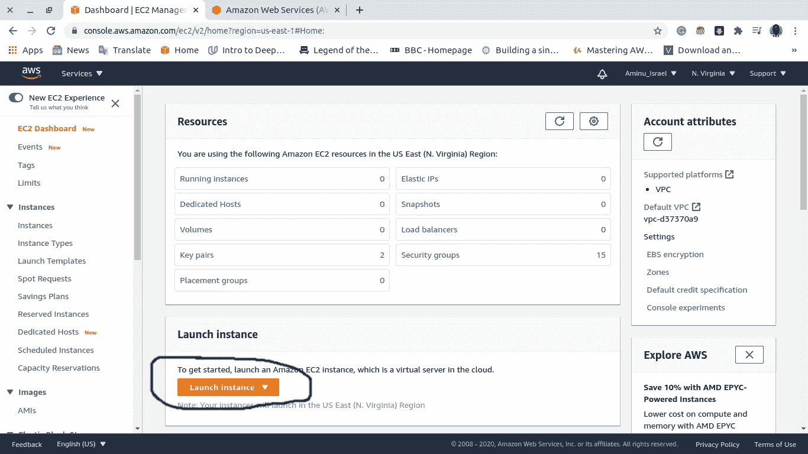

作者图片

然后在页面上点击“AWS Marketplace ”,输入“openvpn ”,选择“OpenVPN Access Server ”,即带有“Free tier eligible”选项的服务器，然后点击“select”。

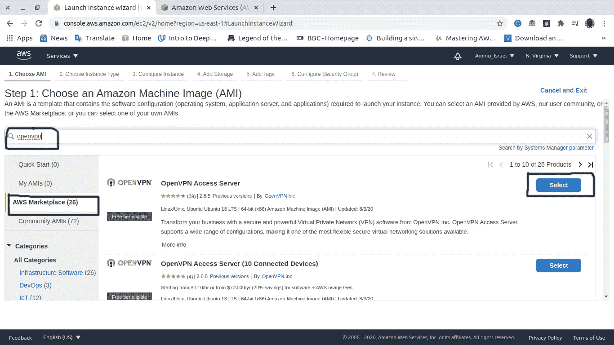

作者图片

OpenVPN 是一个开源 VPN 服务器，在这种情况下，我们使用 Ubuntu AMI(Amazon 机器映像)来运行 VPN，有时 AWS marketplace 会更好，如果你不想自己配置 OpenVPN 服务器的话。

点击“选择”后，您将进入以下页面。请记住，正如我之前所说，OpenVPN 是一个免费的开源 VPN，但它是一项商业服务，尽管我们可以使用自带许可证(BYOL)选项免费开设两个 VPN 帐户，这也是此处显示的页面的本质。之后，向下滚动并单击选择。

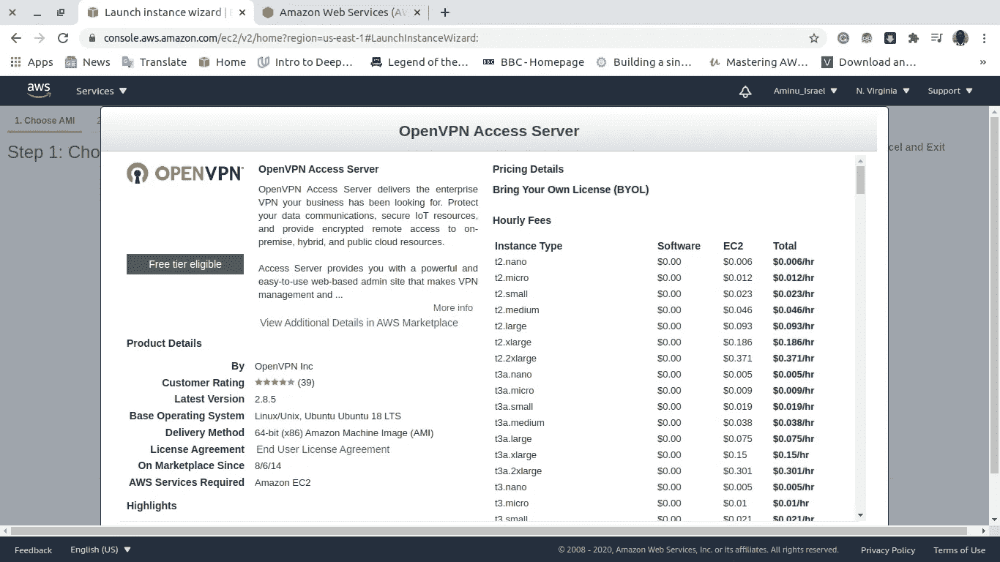

作者图片

然后，您将被定向到此页面，这是服务将运行的地方，选择包含“Free tier eligible”标记的 t2.micro，然后单击“Review and Launch”

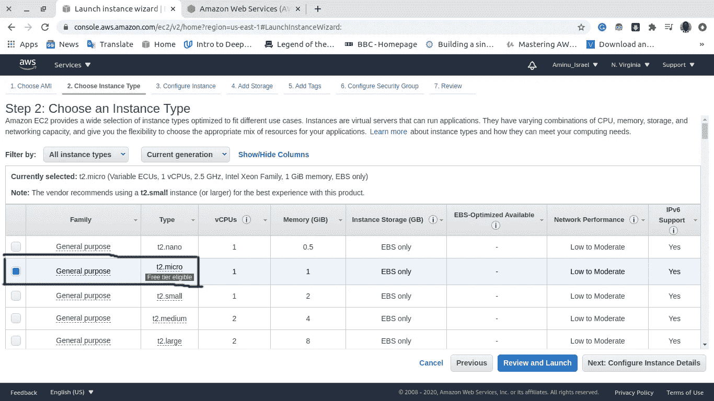

作者图片

单击 Review and Launch 后，您会看到对您将要创建的实例的审查。如果你通读一遍，你会发现运行这项服务的成本是每小时 0.00 美元。点击启动

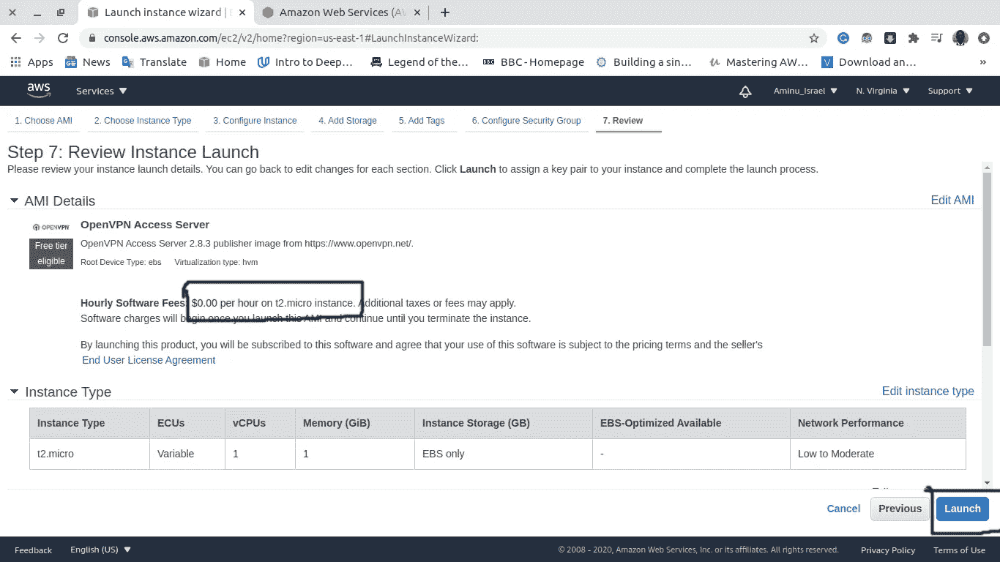

作者图片

然后您会看到一个弹出窗口，要求您创建或使用一个现有的密钥对，这一部分非常重要，因为您将需要它来 SSH 到您的服务器。如果您还没有密钥对，您可以创建一个新的密钥对，并将其下载到您的计算机上。然后单击启动实例。几秒钟后，您的实例将开始运行，您可以开始工作了。

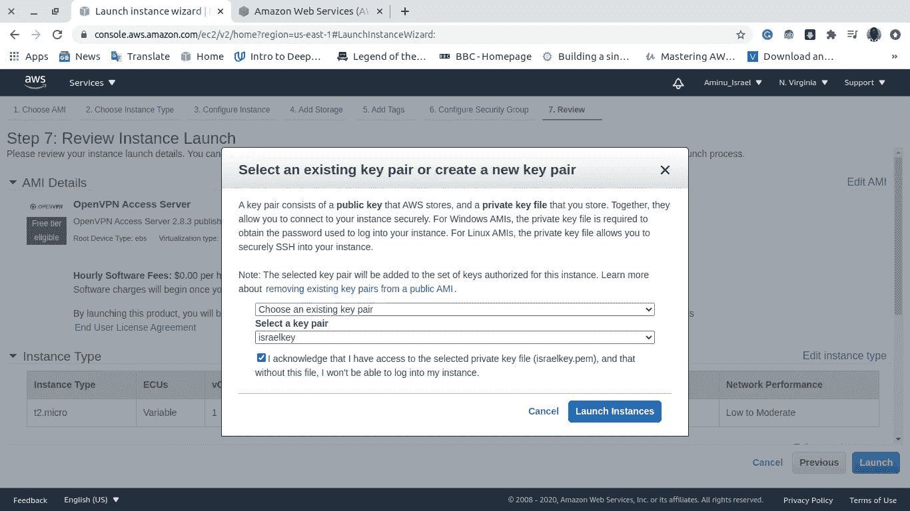

作者图片

# 步骤 2:服务器配置

实例成功启动后。以 root 用户身份打开您的终端并通过 SSH 连接到您的服务器，以便配置 VPN 的管理端，为此使用以下命令:

```
ssh -i "<your-key-pair>" [root@](mailto:root@ec2-34-228-81-236.compute-1.amazonaws.com)<your-public-instance-domain>
```

您的密钥对是您最近下载的或者您的计算机上已有的密钥对，如果它在不同的目录中，也要确保您指定了密钥对的路径以使它工作。您的公共实例域可以在 EC2 仪表板上找到。如果输入正确，您应该会看到许可协议条款，键入 **yes** 并输入。

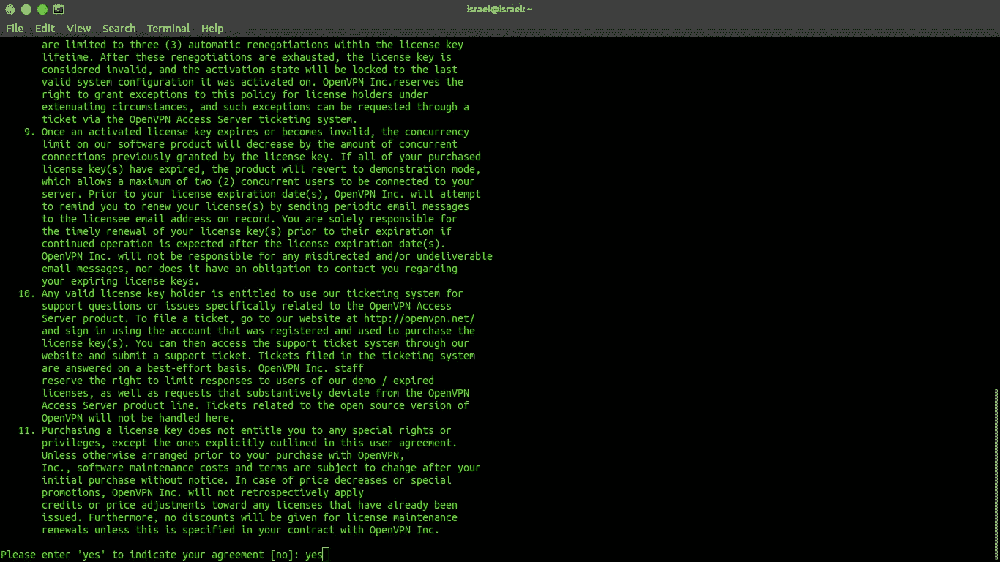

作者图片

接下来，你会被提示如何配置你的 VPN，保持默认设置，只需继续按下回车键，它会为你启动配置过程。完成后，您将看到一条指令，不再以 root 用户身份登录，而是以默认创建的用户“openvpnas”身份登录。

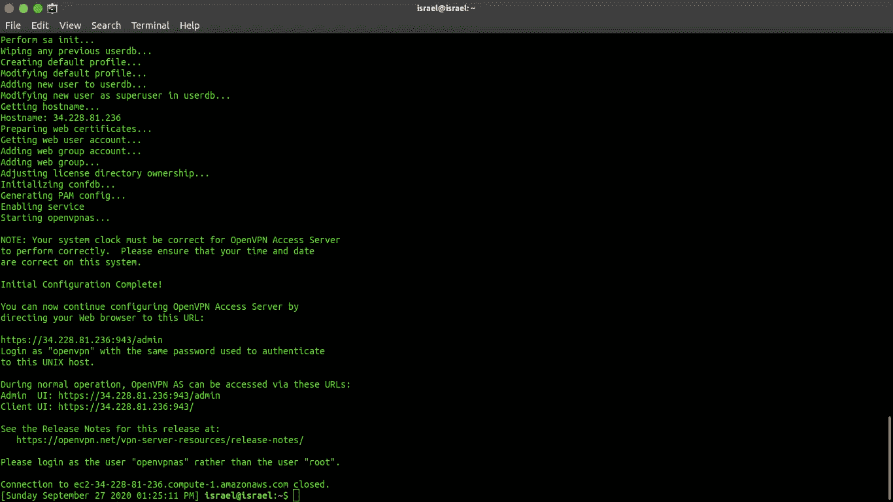

作者图片

现在，使用下面的命令再次对实例进行 SSH，但不是以 root 用户身份，而是以用户“openvpnas”身份:

```
ssh -i "<your-key-pair>" openvpnas[@](mailto:root@ec2-34-228-81-236.compute-1.amazonaws.com)<your-public-instance-domain>
```

当您成功登录后，为用户“openvpnas”创建一个密码，这将是访问 VPN 门户的管理员和客户端密码，您可以使用以下命令完成此操作:

```
sudo passwd openvpn
```

您将看到创建新密码的提示。就这样，您已经成功地配置了服务器。

# 步骤 3:使用 VPN 服务

祝贺您完成了本教程的这一部分，但是在我们开始使用它之前，我们只需要在我们的 VPN 中启用一个小功能。

复制您的实例的公共 DNS 或 IP 地址，并将以下内容粘贴到您的浏览器上:

```
http://<your-instance-public-DNS or IP address>:943/admin
```

您应该会看到以下页面:

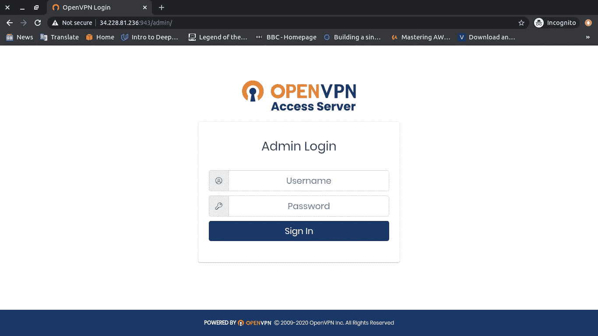

作者图片

如果您看不到此页面，请尝试使用匿名浏览器打开该网页。对于用户名，输入“openvpnas ”,密码是您在前面的步骤 2 中创建的。如果成功，您将被要求接受许可协议条款，然后您将看到以下页面:

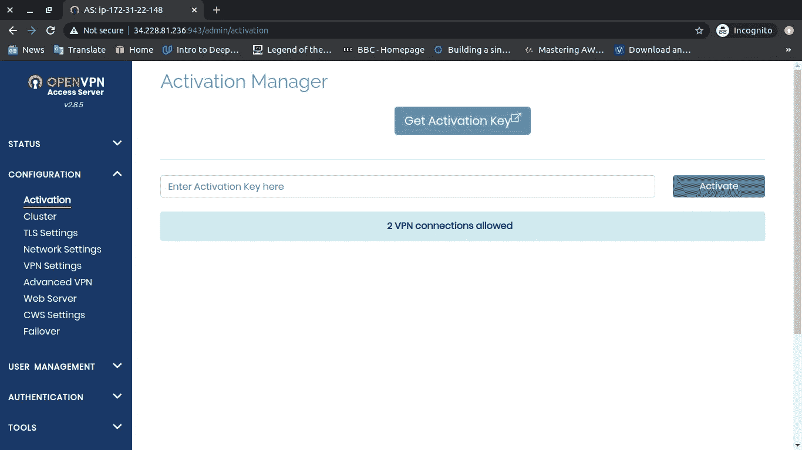

作者图片

现在在左边的页面，进入配置，点击“VPN 设置”

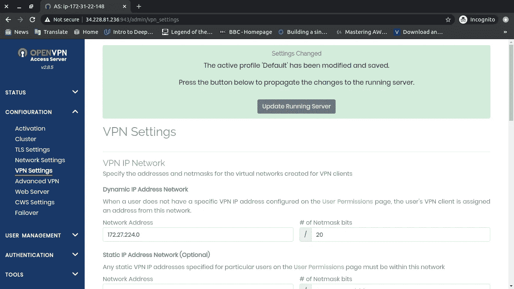

作者图片

然后向下滚动到**路由**并启用“客户端互联网流量应该通过 VPN 路由吗？”选项:

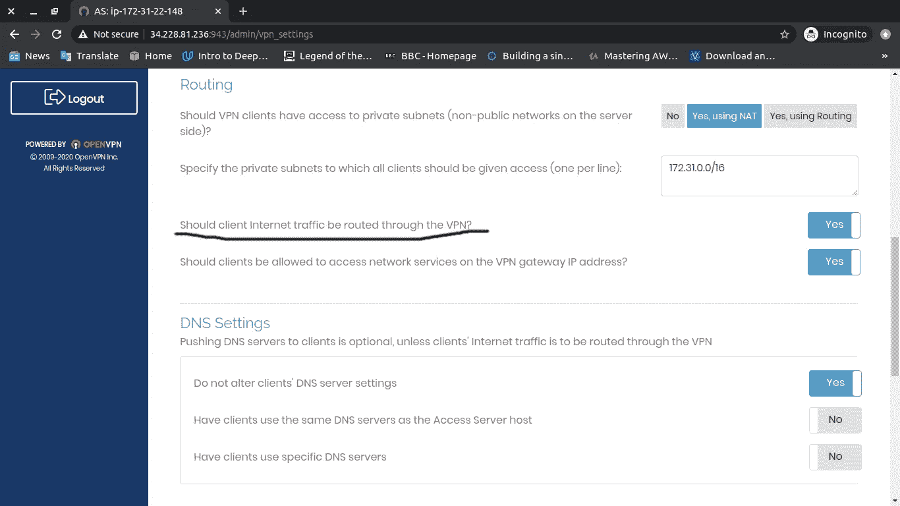

作者图片

向下滚动并点击保存设置。


作者图片

当你改变设置时，你需要更新服务器，所以点击“更新运行的服务器”就完成了！！！

## 现在让我们连接到 VPN…

转到 URL 并删除管理路径，它应该是这样的:

```
http://<your-instance-public-DNS or IP address>:943/
```

您应该看到用户登录页面，输入您用于登录管理员的相同凭证

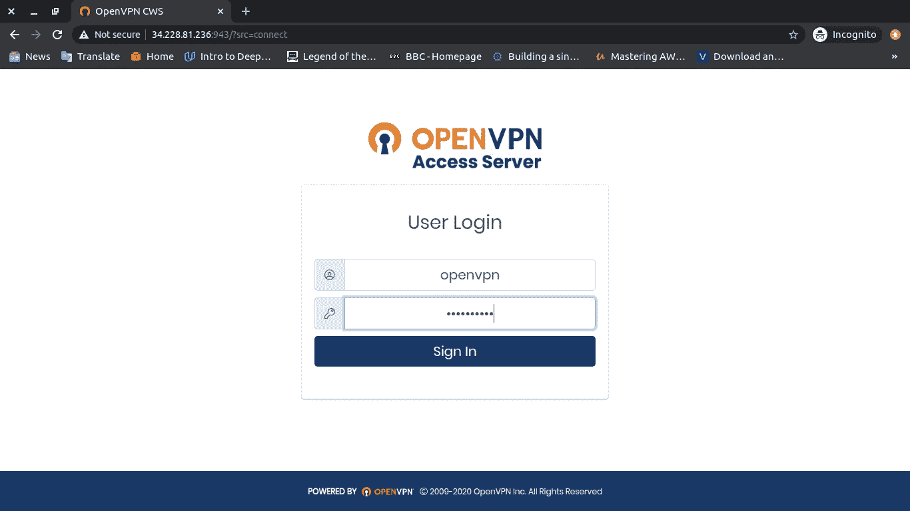

作者图片

现在选择你想要使用 VPN 的操作系统，按照提示操作，你就可以开始了！！！

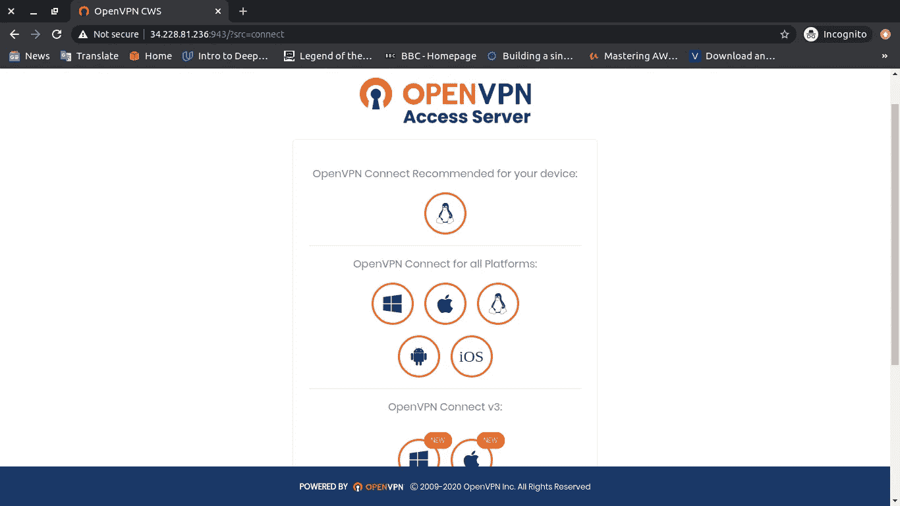

作者图片

仅此而已。感谢阅读，并保持安全😃。