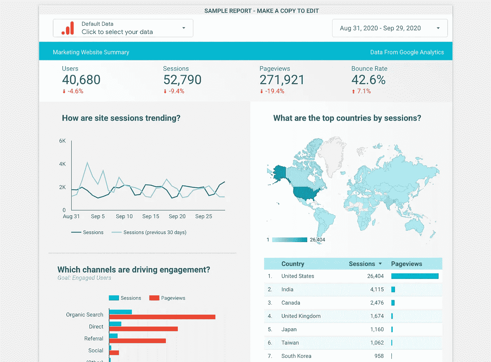

# 如何在 5 分钟内创建一个谷歌数据工作室仪表板

> 原文：<https://towardsdatascience.com/how-to-create-a-google-data-studio-dashboard-in-5-minutes-4f1c7af68de6?source=collection_archive---------15----------------------->

## 数据科学家的专家可视化方法。

照片由[米切尔罗](https://unsplash.com/@mitchel3uo?utm_source=unsplash&utm_medium=referral&utm_content=creditCopyText)在 [Unsplash](https://unsplash.com/s/photos/google?utm_source=unsplash&utm_medium=referral&utm_content=creditCopyText)

G oogle Data Studio 是一款简单易用的工具，任何拥有互联网连接和计算机的人都可以使用，但对业务分析师、数据分析师和数据科学家尤其有用。本文的目标是向您介绍如何创建 Google Data Studio 仪表板。该工具有利于通过交互式图表和表格直观地描述数据。商业中的很多问题都源于不恰当的沟通，包括从工程师到产品经理再到数据科学家。发现和结果很难传达给其他人。该工具可以通过以易于查看的格式呈现数据来帮助解决这些问题。下面，我将讨论一些简单的步骤来帮助您创建一个简单而有效的仪表板。

# 连接您的数据

第一步是获取你的数据。如果您想继续，但还没有数据，您可以通过命名一些列并在行中分配一些值，在 Google Sheets 中快速创建一些虚拟数据，然后连接到这些数据(*我将使用虚拟数据*)。下面提供的截图显示了如何连接到 18 个数据源，但我选择显示 Google Sheets，因为它是一个流行而简单的数据编辑工具。

连接您的数据源。作者截图。

然后，您很可能会看到您的编辑版本的仪表板，它会自动显示您的数据表。我有几个字段，包括一些数字字段和一些文本字段(分别用 a 123 和 ABC 表示的*和*)。

# 你的第一次想象

您将会看到一个数据表，但是我在这里将我的数据表改为一个“*带有热图*的表”。它为您选择在图表中显示的指标着色。这个附加组件不仅可以用数字，还可以用颜色来显示列值的数量级。几分钟后，甚至几秒钟后，你就有了一张令人印象深刻的彩色图表。

选择了“带热图的表格”选项的可能图表。作者截图。

# 给你的观众(或你自己)留下深刻印象

让我们更进一步，用一个更独特的图表来可视化同样的数据。你可以从上面看到地图选项。我要用的是“*地理图*”。选择此图表意味着您必须确保您的数据具有地理要素组件，或者手动将其更改为地理要素组件。例如，您可以看到我的数据有一个名为“*地区*”的字段。您将希望确保图表知道地区的缩写实际上是正确的地区，在本例中是美国的州。现在，您已经创建了一个有意义的地图，可用于会议、演示、电子邮件等。

状态数据的“地理图”,用数量密度进行颜色编码。作者截图。

# 把所有的放在一起

完成两张图表后，您可以点击“*查看*”按钮，退出编辑模式，进入仪表板的查看模式。现在，您可以与他人共享您的仪表板，就像使用 Google Sheet 或 Doc 一样。下面的屏幕截图显示了带有热图的原始表格，按“*已确认 _ 恢复*”降序排列(*虚构字段，用于示例目的—您也可以执行升序排列*)。另一个简洁的功能是，一旦进入仪表板视图，您就可以将鼠标悬停在图表上，并获得有关数据的更详细的信息。例如，您可以看到我的鼠标悬停在 CA — California 上，它显示了“ *Confirmed_Recovery* ”指标的数量。地图还显示了显示数量范围的键(*最小到最大，也用颜色编码*)。此外，您可以移动图表并轻松更改其大小，以实现完美的仪表板布局。有几个*“主题和布局*”。左边的这个主题是默认的，右边的主题是星座模式(*类似于黑暗模式*)。

带有默认和黑暗模式主题版本的最终仪表板。作者截图。

这个仪表板很容易创建，而且是免费的。你不必下载任何工具或平台，只需使用一个谷歌账户——所以你可以看到这个工具是多么有益。虽然这个仪表板创建得很快，但您可以创建一个更加令人印象深刻的仪表板，更加注重时间，以及一些您想要突出显示的与您的业务相关的特定目标和指标。

[这里的](https://datastudio.google.com/reporting/0B_U5RNpwhcE6SF85TENURnc4UjA/page/1M/preview)是 Google 自己做的一个更复杂的例子，突出了按国家进行广告数据会话的用例。它被标记为[样本]谷歌分析营销网站。

Google Data Studio 的仪表板示例——Google Analytics 营销网站。

# 最后的想法

创建一个仪表板可能看起来令人生畏，但是通过一些努力和指导，像这样，你可以很好地为无数目的创建一个强大而令人印象深刻的仪表板。作为一名数据科学家，我已经习惯于用 Python 编程语言创建可视化或图表，但是使用 Google Data Studio 更容易、更快，并且可以产生更令人印象深刻的交互式仪表板。可视化复杂的机器学习算法指标也可能是暗示，但使用这样的工具，数据科学家或类似角色的人可以以容易理解的格式显示分析。

*感谢您的阅读！我希望你喜欢这篇来自数据科学家的文章。如果您在执行可视化时使用相似或不同的概念和代码，请在下面评论。*

*我不隶属于本文中提到的任何公司。*

## 参考

*谷歌，* [*谷歌数据工作室*](https://datastudio.google.com/navigation/) *，【2020】*

*谷歌，* [*谷歌分析营销网站*](https://datastudio.google.com/reporting/0B_U5RNpwhcE6SF85TENURnc4UjA/page/1M/preview) *，【2020】*

*M.Przybyla，截图和仪表板，(2020 年)*