# 如何使用 AWS AppSync 创建 GraphQL API

> 原文：<https://towardsdatascience.com/how-to-create-a-graphql-api-using-aws-appsync-49fed1171780?source=collection_archive---------13----------------------->

## 什么是 GraphQL 以及如何使用 AWS AppSync 创建我们自己的 GraphQL API


图片由[贝瑟尼·德鲁因](https://pixabay.com/users/bsdrouin-5016447/?utm_source=link-attribution&amp;utm_medium=referral&amp;utm_campaign=image&amp;utm_content=2402637)从[皮克斯拜](https://pixabay.com/?utm_source=link-attribution&amp;utm_medium=referral&amp;utm_campaign=image&amp;utm_content=2402637)拍摄

# 什么是 GraphQL

如今，每当我们谈论或考虑创建/设计一个 API 时，首先浮现在脑海中的是 **REST** 。REST(**RE**presentational**S**state**T**transfer)一直是开发 API 平台的首选标准。即使 REST 成为了标准，它也有自己的缺点。一个主要的缺点是对于将要消费它们的客户来说缺乏灵活性。因此，即使在开始时，我们根据客户需求创建 REST API，当客户需求快速变化时，该 API 的选项也很少。为了支持这些快速的变化，客户需要发送多个调用，并获得多个不必要的数据。


图片由 [GraphQL](https://graphql.org/) 提供

**GraphQL** 的开发主要着眼于为客户提供这种灵活性。它最初是脸书内部的一个项目，但是后来他们把它变成了开源项目。主要概念是让客户端能够选择要查询的数据和需要返回的数据，而无需进行多次 API 调用。是的，正如你在 GraphQL 中读到的，它没有多个端点，而是只有一个端点。为了说明 GraphQL 是如何工作的，让我们尝试使用 node.js 和 express framework 实现一个简单的 GraphQL API。我们的 GraphQL 的数据模型将是一个用户。

下面的 npm 包将在我们的代码中使用。

```
express, express-graphql, graphql
```

一个 GraphQL API 主要由四个组件组成。

*   (计划或理论的)纲要
*   问题
*   突变
*   下决心者

## (计划或理论的)纲要

GraphQL 模式是我们定义客户端连接到 API 后可以执行的功能的核心元素。模式上的主要构建块是*类型*。

如上图所示，使用积木*类型*，我们创建了三个积木。*类型*类型**查询**、*类型*、**突变、**类型**用户**。下面将描述查询和突变。对于*类型*用户，如您所见，我们已经定义了属性字段，当查询用户时，这些字段将对客户端可用。

## 询问

查询*类型*用于定义什么类型的查询将可用于要被访问的客户端。用 REST 术语查询类型可以映射到 **GET** 请求。在上面的模式中，我们定义了三个查询，它们接受的参数以及返回值的类型。(!代表必需的)

## 变化

任何导致数据变化的函数都应该作为 GraphQL 的变种来完成。对 REST 的 **POST** 、 **PUT、**和 **DELETE** 请求可以映射为 GraphQL 上的突变。正如我们定义查询一样，变异也是用参数和返回值类型定义的。

## 下决心者

在解析器中，我们定义了我们在模式中定义的*查询*和*突变*的功能。解析器将模式定义的方法映射到我们正在执行的功能方法。

在上面你可以看到，对于我们定义的每个*查询*和*变异*，我们已经映射了一个 Javascript 函数来执行功能逻辑。(getUser、getUserByName、getUserByStatus 和 updateUser 是 Javascript 函数)

好了，现在我们已经介绍了代码中的主要概念，下面是简单的 GraphQL API 的完整代码。如上所述，您需要安装提到的 npm 包，以便运行应用程序。

现在，您可以启动 node.js 服务器，并向我们的 API 发出查询，我们可以使用 graphql 工具，它将在[http://localhost:4000/graph QL](http://localhost:4000/graphql)上运行

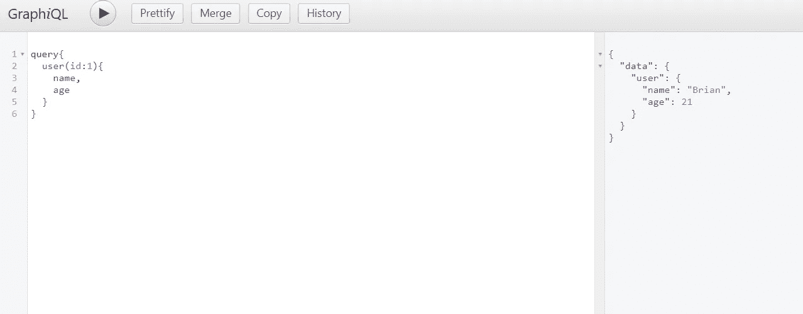

现在，如上所示，我们可以为我们创建的 API 执行查询。上面我们得到了 id 为 1 的用户，我们只请求返回姓名和年龄字段。

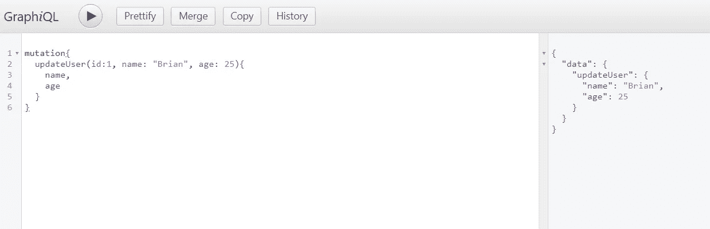

与查询一样，我们也可以发送变异来更新用户。上面我们已经将用户的年龄改为 25 岁。

# AWS AppSync

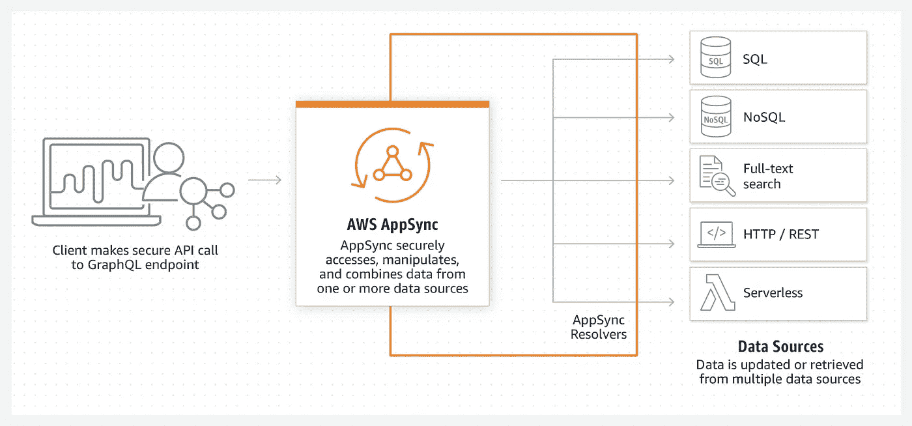

图片来源 [AWS AppSync](https://aws.amazon.com/appsync/)

WS AppSync 是由 Amazon Web Services 提供的一项服务，它通过让开发人员在其基础设施上创建安全、灵活的 GraphQL API 来简化 API 应用程序开发。使用 AWS AppSync 的好处是，它还提供了额外的功能，如 Cognito、IAM permissions、API key 和许多其他 AWS 服务，以便与我们的 API 集成。

对于 AppSync，GraphQL 的主要概念基本保持不变，只是增加了一个*类型*、**订阅**。订阅被调用到一个通过 API 完成的变异，因此它可以用来创建实时的 GrapgQL APIs。此外，在我们开始在 AWS AppSync 中创建自己的 GraphQL 之前，我们需要讨论 AWS AppSync 中的另外两个组件。

*   **数据源** —数据源可以是持久存储(关系数据库或 NoSQL 数据库)或触发器(AWS Lambda 函数或其他 HTTP API)
*   **解析器** —与 GrapQL 中的解析器有相同的概念，但是这里我们将请求负载映射到我们的数据源或触发器。这些解析器主要与包含执行逻辑的映射模板妥协。

## 在 AppSync 上创建 GraphQL API

让我们开始实现我们的 API。首先转到 AppSync 服务，如果您还没有创建 API，您将看到下面的屏幕。

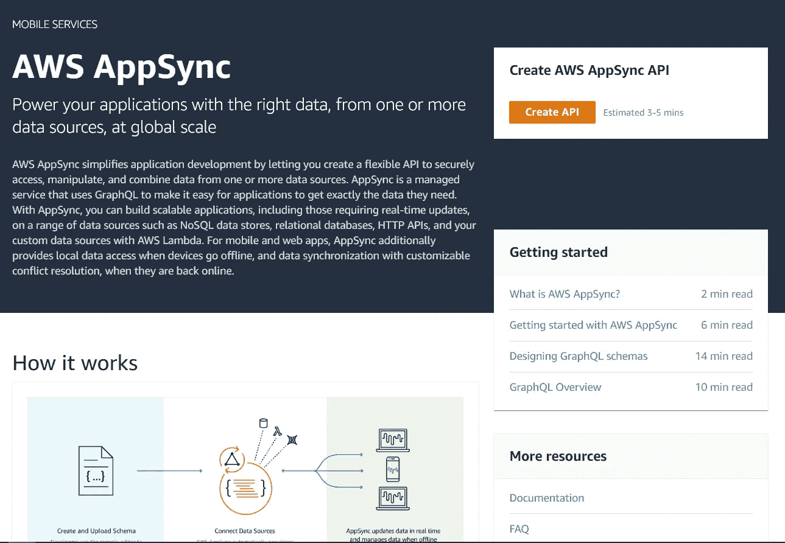

点击**创建 API** ，这将把我们带到 API 创建页面。这里 AWS 将为我们提供几种选择。我们可以从已经创建的模板中选择一个，也可以从头开始。对于这篇文章，让我们选择**从头开始构建**，这样我们将能够了解场景背后的一切是如何连接的。

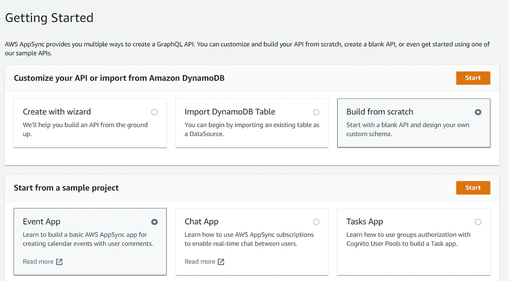

接下来，提供一个名称并创建我们的 API。然后，我们将转到一个屏幕，在这里我们可以选择编辑我们的模式并根据我们的 API 运行查询。

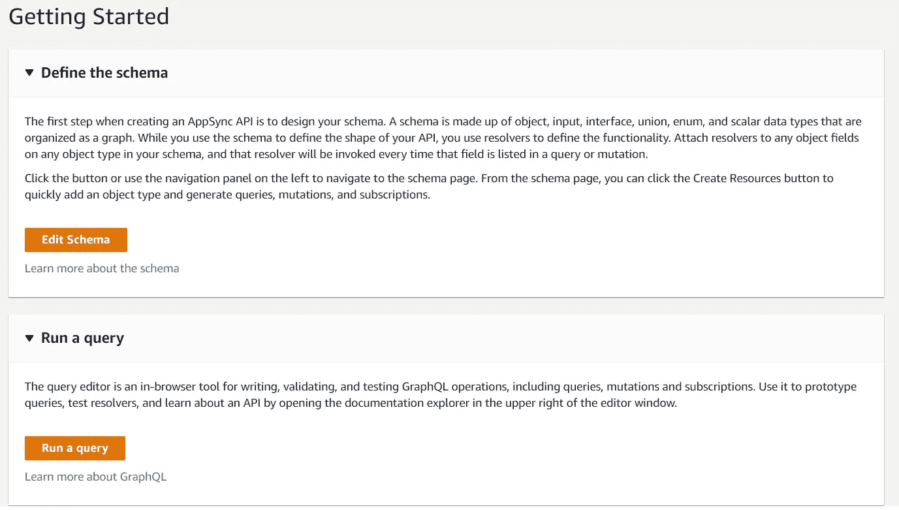

因为我们的 API 上还没有任何东西，所以让我们首先定义我们的模式。在本文中，我将讨论 AppSync 支持的两种类型的数据源。一个是 **DynamoDB** 另一个将是 **AWS Lambda functions** 。由于上面创建了简单的 GraphQL API，让我们假设我们的用户数据模型。

## DynamoDB 作为数据源

假设我们需要将用户保存在 DynamoDB 表中。因此，对*类型*用户进行的所有查询和变更都将直接发生在我们的 DynamoDB 表上。所以首先让我们在模式中定义我们的用户类型。

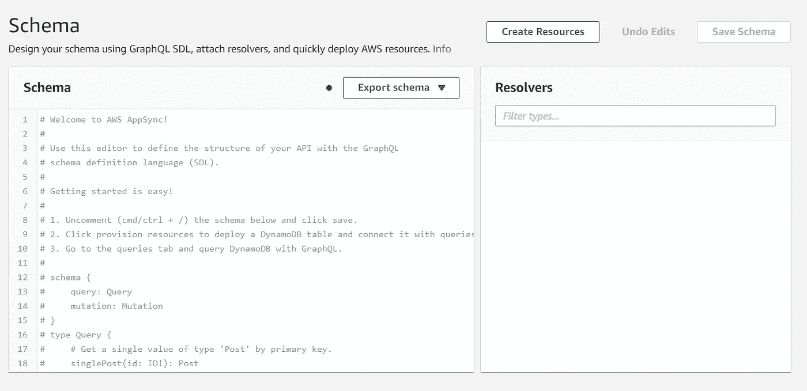

在模式页面上，单击**创建资源**，我们将在其中定义我们的用户模式。

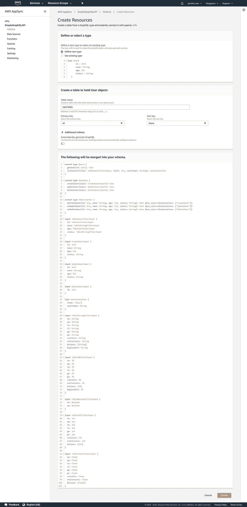

我们定义了**用户**的新*类型*，然后它将要求 DynamoDB 表的详细信息。在这里，我们可以提供表的名称，还可以配置我们需要创建的不同类型的索引。最后，它将显示为我们的*类型* **用户**自动生成的模式块，这些模式块将被合并到我们的模式中。点击**创建**，它将创建 DynamoDB 表以及解析器。

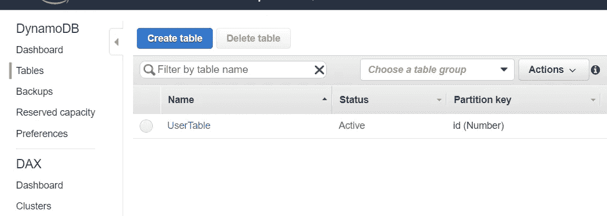

现在让我们更深入地看看我们的模式。我们可以看到 AppSync 已经为我们自动生成了**查询**类型和**突变**，并且已经将这些查询和突变映射到**解析器**。

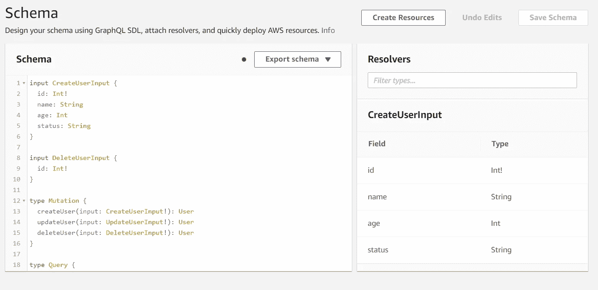

让我们看一个解析器，以确定解析器如何在 AppSync 上工作。

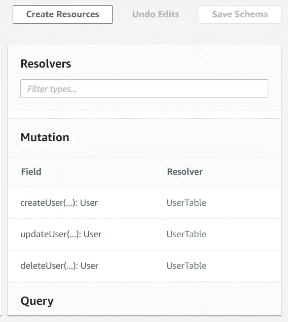

点击*创建用户*突变。在这里，我们可以看到 AppSync 用于此突变的模板。在请求映射模板中，我们可以看到它将 id 作为我们的*用户表*的键，并在表中创建一个用户集合。 *$ctx.args.input* 是我们将传递给变异的参数。

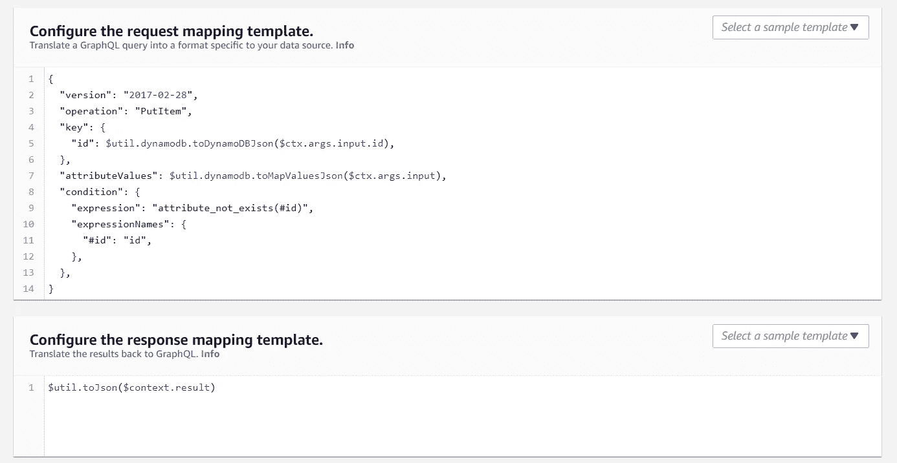

响应映射定义了我们将发送回客户端的响应。在这里，它将直接发送来自 DynamoDb 的输出，这将是新创建的用户。

我们可以使用提供的查询工具测试我们的 API。让我们首先添加一个用户，并尝试使用 id 查询该用户。

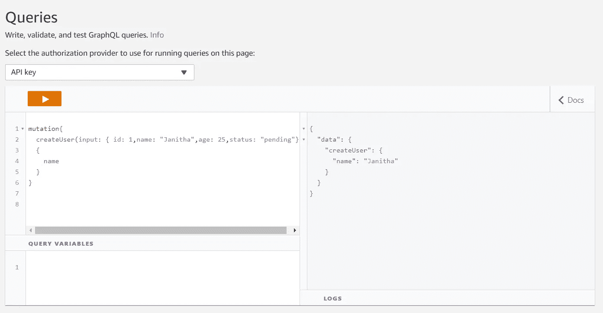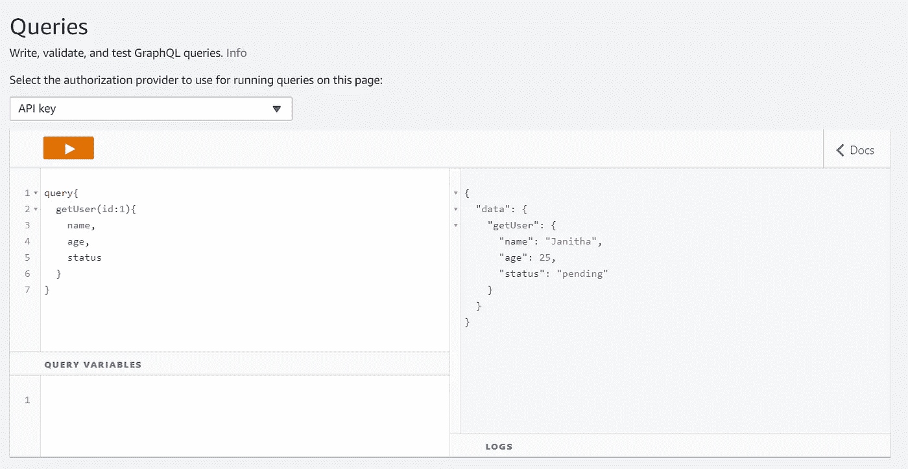

## AWS Lambda 用作数据源

到目前为止，我们创建的 API 可以直接在 DynamoDB 数据库上执行所有 CRUD 操作。但是 API 不仅仅包含 CRUD 操作。可以有不同种类的功能逻辑，如通过向队列发送消息来启动流程，或者我们可能需要使用不同的 AWS 资源，如 ElasticSearch，而不是在数据库上进行 CRUD 操作。为了迎合这种情况，我们可以使用 AWS lambda 函数作为数据源。

对于本文，让我们假设我们想从 AWS lambda 函数获取用户数据，而不是从 DynamoDb 获取。首先，让我们创建 lambda 函数。我们要映射为解析器的查询是

```
getUser(id: Int!): User
```

创建一个新的 lambda 函数，并为该函数添加以下代码。在这里，我们检查将通过解析器发送的 **event.field** 参数。因此，如果字段参数是 *getUsers* ，那么我们将返回过滤后的用户。

现在让我们为这个函数配置一个解析器。在此之前，我们需要在我们的 API 中将这个函数注册为一个**数据源**。为此，转到*数据源*选项卡，点击**创建数据源**。

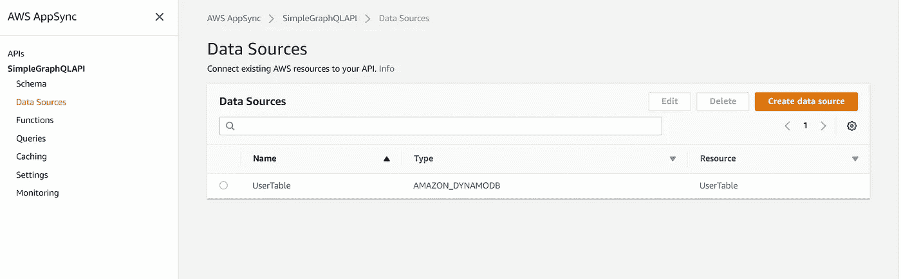

接下来，为数据源提供一个名称，选择 *DataStorageType* 作为 **Lambda** ，然后选择 *region* ，最后选择我们创建的 Lambda 函数。

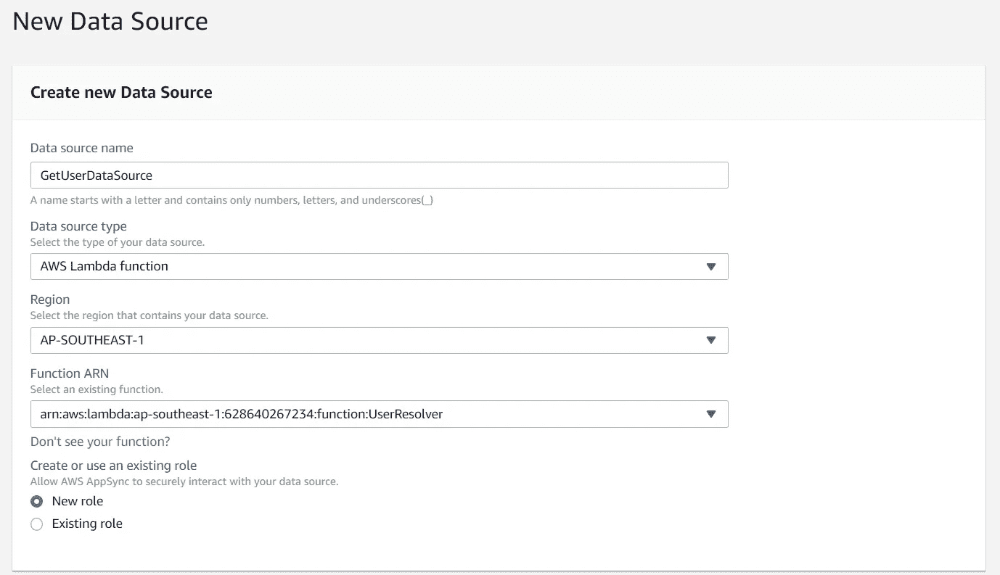

下一步是在我们的模式中分配这个数据源。首先，当我们将模式映射到 DynamoDB 表时，删除已经映射到 getUser()解析器。

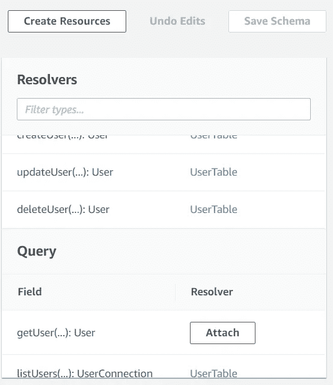

删除后，点击**连接**。然后选择数据源作为我们为 lambda 函数创建的数据源。接下来将为**请求映射**和**响应映射**添加模板。

```
{
    "version": "2017-02-28",
    "operation": "Invoke",
    "payload": {
        "field": "getUser",
        "arguments":  $utils.toJson($context.arguments)
    }
}
```

将上述内容添加为请求映射模板。这里我们将字段指定为 **getUser** ，我们在 lambda 函数中使用它作为**事件。对于响应映射，我们可以让它保持原样。**

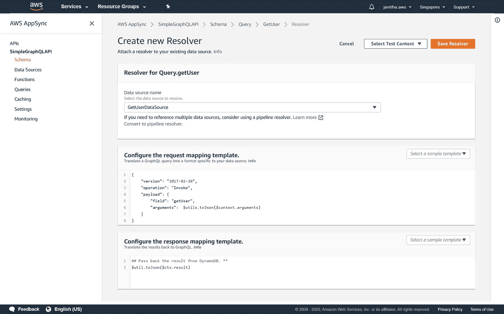

现在让我们试着从我们的 GraphQL API 中查询这个。

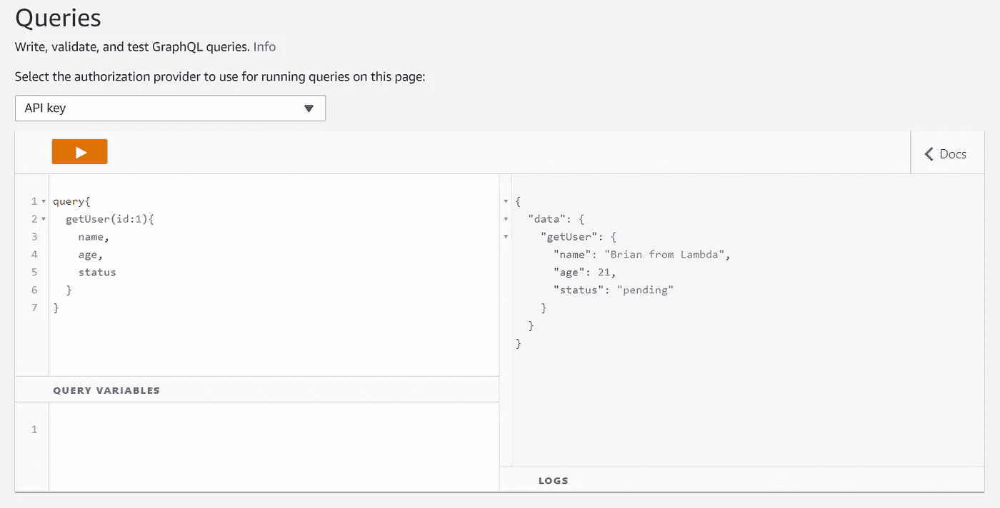

就是这样。尽管这里 lambda 函数只是用来返回一个用户，但我想你可能会发现 lambda 函数能做的任何事情都可以映射到我们的 GraphQL，这确实创建了一个无服务器 API。

我想你已经了解了更多关于什么是 GraphQL 以及如何使用 AWS AppSync 为我们创建一个 GraphQL。还有许多概念没有在本文中介绍。因此，如果你热衷于此，请确保遵循官方文档以及其他可用的精彩文章。谢谢你。

[](https://graphql.org/learn/) [## GraphQL:一种 API 查询语言。

### 在本系列文章中了解 GraphQL，它是如何工作的，以及如何使用它。寻找关于如何…

graphql.org](https://graphql.org/learn/)  [## 欢迎

### 欢迎使用 AWS AppSync 开发人员指南。AWS AppSync 是一个企业级的完全托管的 GraphQL 服务，具有…

docs.aws.amazon.com](https://docs.aws.amazon.com/appsync/latest/devguide/welcome.html)