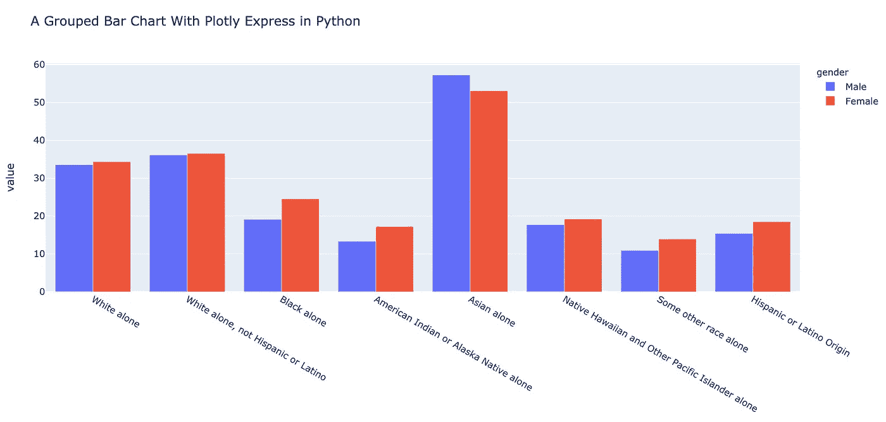
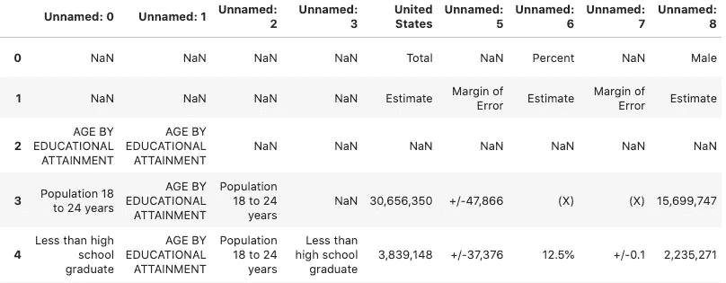
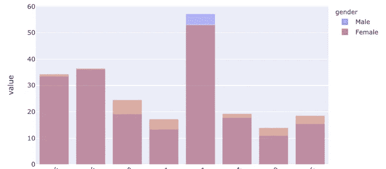
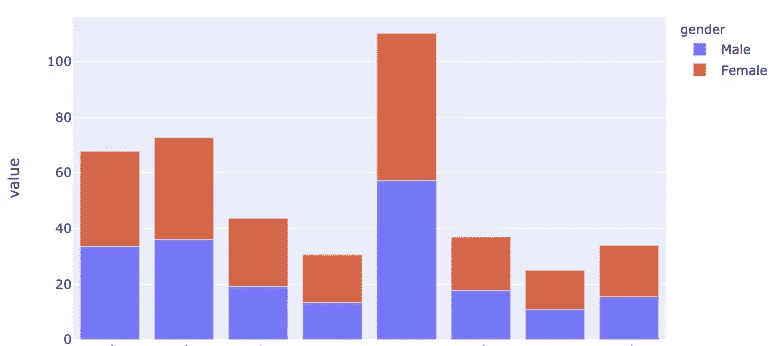
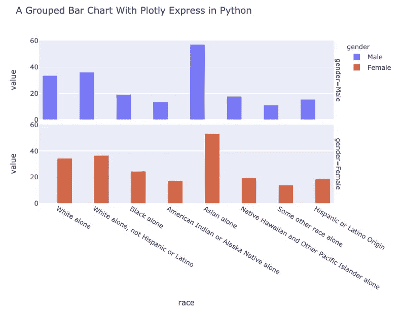
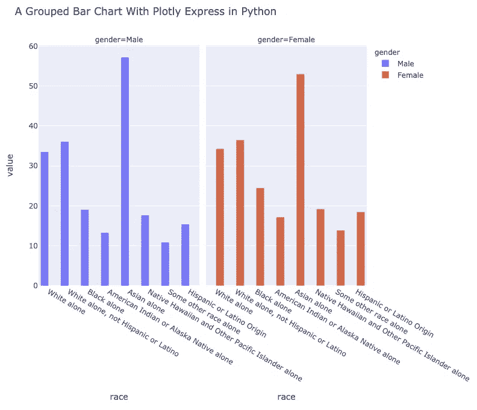

# 如何用 Python 中的 Plotly Express 创建分组条形图

> 原文：<https://towardsdatascience.com/how-to-create-a-grouped-bar-chart-with-plotly-express-in-python-e2b64ed4abd7?source=collection_archive---------6----------------------->

## Python melt 函数将数据帧从宽到长格式化



作者图片

```
**Table of Contents**[**Introduction**](#7b7f)1\. [Data](#4f79)
2\. [Preparing data](#010c)
3\. [Pandas melt function](#0bb4)
4\. [A grouped bar chart](#9c7d)
5\. [Bonus tip](#de73)[**Conclusion**](#b4e3)
```

# 介绍

创建[分组条形图](https://plotly.com/python/bar-charts/#grouped-bar-chart)时，需要使用`[plotly.graph_objects](https://plotly.com/python-api-reference/plotly.graph_objects.html#graph-objects)`。在本文中，您将学习如何使用 [Plotly.express](https://plotly.com/python/plotly-express/) 创建一个分组条形图。Plotly Express 是一个用于数据可视化的高级接口。

Plotly Express 提供了 30 多种功能来创建不同类型的图形。这些函数的 API 一致且易于使用。

你可以在这里找到如何安装 plot ly。

> *本文假设您已经熟悉 JupyterLab/Jupyter 笔记本的基本操作。*

# 数据

我们使用美国人口普查局的数据。[本页](https://data.census.gov/cedsci/table?tid=ACSST1Y2018.S1501&vintage=2018&hidePreview=true)提供 2018 年以来的教育程度数据。在这篇文章中，我们主要关注种族和性别。你可以在这里找到下载的数据。

# 准备数据

```
import pandas as pd
import plotly.express as px

url='https://gist.githubusercontent.com/shinokada/f2ebf82eaa3cfa02106ae93c7fe9efbe/raw/3494b1e2ba9b1c0d8991e71483123f63b4bce559/educational+attainment.csv'

df = pd.read_csv(url)
display(df)
```

我们导入 Pandas 并创建一个变量`url`，它包含一个到逗号分隔文件(csv)的链接。

我们使用`read_csv`来读取 csv 文件并创建一个熊猫数据帧。



csv 文件有 70 行× 16 列。图片由作者提供。(图 1)

```
cols = [2,10,14]
rows = [33,36,39,42,45,48,51,57]

df =df.iloc[rows,cols].reset_index(drop=True)

df.columns=['race','Male','Female']
for col in ['Male', 'Female']:
    df[col]=pd.to_numeric(df[col].str.replace('%',''))

display(df)
print(df.dtypes)
```

*   csv 文件有 70 行 x 16 列。我们需要`2, 10, 14`的列号，其中包含种族名称、男性的估计百分比和女性的估计百分比。我们还使用行号`33, 36, 36, 42, 45, 48, 51, 57`，它包含不同种族的学士学位或更高学位的数据。
*   我们将该列重命名为种族、男性和女性。
*   我们使用 for 循环，使用`pd.to_numeric`函数将男性和女性列转换为数字，并使用`str.replace`方法删除%符号。


显示(df)和打印(df.dtypes)的输出。图片由作者提供。(图 2)

[](/how-to-run-jupyter-notebook-on-docker-7c9748ed209f) [## 如何在 Docker 上运行 Jupyter 笔记本

### 不再有 Python 环境和包更新

towardsdatascience.com](/how-to-run-jupyter-notebook-on-docker-7c9748ed209f) [](/how-to-create-an-animated-choropleth-map-with-less-than-15-lines-of-code-2ff04921c60b) [## 如何用不到 15 行代码创建一个动画的 Choropleth 地图

### 在 Jupyter 上使用 Python 中的 Plotly Express

towardsdatascience.com](/how-to-create-an-animated-choropleth-map-with-less-than-15-lines-of-code-2ff04921c60b) [](/how-to-create-an-animated-bar-chart-in-jupyter-9ee1de8d0e80) [## 如何在 Jupyter 中创建动画条形图

### 使用 Plotly Python 显示最新美国失业率的数据可视化

towardsdatascience.com](/how-to-create-an-animated-bar-chart-in-jupyter-9ee1de8d0e80) 

# **熊猫融化功能**

上面的图像图 2 被称为宽格式。要使用 Plotly Express 分组条形图，我们需要将数据帧重新调整为长格式。

熊猫的`[melt](https://pandas.pydata.org/pandas-docs/stable/reference/api/pandas.melt.html)`功能可以将一个数据帧从宽格式重塑为长格式。

```
df=pd.melt(df,id_vars=['race'],var_name='gender', value_name='value')
df
```

我们使用以下 pandas.melt 参数。
- `id_vars`:用作标识符变量的列
- `var_name`:用于变量的名称。默认为`variable`。
- `value_name`:要取消透视的列。如果未指定，则使用未设置为`id_vars`的所有列。我们用`value`。


一种长格式数据帧。图片由作者提供。(图 3)

# 分组条形图

```
fig = px.bar(df, x="race", color="gender",
             y='value',
             title="A Grouped Bar Chart With Plotly Express in Python",
             barmode='group',
             height=600
            )

fig.show()
```

我们使用`px.bar`实例化一个`plotly.graph_objects.Figure`对象并定义参数。

- `data_frame`:我们使用`df`数据帧。你可以像上面一样使用或不使用`data_frame`或`data_frame=df`。
- `x`:用于 x 轴的`data_frame`中的一列的名称。我们使用列`race`。
-`color`:`data_frame`中一列的名称，用于给列分配颜色。
- `y`:用于 y 轴的`data_frame`中的一列的名称。我们使用列`value`。
- `title`:一个图标题。
- `barmode`:为`group`、`overlay`或`relative`中的一种。在`relative`模式下，棒被堆叠。在`overlay`模式下，条形被绘制在彼此的顶部。在`'group'`模式下，条块并排放置。默认值为`relative`。

因为我们正在创建一个分组条形图，所以我们使用`group`。



barmode='overlay '。图片由作者提供。



barmode='relative '。图片由作者提供。

- `height`:以像素为单位的图形高度。

# 额外小费

当你有一个像我们这样的宽格式数据帧时，你可以使用`facet_col`或`facet_row`来创建支线剧情。

```
fig = px.bar(df, x="race", color="gender",
             y='value',
             title="A Grouped Bar Chart With Plotly Express in Python",
             barmode='group',
             height=700,
             facet_row="gender"
            )

fig.show()
```



facet_row="gender "的输出图。图片由作者提供。

```
fig = px.bar(df, x="race", color="gender",
             y='value',
             title="A Grouped Bar Chart With Plotly Express in Python",
             barmode='group',
             height=700,
             facet_col="gender"
            )

fig.show()
```



facet_col="gender "的输出图。图片由作者提供。

# 结论

我们可以使用 Plotly Express 创建一个分组条形图。Plotly Express API 提供了我们可以利用的各种高级特性。`barmode`参数有不同的值可供您使用。

Pandas `melt`函数是将宽格式转换为长格式数据帧的最简单方法。

**通过** [**成为**](https://blog.codewithshin.com/membership) **会员，获得媒体上所有故事的访问权限。**


[请订阅。](https://blog.codewithshin.com/subscribe)

[](/line-chart-animation-with-plotly-on-jupyter-e19c738dc882) [## Jupyter 上 Plotly 的折线图动画

### Plotly 统一悬停模式，按钮和更多

towardsdatascience.com](/line-chart-animation-with-plotly-on-jupyter-e19c738dc882) [](/how-to-create-an-interactive-dropdown-in-jupyter-322277f58a68) [## 如何在 Jupyter 中创建交互式下拉列表

### 用下拉菜单更新图表

towardsdatascience.com](/how-to-create-an-interactive-dropdown-in-jupyter-322277f58a68) [](/how-to-create-an-attractive-bubble-map-5cf452c244e9) [## 如何在 Jupyter 中创建一个有吸引力的气泡图

### 从 Github repo 抓取数据的分步指南

towardsdatascience.com](/how-to-create-an-attractive-bubble-map-5cf452c244e9)