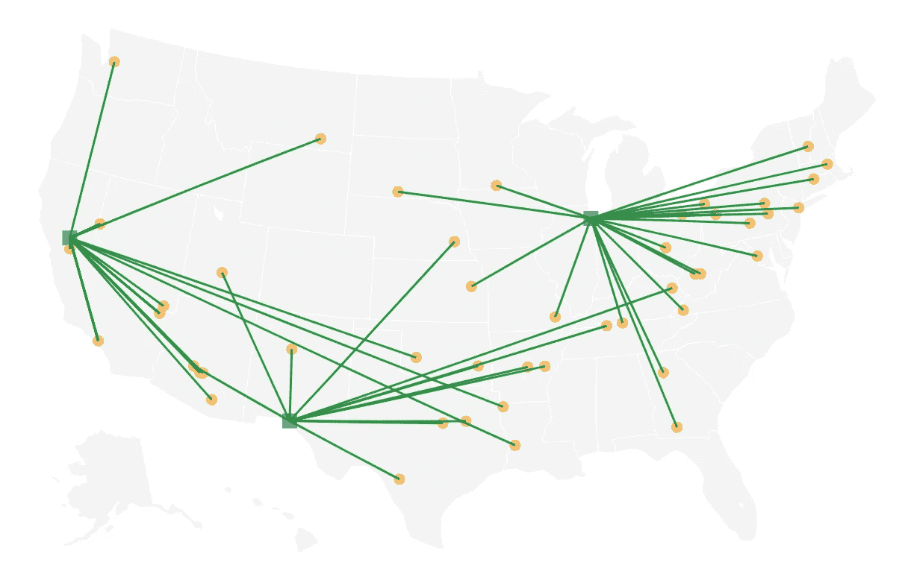
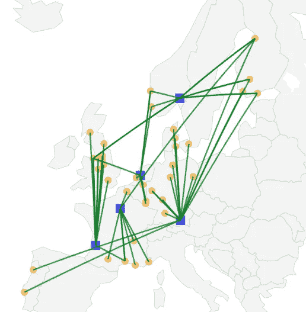

# 如何使用 Plotly 创建轴辐式绘图

> 原文：<https://towardsdatascience.com/how-to-create-a-hub-and-spoke-plot-with-plotly-d11d65a4200?source=collection_archive---------31----------------------->

## 用连接位置的线在地图上绘制纬度/经度数据



不久前，我需要在地图上绘制连接某些位置的纬度(lat)和经度(long)坐标的线。我需要画的是众所周知的“[轴辐式](https://en.wikipedia.org/wiki/Spoke%E2%80%93hub_distribution_paradigm)图。知道 [Plotly](https://plot.ly/python/) 已经有了一些样品，比如这里的，我能够很容易地完成它。但是现实生活中的数据并不总是完美地适用于 Plotly 的例子，而且可能还有其他开箱即用的例子不能满足的要求。

在这篇博客中，我将向你展示如何自己构建这些图表。特别是，我们将假设:

*   数据并不总是来自同一个地区(如美国)。我们的地理空间数据可以是北美、南美或欧洲的。
*   该图需要保存为 HTML 文件。
*   图形应该是脱机的*。

* *这实际上是在 Plotly 版本 4 之前需要更多努力的事情，特别是因为他们的文档强调在线模式，正如你在这里看到的*[](https://plot.ly/python/v3/lines-on-maps/)**。但是版本 4 只离线。你可以在这里* *阅读更多关于在线特性* [*的迁移。*](https://plot.ly/python/v4-migration/)*

# *一些关于神秘人物的背景*

*Plotly 中有多种表示图形的方法。两种最常见的方法是使用(a)字典或使用(b) *图形对象。*虽然各有利弊，Plotly 推荐后者的额外好处，你可以在这里查看。*

*为了创建一个图形，我们需要两个主要组件:数据*和布局*。来自[文档](https://plot.ly/python/creating-and-updating-figures/):*

> *您可以通过将跟踪和布局规范传递给`plotly.graph_objects.Figure`构造函数来构建一个完整的图形。这些跟踪和布局规范可以是字典或图形对象。*

**布局*字典指定图形布局的属性，而*数据*是一个跟踪字典列表，带有各个跟踪的配置选项(*跟踪*是 Plotly 用来描述图形的一个词)。*

*既然我们知道了图形是如何构成的，我们就可以准备数据并把它们标绘在地图上。虽然下面的代码是针对 Plotly 版本 4 的，但是你可以在[这个 Jupyter 笔记本](https://github.com/ekhoda/plotly_hub_and_spoke/blob/master/plotly_hub_and_spoke.ipynb)中找到版本 3 和版本 4 的实现。*

# *数据准备*

*数据(如您在此[示例中所见。csv 文件](https://github.com/ekhoda/plotly_hub_and_spoke/blob/master/sample_us.csv))包含每个出发地和目的地的信息(即城市、州、国家、纬度和经度)。为了画出这个情节，我们只关心:*

*   *始发地和目的地的纬度/经度。*
*   *地图上的位置属性，例如大小、颜色和形状。*
*   *以及任何其他关于某个位置的信息，或者我们希望在地图上显示的位置之间的路径。例如，当用户的鼠标悬停在每条路径上时，您可能想要显示每个位置的名称，或者每条路径的长度(以英里为单位)(这里我们只显示前者。)*

*首先，让我们加载数据:*

```
***import** pandas **as** pd
**import** plotly.graph_objects **as** godata = pd.read_csv(**'sample_us.csv'**)*
```

*接下来，使用所有需要的属性创建位置数据框架:*

*之后，我们可以将每个位置及其属性添加到图形中:*

*之后，我们可以将每条路径添加到图形中:*

*最后，让我们指定地图的布局:*

*因为我们希望将地图显示为 HTML 文件，所以我们还需要一行代码:*

```
*fig.write_html(file=**f'{**title**}.html'**, auto_open=**True**)*
```

*就是这样！这正如预期的那样起作用，但是只有当纬度/经度数据局限于美国时。为了让它对不同种类的底层数据(比如欧洲的位置)有更好的响应，我们需要做一个小小的改变。*

# *一般数据*

*如果你仔细观察上面的代码，你会发现在`layout`字典中，我们指定了`scope='usa'`。根据 [Plotly 的文档](https://plot.ly/python/reference/#layout-geo-scope) , `scope`接受以下值之一:*

```
**"world" | "usa" | "europe" | "asia" | "africa" | "north america" | "south america".**
```

*为了决定使用什么范围，我们应该查看数据中纬度和经度的范围。*

*然后，我们可以将我们的范围与每个范围的大致范围进行比较，以决定使用哪一个(我通过在线搜索找到了它们——它们应该很好地服务于我们的目的。)*

*剩下要做的就是改变`layout`的`scope=scope`，我们就完成了。*

*瞧啊。我们完了。让我们在两个不同的数据集上测试这个方法。*

*这是一张[用户数据](https://github.com/ekhoda/plotly_hub_and_spoke/blob/master/sample_us.csv)的地图:*

**

*这是一张来自[欧洲](https://github.com/ekhoda/plotly_hub_and_spoke/blob/master/sample_eu.csv)的照片:*

**

*注意，这个博客的样本数据和更详细的代码可以在 [GitHub](https://github.com/ekhoda/plotly_hub_and_spoke) 上找到。*

*我希望这篇博客对你有用。可以通过[*Twitter*](https://twitter.com/EhsanKhoda)*和*[*LinkedIn*](https://www.linkedin.com/in/ehsankhodabandeh)*联系到我，我欢迎任何反馈。**