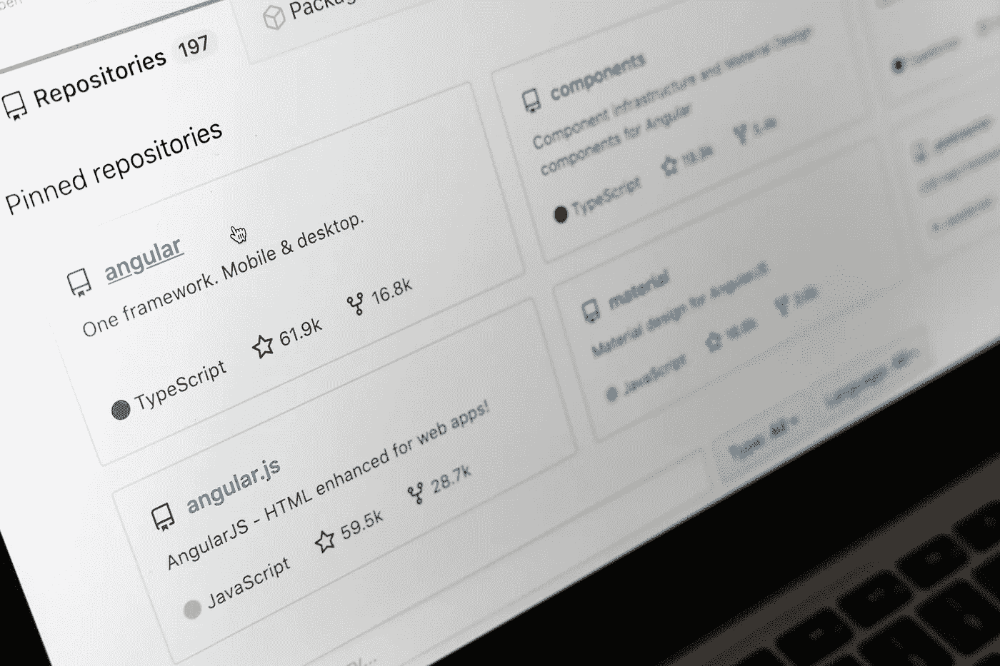

# 如何创建专业的 Github 数据科学库

> 原文：<https://towardsdatascience.com/how-to-create-a-professional-github-data-science-repository-84e9607644a2?source=collection_archive---------14----------------------->

## 存储库结构、记录 jupyter 笔记本和编写信息丰富的自述文件方面的良好实践

马库斯·温克勒在 [Unsplash](https://unsplash.com/s/photos/github?utm_source=unsplash&utm_medium=referral&utm_content=creditCopyText) 上的照片

作为一名数据科学家，你将利用许多不同的工具和技术来完成一个项目。Github 是一个出色而重要的工具，它让我们能够管理自己的代码、版本控制，并与其他人合作。不仅是数据科学家，任何为个人或工作项目编程的人都会使用 Github(或另一个 Git 存储库托管服务)。

除了使用存储库来推动您的工作之外，Github 还可以作为您的技术项目的一个很好的投资组合，或者作为您的同事在工作场所阅读您的代码和报告的一个很好的媒介。作为申请数据科学职位的候选人，展示你有项目经验的一个很好的方式是拥有一个到 Github 的链接，潜在的雇主可以在那里看到项目简介、你的代码和你参与的项目的成果。另一种情况是在你工作的公司里，你对一个项目的贡献可能会被一个非技术人员、一个高级技术人员或者一个比你级别低的人看到。对于所有这些不同的人群，你的知识库应该容易理解。

我想从编码实践、有效地使用 jupyter 笔记本以及详细的自述文件等方面来回顾一下如何创建一个优秀的 Github 资源库的技巧和提示。我将在希尔顿酒店 NLP 项目中使用 Github 存储库中的图片。这里有一个链接可以看到完整的知识库:【https://github.com/awesomeahi95/Hotel_Review_NLP 

## Jupyter 笔记本

Python 是数据科学中主要使用的语言，有许多不同的 ide 可以用来编写 Python 代码，但是要用干净的代码和注释创建一个结构化的报告，Jupyter 笔记本是前进的方向。以下是让您的笔记本更易于访问的一些提示:

使用标记:如果你的代码很长或者很复杂，对你正在编写的代码的标题、副标题和描述进行标记会非常有用。通过这样做，一个非技术人员或者像你一样不擅长编码的人可以理解为什么要采取这样的步骤，以及一些细胞在做什么。

将所有的导入放在顶部:如果有人需要知道什么库、python 脚本或数据集被导入到笔记本中，将它们放在顶部。这使得阅读你的笔记本的人在运行它之前，更容易知道该笔记本运行所需的库或回购文件。

用于导入的单元格

**在 Seaborn 海报背景中使用可视化**:在数据科学报告中，可视化是必不可少的——还有什么更好的方式来传达你的发现。但是我们可以用 seaborn 的上下文“海报”来改进这些可视化，这使得可视化更加大胆，文字更加清晰。这也使得 matplotlib 可视化看起来更好。

用于更好可视化的代码

**使其易于理解和浏览**:使用数字如 1.4.2 的副标题可以更容易地遵循笔记本上的步骤。对于给定的笔记本，您可能会对您的数据执行某些任务，如果有一系列单元格完成一项任务，将它们放在一个编号的小标题下有助于在笔记本中上下导航，并准确了解接下来的几个单元格致力于实现什么。

可消化代码的示例

一份报告使用多个笔记本:这可能并不适用于所有项目，因为一些公司可能有特定的编码规则，并且只选择使用一个笔记本，但在其他情况下，这可能非常有用。在构建数据科学项目时，通常有明确的阶段，如 EDA 和建模。对于所有这些阶段，你可以为每个阶段都写一个笔记本。这不仅使它更容易理解，而且其他人可以为特定阶段运行一个笔记本，而不是运行一个单独的长笔记本。

我还建议最后将每个数据框架/数据集或模型保存在笔记本中，并将其保存在 repo 中的数据或模型文件夹中，然后将其导入笔记本中，用于下一阶段。这有助于回到旧版本的操作数据和模型。

项目使用的笔记本列表

**为函数和类创建 python 脚本**:试着让你的笔记本更有目标性，更多地记录所采取的步骤和原因，因为这些部分是你快速浏览时想要看到的。将函数和类保存在脚本中，这些脚本可以导入到您的笔记本中使用。这并不意味着函数和类不重要，对于评估代码质量的技术人员来说，它们非常重要。所以要确保你的 python 脚本写得很好，并且有详细的文档。

带文档的类

## 自述文件

就简化和总结项目存储库中正在进行的一切而言，READMEs 是实现这一点的最佳方式。一旦有人打开你的存储库，在文件下，你首先看到的是你的自述文件。这对潜在的雇主，你的非技术同事和你的技术同事来说都是很好的参考。这是你解释你对这个项目的意图的地方，你可以包括为什么要做这个项目的背景。你可以详细说明你的文件的结构，采取的步骤，并添加一些可视化。

**陈述你的商业案例**:在继续讲述你的所作所为之前，给出一些背景会对任何读者都非常有益。这一部分使结果看起来更令人印象深刻，因为你可以在故事中讲述“过去是什么”，然后项目应该显示“可以做什么”和“如何做”。

商业案例

**带导航链接的目录**:目录很有用，尤其是当你的自述文件包含大量信息的时候。给读者一个在自述文件中可以阅读的内容的摘要，并且能够跳转到特定的部分，这是一个很大的方便。

目录示例

**带有导航链接的文件描述**:为每个文件添加一个小的描述也可以极大地帮助读者理解存储库的每个组件做什么或者包含什么。同样，添加链接来简化导航。

文件描述示例

使用下拉框 : Markdowns 可以使用下拉框，当有人想浏览你的自述文件时，这有助于缩短它的长度。您可以选择隐藏一些部分，并选择显示部分，反之亦然。

两种下拉状态的示例

**执行摘要**:这是自述文件的大部分内容，你可以在其中回顾项目的各个步骤，简要描述你在每个阶段做了什么和发现了什么，并附有可视化效果(图片格式)。确保描述不要太专业，因为自述文件是非技术人员查看您的项目的最佳地方，并且您不希望他们阅读函数中使用的代码细节。

执行摘要的开头

**未来的改进**:在结果之后，以一部分专用于这个项目的未来工作/改进，和/或关于项目或数据科学的主题，你将来可能计划做的其他事情来结束。

结束自述文件的好方法示例

我希望这能帮助你在 Github 上创建一个好的数据科学项目库。请评论您认为对创建一个好的资源库有用的任何其他技巧和技术。