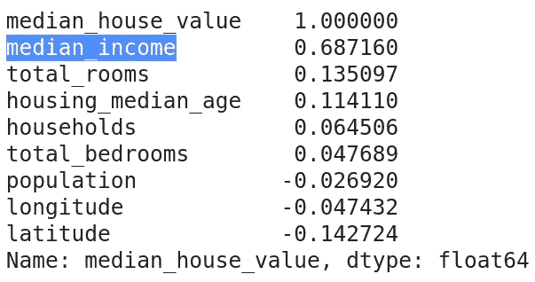

# 如何创建代表性的测试集

> 原文：<https://towardsdatascience.com/how-to-create-a-representative-test-set-f0aa56adaf35?source=collection_archive---------19----------------------->

## 使用有代表性的测试数据集**，满怀信心地评估您的模型的性能。**


图片来自 [Pixabay](https://pixabay.com/?utm_source=link-attribution&utm_medium=referral&utm_campaign=image&utm_content=2638326) 的 [andrasgs](https://pixabay.com/users/andrasgs-6162446/?utm_source=link-attribution&utm_medium=referral&utm_campaign=image&utm_content=2638326)

将数据集分割成*训练*和*测试*集通常是机器学习流水线中的第一个处理步骤之一。在这一点上，只有一个不可侵犯的规则:搁置测试数据分割，只有当您的模型准备好进行最终评估时才再次引用它。但是，有没有一种方法可以让我们确信我们所做的拆分是正确的呢？我们如何确定测试集代表我们的总体？

> 我们必须确保测试集非常接近我们人口的复杂性。我们的验证集也是如此。

在这个故事中，我们讨论两种分裂方法:随机抽样和分层抽样。我们考虑它们的优点，并讨论在特定情况下使用哪一种。这个故事实际上是我发表的关于优秀的[实践机器学习的笔记，作者是 Aurélien Géron，作者是 Scikit-Learn、Keras 和 TensorFlow:构建智能系统的概念、工具和技术](https://www.amazon.com/Hands-Machine-Learning-Scikit-Learn-TensorFlow/dp/1492032646)。

> [学习率](https://www.dimpo.me/newsletter)是我每周给那些对 AI 和 MLOps 世界好奇的人发的简讯。你会在每周五收到我关于最新人工智能新闻、研究、回购和书籍的更新和想法。在这里订阅！

# 数据集

对于这个例子，我们使用 [*加州房价*](https://www.kaggle.com/camnugent/california-housing-prices) 数据集。这个数据集对于入门教程来说是极好的，因为它熟悉的性质、很少丢失的值、适度的大小和明确的目标。

该数据集基于 1990 年加州人口普查的数据。任务是在给定一组特征(如房龄、总房间数等)的情况下，预测特定地区房屋的*中值*。).目标变量或因变量(即中值房价)是一个数值。因此，我们有一个回归任务要处理。

数据集的特性是不言自明的，但是让我们使用`pandas`加载 CSV 文件并查看前五行。


我们可以执行更多的方法来获得对数据的感觉，如`df.info()`或`df.describe()`，而每个数值实例的简单直方图——使用`df.hist()`方法——会给我们手中的信息提供更好的图片。但是，由于这不是本文的范围，让我们进入下一步，即将数据集分成训练集和测试集。

# 随意采样

理论上，创建一个测试集确实很容易；只需随机选择几行——通常是整个数据集的 10%或 20%——并将它们保存在一个新的单独的数据帧中。此外，为了可再现性，我们可以设置一个`random_state`数，这样每次我们运行一个实验，都会得到相同的测试集。这也有助于直接比较不同的方法，因为我们选择的每个算法都是在同一个测试集上评估的。

接下来，我们使用由 [Scikit 提供的一个方便的方法——Learn](https://scikit-learn.org/)命名为`train_test_split()`。该方法接受列表、numpy 数组、scipy 稀疏矩阵或 pandas 数据帧。我们还应该提供默认的分割百分比`None`和一个`random_state`数字。

我们可以看到该方法返回了一个`tuple`，我们可以将它直接解包成一个训练和一个测试集。因为我们将一个数据帧传递给该方法，所以得到的训练集和测试集也是数据帧。请记住，默认情况下，该方法首先打乱数据集，然后将其拆分。为了避免这种行为，我们可以将`shuffle`属性设置为`False`。

> 通常，如果数据集足够大(特别是相对于属性的数量)，随机分割就足够了。但如果不是这样，随机分裂可能会引入显著的采样偏差。

```
train_set, test_set = train_test_split(df, test_size=.2, random_state=42, shuffle=False)
```

我们现在有一个随机生成的测试集来评估我们的模型。但是这有什么好处吗？**是否代表总体？** **嗯，看情况。通常，如果数据集足够大(特别是相对于属性的数量)，随机分割就足够了。但如果不是这样，随机分裂可能会引入显著的采样偏差。因此，让我们来看看如何解决这个问题。**

# 分层抽样

假设我们正在美国进行一项调查，记录一个特定州的教育水平和收入中位数。如果我们只询问生活在昂贵地区的人，我们肯定会在样本中引入明显的偏见。因此，我们需要一种方法来选择任何经济地位的人，粗略地接近相应的人口分布。

在我们的例子中，让我们首先检查是否有一个变量与我们的目标变量高度相关。使用`pandas.corr()`方法很容易做到这一点。

我们将因变量的结果按降序排列，我们得到`median_income`与`median_house_value`有很强的正相关性。这肯定是意料之中的事情。



似乎以分层的方式分割数据集，使用`median_income`作为类别标签是一个好主意。首先，让我们创建一个新的变量，为这个属性创建类标签。

`pd.cut`将根据我们指定的分类创建五个类别，并将它们保存在一个新变量中，我们将其命名为`income_cat`用于收入类别。我们现在准备以分层的方式分割我们的数据集。

唯一的变化是我们现在用一个类似数组的对象设置了`train_test_split()`方法的`stratify`参数，该对象设置了标签类。还有另一种更复杂的方法，在下面的代码示例中指定，用于遗留目的。

无论如何，让我们看看我们做得怎么样。我们将在完整的数据集以及测试样本中检查每个收入类别的比率。

让我们并排比较两个结果。


可以看出我们很亲近。微小的差异真的微不足道。我们现在有了一个测试集，它遵循人口中收入类别的分布！

# 结论

创建测试集并不总是那么简单。我们必须确保测试集非常接近我们人口的复杂性。我们的验证集也是如此。例如，检查 Scikit-Learn 提供的`[StratifiedKFold()](https://scikit-learn.org/stable/modules/generated/sklearn.model_selection.StratifiedKFold.html#sklearn.model_selection.StratifiedKFold)`方法。

在这个故事中，我们看到了如何以分层的方式将数据集随机分为训练集和测试集。我们使用 Scikit-Learn 库在 Python 中实现了相应的解决方案。最后，我们提供了每种方法的细节和优点，以及何时使用每种方法的简单实用规则。

> [学习率](https://www.dimpo.me/newsletter)是我每周给那些对 AI 和 MLOps 世界好奇的人发的简讯。你会在每周五收到我关于最新人工智能新闻、研究、回购和书籍的更新和想法。订阅[这里](https://www.dimpo.me/newsletter)！

***我叫 Dimitris Poulopoulos，是希腊比雷埃夫斯大学的机器学习研究员***[***BigDataStack***](https://bigdatastack.eu/)***和博士(c)。我曾为欧洲委员会、欧盟统计局、国际货币基金组织、欧洲中央银行、经合组织和宜家等主要客户设计和实施人工智能和软件解决方案。如果你有兴趣阅读更多关于机器学习、深度学习和数据科学的帖子，请在 twitter 上关注我的*** [***中***](https://medium.com/@dpoulopoulos) ***，***[***LinkedIn***](https://www.linkedin.com/in/dpoulopoulos/)***或***[***@ james2pl***](https://twitter.com/james2pl)******