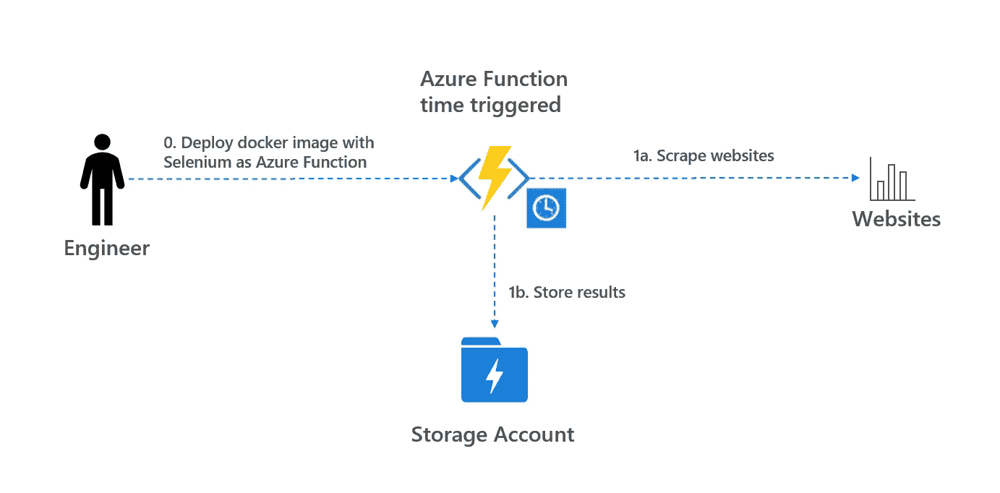
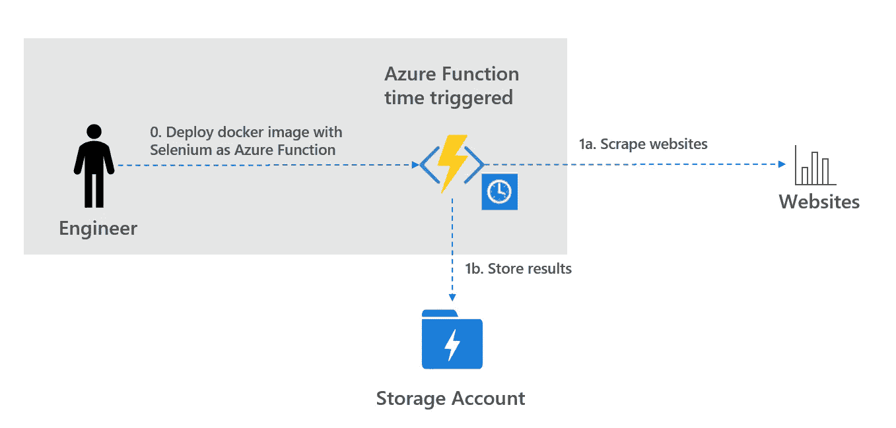
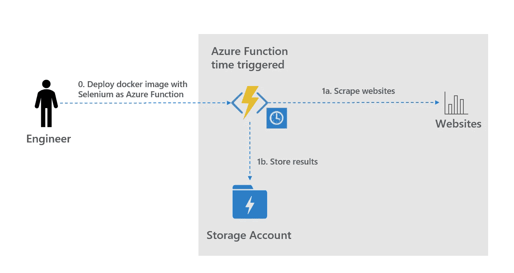
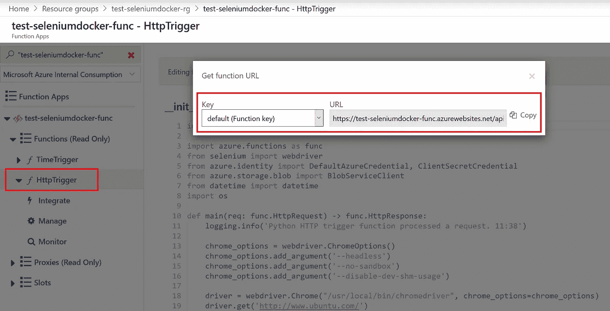
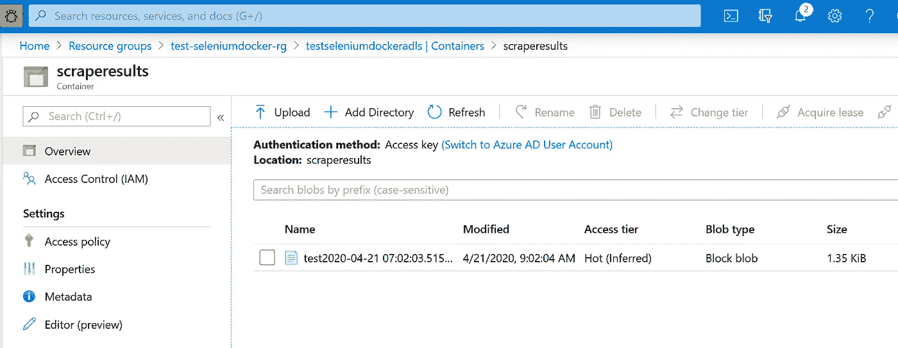

# 如何在 Azure 函数中创建 Selenium web scraper

> 原文：<https://towardsdatascience.com/how-to-create-a-selenium-web-scraper-in-azure-functions-f156fd074503?source=collection_archive---------4----------------------->

## *了解如何使用自定义 docker 图像创建 Azure 函数，并将其作为 Python 中的 lenium web scraper*

# A.介绍

Selenium 是自动化 web 浏览器测试的标准工具。最重要的是，Selenium 是一个流行的[网页抓取工具](https://medium.com/the-andela-way/introduction-to-web-scraping-using-selenium-7ec377a8cf72)。在 Azure 中创建 web scraper 时，Azure Functions 是运行代码的理想选择。然而，默认的 Azure Functions 映像不包含 Selenium 所需的依赖项。在这篇博客中，Azure Functions 中的 web scraper 创建如下:

*   使用 Selenium 创建并部署 docker 映像作为 Azure 函数
*   定期抓取网站并存储结果

***更新 2022–08–13:使用最新版本的 Azure Functions，Python 3.10 成功部署代码。Git 回购和博客是最新的。***

web scraper 的架构如下所示。



A.构建 Selenium web scaper 的架构(图片由作者提供)

在剩下的部分，我们将讨论在 Azure Functions 中部署和运行 web scraper 的步骤。关于如何保护你的 Azure 功能的详细信息，请看这个博客。有关如何在 Azure 函数中使用 OpenCV 创建自定义 docker 映像的详细信息，请参见此处的[和此处](/intelligent-realtime-and-scalable-video-processing-in-azure-201f87104f03)的 DockerFile [。](https://github.com/rebremer/realtime_video_processing/blob/master/AzureFunction/afpdqueue_rtv/Dockerfile)

# B0。用 Selenium 作为 Azure 函数部署 Azure 函数

基础 Azure 函数映像不包含运行 selenium webdriver 所需的 chromium 包。这个项目创建了一个定制的 docker 图像和所需的库，这样它就可以作为 Azure 函数运行。执行以下步骤:

*   B01。安装必备组件
*   B02。从 GIT 克隆项目
*   B03。使用 docker 桌面创建 docker 图像
*   B04。创建 Azure 函数并部署 docker 映像

另请参见下面的架构。



B0。运行 Selenium 的 Azure 函数(图片由作者提供)

## B01。安装依赖项

需要安装以下先决条件:

*   [Docker 桌面](https://docs.docker.com/get-docker/)
*   [Azure CLI](https://docs.microsoft.com/en-us/cli/azure/install-azure-cli?view=azure-cli-latest)
*   [Azure 核心工具版本 2.x](https://docs.microsoft.com/en-us/azure/azure-functions/functions-run-local?tabs=windows%2Ccsharp%2Cbash#v2)
*   [(可选)Visual Studio 代码](https://code.visualstudio.com/)
*   (可选) [Azure 容器注册中心](https://docs.microsoft.com/nl-nl/azure/container-registry/container-registry-get-started-portal)(也可以使用 docker hub)

## B02。使用 docker 桌面创建 docker 图像

运行下面的命令从 git 克隆项目。如果您没有安装 git，也可以下载并解压缩 zip 文件。

```
git clone [https://github.com/rebremer/azure-function-selenium.git](https://github.com/rebremer/azure-function-selenium.git)
```

在此项目中，可以找到以下文件:

*   TimeTrigger/__init__。py: Python 文件，包含抓取网站的所有代码。这个 Azure 函数是时间触发的
*   HttpTrigger/__init__。py:与前面的项目符号相同，但是，这是 HTTP 触发的函数，可以从浏览器运行..
*   DockerFile:包含所有命令的文件，用于创建将在下一步中使用的 Docker 映像

## B03。使用 docker 桌面创建 docker 图像

运行以下命令，在 Azure 函数基础映像上安装 chrome、chrome 驱动程序和 selenium。命令可以在 Visual Studio 终端或 PowerShell 终端中运行。对于<<username>>、<<password>>，您需要获取可以在访问键选项卡中找到的容器注册中心的凭证。</password></username>

```
# Variables
$acr_id = "<<your acr>>.azurecr.io"# Create docker image using docker desktop
docker login $acr_id -u <<your username>> -p <<your password>>
docker build --tag $acr_id/selenium .# Push docker image to Azure Container Registry
docker push $acr_id/selenium:latest
```

## B04。创建 Azure 函数并部署 docker 映像

运行以下命令创建一个 Azure 函数，并从 Azure Container Registry 部署 docker 映像。

```
# Variables
$rg = "<<your resource group name>>"
$loc = "<<your location>>"
$plan = "<<your azure function plan P1v2>>"
$stor = "<<your storage account adhering to function>>"
$fun = "<<your azure function name>>"
$acr_id = "<<your acr>>.azurecr.io"# Create resource group, storage account and app service plan
az group create -n $rg -l $loc
az storage account create -n $stor -g $rg --sku Standard_LRS
az appservice plan create --name $plan --resource-group $rg --sku P1v2 --is-linux# Create Azure Function using docker image
az functionapp create --resource-group $rg --os-type Linux --plan  $plan --deployment-container-image-name $acr_id/selenium:latest --name  $fun --storage-account $stor --docker-registry-server-user <<your acr user>> --docker-registry-server-password <<your acr password>>
```

# B1。抓取网站并存储结果

上一步部署的 Azure 函数包含一个时间触发函数和一个 HTTP 触发器函数。在这一部分，该功能将被触发，刮网站和存储结果到一个数据湖帐户。执行以下步骤:

*   B11。创建数据湖帐户
*   B12。运行 HTTP 触发器功能

另请参见下面的架构。



B1_1。抓取网站(作者图片)

## B11。创建数据湖帐户和更新功能

执行以下命令在 Azure 中创建一个数据湖帐户，并更新函数的设置。

```
# Variables
$rg = "<<your resource group name>>"
$fun = "<<your azure function name>>"
$adls = "<<your storage account>>"
$sub_id = "<<your subscription id>>"
$container_name = "scraperesults"# Create adlsgen2
az storage account create --name $adls --resource-group $rg --location $loc --sku Standard_RAGRS --kind StorageV2 --enable-hierarchical-namespace true
az storage container create --account-name $adls -n $container_name# Assign identity to function and set params
az webapp identity assign --name $fun --resource-group $rg
az functionapp config appsettings set --name $fun --resource-group $rg --settings par_storage_account_name=$adls par_storage_container_name=$container_name# Give fun MI RBAC role to ADLS gen 2 account
$fun_object_id = az functionapp identity show --name $fun --resource-group $rg --query 'principalId' -o tsv
New-AzRoleAssignment -ObjectId $fun_object_id -RoleDefinitionName "Storage Blob Data Contributor" -Scope  "/subscriptions/$sub_id/resourceGroups/$rg/providers/Microsoft.Storage/storageAccounts/$adls/blobServices/default"
```

## B12。运行功能

时间触发功能将定期运行，以抓取网站。但是，还有一个 HTTP 触发的功能。获取 URL 后，可以在浏览器中复制并运行它，另请参见下文。



B12_1。运行 HTTP 触发功能(图片由作者提供)

运行该函数后，结果将存储在 data lake 帐户中，另见下文。



B12_2。存储在 ADLSgen2 帐户中的抓取结果(图片由作者提供)

# C.结论

Selenium 是一个流行的网络抓取工具。然而，默认的 Azure Functions 映像不包含 Selenium 所需的依赖关系。在这篇博客中，Azure Functions 中创建了一个 web scraper 来安装这些依赖项，如下所示:

*   使用 Selenium 创建并部署 docker 映像作为 Azure 函数
*   定期抓取网站并存储结果

web scraper 的架构如下所示。


C.构建 Selenium web scaper 的架构(图片由作者提供)