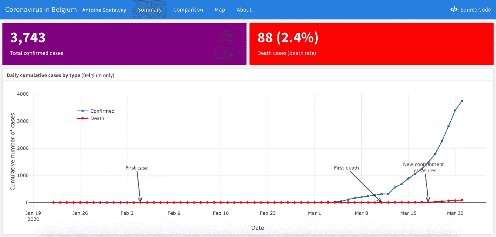
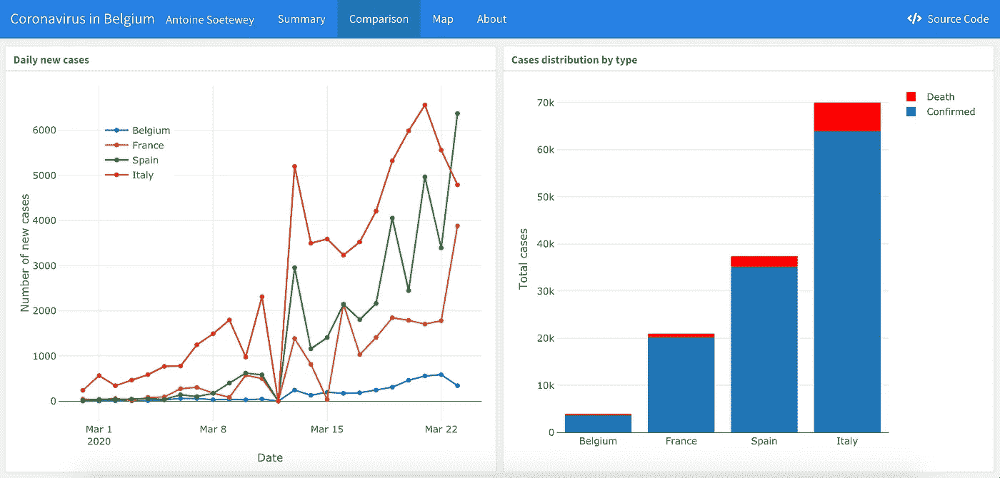
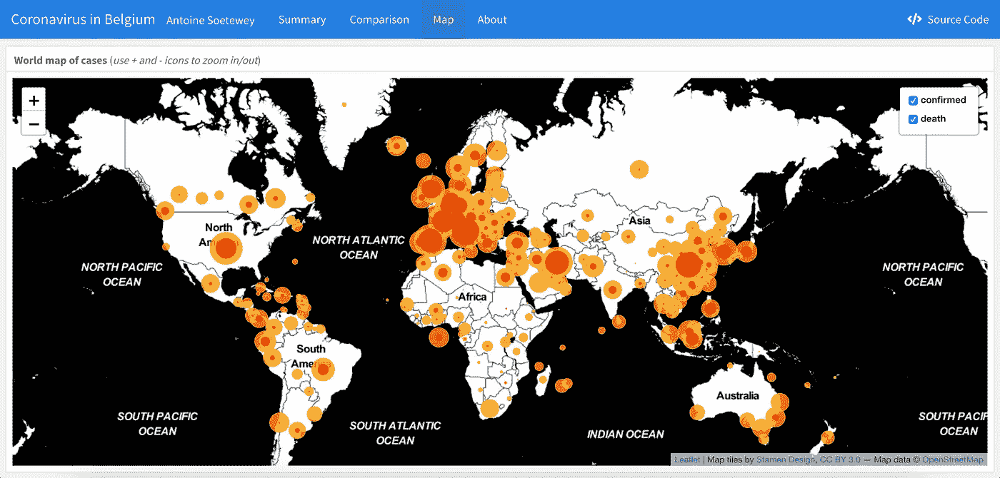
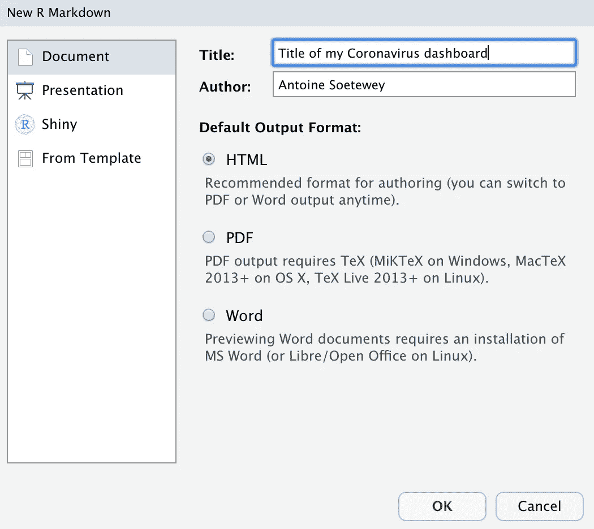

# 如何创建一个简单的冠状病毒仪表板具体到您的国家在 R

> 原文：<https://towardsdatascience.com/how-to-create-a-simple-coronavirus-dashboard-specific-to-your-country-in-r-732f87a9965f?source=collection_archive---------26----------------------->

## 了解如何在有限的时间内用 R 构建自己的冠状病毒仪表板。



# 介绍

新型新冠肺炎冠状病毒是目前最热门的话题。每天，媒体和报纸都在分享几个国家的新增病例和死亡人数，试图衡量病毒对公民的影响，并提醒我们呆在家里以保持安全。每个人都在谈论冠状病毒。

除了政府、媒体和公司在讨论这个问题之外，数据科学家和数据专业人员也在用他们的知识和时间为病毒服务。这导致应用程序、仪表盘、博客帖子、视频、数据集和代码的激增，以这样或那样的方式分析新冠肺炎的扩张及其如何在人群中传播。

# 冠状病毒的顶级资源

作为一名数据爱好者，我发现了大量关于冠状病毒的资源。然而，这些资源遍布互联网，并且通常被另一种类型的大量信息所隐藏(例如，令人担忧的头条新闻、受感染名人的姓名、炫耀他们如何帮助卫生保健机构的公司等)。).为了解决这个问题，我在之前的一篇文章[中收集并分享了我遇到的关于冠状病毒](https://www.statsandr.com/blog/top-r-resources-on-covid-19-coronavirus/)的最佳资源。

注意，本文只分享 R 上的资源，因为 R 是我最喜欢的统计程序，也是我最熟悉的程序。事实上，我几乎每天都使用这个程序，这让我更容易意识到资源背后的复杂性和时间，并欣赏它的质量和潜力。我确信网上还有其他非常有趣的资源(例如约翰·霍普金斯冠状病毒资源中心的[最受欢迎的仪表板](https://coronavirus.jhu.edu/map.html))。尽管如此，许多人比我更有资格来评判用我不擅长的编程语言制作的资源的质量。

这篇[文章](https://www.statsandr.com/blog/top-r-resources-on-covid-19-coronavirus/)让我发现了这么多关于冠状病毒的伟大资源，我不断收到来自世界各地科学家的数据可视化和数据分析，因此我将它们纳入了收集范围。正因如此，它不断提高了系列的质量和完整性。

除了接收 R 资源，读者经常问的一个问题是“我怎样才能自己创建一个仪表板？”或者“我如何构建一个特定于我所在国家的仪表板？”。因此，我认为，如果我创建一个针对我的国家(比利时)的仪表板，并详细说明如何创建它的步骤，会对一些人有所帮助。

关于如何开发这样的仪表板的问题大多来自 R 初学者，因为高级 R 用户很可能知道如何做，或者至少可以很容易地使用我在这里收集的资源作为他们自己工作的灵感来源。此外，为了应对对冠状病毒的狂热，感兴趣的用户非常着急，希望尽快拥有自己的仪表盘。

这些问题让我产生了创建一个简单的**仪表盘**的想法，而不是一个[闪亮的应用](https://www.statsandr.com/tags/shiny)。闪亮的应用程序的优势在于它们是交互式的，用户可以通过以用户友好的方式简单地改变一些输入来编辑输出和可视化，而仪表板是静态的，最终用户不能修改。另一方面，仪表板相对于闪亮应用的优势在于它更容易编码，尤其是如果你已经精通 [R Markdown](https://www.statsandr.com/blog/getting-started-in-r-markdown) 的话。

# 冠状病毒仪表板:比利时的案例

在我到目前为止看到的所有可视化中，有一个因其简单性而突出，同时也因其完整性和可视化的质量而突出。因此，我决定在 Rami Krispin 已经存在的[仪表板](https://ramikrispin.github.io/coronavirus_dashboard/)的基础上创建一个冠状病毒仪表板(它带有一个允许自由修改和共享的许可证)，并对其进行修改，使其适用于比利时。请注意，我还从最初的仪表板中删除了一些可视化和表格，以保持其简单明了。

在进一步阅读之前，这里是我的[冠状病毒仪表板](https://www.antoinesoetewey.com/files/coronavirus-dashboard.html)适应比利时和以下主要部分的预览:



仪表板分为几个部分，可以在顶部选择:

*   摘要部分提供了关于冠状病毒的关键指标(总病例数、活跃病例数和死亡数)，以及一个显示从 2020 年 1 月 22 日到最近可用日期的活跃病例数和死亡数的图表。
*   “比较”部分显示了与其他欧洲国家(您也可以通过在代码中替换它们来更改这些国家)的每日新病例数(左图)和病例类型分布(右图)的比较。
*   地图部分显示了确诊病例和死亡病例的世界地图。您可以取消选中一种或多种类型的案例(右上角)并放大或缩小(左上角)以使地图适应您的需求。
*   “关于”部分提供了有关数据、仪表板总体情况以及更新频率的更多信息。

我相信这个简单的仪表板很容易适应任何国家(以及从初学者到专家的任何人)，并且仍然可以通过一些可视化来传达关于病毒的关键措施。值得一提的是，所有的图都是用`{plotly}`包生成的。这个软件包允许通过显示额外的相关信息来增强情节。).

# 如何创建自己的冠状病毒仪表板

如果您想构建自己的特定于某个国家的仪表板，请遵循以下步骤:

1.  打开仪表板[这里](https://www.antoinesoetewey.com/files/coronavirus-dashboard.html)
2.  通过位于仪表盘右上角的“源代码”按钮查看完整代码，或者查看 [GitHub](https://github.com/AntoineSoetewey/coronavirus_dashboard) 上的代码。复制代码。
3.  打开一个新的 R Markdown 文件(`.Rmd`)，输入任何标题和作者(反正在下一步都会被替换)，选择 HTML 作为输出格式，点击 OK:



4.删除已经存在的所有模板代码，并粘贴您在步骤 1 中复制的代码。

5.确保安装了所需的软件包:

```
install.packages(c("devtools", "flexdashboard", "leaflet", "leafpop"))
devtools::install_github("RamiKrispin/coronavirus", force = TRUE)
```

如果 R 问你想更新哪个包，应该没有必要更新它们:键入 3 表示“无”。

6.在代码中，将`Belgium`替换为您的国家。以下是数据集中所有可用国家的列表:

*阿富汗*，*阿尔巴尼亚*，*阿尔及利亚*，*安道尔*，*安哥拉*，*安提瓜和巴布达*，*阿根廷*，*亚美尼亚*，*奥地利*，*阿塞拜疆*，*巴哈马*，*巴林*，*孟加拉* *波黑*，*巴西*，*文莱*，*保加利亚*，*布基纳法索*，*Cabo*，*柬埔寨*，*喀麦隆*，*佛得角*，*中非共和国*，*乍得*，*智利【T61 *克罗地亚*，*古巴*，*塞浦路斯*，*捷克*，*吉布提*，*多米尼加*，*多米尼加*，*东帝汶*，*厄瓜多尔*，*埃及*，*萨尔瓦多【T93 *冈比亚*，*格鲁吉亚*，*德国*，*加纳*，*希腊*，*格林纳达*，*危地马拉*，*几内亚*，*圭亚那*，*海地*， **以色列*，*意大利*，*牙买加*，*日本*，*约旦*，*哈萨克斯坦*，*肯尼亚*，*韩国*，*科索沃*，*科威特*，*吉尔吉斯斯坦 *马耳他*，*马提尼克*，*毛里塔尼亚*，*毛里求斯*，*墨西哥*，*摩尔多瓦*，*摩纳哥*，*蒙古*，*黑山*，*摩洛哥*，*莫桑比克 **阿曼*，*巴基斯坦*，*巴拿马*，*巴布亚新几内亚*，*巴拉圭*，*秘鲁*，*菲律宾*，*波兰*，*葡萄牙*，*卡塔尔*， **塞尔维亚*，*塞舌尔*，*新加坡*，*斯洛伐克*，*斯洛文尼亚*，*索马里*，*南非*，*西班牙*，*斯里兰卡*，*苏丹*， **突尼斯*，*土耳其*，*乌干达*，*乌克兰*，*阿联酋*，*乌拉圭*，*乌兹别克斯坦*，*委内瑞拉*，*越南*，*赞比亚*，********

请注意，如果您的国家/地区由两个或更多单词组成，您需要用反勾号将其括起来(但只能在代码中的一个特定行上，请参见英国的示例):

```
#----------------------------------------
# Plotting the datadaily_confirmed %>%
  plotly::plot_ly() %>%
  plotly::add_trace(
    x = ~date,
    y = ~`United Kingdom`,
    type = "scatter",
    mode = "lines+markers",
    name = "United Kingdom"
  ) %>%
```

不要在代码的其余部分添加反勾号，因为其他地方的国名都用双引号`""`括起来。

不要忘记更改文档顶部的标题和作者，并编辑文档底部的“关于”部分。最后但同样重要的是，正如你在摘要部分的图上看到的，箭头指向比利时不同的(sad)“里程碑”(即首例、首例死亡和新的遏制措施)。您需要为您的国家修改这些里程碑(如果您不想在图上显示任何里程碑，则删除它们)。在`plotly::add_annotations()`函数之后的代码中对此进行更改。

7.编织文档(如果您不熟悉 R Markdown，请参见此[文章](https://www.statsandr.com/blog/getting-started-in-r-markdown))。您的仪表板应该以 HTML 格式出现。

按照这 7 个步骤，您应该已经有了一个针对您所在国家的简单仪表板。我有意让它保持简单，这样每个人都可以在有限的时间内复制它并拥有自己的仪表板。

如果您熟悉用于仪表板界面和可视化的`[{flexdashboard}](https://rmarkdown.rstudio.com/flexdashboard/)`、`[{plotly}](https://plot.ly/r/)`和`[{leaflet}](https://rstudio.github.io/leaflet/)`包，以及用于数据操作的`[{dplyr}](https://dplyr.tidyverse.org/)`和`[{tidyr}](https://tidyr.tidyverse.org/)`包，请根据您的需要随意编辑代码并改进您的仪表板。

# 附加注释

# 数据

这个仪表板的输入数据是从`[{coronavirus}](https://github.com/RamiKrispin/coronavirus)` R 包中获得的数据集。确保下载软件包的开发版本，以获得最新数据:

```
install.packages("devtools")
devtools::install_github("RamiKrispin/coronavirus")
```

要用最新的数据更新您的仪表板，您必须通过用`devtools::install_github("RamiKrispin/coronavirus", force = TRUE)`重新安装`{coronavirus}`包来手动更新数据。同样，如果 R 问你是否想更新其他包，输入 3 表示“无”。

这个问题经常被提出，所以我重复一遍，你的仪表盘不会每天自动更新，你需要手动更新。更新数据后，您可能还需要重新启动 R 会话，以便获得最新的可用数据。

原始数据来自约翰·霍普金斯大学系统科学与工程中心(JHU·CCSE)的冠状病毒[库](https://github.com/RamiKrispin/coronavirus-csv)。

# 开放源码

这个仪表盘和 [GitHub](https://github.com/AntoineSoetewey/coronavirus_dashboard) 上的代码都是开源的，所以你可以随意复制、改编和分享。

# 准确(性)

请注意，该仪表板主要用于教育目的。我尽可能频繁地更新仪表板，以保持其准确性。然而，关于新冠肺炎病例数存在一些不确定性，并且检测方法因国家而异，因此该仪表板上的数字与其他来源相比可能略有不同。目前，[数据集](https://www.statsandr.com/blog/how-to-create-a-simple-coronavirus-dashboard-specific-to-your-country-in-r/#data)的维护者每天都会更新它，但是将来更新的频率可能会降低。

# 发布您的仪表板

如果您想要共享您的仪表板，您可以:

*   如果你有，把它上传到你的网站上(如果你还没有，我强烈建议你创建一个)
*   通过 [RPubs](https://rpubs.com/) 发布(直接从 RStudio 发布你的作品是免费且容易的)

感谢阅读。我希望这篇文章能帮助你在 R 中建立你的第一个冠状病毒仪表板。如果你需要灵感来进一步增强你的仪表板，请查看这些关于冠状病毒的顶级 R 资源。

和往常一样，如果您有与本文主题相关的问题或建议，请将其添加为评论，以便其他读者可以从讨论中受益。

**相关文章:**

*   [比利时的新冠肺炎](https://www.statsandr.com/blog/covid-19-in-belgium/)
*   [关于新型新冠肺炎冠状病毒的前 25 个 R 资源](https://www.statsandr.com/blog/top-r-resources-on-covid-19-coronavirus/)
*   [如何手工进行单样本 t 检验，并对一个均值进行 R:检验](https://www.statsandr.com/blog/how-to-perform-a-one-sample-t-test-by-hand-and-in-r-test-on-one-mean/)
*   [每个数据科学家都应该知道的概率中的 9 个概念和公式](https://www.statsandr.com/blog/the-9-concepts-and-formulas-in-probability-that-every-data-scientist-should-know/)
*   [学生的 R 和手工 t 检验:如何在不同场景下比较两组](https://www.statsandr.com/blog/student-s-t-test-in-r-and-by-hand-how-to-compare-two-groups-under-different-scenarios/)

1.  如果有人愿意用这种编程语言创建一个关于冠状病毒的资源集合，我会很高兴提到 Python 资源集合。如果是这种情况，请随时[联系我](https://www.statsandr.com/contact/)。 [↩](https://www.statsandr.com/blog/how-to-create-a-simple-coronavirus-dashboard-specific-to-your-country-in-r/#fnref1)

*原载于 2020 年 3 月 23 日 https://statsandr.com*[](https://statsandr.com/blog/how-to-create-a-simple-coronavirus-dashboard-specific-to-your-country-in-r/)**。**