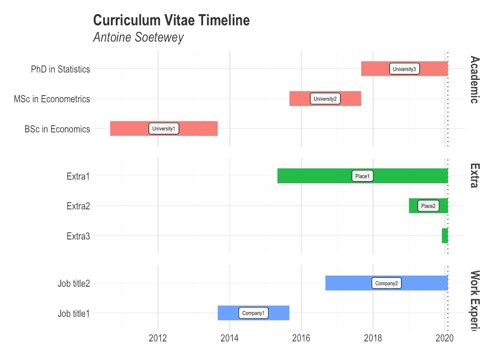

# 如何在简历中创建一个时间线

> 原文：<https://towardsdatascience.com/how-to-create-a-timeline-of-your-cv-in-r-2528abaeb8db?source=collection_archive---------22----------------------->

## 简历时间线说明了你的教育、工作和额外活动的关键信息。

照片由[hello queue](https://unsplash.com/@helloquence?utm_source=medium&utm_medium=referral)拍摄

# 介绍

在这篇文章中，我将展示如何在简历中创建一份简历时间表。简历时间表展示了你的教育、工作经历和额外活动等关键信息。与普通简历相比，简历时间线的主要优势在于，它们通过视觉上的吸引力和更容易浏览，让你立刻脱颖而出。它还可以让你更好地展示你的“故事”,展示你的工作和活动的年表，从而解释你是如何走到今天的。(它也可以是你作品集的一部分，展示你的 R 技能。)

下面我们用一个最小的可重复的例子来展示如何在 R 中创建这样的 CV。请随意使用代码，并根据您的需要进行调整。更完整的例子(连同代码)你可以在这里查看我自己的 CV 时间轴。

请注意，我是在阅读了 Bernardo Lares 的这篇[原帖](https://datascienceplus.com/visualize-your-cvs-timeline-with-r-gantt-style/)之后写的这篇文章，特别是他的包，即`[{lares}](https://github.com/laresbernardo/lares)` [包](https://github.com/laresbernardo/lares)。特别感谢他的惊人工作，他的工作被用来创建一个稍微修改过的版本的`[plot_timeline()](https://github.com/laresbernardo/lares/blob/master/R/other_plots.R#L19)`函数！

# 最小可重复示例

下面是一个最小可重现示例的代码和结果:

# 如何个性化它

如果你想用你自己的学术、额外和工作经验来编辑这个例子，你基本上只需要编辑上面代码中名为`cv`的数据框架。数据集`cv`的每一行都是不同的学术项目、工作或活动。各行应包括:

*   学术项目、职称或活动的名称
*   大学、学校、公司或工作场所的名称
*   类别:学术、工作经验或额外
*   开始日期(日期必须采用`yyyy-mm-dd`的格式)
*   结束日期。如果角色尚未结束，请键入`today`而不是日期。通过使用`today`,您的简历时间线将自动适应今天的日期

如果要添加或删除角色，请在数据框架中添加或删除一行。如果您不想指定任何工作场所，请注明`NA`(如同对`Extra3`所做的那样)。最后，不要忘记在代码末尾的时间线副标题中用你的名字替换我的名字。

有经验的 R 用户不妨根据自己的需求编辑`plot_timeline2`功能。然而，如果你对这个例子的模板和设计感到满意，你只需要改变上面提到的东西。

# 附加说明

除了直接在脚本中根据您的角色编辑代码，您还可以创建一个包含所需数据(职位、工作场所、类型、开始日期、结束日期)的 Excel 文件，然后[将其导入 R](https://www.statsandr.com/blog/how-to-import-an-excel-file-in-rstudio/) 。编辑 Excel 文件更容易，也不容易出现编码错误。此外，如果您的职业生涯很长，代码可能会变得很长，而如果您导入 Excel 文件，它将始终保持简短和简洁。

感谢阅读。我希望这篇文章能帮助你在简历中建立一个时间表。如果你想看一个更完整和生动的例子，请看[我的时间表简历](https://www.antoinesoetewey.com/files/CV_timeline_antoinesoetewey.html)。

和往常一样，如果您有与本文主题相关的问题或建议，请将其添加为评论，以便其他读者可以从讨论中受益。

特别感谢 Job N Nmadu 教授关于创建保存数据的文件的建议。

**相关文章:**

*   [安装和加载 R 包的有效方法](https://www.statsandr.com/blog/an-efficient-way-to-install-and-load-r-packages/)
*   我的数据符合正态分布吗？关于最广泛使用的分布以及如何检验 R 中的正态性的注释
*   [R 中的 Fisher 精确检验:小样本的独立性检验](https://www.statsandr.com/blog/fisher-s-exact-test-in-r-independence-test-for-a-small-sample/)
*   [R 中独立性的卡方检验](https://www.statsandr.com/blog/chi-square-test-of-independence-in-r/)

*原载于 2020 年 1 月 26 日 https://statsandr.com***。**