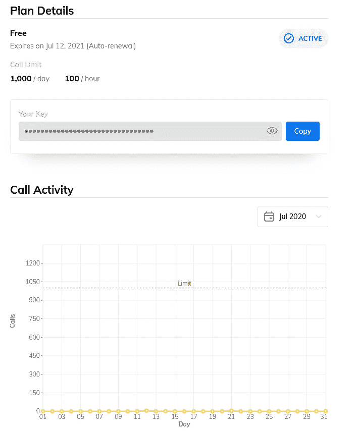
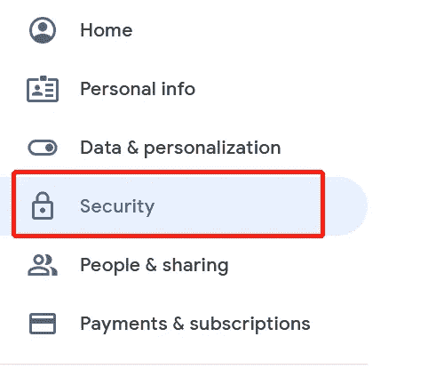
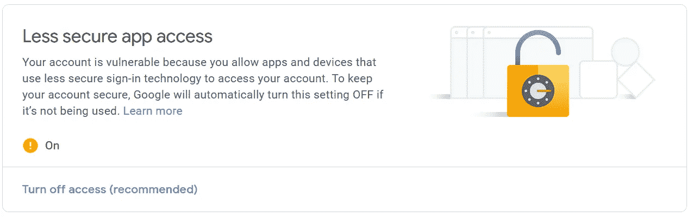
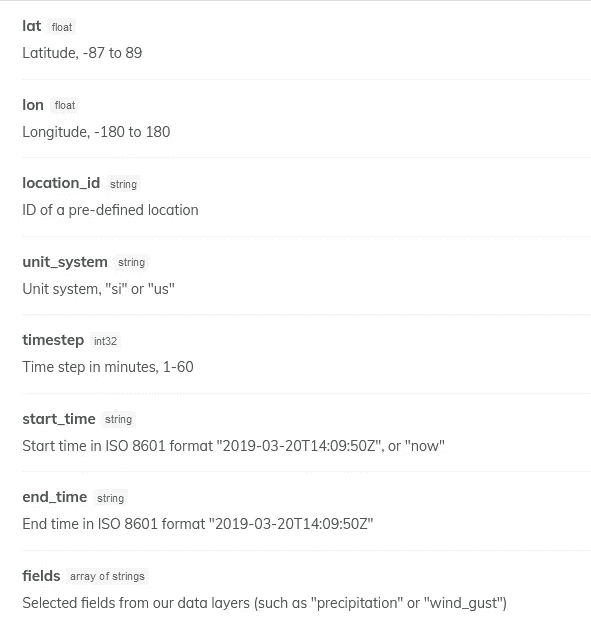
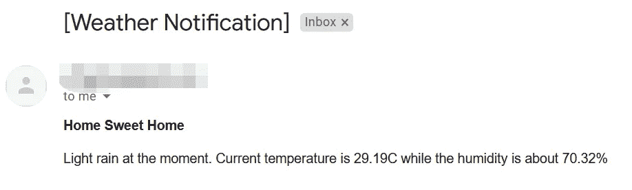
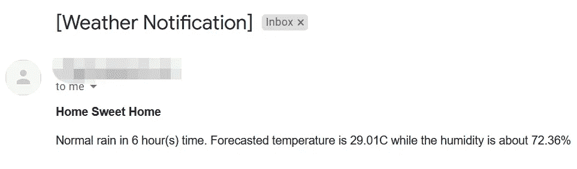

# 如何用 Python 创建天气警报系统

> 原文：<https://towardsdatascience.com/how-to-create-a-weather-alert-system-in-python-5fab4b42e49a?source=collection_archive---------15----------------------->

## 根据预测的天气数据发送电子邮件通知


Johannes Plenio 在 [Unsplash](https://unsplash.com/s/photos/weather-forecast?utm_source=unsplash&utm_medium=referral&utm_content=creditCopyText) 上拍摄的照片

通过阅读这篇文章，您将学会用 Python 创建一个天气警报系统，当它预测未来几小时内天空将下雨/下雪时，将向多个收件人发送电子邮件通知。电子邮件通知包含其他信息，如预测的温度和湿度。

本教程有 4 个部分:

1.  设置
2.  履行
3.  结果
4.  结论

让我们进行下一部分。

# 1.设置

## 天气 API

我将使用 **ClimaCell 的** [**天气 API**](https://www.climacell.co/weather-api/) 来获取天气预报数据。它提供了相当多的有用和准确的数据，取决于你的需要。

在撰写本文时，它涵盖了过去 4 周的历史气象站数据以及未来 15 天的每日预报数据。此外，您可以轻松地实现它，因为官方文档提供了 4 种不同计算机语言的参考:

*   Java Script 语言
*   红宝石
*   结节
*   计算机编程语言

一旦你注册了，你将被置于免费层，允许你每天打 1000 个电话，每小时 100 个。对于我们的用例来说，这应该足够了。

去注册一个新账户。完成后，您应该会看到下面的仪表板，其中概述了计划详情和您的通话活动。



作者图片

记下 API 键，因为我们将在后面的代码中使用它。

## 电子邮件配置

我将使用个人`Gmail`账户通过`SMTP`给自己发送电子邮件。为了使用它，您需要在帐户设置中更改配置，并打开`Less secure app access`。

转到帐户设置，点击安全菜单。



作者图片

按如下方式打开`Less secure app access`



作者图片

完成后，在项目的根目录下创建一个名为`config.ini`的新文件。它将被用作我们项目的配置文件。将以下代码追加到其中。

```
[email]
email=your_email@gmail.com
host=smtp.gmail.com
port=587
password=your_password
```

*   `email` —您的电子邮件帐户名称
*   `host`—SMTP 服务器的主机名。根据电子邮件的 smtp 服务器对此进行修改
*   `port`—SMTP 服务器的端口。根据电子邮件的 smtp 服务器对此进行修改
*   `password` —您的电子邮件帐户的密码。确保不要将此文件或信息透露给其他人。

## Python 模块

对于这个项目，强烈建议创建一个虚拟环境。在终端运行以下命令安装`configparser`模块。这对于从文件中加载配置设置非常有用。

```
pip install configparser
```

让我们转到小节部分，开始编写 Python 代码。

# 2.履行

在与`config.ini`相同的目录下创建一个名为`weather_email.py`的新文件。这个文件作为我们应用程序的电子邮件模块。

## 导入

在文件顶部添加以下导入声明

```
try:
    import configparser
except:
    from six.moves import configparserimport smtplib
from email.mime.multipart import MIMEMultipart
from email.mime.text import MIMEText
import requests
```

接下来，创建一个字典，代表下雨或下雪时我们将要发送的消息。您可以基于您的用例创建您自己的映射或定制消息。

```
weather_dict = {'freezing_rain_heavy': 'Heavy rain and snow', 'freezing_rain': 'Rain and snow', 'freezing_rain_light': 'Light rain and snow', 'freezing_drizzle': 'Light drizzle and snow', 'ice_pellets_heavy': 'Heavy ice pellets', 'ice_pellets': 'Normal ice pellets', 'ice_pellets_light': 'Light ice pellets', 'snow_heavy': 'Heavy snow', 'snow': 'Normal snow', 'snow_light': 'Light snow', 'tstorm': 'Thunder storm', 'rain_heavy': 'Heavy rain', 'rain': 'Normal rain', 'rain_light': 'Light rain'}
```

## 天气 API 的设置

初始化以下变量，这些变量是我们调用天气 API 时所需要的。

```
url = "[https://api.climacell.co/v3/weather/nowcast](https://api.climacell.co/v3/weather/nowcast)"querystring = {"lat":"1.29027","lon":"103.851959","unit_system":"si","timestep":"60","start_time":"now","fields":"temp,humidity,weather_code","apikey":"xxxx"}
```

我们将调用 **nowcast API** ，它有以下可以修改的参数:



作者图片

*   `lat` —纬度，-87°至 89°
*   `lot` —经度，-180°至 180°
*   `unit_system` —单位制，“国际单位制”或“美国单位制”
*   `timestep` —以分钟为单位的时间步长，1 到 60。将`start_time`设置为 now，将`timestep`设置为 60 将返回 7 个数据点。(现在，60 分钟后，120 分钟后，…)
*   `start_time` —您可以设置自己的时间或将其初始化为现在
*   `end_time` —限制结束时间的可选参数。默认情况下，它将返回自当前时间戳起 6 小时内的数据。
*   `fields` —从提供的数据层中选择的字段(如“降水”或“阵风”)。我在本教程中使用`temp`、`humidity`和`weather_code`。
*   `apikey` —来自 **Climacell 气象 API** 仪表盘的 API 键。

## EmailSender 类

我们将创建一个名为`EmailSender`的新类，并将其初始化如下。我们利用`configparser` 模块从`config.ini`读取数据，并将其分配给相应的变量。

```
def __init__(self):
    self.cf = configparser.ConfigParser()
    self.cf.read('./config.ini')
    self.sec = 'email'
    self.email = self.cf.get(self.sec, 'email')
    self.host = self.cf.get(self.sec, 'host')
    self.port = self.cf.get(self.sec, 'port')
    self.password = self.cf.get(self.sec, 'password')
```

在名为`SendEmail`的类中创建另一个函数，它接受一个接受者参数。它接受列表而不是字符串。这允许我们向多个电子邮件地址发送相同的电子邮件通知。

```
def SendEmail(self, recipient):
```

在函数内部，用下面的代码初始化一个新的`MIMEMultipart`对象

```
title = "Home Sweet Home"msg = MIMEMultipart()
msg['Subject'] = '[Weather Notification]'
msg['From'] = self.email
msg['To'] = ', '.join(recipient)
```

## 打电话给气象 API

下一步是通过请求模块调用 API，该模块将以 json 的形式返回结果。

```
response = requests.request("GET", url, params=querystring)
result = ""json_data = response.json()
```

您可以充分利用结果并将其映射到我们在上面指定的字典，以便创建所需的通知消息。然后，用它初始化一个`MIMEText`对象，并将它附加到`MIMEMultipart`对象上。最后，调用`smtplib.SMTP`上下文管理器发送电子邮件。

```
msgText = MIMEText('<b>%s</b><p>%s</p>' % (title, result), 'html')
msg.attach(msgText)with smtplib.SMTP(self.host, self.port) as smtpObj:
    smtpObj.ehlo()
    smtpObj.starttls()
    smtpObj.login(self.email, self.password)
    smtpObj.sendmail(self.email, recipient, msg.as_string())
```

查看以下[要点](https://gist.github.com/wfng92/f5af6144053aeab514e5ff330949b112)获取完整代码。

您的根目录中应该有以下文件。

*   config.ini
*   天气 _ 电子邮件. py

您可以在任何 Python 应用程序中轻松触发电子邮件提醒功能，只要这两个文件与您调用的 Python 文件位于同一个目录中。只需根据您的用例修改导入语句。以下示例概述了在未来 6 小时内下雨或下雪时向两个收件人发送电子邮件通知的代码。

```
import weather_emailemail_obj = weather_email.EmailSender()
email_obj.SendEmail(["email@gmail.com", "email2@gmail.com"])
```

# 结果

让我们看看我运行测试时的结果。我收到一个通知，告诉我我家正在下小雨。



作者图片

雨一停，我就运行同样的代码，它预测 6 小时后还会下雨。也许我应该回去，在下雨之前把我所有的衣服从晾衣架上拿走。



作者图片

# 结论

让我们回顾一下今天所学的内容。

我们从注册获取访问天气数据的`apikey`开始，并更改`Gmail`中的安全设置以允许`Less secure app access`用于我们的教程。此外，我们还创建了一个简单的配置文件来存储电子邮件认证数据。

接下来，我们实现了一个 Python 模块，该模块将调用天气 API，并在未来 6 个小时内无论何时有雪或雨时发送电子邮件通知。

到目前为止，您应该能够基于您拥有的用例创建自己的天气警报系统。感谢您阅读这篇文章，希望在下一篇文章中再次见到您！

# 参考

1.  [如何创建天气聊天机器人](/how-to-create-a-weather-chatbot-b8ef1b1d6703)
2.  [用 Python 处理配置文件的技巧和诀窍](https://medium.com/better-programming/tips-and-tricks-for-handling-configuration-files-in-python-a9d7429aa50b)