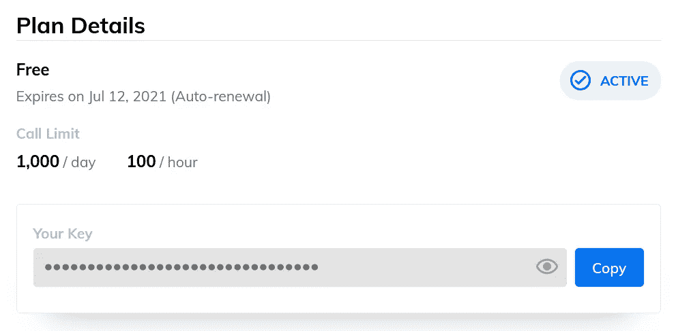
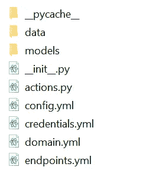
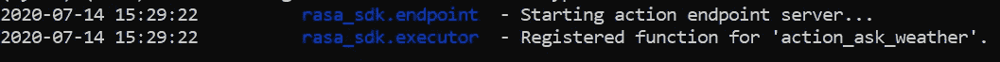
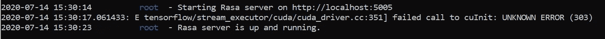
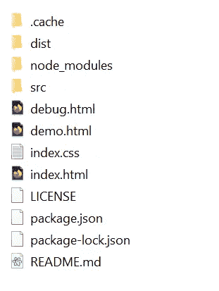
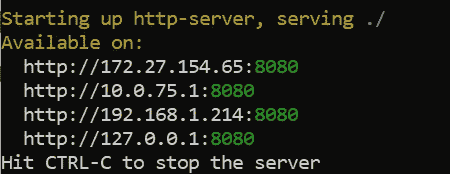
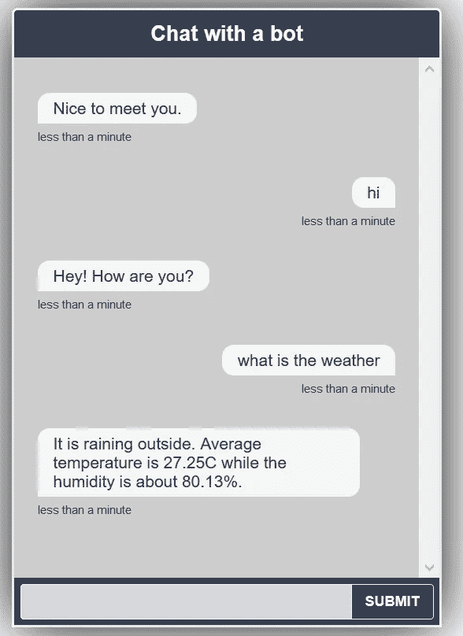

# 如何创建天气聊天机器人

> 原文：<https://towardsdatascience.com/how-to-create-a-weather-chatbot-b8ef1b1d6703?source=collection_archive---------21----------------------->

## 集成 Rasa 堆栈的 React 天气聊天机器人


达拉斯·里德在 [Unsplash](https://unsplash.com/s/photos/cloud?utm_source=unsplash&utm_medium=referral&utm_content=creditCopyText) 上拍摄的照片

通过阅读这篇文章，你将学会创建和部署你自己的天气聊天机器人。在本教程结束时，你应该有一个基本的聊天机器人，可以在用户询问时对当前的天气、温度和湿度做出适当的响应。

本教程有 4 个部分:

1.  天气 API
2.  罗砂
3.  基于 React 的聊天室组件
4.  结论

让我们进入下一部分

# 1.天气 API

为了获取天气数据，我将使用 ClimaCell 的[天气 API](https://www.climacell.co/weather-api/) 。它有一个免费层，每天最多可以打 1000 个电话，每小时 100 个电话，这对我们的使用案例来说绰绰有余。

前往登录页面并注册。登录到主页后，您应该会看到下面的仪表板。



作者图片

记住 API 键，因为我们稍后会用到它。

让我们继续下一部分，开始使用`Rasa` stack，这是一个开源的机器学习框架，用于自动化基于文本和语音的对话。

# 2.罗砂

## 装置

强烈建议您在继续安装软件包之前创建一个虚拟环境。通过以下命令安装`Rasa`。

```
pip install rasa
```

通过运行以下命令，验证您已经安装了该模块

```
pip show rasa
```

## 初始化

确保终端位于项目目录的根目录下。通过运行以下命令初始化示例数据集:

```
rasa init
```

当它提示训练时，选择`No (n)`,因为我们稍后需要再次训练它。目录中应该有以下文件。



作者图片

## 端点

取消对`endpoints.yml`中 action_endpoint 代码的注释

```
action_endpoint:
  url: "[http://localhost:5055/webhook](http://localhost:5055/webhook)"
```

## NLU

在`nlu.md`中添加一个名为`ask_weather`的新意图。提供几个里面的例子

```
## intent:ask_weather
- what is the weather now
- may i know the weather
- is it sunny outside
- is it raining now
```

## 领域

完成后，将`domain.yml`中的内容更改为以下内容。你可以在下面的[要点](https://gist.github.com/wfng92/31f59183f5618b5be4f1d2f54839589d)中找到完整的代码。

## 故事

在`stories.md`中追加以下代码。

```
## weather
* ask_weather
  - action_ask_weather
```

## 行动

如下更新`actions.py`中的代码。你可以在下面的[要点](https://gist.github.com/wfng92/87d4a2384b788de6a3ff0a834732706a)中找到完整的代码。

您需要根据您的用例为`querystring`修改一些参数。我使用了当前位置的纬度和经度。我还指定了额外的字段，如`temp`和`humidity`。请随意相应地修改它。

*   `lat` —纬度，-59.9 至 59.9
*   `lot` —经度，-180°至 180°
*   `unit_system` —单位制，“国际单位制”或“美国单位制”
*   `fields` —从提供的数据层中选择的字段(如“降水”或“阵风”)
*   `apikey` —来自 **Climacell 气象 API** 仪表盘的 API 键。

## 训练 Rasa 模型

接下来，我们将通过以下命令来训练它

```
rasa train
```

它可能需要一些时间来训练，您应该会看到一个名为 models 的新文件夹，其中包含一个以`tar.gz`结尾的文件。

## 运行 Rasa 和操作服务器

下一步是运行`Rasa Server`和`Action server`。让我们从`Action Server`开始。在现有终端中，运行以下命令启动操作服务器。它将默认为端口 5055。

```
rasa run actions
```

您应该在终端看到以下输出



作者图片

打开一个新的终端，激活同一个虚拟环境。将目录更改为与上一个终端相同的目录。运行以下命令启动服务器。默认端口是 5005。

```
rasa run --enable-api --cors "*"
```

需要`cors`以允许安全的数据传输，并防止您获得**跨源资源共享**错误。终端将显示以下输出。对于 Windows 用户，需要使用双引号来确保`CORS` 注册正确。



作者图片

让我们继续下一部分，实现天气聊天机器人的 UI。

# 3.基于 React 的聊天室组件

对于本教程，我将使用一个由`Scalableminds`团队开发的现成的 UI 框架。前往下面的 [github 库](https://github.com/scalableminds/chatroom)并将其克隆/下载到您的机器中。将其解压缩，并将所有文件放在与`Rasa`文件不同的目录中。

github 官方页面提供的说明是基于`yarn`的，但我将在本教程中使用`npm`。

确保你已经在你的机器上安装了`Node.js`。打开一个新的终端，更改到`package.json`所在的`chatroom-master`根目录。修改`package.json`中第 35 行的代码

```
"prepare": "yarn build",
```

到

```
"prepare": "npm build",
```

当且仅当您使用`npm`来安装软件包时，才需要此修改。

## 装置

接下来，运行以下命令来安装必要的模块。

```
npm install  //for npm user
yarn install //for yarn user
```

它将创建一个名为`node_modules`的新文件夹，并在其中安装所有列出的包。

在`chatroom-master`中应该有以下文件和文件夹



作者图片

## 建设

在构建文件之前，确保 Rasa 服务器使用端口 5005。如果您正在使用其他端口，您需要更改`index.html`中的第 18 行。

```
host: "[http://localhost:5005](http://localhost:5005)",
```

通过运行以下命令来构建文件。

```
npm run build  //for npm user
yarn build     //for yarn user
```

## 服务

它将创建一个名为 dist 的新文件夹，并在其中创建所需文件的缩小版本。之后，你可以简单地通过跑步来发球

```
npm run serve //for npm user
yarn serve    //for yarn user
```

您应该在控制台上看到以下输出



作者图片

打开浏览器并转到以下 url

```
[http://localhost:8080/index.html](http://localhost:8080/index.html)
```

它应该加载 chatbot 界面供您测试。目前，它只能回答基本的问题，并为您提供天气信息。



作者图片

# 4.结论

祝贺您完成教程。让我们回顾一下今天所学的内容。

我们从注册获取访问天气数据的`apikey`开始。

然后，我们继续安装必要的包，比如`Rasa`。我们修改了数据集，增加了额外的意图和天气故事。一旦我们完成培训，我们就开始`Action Server`和`Rasa Server`。

对于聊天机器人 UI，我们使用了一个基于 React 的组件，并通过`npm run serve`正常提供服务。您可以根据自己的偏好和用例轻松扩展和修改它。

感谢你阅读这篇文章。希望在下一个教程中再见到你！

# 参考

1.  [Rasa NLU 意向分类和命名实体识别入门指南](/a-beginners-guide-to-rasa-nlu-for-intent-classification-and-named-entity-recognition-a4f0f76b2a96)
2.  [使用 Rasa 和自定义标记器的多语言聊天机器人](/multi-lingual-chatbot-using-rasa-and-custom-tokenizer-7aeb2346e36b)
3.  [基于 React 的 Rasa Stack 聊天室组件](https://github.com/scalableminds/chatroom)
4.  [Rasa 开源](https://github.com/RasaHQ/rasa)