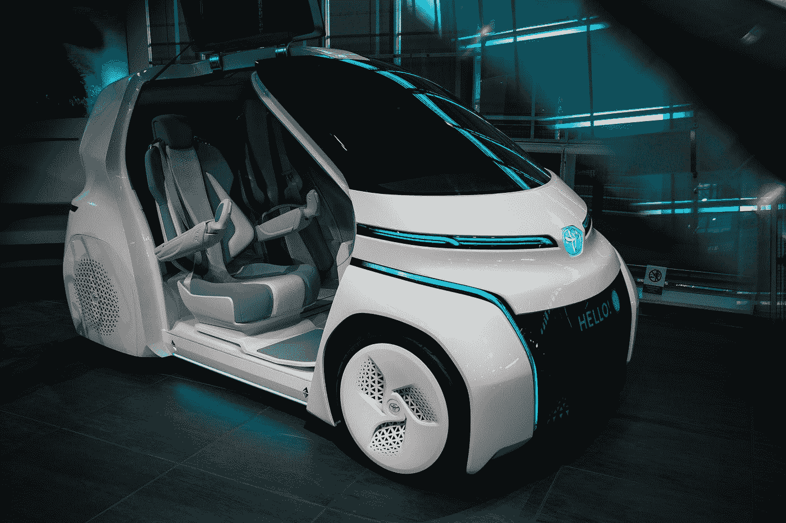

# 如何用 10 步打造世界级人工智能国家战略

> 原文：<https://towardsdatascience.com/how-to-create-a-world-class-ai-national-strategy-in-10-steps-eec5bc1f91fd?source=collection_archive---------52----------------------->

## 关于马耳他及其如何成为世界上人工智能排名前 10 位的国家的案例研究

照片由 [Maximalfocus](https://unsplash.com/@maximalfocus?utm_source=medium&utm_medium=referral) 在 [Unsplash](https://unsplash.com?utm_source=medium&utm_medium=referral) 上拍摄

世界目前正在进行一场全球人工智能(AI)竞赛。各国每年投入数十亿美元试图获得全球霸权。他们很清楚，谁在这场游戏中处于领先地位，谁就会从巨大的经济利益中受益。因此，不同国家(如美国或中国)甚至经济集团(如欧盟)成为全球领导者的竞赛已经开始。

马耳他是地中海中部的一个小国，人口约 50 万。它是最小的欧盟国家之一，并渴望成为最终的人工智能发射台。以下是马耳他为制定战略而采取的步骤:

# 步骤 1:建立一个国家工作队

马耳他政府做的第一件事是任命一个旨在制定“马耳他. ai 战略”的国家工作队。工作队的成员来自各行各业，他们带来了经验和热情。人们可以找到经验丰富的学者、经验丰富的行政人员、法律专家、官僚、企业家和政策协调员等。此外，为了协助这个工作队，还有其他组织和各种小组委员会，它们的任务是侧重于具体的主题。

# 第二步:目标远大

当在一场全球竞赛中竞争时，一个人必须志存高远，然后找到实现目标的方法。就 Malta.ai 战略而言，国家工作队的任务是使马耳他成为全球 ai 前 10 名的国家之一。不是一个微不足道的任务！然而，该国在过去已经取得了相当大的成功。过去几十年见证了在线游戏、金融、医药和区块链行业的建立。所有这些对马耳他经济来说都非常成功。

# 第三步:现实点

设定高目标很容易，但需要脚踏实地。我们知道在金融战线上我们无法与其他国家竞争。未来十年，中国将在人工智能领域投资 1000 亿美元。德国、英国和美国紧随其后。所以我们决定找一个适合我们特殊情况的利基市场。AI launchpad 的想法来自于这样一个事实，即我们认为马耳他是一个岛国，具有典型国家的所有活力，但在地理上局限于一个小空间。这些条件使得测试新技术、验证新技术并将其部署到全球市场变得更加容易和便宜。

此外，马耳他是一个欧洲国家，拥有受过高等教育的劳动力，并且靠近北非和中东，这一事实使其更具吸引力。我们令人难以置信的 300 天的阳光，各种各样的历史和有趣的景点以及地中海的生活方式使这个岛屿对外国人才具有吸引力。因此，马耳他为任何想在全球部署人工智能解决方案的人提供了一个独特的包。

# 步骤 4:确定促成因素

促成因素是构成战略的基本组成部分。没有它们，我们就无法构建人工智能系统。这些包括底层基础设施(如宽带连接)、法律和道德框架以及教育和劳动力促进因素。我们相信，只有具备这些有利条件，我们才能建立一个坚实的人工智能战略。

# 步骤 5:确定利益相关者

任何战略要想成功，所有利益相关者都必须参与进来。工作队需要与不同的利益相关者建立信任关系，因为一旦政策到位，他们的帮助对政策的实施至关重要。因此，确定所有可能参与其中的组织或个人是至关重要的。

# 步骤 6:教育利益相关者

教育对于有效的战略至关重要。许多利益相关者可能听说过 AI，他们甚至可能知道缩写代表什么，但他们中的大多数人不知道它是什么。我们的调查显示，大多数人都不知道他们已经使用基于人工智能的系统几十年了。他们可以肯定的一件事是好莱坞大片喂给他们的，即邪恶的人工智能革命将接管世界，杀死所有人类。正因为如此，教育利益相关者，消除他们的恐惧，并让他们真正了解对人工智能的期待是至关重要的。

# 第七步:会见不同的利益相关者

一旦得到通知，工作队的小组委员会就与各利益攸关方组织各种一对一的会议。这些会议涉及多种讨论，涉及前进的道路，实现我们目标的路径，以及如何帮助那些可能受到人工智能崛起严重影响的人(如失业)。

# 步骤 8:全球盘点

除了当地情况之外，还必须了解我们周围正在发生的事情。我们知道今天有超过 50 个国家有他们自己的人工智能战略。正因为如此，我们想确保我们没有复制其他人的方法。此外，我们希望确保我们的提案具有独特的销售主张，因为毕竟，我们希望制定一项战略，为我们的小岛吸引投资。

# 第九步:整理信息

在所有这些工作之后，我们从当地和国际来源收集了所有数据。我们在一份文件中整理了所有的东西。因为我们需要一些额外的反馈(比如人工智能伦理框架)，所以文本的一些部分被提前发布了。一旦我们拥有了一切，最终的文档经过了各种迭代，我们讨论了它的内容，并确保它满足我们最初的概要。

# 步骤 10:启动战略

所有这些工作之后剩下的最后一件事实际上是启动战略。政府接受了我们的文件，它通过国家预算提供资金，我们现在正与不同的利益攸关方和实体一起实施这一文件。

在一年内完成如此雄心勃勃的任务不是一个容易的目标，但我很高兴我们成功地做到了。此外，在其发布几个月后，就政府战略而言，Tortoise Media 将马耳他的国家人工智能战略在 54 个国家中排名第 10 位，大大超过了爱沙尼亚、瑞典和奥地利等国家。在如此短的时间内取得如此令人印象深刻的成绩，令人非常满意。然而，这并不意味着我们已经达到了目标。我们在其他方面还需要改进。该调查将马耳他在人才方面排在第 17 位，在研发方面分别排在第 36 位和第 25 位。然而，结果非常令人鼓舞；它将马耳他放在人工智能的国际地图上，并使我们朝着成为全球人工智能发射台的正确方向前进。

请在下面留下你的想法。如果你喜欢这篇文章，请跟我来🐦[推特](https://twitter.com/alexieidingli)，🔗 [LinkedIn](https://www.linkedin.com/in/alexieidingli/) 或者😊[脸书](https://www.facebook.com/alexieidingli/)。

*原载于 2020 年 3 月 2 日*[*https://Howard . ai*](https://towards.ai/how-to-create-a-world-class-ai-national-strategy-in-10-steps/)*。*

[**阿列克谢·丁力教授**](http://www.dingli.org/) 是马耳他[大学](https://www.um.edu.mt/)的 AI 教授。二十多年来，他一直在人工智能领域进行研究和工作，协助不同的公司实施人工智能解决方案。他的工作被国际专家评为世界级，并赢得了几个当地和国际奖项(如欧洲航天局、世界知识产权组织和联合国等)。他出版了几本同行评审的出版物，并且是马耳他[的一部分。由马耳他政府成立的人工智能特别工作组，旨在使马耳他成为世界上人工智能水平最高的国家之一。](https://malta.ai/)