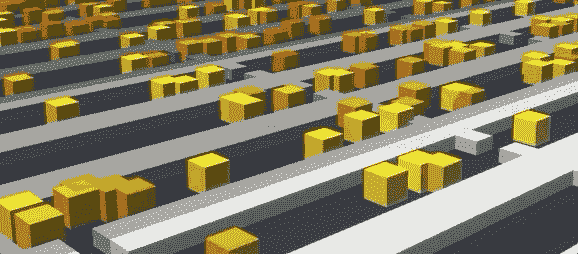
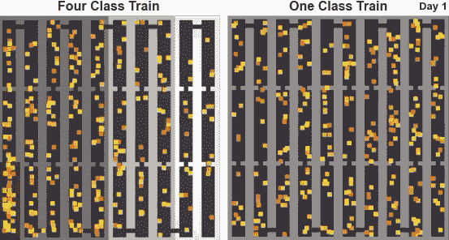
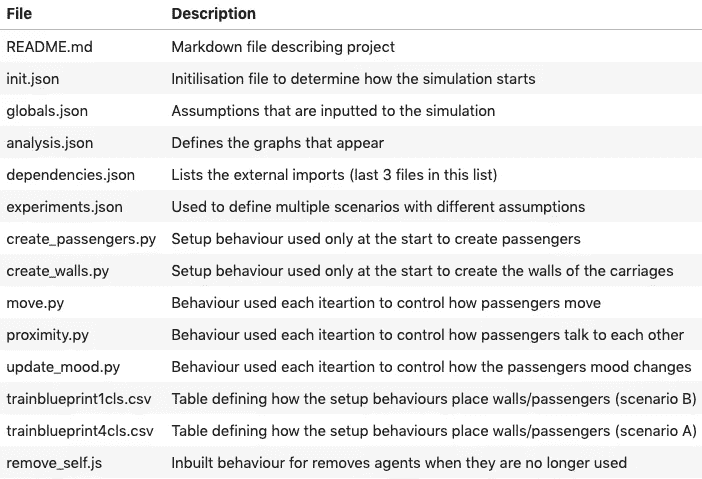
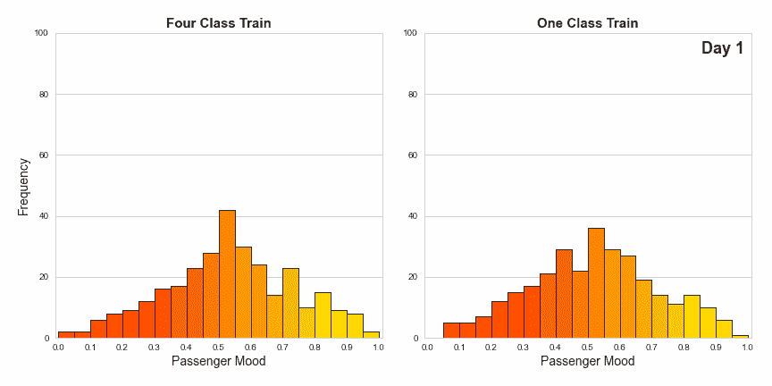
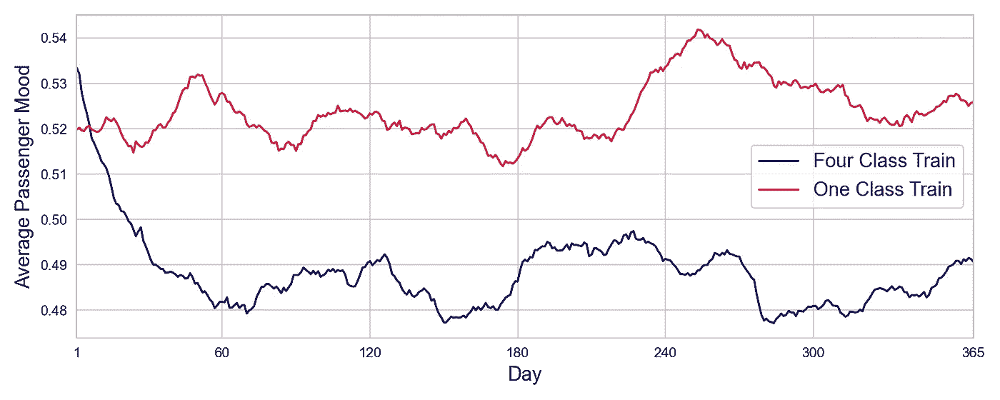

# 如何创建基于代理的仿真模型

> 原文：<https://towardsdatascience.com/how-to-create-an-agent-based-simulation-model-37bd7b4b0da7?source=collection_archive---------41----------------------->

## 根据电视剧《冰雪奇缘》改编

作者提供的图片([哈希](http://hash.ai/)可视化的屏幕上限)

需要模拟一个复杂的系统，包含许多自主运行的个体？那么一款 [**基于代理的型号**](https://en.wikipedia.org/wiki/Agent-based_model) 可能正是你所需要的！你可能听说过康威的生命游戏，这是这种模型的最早的例子之一，由传奇数学家约翰·何顿·康威创造。

为了建立这样一个模型，我们需要三样东西，每样东西都将在本文中解释:

1.  概念:模型的超参数
2.  框架:底层代码基础设施
3.  行为:决定代理如何行动的顶层代码

# 概念:阶级斗争(在火车上！)

最近看了 [**扫雪者**](https://en.wikipedia.org/wiki/Snowpiercer_(TV_series)) 电视剧；一部反乌托邦科幻小说，其中人类的最后残余存活在一列火车上，分成不同的阶级。这一系列提出了许多哲学问题，我认为最好通过建立一个基于代理的模拟模型来回答。

要建立一个火车社会的仿真模型，我们首先需要的是参数；列车有多大，有多少代理/乘客，他们在列车上是如何分布的？为了回答这些问题，并为我们的模型设置输入，我查看了我可以从电视剧中收集到的信息。

火车上有 3000 名乘客，分成四类:一等、二等、三等和“尾巴”(偷渡者)。我们被告知尾部有 400 人，三等舱有 1700 人。没有人告诉我们头等舱和二等舱的比例，所以我只能猜测是 250/650。

为了使数字更容易处理，我们的模型将有 1 个代理代表 10 名乘客，火车车厢也是如此。

我们被告知有 1001 节车厢，其中大部分用于种植作物或饲养牲畜。在没有任何进一步信息的情况下，我只能猜测大约只有一半的车厢用于人类居住，其余的车厢以 6/9/14/1 的比例分成一等车厢/二等车厢/三等车厢/尾部车厢。

虽然代理将能够在车厢之间移动，但是我们输入到模型中的这些初始值将意味着一些车厢比其他车厢更加拥挤(例如，尾部将比头等车厢更加拥挤)。

**模型的目的是运行实验**。鉴于 Snowpiercer 的主题是关于阶级划分，我们将运行两个场景；要么火车被分成上述四个等级，要么我们有一个单一的等级，所有乘客在车厢中平均分配。

作者图([哈希](http://hash.ai/)的屏幕盖)

# 框架:哈希平台

我很忙，我真的没有时间从头开始构建运行基于代理的仿真模型所需的代码。幸运的是，其他人已经为我做了这些，那些人是 [**HASH**](https://hash.ai/) 的人，他们建立了一个平台，提供了我们需要的所有底层代理机制。再加上他们的支持者包括 [Kaggle](https://www.kaggle.com/) 和 [StackOverflow](https://stackoverflow.com/) 的创始人，这就让人放心了。

**哈希框架提供了所有代理机制的基本构件**；如何创建或删除它们，它们如何通过相互发送消息进行交互，以及将您自己的自定义行为附加到代理的简单方法(使用 Python 或 Javascript)。此外，它有一个漂亮的 3D 可视化模拟运行(如本文顶部所示)！

哈希项目就像 git 存储库，所以很容易派生或共享。例如，您可以通过单击下面的链接自己运行我的模拟(但是为了理解代码，您可能想先读完本文)。

 [## 雪地穿刺器-哈希

### 这是一个基于智能体的模拟模型，模拟一个完全生活在一列火车里的社会。概念和超参数…

hash.ai](https://hash.ai/@gmorinan/snowpiercer) 

尽管这个框架很棒，但我们仍然需要自己编写模型的细节，这些代码包含在这 14 个项目文件中:

因此，让我们深入了解对模拟运行至关重要的全局和行为文件的细节…

# 行为:快乐的乘客，快乐的火车

Snowpiercer 的一个关键主题是资源的差异，其中一个关键资源是空间。**为了对此进行调查，我们将对乘客情绪**进行建模，由此，如果乘客的空间有限，即如果他们所在的列车车厢过于拥挤，乘客的情绪将会下降。

为了解释这一点，让我们从查看全局输入开始。首先，我们有“拓扑”，这是一个特殊的关键字，哈希将自动转换为模拟发生的区域，以及代理用来确定其邻居是谁的搜索半径。

接下来,“设置”输入是我们在模拟开始时运行的两种行为所使用的输入，其中大部分包括与列车上的四个等级相对应的四个元素列表。例如,' class_numbers '告诉模型我们希望尾部有 40 个代理，三等舱有 170 个代理，依此类推。而‘car _ id’和‘wall _ id’告诉模型‘蓝图’中的哪些数字转换成用于哪些类的列车车厢和墙壁。

最后，“属性”输入决定了代理机制。代理人的颜色从红色到黄色不等，取决于他们有多开心。而三个情绪值是通用常数；“mood_incr”控制过度拥挤时情绪如何降低，“mood_baseline”控制没有过度拥挤时情绪如何增加，“mood_edge”控制每次迭代的最小随机性。

**为了将这些全局变量放入上下文中，让我们看看行为脚本**，从“create_passengers.py”开始，它只在第一次迭代中运行。该脚本执行以下操作:从 globals.json 中检索输入变量，使用火车蓝图来确定哪些位置属于哪些火车车厢，然后将代理放置到适当火车车厢内的随机空间中，同时使用三角形分布为它们分配随机的开始情绪(和相应的颜色)。最后，它向控制模拟的特殊“散列”代理发送一个“create_agent”消息，就这样我们创建了我们的乘客。

一旦你理解了这个脚本，理解“create_walls.py”就变得很简单了，它创建了静态的虚拟代理，只用来阻止乘客的移动。

现在设置好了，让我们看看控制代理如何操作每次迭代的行为；“move.py”将在每次迭代中对每个乘客运行。此函数的“状态”输入是它运行的乘客的状态，在这种情况下，我们使用它来获得代理的 xy 坐标，以计算它可能做出的所有可能的移动。乘客查看附近是否有墙，并相应地调整可能的移动以避免在墙中结束，然后从剩余的选项中随机选择一个移动。

“proximity.py”行为展示了内置于 HASH 中的消息传递机制。如果一名乘客靠近不止一名其他乘客，它会向所有乘客发送一条信息，抱怨过度拥挤，这些信息会反馈到下一个行为中…

最后，“update_mood.py”是数学发生的地方。乘客检查它有多少投诉消息。然后，使用决定情绪的全局变量，它创建一个三角形分布，从中随机选择一种新的情绪。越拥挤，情绪下降的机会就越大。虽然“情绪边缘”全局意味着即使乘客过度拥挤，情绪也有小的机会上升，反之亦然。

现在我们理解了代码，让我们看看结果…

# 结果

我们运行上面概述的两个场景(四个类或一个类)，每个场景进行 365 次迭代，在下面的动画直方图中总结结果。在这两种情况下，乘客情绪开始时为单峰分布，约为 0.5，但几天后变为双峰分布，群集在 0 和 1 处。

按作者分列的数字

从这里我们可以得出什么结论？虽然动画看起来不错，但有时一个简单的时间序列能更清楚地显示结果。下面我们可以看到，在一个班级的情况下，平均情绪更高。这很大程度上是因为，在四个等级的情况下，由于过度拥挤，尾部乘客的情绪会迅速下降。

按作者分列的数字

我们需要记住**基于代理的模拟是随机过程**，这些结果只是模型的一次运行。在得出任何确定的结论之前，应该多次运行模拟模型，并一起查看所有运行的结果。

还应该对全局输入进行一些**敏感性分析**。例如，在这个模型中，将“mood_incr”常数加倍将会得到非常不同的结果。

模型的信息量取决于其假设的准确性。

不相信我？尝试用您喜欢的任何输入自己运行它:

 [## 雪地穿刺器-哈希

### 这是一个基于智能体的模拟模型，模拟一个完全生活在一列火车里的社会。概念和超参数…

hash.ai](https://hash.ai/@gmorinan/snowpiercer)