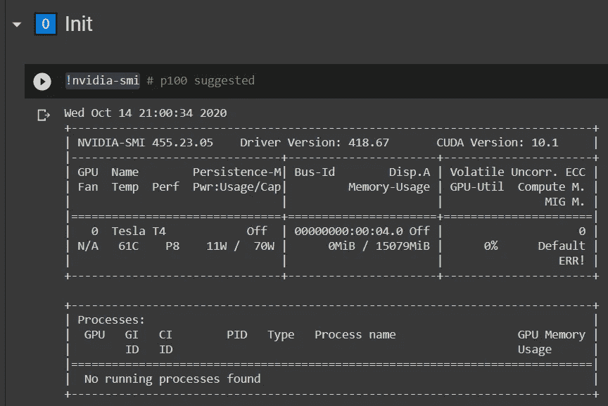
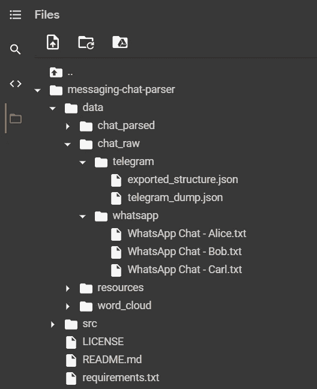
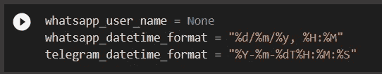
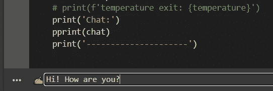
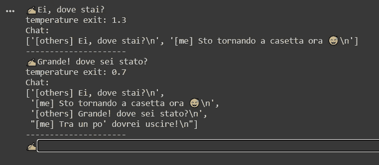

# 如何创造一个像你一样聊天的人工智能

> 原文：<https://towardsdatascience.com/how-to-create-an-ai-that-chats-like-you-cb3484824797?source=collection_archive---------9----------------------->


照片由[帕特里克·福尔](https://unsplash.com/@patrickian4?utm_source=medium&utm_medium=referral)在 [Unsplash](https://unsplash.com?utm_source=medium&utm_medium=referral) 拍摄

## [实践教程](https://towardsdatascience.com/tagged/hands-on-tutorials)

## 使用你的 WhatsApp 和 Telegram 数据，与 GPT-2 神经网络进行训练和聊天

# 路标

本指南的目标是建立一个能够像你一样聊天的系统，使用你自己的 WhatsApp 和 Telegram 聊天作为 ML 数据集。

我们要做的可以概括为以下步骤:

1.  获取您的 WhatsApp 和 Telegram 数据
2.  解析它以构建一个 ML 就绪的数据集
3.  列车 a **GPT-2** 型号
4.  与模特聊天

所以让我们开始我们的冒险吧！

> 你想看到一些结果吗？查看[官方网页](https://pistocop.github.io/pistoBot-website/)，注意它们是基于我的个人聊天的**意大利语**。

GIPHY [来源](https://gph.is/g/Zy6wx6e)

## **⚠警告:**

最好不要对个人信息(如个人聊天信息)运行随机脚本。

我保证没有漏洞，但你可以随时检查正在使用的本机代码: [**消息传递-聊天-解析器**](https://github.com/pistocop/messaging-chat-parser) 和 [**pistoBot**](https://github.com/pistocop/pistoBot) ，所有的源代码都是在 github 上开源的**。**

# 1.获取数据

首先，我们需要从我们的聊天应用程序中收集数据。我们现在将学习如何从两个最常用的即时通讯应用程序中导出数据: **WhatsApp** 和 **Telegram。**

## 1.1 WhatsApp 导出

我们必须出口一辆**。txt** 文件，用于我们希望包含在最终数据集中的每个聊天。所以，正如[WhatsApp 官方网站](https://faq.whatsapp.com/android/chats/how-to-save-your-chat-history)上描述的:

1.  打开你的 WhatsApp 手机应用
2.  选择个人聊天一个**个人**聊天(例如与一个朋友聊天)>点击“更多选项”(三个垂直点)
3.  选择*多*语音>多*导出聊天*语音
4.  在弹出窗口中选择无介质的
5.  *选择一种电子邮件服务(如 Gmail 应用程序)并将您的电子邮件地址添加为收件人*
6.  *等待以 txt 文件附件的形式接收带有聊天记录的邮件*
7.  *下载 txt 附件并存储在计算机上*
8.  *对您想要包含的每个**个人聊天**重复这些步骤*

*请注意，只允许一对一聊天(即**个人**)，我们建议导出消息数量最多的聊天，以获得更大的数据集和更好的最终结果。*

*现在，您应该有更多的文件，每个文件的结构类似于下面的代码片段:*

```
*12/12/19, 02:09 — <FriendName>: bla bla bla bla
12/12/19, 08:40 — <YourName>: bla bla bla bla*
```

*记下您在导出的聊天中在 *<您的姓名>* 占位符下找到的文本。这个参数是 WhatsApp 应用程序的名称，我们稍后将使用这个值。*

## *1.2 电报*

*这里的过程将比 WhatsApp 更快，因为 Telegram 将在单个**中导出所有内容。json** 文件，没有一次导出一个聊天的限制。*

*所以，如[官方电报网站](https://telegram.org/blog/export-and-more)所述:*

1.  *打开[电报桌面 app](https://desktop.telegram.org/)*
2.  *打开屏幕左上角的菜单(三条水平线)*
3.  *进入*设置*语音>点击*高级>选择*导出电报数据***
4.  *只能选择这些字段:
    *账户信息、联系人列表、个人聊天、机器可读 JSON**
5.  *确保在*媒体导出设置*下没有选择任何内容，并将尺寸限制设置为最大*
6.  *启动导出并等待*
7.  *将输出文件重命名为“ *telegram_dump.json**

*现在你应该有一个名为 *telegram_dump.json* 的文件，其结构如下:*

```
*{
 "about": "Here is …",
 "personal_information": {
 "user_id": 123456789,
 "first_name": "your_name_here",
 "last_name": "",
 ....*
```

# *2.解析数据*

*为了训练一个 GPT-2 神经网络，首先我们需要预处理数据，以获得单个**。txt** 具有机器学习兼容结构。*

## *2.1 谷歌可乐*

*为了简单起见，由于我们将使用的 ML 模型需要 GPU 来工作，我们将在下一步使用 Google Colab。*

*如果你不知道 Google Colab 是什么，可以看看这篇文章:*

*[](/getting-started-with-google-colab-f2fff97f594c) [## Google Colab 入门

### 沮丧和困惑的基本教程

towardsdatascience.com](/getting-started-with-google-colab-f2fff97f594c) 

## 2.2 启动笔记本

打开本 [Colab 笔记本](https://colab.research.google.com/drive/1T4-Gk-mlAWJkX9RuRd3_EiS5JBP5UvyV?usp=sharing)并遵循以下步骤:

1.  运行“0️⃣初始化”章节下调用的第一个单元格块
2.  在弹出窗口中按“无论如何都要运行”
3.  确保第一个命令*！nvidia-smi* 显示连接了 GPU(建议 p100)
4.  如果没有连接 GPU，转到*运行时>更改运行时类型>硬件加速器> GPU*



特斯拉 T4 GPU 正确连接时的输出示例。|作者图片

## 2.3 加载数据

为了处理这些数据，我们需要将它们上传到 Colab 上正确的文件夹中。

**WhatsApp 聊天** 选择你所有的。txt 文件，并将所有东西上传到下面的笔记本文件夹:
*。/messaging-chat-parser/data/chat _ raw/whatsapp/*

**Telegram JSON** 获取文件 *telegram_dump.json* 上传到以下笔记本文件夹:
*。/messaging-chat-parser/data/chat _ raw/telegram/*



聊天上传后的笔记本文件示例|作者图片

## 2.4 解析数据

现在，运行所有的单元格，直到块“2️⃣解析数据”。

这里我们需要把变量“whatsapp_user_name”替换成你的 whatsapp 名称，在 1.1 章节上叫做 *< YourName >* 。

如果由于本地时间格式，某些导出的数据显示不同的格式，您也可以更改日期格式解析系统。



用于设置用户名的单元格。|作者图片

例如，如果我的名字是“Bob ”,我来自美国，我应该使用以下代码:* 

# *3.训练 GPT-2 模型*

*现在执行“3️⃣培训 GTP2 模型”笔记本章节下的单元，它将使用您提供的数据运行新的培训。*

*将显示一个进度条，培训可能需要 10 个小时，这主要取决于 Colab 运行的 GPU 类型以及提供了多少消息。*

*等待该过程结束。*

*常见的“我在等我的神经网络列车”姿势| GIPHY [来源](http://gph.is/2jf2B8X)*

# *4.与模特聊天*

*训练完成后，运行所有剩余的笔记本单元格:最后一个单元格将显示一个左侧带有✍符号的文本块。*

*您可以使用这个文本框来插入您想要“发送”到 ML 模型的消息。所以写下你的信息，然后按下回车键。*

**

*在文本框上书写消息的示例。|作者图片*

## ***4.1 如何读取结果***

*第一条消息发出后，系统会提示一些关于对话的信息。*

*现在，您将看到最有趣的结果，显示为邮件列表:*

*   *以标签**【其他】** :开头的消息，您发送给模特的那些*
*   ***以标签**【me】**:
    开头的消息，由模型生成的**消息。*****

***回复的消息生成后，您可以继续聊天，总共 5 条消息。在此之后，您可以重新运行单元，开始与模型的新对话。***

******

***我写的一些消息的例子(标签为**【其他】**)和由模型生成的消息(标签为**【我】**)。聊天是在意大利，因为模型是在我自己的聊天训练。|作者图片***

# ***5.结论***

***因此，在本指南中，我们已经看到从头开始训练你的 GPT-2 模型是多么简单，任务是简单的(但不是微不足道的！)多亏了在活塞罩下运行的 [aitextgen](https://github.com/minimaxir/aitextgen) 软件包。***

***请注意，如果您的聊天信息是英文的，您可以**轻松获得比我们用这种标准方法获得的结果更好的结果**，因为您可以使用来自 GPT-2 预训练模型的迁移学习。***

***pistoBot 资源库允许您训练(或微调)不同的模型，包括从 GPT-2 预训练模型开始的机会:查看资源库文件夹了解更多信息。***

***我们选择了标准的，未经训练的 GPT-2 模型，这样即使是非英语用户也可以使用这个人工智能。***