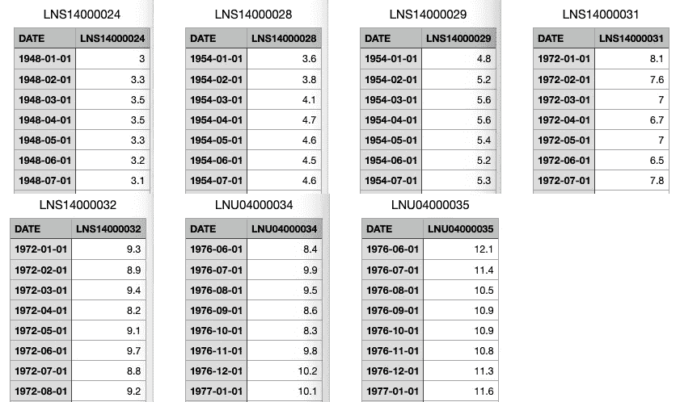
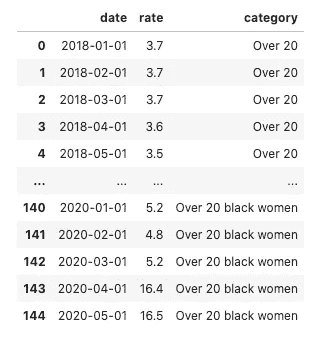
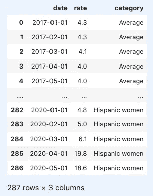
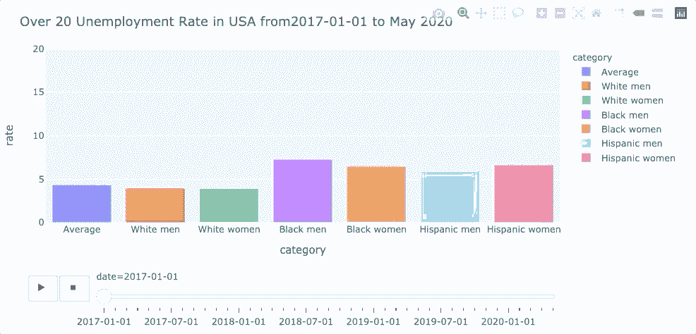
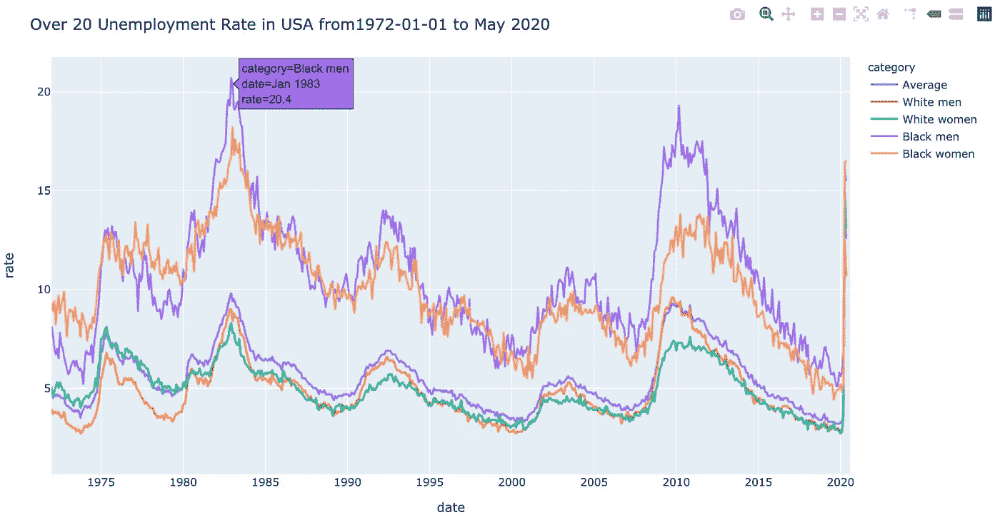

# 如何在 Jupyter 中创建动画条形图

> 原文：<https://towardsdatascience.com/how-to-create-an-animated-bar-chart-in-jupyter-9ee1de8d0e80?source=collection_archive---------28----------------------->

## 使用 Plotly Python 显示最新美国失业率的数据可视化


乔尔·士迪佛立在 [Unsplash](https://unsplash.com/s/photos/eye?utm_source=unsplash&utm_medium=referral&utm_content=creditCopyText) 上拍摄的主要照片。作者 Photoshop。

```
**Table of Contents**[**Introduction**](#dd46)1\. [Data preparation](#5e4a)
2\. [Animated Bar Chart](#52ad)
3\. [A line chart](#ecd9)[**Conclusion**](#6e8e)
```

# 介绍

每个新闻媒体都报道了新冠肺炎造成的经济困难。辐射尘不成比例地影响了黑人社区。

圣路易斯美联储银行更新了其失业率数据。观测范围因数据集而异，但最新数据是 2020 年 5 月的。我们将使用 Jupyter 上的一个[生动的条形图](https://plotly.com/python/animations/#animated-bar-charts-with-plotly-express)来可视化一年来失业率是如何随着种族和性别而变化的。

> *本文假设您已经熟悉 JupyterLab/Jupyter 笔记本的基本操作。*

[**精心安装**](https://plotly.com/python/getting-started/)

plotly.py 可以使用 pip 安装。

```
$ pip install plotly==4.8.1
```

对于 Conda 用户:

```
$ conda install -c plotly plotly=4.8.1
```

**JupyterLab 支持(Python 3.5+)**

使用画中画:

```
$ pip install jupyterlab "ipywidgets>=7.5"
```

对于 Conda 用户:

```
$ conda install jupyterlab "ipywidgets=7.5"
```

然后运行以下命令(您需要安装节点):

```
# JupyterLab renderer support 
$ jupyter labextension install jupyterlab-plotly@4.8.1  
# OPTIONAL: Jupyter widgets extension 
$ jupyter labextension install @jupyter-widgets/jupyterlab-manager plotlywidget@4.8.1
```

[](/how-to-run-jupyter-notebook-on-docker-7c9748ed209f) [## 如何在 Docker 上运行 Jupyter 笔记本

### 不再有 Python 环境和包更新

towardsdatascience.com](/how-to-run-jupyter-notebook-on-docker-7c9748ed209f) [](/how-to-create-an-animated-choropleth-map-with-less-than-15-lines-of-code-2ff04921c60b) [## 如何用不到 15 行代码创建一个动画的 Choropleth 地图

### 在 Jupyter 上使用 Python 中的 Plotly Express

towardsdatascience.com](/how-to-create-an-animated-choropleth-map-with-less-than-15-lines-of-code-2ff04921c60b) [](/line-chart-animation-with-plotly-on-jupyter-e19c738dc882) [## Jupyter 上 Plotly 的折线图动画

### Plotly 统一悬停模式，按钮和更多

towardsdatascience.com](/line-chart-animation-with-plotly-on-jupyter-e19c738dc882) 

# 数据准备



所有[数据源。](https://fred.stlouisfed.org/categories/32447?t=20%20years%20%2B%3Bnsa&ob=pv&od=desc)图片作者

以上数据为 **20 年。&超过**(LNS 14000024)**20 年。&结束，白人男子** (LNS14000028)， **20 年。结束，白人女性**(LNS 14000029)**20 年。超过 20 岁的黑人或非裔美国人。超过 20 岁的黑人或非裔美国妇女。超过 20 岁的西班牙裔或拉丁裔男性。超过，西班牙裔或拉丁裔女性。**

我们将连接所有数据集，添加一个具有适当名称的类别列，并按日期过滤，这样所有数据集将具有相同的长度，如下所示。



最终数据集。作者图片

```
import pandas as pd
import plotly.express as px over20='https://gist.githubusercontent.com/shinokada/dfcdc538dedf136d4a58b9bcdcfc8f18/raw/d1db4261b76af67dd67c00a400e373c175eab428/LNS14000024.csv'
over20_white_men='https://gist.githubusercontent.com/shinokada/dfcdc538dedf136d4a58b9bcdcfc8f18/raw/d1db4261b76af67dd67c00a400e373c175eab428/LNS14000028.csv'
over20_white_women='https://gist.githubusercontent.com/shinokada/dfcdc538dedf136d4a58b9bcdcfc8f18/raw/d1db4261b76af67dd67c00a400e373c175eab428/LNS14000029.csv'
over20_black_men='https://gist.githubusercontent.com/shinokada/dfcdc538dedf136d4a58b9bcdcfc8f18/raw/7d63e7a7495dfb8578120016c7a7dd4edc04e20d/LNS14000031.csv'
over20_black_women='https://gist.githubusercontent.com/shinokada/dfcdc538dedf136d4a58b9bcdcfc8f18/raw/d1db4261b76af67dd67c00a400e373c175eab428/LNS14000032.csv'
over20_hispanic_men='https://gist.githubusercontent.com/shinokada/dfcdc538dedf136d4a58b9bcdcfc8f18/raw/f693c9bdd76875b12a14033cc54931da894bd341/LNU04000034.csv'
over20_hispanic_women='https://gist.githubusercontent.com/shinokada/dfcdc538dedf136d4a58b9bcdcfc8f18/raw/f693c9bdd76875b12a14033cc54931da894bd341/LNU04000035.csv' df_over20 = pd.read_csv(over20)
df_over20_wm = pd.read_csv(over20_white_men)
df_over20_ww = pd.read_csv(over20_white_women)
df_over20_bm = pd.read_csv(over20_black_men)
df_over20_bw = pd.read_csv(over20_black_women)
df_over20_hm = pd.read_csv(over20_hispanic_men)
df_over20_hw = pd.read_csv(over20_hispanic_women) def prepare(dfs, datefrom):
    result=[]
    for item in dfs:
        item.columns = ['date','rate','category']
        item = item[item['date']>= datefrom]
        result.append(item)
    return result dfs = [df_over20, df_over20_wm, df_over20_ww, df_over20_bm, df_over20_bw, df_over20_hm, df_over20_hw]
datefrom='2017-01-01'
categories = ['Average', 'White men', 'White women', 'Black men', 'Black women','Hispanic men', 'Hispanic women'] i=0
while i < len(categories):
    dfs[i].loc[:,'category'] = categories[i]
    i = i+1 df=prepare(dfs, datefrom)    
df = pd.concat(df, ignore_index=True)
display(df)
```

我们导入必要的库，熊猫和 Plotly.express。

我们使用 Github URLs 为每个数据创建变量。

我们使用`read_csv`读取所有逗号分隔值文件(csv 文件)。

我们创建一个名为`prepare`的函数。这个函数有两个参数，`dfs`一个数据帧列表，`datefrom`一个日期字符串。

我们创建一个空列表`result`。我们遍历数据帧列表来重命名列，使用`datefrom`变量过滤`date`字段，并将每个数据帧附加到`result`。

我们使用所有数据帧`datefrom`和`categories`定义一个变量`dfs`。

我们使用`dfs`和`categories`添加一个新列。

我们使用`prepare`函数`dfs`和`datefrom`作为自变量。

我们使用`[concat](https://pandas.pydata.org/pandas-docs/stable/user_guide/merging.html)`和`ignore_index=True`参数组合所有数据帧。每个数据帧都有自己的索引，这使得我们可以忽略它们，从 0，…，n-1 开始标记索引。`df`的输出具有以下结构。



准备好的数据集。图片由作者提供。

# 动画条形图

[plotly.express](https://plot.ly/python/plotly-express/) 模块是 plotly 用于快速图形生成的高级 API。

```
fig = px.bar(df, x="category", y="rate", color="category",
   animation_frame="date", animation_group="category", 
   range_y=[0,20])fig.update_layout(
    height=600,
    title_text='Over 20 Unemployment Rate in USA from'+datefrom+' to May 2020'
)fig.show()
```

每个 Plotly Express 函数返回一个`graph_objects.Figure`对象，我们使用`[plotly.express.bar](https://plotly.com/python-api-reference/generated/plotly.express.bar.html)`实例化它。我们设置参数，`x`，`y`，`color`等。

我们使用`update_layout`来设置`height`和`title`，然后显示动画条形图。



从 2017 年 1 月 1 日到 2020 年 5 月 1 日的动画条形图。图片由作者提供。

黑人或非裔美国男子和妇女的失业率一直是两倍左右，在某些时期，他们是白人男子和妇女的两倍以上。我们看到最后所有数据集的突然峰值，但是比率的差异变小了。

# 折线图

下图显示了从 1972 年 1 月 1 日到 2020 年 5 月 1 日的失业率。我们选择五个数据帧，并改变`datefrom`值。如果你想创建一个折线图动画，请看这个[帖子](/line-chart-animation-with-plotly-on-jupyter-e19c738dc882)。

```
df = pd.concat([df_over20, df_over20_wm, df_over20_ww, df_over20_bm, df_over20_bw], ignore_index=True)datefrom='1972-01-01'fig = px.line(df, x="date", y="rate", color="category",range_x=[datefrom,'2020-07-30'])
# fig.update_layout(hovermode='x unified')
fig.update_layout(
    height=600,
    title_text='Over 20 Unemployment Rate in USA from'+datefrom+' to May 2020'
)fig.show()
```



从 1972 年 1 月 1 日到 2020 年 5 月 1 日的美国失业折线图。图片由作者提供。

# 结论

一个动画条形图是一个很好的工具来显示由于新冠肺炎的失业率的戏剧性变化。Pandas 和 Python 使得合并和修改原始数据变得很容易。

在不久的将来，我想回顾一下这篇文章，看看不同群体的失业率是如何变化的。

**通过** [**成为**](https://blog.codewithshin.com/membership) **会员，可以完全访问媒体上的每一个故事。**


[https://blog.codewithshin.com/subscribe](https://blog.codewithshin.com/subscribe)

[](/how-to-create-a-grouped-bar-chart-with-plotly-express-in-python-e2b64ed4abd7) [## 如何用 Python 中的 Plotly Express 创建分组条形图

### Python melt 函数将数据帧从宽到长格式化

towardsdatascience.com](/how-to-create-a-grouped-bar-chart-with-plotly-express-in-python-e2b64ed4abd7) [](/how-to-create-an-interactive-dropdown-in-jupyter-322277f58a68) [## 如何在 Jupyter 中创建交互式下拉列表

### 用下拉菜单更新图表

towardsdatascience.com](/how-to-create-an-interactive-dropdown-in-jupyter-322277f58a68) [](/how-to-create-an-attractive-bubble-map-5cf452c244e9) [## 如何在 Jupyter 中创建一个有吸引力的气泡图

### 从 Github repo 抓取数据的分步指南

towardsdatascience.com](/how-to-create-an-attractive-bubble-map-5cf452c244e9)