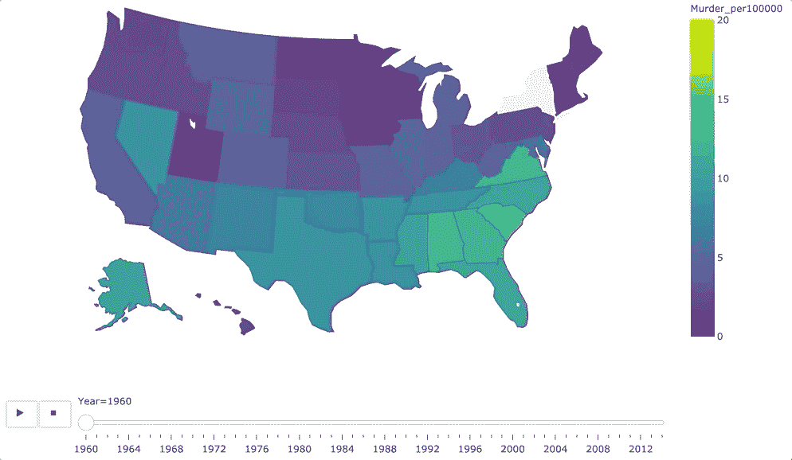
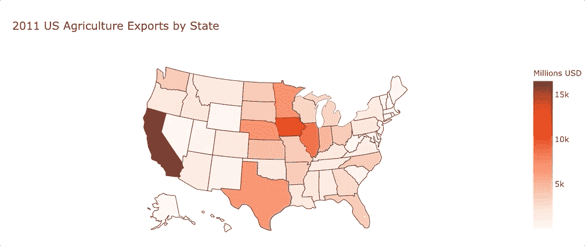
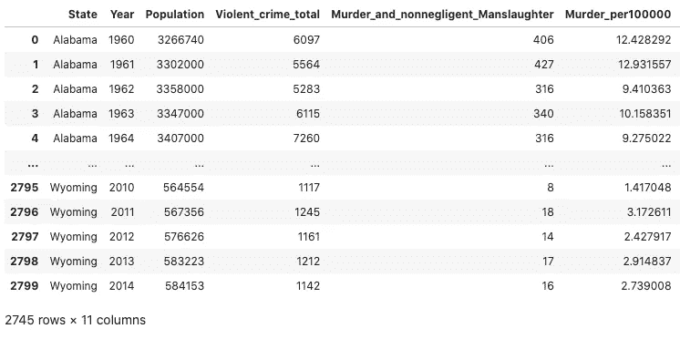
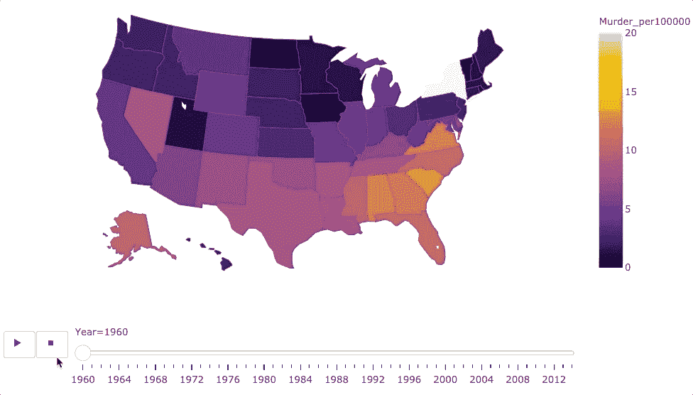
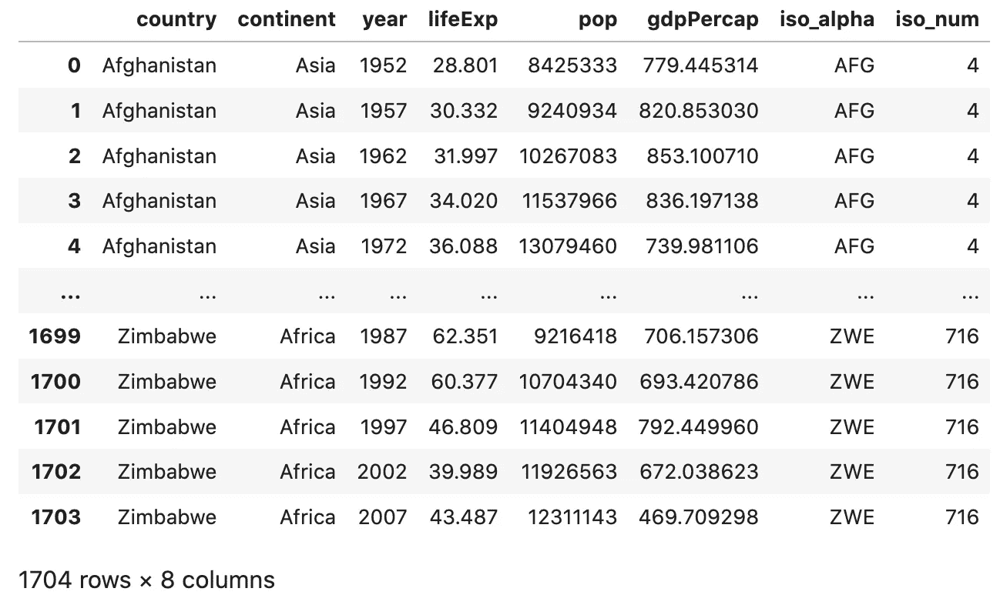
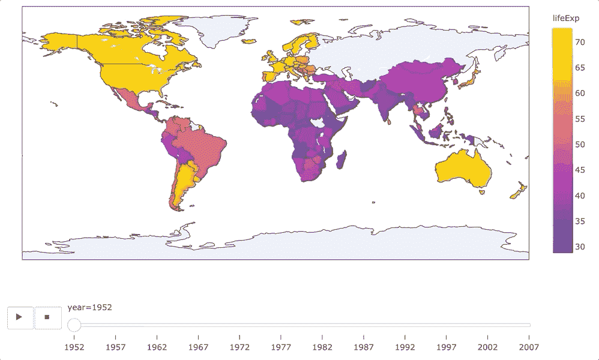

# 如何用不到 15 行代码创建一个动画的 Choropleth 地图

> 原文：<https://towardsdatascience.com/how-to-create-an-animated-choropleth-map-with-less-than-15-lines-of-code-2ff04921c60b?source=collection_archive---------24----------------------->

## 在 Jupyter 上使用 Python 中的 Plotly Express



动画 choropleth 地图的截图。作者图片

```
**Table of Contents**[**Introduction**](#1eac)1\. [Choropleth maps](#189e)
2\. [Data](#5d9c)
3\. [Animated choropleth USA map](#ced3)
4\. [Animated choropleth world map](#b595)[**Conclusion**](#fdec)
```

# 介绍

[Plotly Express](https://plotly.com/python/animations/) 可以轻松创建动画图形。官方文件称，“尽管 Plotly Express 支持许多图表和地图类型的动画，但平滑的帧间过渡目前仅适用于散点图和条形图。”

尽管没有提到 choropleth 地图，但在本文中，你会发现在 Jupyter 上使用 Plotly 和 Python 创建动画 choropleth 地图是多么容易。

> *本文假设您已经熟悉 JupyterLab/Jupyter 笔记本的基本操作，并且已经安装了*[](https://plotly.com/python/getting-started/)**。**

# *Choropleth 地图*

*[choropleth 地图](https://en.wikipedia.org/wiki/Choropleth_map)是由彩色多边形组成的地图。 [Plotly Express](https://plotly.com/python/choropleth-maps/) ' `px.choropleth`函数和底层`go.Choropleth` graph 对象可以创建 choropleth 地图，你可以在[官网](https://plotly.com/python/choropleth-maps/)上找到一些例子。您只能放大或缩小地图。*

**

*非动画`choropleth map ([code](https://gist.github.com/shinokada/c192a2d25f1c3f8224bb8ee7e35ded8a)). Image by author.`*

# *数据*

*我们将使用美国的谋杀率。数据最初是由联邦调查局公布的[，并由](https://www.ucrdatatool.gov/Search/Crime/State/StatebyState.cfm)[Julia Poncela-Casasnovas](https://amaral.northwestern.edu/blog/step-step-how-plot-map-slider-represent-time-evolu)*修改。你可以在这里找到它[。](https://gist.githubusercontent.com/shinokada/f01139d3a024de375ede23cec5d52360/raw/424ac0055ed71a04e6f45badfaef73df96ad0aad/CrimeStatebyState_1960-2014.csv)**

```
**import plotly.express as px
import pandas as pddf = pd.read_csv('[https://gist.githubusercontent.com/shinokada/f01139d3a024de375ede23cec5d52360/raw/424ac0055ed71a04e6f45badfaef73df96ad0aad/CrimeStatebyState_1960-2014.csv'](https://gist.githubusercontent.com/shinokada/f01139d3a024de375ede23cec5d52360/raw/424ac0055ed71a04e6f45badfaef73df96ad0aad/CrimeStatebyState_1960-2014.csv'))
df = df[(df['State']!= 'District of Columbia' )]
df**
```

****

**数据集的屏幕截图。图片由作者提供。**

**DataFrame 的列具有以下值。**

```
**df.columns# Output
Index(['State', 'Year', 'Population', 'Violent_crime_total',
       'Murder_and_nonnegligent_Manslaughter', 'Murder_per100000',
       'Legacy_rape_/1', 'Revised_rape_/2', 'Robbery',   'Aggravated_assault', 'State_code'], dtype='object')**
```

**[](/line-chart-animation-with-plotly-on-jupyter-e19c738dc882) [## Jupyter 上 Plotly 的折线图动画

### Plotly 统一悬停模式，按钮和更多

towardsdatascience.com](/line-chart-animation-with-plotly-on-jupyter-e19c738dc882) [](/how-to-create-an-animated-bar-chart-in-jupyter-9ee1de8d0e80) [## 如何在 Jupyter 中创建动画条形图

### 使用 Plotly Python 显示最新美国失业率的数据可视化

towardsdatascience.com](/how-to-create-an-animated-bar-chart-in-jupyter-9ee1de8d0e80) 

# 动画合唱团美国地图

```
import plotly.express as px
import pandas as pddf = pd.read_csv('[https://gist.githubusercontent.com/shinokada/f01139d3a024de375ede23cec5d52360/raw/424ac0055ed71a04e6f45badfaef73df96ad0aad/CrimeStatebyState_1960-2014.csv'](https://gist.githubusercontent.com/shinokada/f01139d3a024de375ede23cec5d52360/raw/424ac0055ed71a04e6f45badfaef73df96ad0aad/CrimeStatebyState_1960-2014.csv'))
df = df[(df['State']!= 'District of Columbia' )]px.choropleth(df, 
              locations = 'State_code',
              color="Murder_per100000", 
              animation_frame="Year",
              color_continuous_scale="Inferno",
              locationmode='USA-states',
              scope="usa",
              range_color=(0, 20),
              title='Crime by State',
              height=600
             )
```

**第 1–5 行:**

导入`plotly.express`和`pandas`。我们使用`pd.read_csv`创建一个数据帧。我们删除了`State`列下的哥伦比亚特区行。

**第 7–17 行:**

我们实例化`[plotly.graph_objects.choropleth](https://plotly.github.io/plotly.py-docs/generated/plotly.graph_objects.Choropleth.html#plotly-graph-objs-choropleth)`对象并设置参数。
- `location`:此参数通过位置 id 或名称设置坐标。我们对`locations`使用`State_code`列值。
- `color`:我们用`Murder_per100000`值来改变状态的颜色。
- `animation_frame`:这允许我们制作动画，并在地图下添加播放和停止按钮。
- `locationmode`:确定将`locations`中的条目匹配到地图上的区域。值为“ISO-3”或“美国各州”。
- `[scope](https://plotly.com/python/map-configuration/#named-map-scopes-and-country-subunits)`:将地图限制在此值。可用的范围有::`'world'`、`'usa'`、`'europe'`、`'asia'`、`'africa'`、`'north america'`、`'south america'`。
- `rang_color`:决定右边刻度的数值。使用 0 和最大值。
- `title`:是地图的平铺。
- `height`:是高度创建图。
- `color_continuous_scale`:我们可以从以下列表中设置任意配色方案。

```
from textwrap import wrap named_colorscales = px.colors.named_colorscales()print("\n".join(wrap("".join('{:<12}'.format(c) for c in named_colorscales), 96)))# Output
aggrnyl     agsunset    blackbody   bluered     blues       blugrn      bluyl       brwnyl      bugn        bupu        burg        burgyl      cividis     darkmint    electric    emrld       gnbu        greens      greys       hot         inferno     jet         magenta     magma
mint        orrd        oranges     oryel       peach       pinkyl      plasma      plotly3     pubu        pubugn      purd        purp        purples     purpor      rainbow     rdbu        rdpu        redor       reds        sunset      sunsetdark  teal        tealgrn     viridis
ylgn        ylgnbu      ylorbr      ylorrd      algae       amp         deep        dense       gray        haline      ice         matter      solar       speed       tempo       thermal     turbid      armyrose    brbg        earth       fall        geyser      prgn        piyg
picnic      portland    puor        rdgy        rdylbu      rdylgn      spectral    tealrose    temps       tropic      balance     curl        delta       edge        hsv         icefire     phase       twilight    mrybm       mygbm
```



动画 choropleth 地图。作者图片

# 动画 choropleth 世界地图

让我们创建一个动画的 choropleth 世界地图。Plotly 有[样本数据集](https://plotly.github.io/datasets/)，我们将使用 [Gapminder](https://github.com/plotly/datasets/blob/master/gapminderDataFiveYear.csv) 。

```
import plotly.express as px gapminder = px.data.gapminder()
display(gapminder)
```

输出:



gapminder 数据集。作者图片

```
import plotly.express as px
gapminder = px.data.gapminder()
px.choropleth(gapminder,               
              locations="iso_alpha",               
              color="lifeExp",
              hover_name="country",  
              animation_frame="year",    
              color_continuous_scale='Plasma',  
              height=600             
)
```



动画 choropleth 世界地图。作者图片

# 结论

官方网站没有动画 choropleth 地图的例子，但使用`animation_frame`和设置适当的参数很容易创建。

你有没有受到启发，在你的下一个项目中尝试一下？

**通过** [**成为会员**](https://blog.codewithshin.com/membership) **获得媒体上所有故事的权限。**


[https://blog.codewithshin.com/subscribe](https://blog.codewithshin.com/subscribe)

[](/how-to-create-a-grouped-bar-chart-with-plotly-express-in-python-e2b64ed4abd7) [## 如何用 Python 中的 Plotly Express 创建分组条形图

### Python melt 函数将数据帧从宽到长格式化

towardsdatascience.com](/how-to-create-a-grouped-bar-chart-with-plotly-express-in-python-e2b64ed4abd7) [](/how-to-create-an-interactive-dropdown-in-jupyter-322277f58a68) [## 如何在 Jupyter 中创建交互式下拉列表

### 用下拉菜单更新图表

towardsdatascience.com](/how-to-create-an-interactive-dropdown-in-jupyter-322277f58a68) [](/how-to-create-an-attractive-bubble-map-5cf452c244e9) [## 如何在 Jupyter 中创建一个有吸引力的气泡图

### 从 Github repo 抓取数据的分步指南

towardsdatascience.com](/how-to-create-an-attractive-bubble-map-5cf452c244e9)**