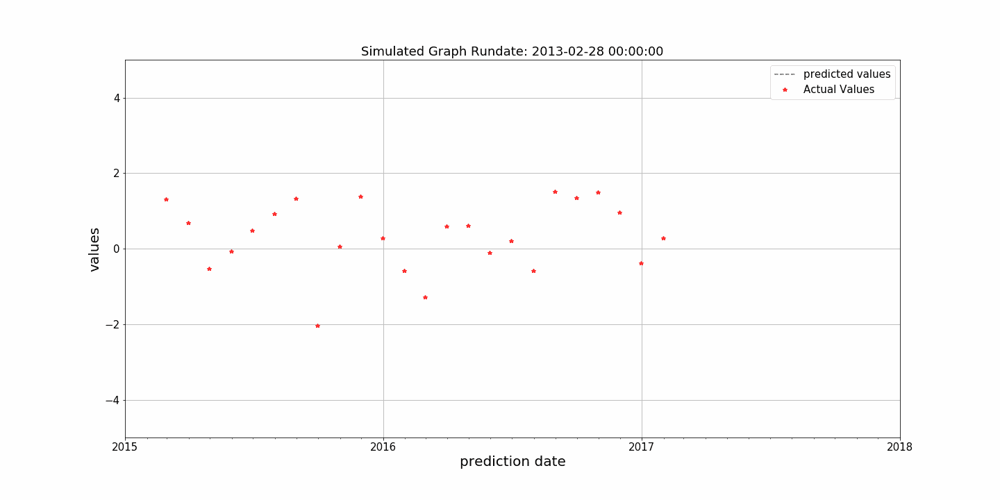

# 如何使用 Python 创建动画图形？

> 原文：<https://towardsdatascience.com/how-to-create-an-animated-graph-using-python-446f61bb88d3?source=collection_archive---------38----------------------->

呈现模拟/预测/预测模型的一种方式

史蒂文·洛艾扎的照片

# 用于预测的 Python 模拟图

你有没有想过展示模特表演的最佳方式是什么？我应该谈论 R-Square、RMSE、准确性，还是直接告诉我的经理，我把它放进了一个黑盒子，它工作得很好。

照片由[丹尼尔·明戈金](https://unsplash.com/@danielmingookkim?utm_source=medium&utm_medium=referral)在 [Unsplash](https://unsplash.com?utm_source=medium&utm_medium=referral) 上拍摄

下面我将向你展示如何创建动画图形，以帮助呈现结果。不要被所有的代码弄得不知所措，大部分是轴、标签和字体大小的选项。

# 我的经历

我有一个项目，预测我们的一个顶级指标的频率。该程序每个月运行一次，预测下一年的指标。(我不会用模型来烦你，但我会向你展示我是如何展示它的)

我模拟了模型的使用。为了向我的管理团队展示这一点，我想用动画图来展示它。

最酷的是，我还可以显示程序运行的日期。

# **库**

好的，让我们从导入一些我们将要使用的库开始。

## 数据

下面我们将创建一个数据框用于我们的图表。有四列:运行预测的日期、预测的日期、实际值和预测值

## 动画图表

接下来，我们将创建动画图形。

它从一些基础开始。它创建一个空图形，然后添加 x 轴和 y 轴的边界。

接下来，它为实际值创建一行。这条线会一直出现在图上。以及动画将迭代预测值的空行。

最后，我们创建两个函数 init()和 animate()，这是 matplotlib 中 FuncAnimation 所必需的。

请务必更改路径，这是保存 GIF 的位置。

## 结论

请随意使用上面的代码，并用您自己的数据替换它。请注意，您可以在图表中添加更多的线条。

附加参考:

 [## Matplotlib . animation . func animation-Matplotlib 3 . 2 . 1 文档

### 通过反复调用函数 func 制作动画。参数:用于获取绘图的图形对象…

matplotlib.org](https://matplotlib.org/api/_as_gen/matplotlib.animation.FuncAnimation.html) 

感谢您的阅读！