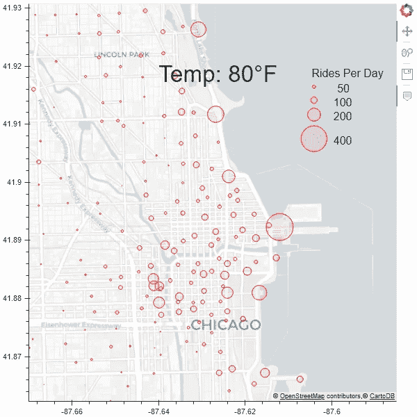
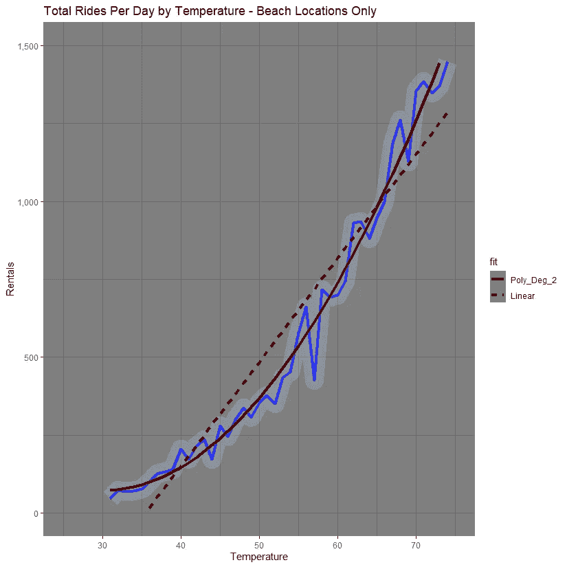
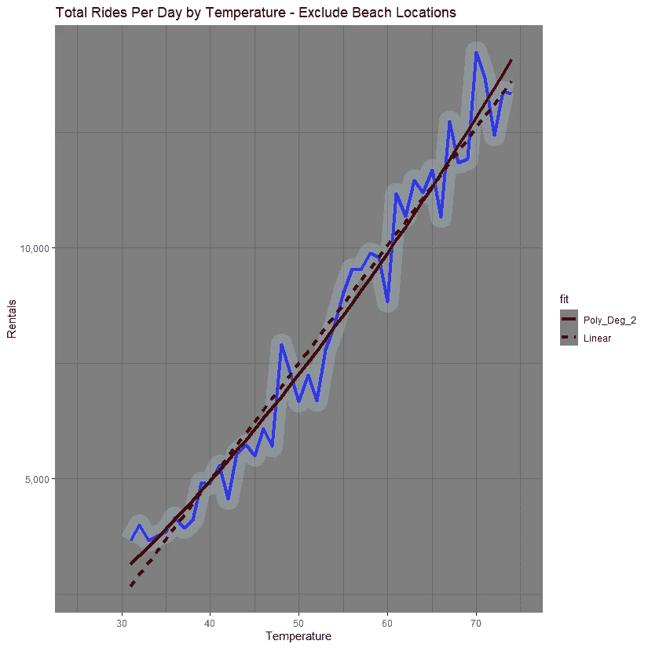

# 如何创建芝加哥自行车租赁的动画地图

> 原文：<https://towardsdatascience.com/how-to-create-an-animated-map-of-bike-rentals-in-chicago-fa2f8e7ce710?source=collection_archive---------45----------------------->

## 向使用 Python 包 Bokeh 创建的可视化添加动画

图片由作者上传至 gfycat

*本文假设读者已经知道如何使用 Python 中的散景库绘制地理数据。关于精彩透彻的解释，请看这篇* [*文章*](/exploring-and-visualizing-chicago-transit-data-using-pandas-and-bokeh-part-ii-intro-to-bokeh-5dca6c5ced10) *作者* [*科林·帕特里克·里德*](https://towardsdatascience.com/@colinpatrickreid) *。*

您的数据已经过处理，并且您已经成功地改编了 Colin 的代码，在散景中创建了您自己的漂亮可视化效果，但是您希望传达比静态图像更多的信息。你来对地方了！

**初始设置**
我们将从这个已经[处理过的数据](https://github.com/mthomp12/mthomp12.github.io/blob/master/assets/images/divvy_data.csv)开始，该数据结合了自行车租赁数据和芝加哥历史日平均气温以及以下代码:

这将生成以下静态图像:

作者图片

**添加动画** 要创建一个动画图形，我们需要添加一个周期性回调函数，在指定的时间过后更新数据。为此，代码需要引用从 Python 脚本自动创建的 JavaScript 文档。因此，我们需要更新到 *curdoc()，而不是使用 *show(p)* 来显示我们的代码。add_root(列(p))* 。注意我们需要确保从 bokeh.plotting 导入 *curdoc* 并从 bokeh.layouts 导入*列*。这一改变要求脚本从命令行运行，这将在下面进一步解释。

该数据集中的每一行代表从给定自行车站租赁的自行车数量，根据平均温度(四舍五入到最接近的 5°F)计算这些天的平均值。每次更新都将数据刷新到下一个 5 F 时段，从 30 F 到 80 F。图表数据存储在字典中，包含 x 和 y 坐标以及圆的大小。每次回调都会更新字典，以获得代表下一个温度桶的新圆圈尺寸。为了进行更新，将散景圆对象存储在一个变量中，然后用更新的数据字典更新*variable _ name . data _ source . data*。

**平滑和调步** 数据被分组到 5°F 的桶中，以确保每个温度都有足够数量的数据点，并使总体趋势更容易解释。如果我们直接从一个温度区间过渡到下一个温度区间，动画会非常不连贯，很难从图表中获得洞察力。为了平滑动画，每一帧都会插入自行车租赁的数量以及上一桶和下一桶之间的温度(四舍五入到最接近的度数)。

我发现每桶 20 帧会产生平滑的动画。这相当于每度 4 帧(每 5f 20 帧=每 1f 4 帧)。每 80 毫秒刷新一次数据会导致每个温度显示 0.32 秒(0.08 秒* 4 帧)，总运行时间为 16 秒(0.32 * 50 个温度)。

附加代码:

完整的代码可以在这里找到[。](https://github.com/mthomp12/Animated_Bike_Graph/blob/master/AnimatedGraph.py)

**创建 GIF** 添加回调函数并通过 *curdoc* 方法调用图形足以创建一个将在您的浏览器中的 localhost 上运行的动画图形，但是如果您想要创建一个动画文件(可能包括在 PowerPoint 演示文稿中)，那么您将需要创建一个. GIF 文件。

要创建 gif，通过 bokeh.io 中的 *export_png* 方法将动画的每一帧保存到一个. png 文件中(参见上面的代码)。然后使用 imageio 库中的 *imread* 函数从 png 文件创建 gif:

注意:我建议在保存任何 png 文件之前，完成你的散景服务器代码(包括平滑和调步)。保存所有的 png 文件比生成服务器要花更多的时间，所以对服务器进行错误检查比对生成的 gif 进行错误检查要快得多。

**Bokeh 服务器 vs GIF 运行时**
观察力敏锐的读者可能注意到了，我计算出 GIF 有 16 秒长，但本文开头的动画实际上运行了 20 秒。为什么会有差异？从这段代码创建的散景服务器确实运行了 16 秒，但是我没有在从 png 文件创建 gif 的代码中指定帧率。默认值为每秒 10 帧(fps)，而在 Bokeh 服务器代码中使用的是每秒 12.5 帧(1 帧/80 毫秒回调周期)，这解释了 gif 的 20 秒运行时间(gif 中的 12.5 fps/Bokeh 服务器中的 10 fps * 16 秒)。

如果散景服务器的速度与生成的 gif 不同，请记住这一点。您可以通过 fps 参数在 *mimsave* 函数中指定所需的帧速率，或者将周期性回调刷新率设置为 100 毫秒(相当于 *mimsave* 的默认值 10 fps)。

**运行您的代码** 静态图像可以直接从您的 IDE 中运行，但是如前所述， *curdoc* 方法需要从命令行中运行，这[使散景](https://docs.bokeh.org/en/latest/docs/user_guide/server.html#userguide-server-applications)能够在每次浏览器连接到服务器时创建一个新的绘图。若要运行代码，请从命令提示符运行以下代码:

*散景服务-显示 AnimatedGraph.py*

注意，我使用 Python 的 Anaconda 发行版，所以我实际上使用 Anaconda 提示符来运行这个命令。从您的计算机执行该命令可能需要一些额外的配置。

**结果** 制作图形动画的额外努力值得吗？我认为是的，因为它让我从数据中发现了我可能没有的洞察力，并以一种非常容易理解的方式来说明它。

您可能注意到，一旦温度达到大约 55°f，标记的湖岸位置的需求就会激增。这非常有意义，因为天气温暖时人们更有可能去海滩，但我不确定如果没有动画可视化，我是否会意识到这一点。我可能认为这些目的地总体上更受欢迎，就像河流南支以西的地方(芝加哥读者会认为这是来自郊区的通勤列车)，与温度有线性关系。

根据这一认识，我能够证明这些湖岸位置的需求随温度呈二次方增长，而其他位置则呈线性增长:

作者图片

这是有用的信息，因为它表明估计海滩位置的需求可能应该使用不同于其他位置的模型，这可以改进补货策略。