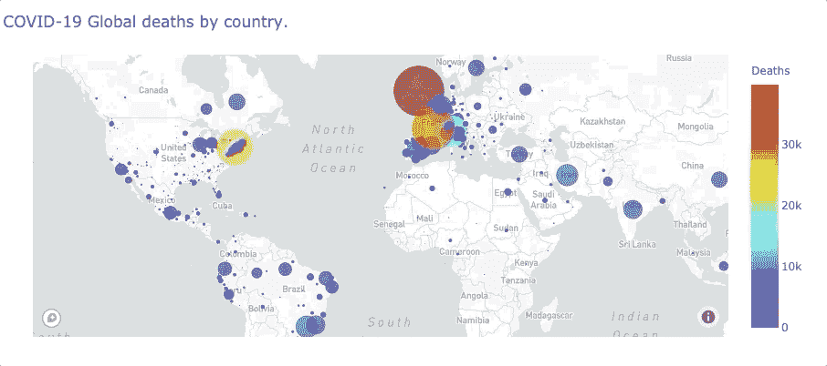

# 如何在 Jupyter 中创建一个有吸引力的气泡图

> 原文：<https://towardsdatascience.com/how-to-create-an-attractive-bubble-map-5cf452c244e9?source=collection_archive---------63----------------------->

## 将数据抓取到数据可视化的分步指南


图片来自 [Pixabay](https://pixabay.com/?utm_source=link-attribution&utm_medium=referral&utm_campaign=image&utm_content=600497) 的 [stokpic](https://pixabay.com/users/stokpic-692575/?utm_source=link-attribution&utm_medium=referral&utm_campaign=image&utm_content=600497)

```
**Table of Contents**[**Introduction**](#f1e4)1\. [Libraries](#ca78)
2\. [Data Scraping with BeautifulSoup](#c249)
3\. [The Mapbox Token](#6bfe)
4\. [Plotly.express](#fb63)
5\. [Other Datasets](#1c1d)
6\. [Comparing to Plotly.graph_object](#f972)[**Conclusion**](#e370)
```

# 介绍

在本文中，我将向您展示如何从 [CSSEGISandData 的新冠肺炎 Github repo](https://github.com/CSSEGISandData/COVID-19/) 中抓取最新数据，并使用 Plotly 和 Mapbox 创建气泡图。

我们将使用 JupyterLab(或 Jupyter Notebook，如果你喜欢的话)，Plotly express，BeautifulSoup 和 Mapbox。

以前在 JupyterLab 上安装 Plotly 很困难，但是现在安装起来很容易。你可以在这里找到[。](https://plotly.com/python/getting-started/?utm_source=mailchimp-jan-2015&utm_medium=email&utm_campaign=generalemail-jan2015&utm_term=bubble-chart)

# 图书馆

```
import requests
from bs4 import BeautifulSoup
import plotly.express as px
import pandas as pd
```

我们使用 Python 的 HTTP 库，`[requests](https://requests.readthedocs.io/en/master/)`向网页发送`get`请求。 [BeautifulSoup](https://www.crummy.com/software/BeautifulSoup/bs4/doc/) 是一个 Python 库，用于从 HTML 和 XML 文件中提取数据。

`[plotly.express](https://plotly.com/python/plotly-express/)`是 Plotly 的高级包装器。它使用更简单的语法，易于使用。`[pandas](https://pandas.pydata.org/)`是一个快速、强大、灵活且易于使用的开源数据分析和操作工具。

# 使用 BeautifulSoup 进行数据抓取

让我们开始写刮擦部分的代码。

我们设置变量`github`和`URL`。

```
github = 'https://github.com'
URL = 'https://github.com/CSSEGISandData/COVID-19/tree/master/csse_covid_19_data/csse_covid_19_daily_reports_us'
```

我们使用`request.get()`获得一个网页，并通过解析页面内容创建一个`Beautifulsoup`对象。

```
page = requests.get(URL)
soup = BeautifulSoup(page.content, 'html.parser')
```

检查页面 HTML 后，您可以发现最新的报告总是倒数第四个链接。如果你需要确认，你可以打印最新的。

```
latest = str(soup.table.find_all('a')[-4]['href'])
# print(latest)
```

输出:

```
/CSSEGISandData/COVID-19/blob/master/csse_covid_19_data/csse_covid_19_daily_reports_us/06-04-2020.csv
```

我们创建指向最新数据的链接，并使用`requests.get()`再次获取网页内容。我们可以通过打印来确认。

```
latestURL = github + latest
latestPage = requests.get(latestURL, 'html.parser')
print(latestURL)
```

输出:

```
[https://github.com/CSSEGISandData/COVID-19/blob/master/csse_covid_19_data/csse_covid_19_daily_reports_us/06-04-2020.csv](https://github.com/CSSEGISandData/COVID-19/blob/master/csse_covid_19_data/csse_covid_19_daily_reports_us/06-20-2020.csv)
```

Github 有一个 id 为`raw-url`的 raw 页面。我们得到原始页面的 URL。我们可以通过打印`rawURL`来确认。

```
soup = BeautifulSoup(latestPage.content, 'html.parser')
raw = str(soup.find(id='raw-url')['href'])
rawURL = github + raw
print(rawURL)
```

输出:

```
[https://github.com/CSSEGISandData/COVID-19/raw/master/csse_covid_19_data/csse_covid_19_daily_reports_us/06-04-2020.csv](https://github.com/CSSEGISandData/COVID-19/raw/master/csse_covid_19_data/csse_covid_19_daily_reports_us/06-20-2020.csv)
```

现在原始页面是一个 CSV 格式，我们可以使用熊猫来阅读它。我们可以通过使用`head()`打印数据来确认。

```
df = pd.read_csv(rawURL)
print(df.head())
```


df.head()的输出。图片由作者提供。

我们删除了缺少`Lat`值的行(`axis=0`)。我们还用 0 填充缺少数据的字段。

```
df = df.dropna(axis=0, subset=['Lat'])
df = df.fillna(0)
print(df.head())
```


df.fillna(0)之后的 df.head()的 Out put。图片由作者提供。

我们从第三列的第一行获取日期和时间。(第一个索引为 0)

```
date, time = df.iloc[0, 2].split()
print(date)
print(time)
```

输出:

```
2020-06-04
04:33:37
```

[](/how-to-run-jupyter-notebook-on-docker-7c9748ed209f) [## 如何在 Docker 上运行 Jupyter 笔记本

### 不再有 Python 环境和包更新

towardsdatascience.com](/how-to-run-jupyter-notebook-on-docker-7c9748ed209f) 

# 地图框标记

在[地图框](https://account.mapbox.com/)创建一个账户。并创建一个令牌。


地图框标记。作者图片

在您的 JupyterLab/Jupyter 笔记本中，创建一个文件`.mapbox_token`，并将创建的令牌从 Mapbox 复制并粘贴到该文件中。

```
px.set_mapbox_access_token(open(".mapbox_token").read())
```

我们使用 Plotly express `set_mapbox_access_token`设置 Mapbox 令牌。如果您使用 Git，那么将`.mapbox_token`添加到您的`[.gitignore](https://github.com/shinokada/covid-19-stats/blob/master/.gitignore)`文件中。

# Plotly.express

代码的最后部分是设置`[plotly.express](https://plotly.com/python/plotly-express/)`参数和布局。

以下列表包含`plotly.express.scatter_mapbox`的一些关键参数。


作者快速参考。更多详情，请参见本[页](https://plotly.com/python-api-reference/generated/plotly.express.scatter_mapbox.html?highlight=scatter_mapbox#plotly.express.scatter_mapbox)。

我们用`color`、`size`、`[color_continuous_scale](https://plotly.com/python/builtin-colorscales/)`、`size_max`、`zoom`、`center`、`hover_data`和`hover_name`。如果您愿意，可以设置更多参数。

```
fig = px.scatter_mapbox(
    df, lat="Lat", lon="Long_",
    color="Deaths",
    size="Deaths",
    color_continuous_scale=px.colors.sequential.Jet,
    size_max=40,
    zoom=3, 
    center={"lat": 37.0902, "lon": -95.7129},              
    hover_data=["Confirmed"],
    hover_name='Province_State'
)
```

我们可以在`fig.update_layout`设置标题。和`fig.show()`显示图像。

```
fig.update_layout(
    title=f'COVID-19 Deaths in USA by states.  Date: {date}',
)
fig.show()
```


作者图片

所有代码:

# 其他数据集

我们可以将此用于其他 CSSEGISandData 的新冠肺炎页面。例如，使用全球每日报告链接:

```
URL = 'https://github.com/CSSEGISandData/COVID-19/tree/master/csse_covid_19_data/csse_covid_19_daily_reports'
```



[要诀](https://gist.github.com/shinokada/aace1fd4e1ad0b35c1f8e8577a4c481b)中的代码。作者图片

# 与 Plotly.graph_object 比较

以下 gif 图像是使用 Plotly.graph_object 创建的。你能看出区别吗？它不像地图框那样有州名、地形、河流和详细信息。你可以在这里找到代码[。](https://gist.github.com/shinokada/3a92351442c5b15c8a30f9a606f153a3)


# 结论

你现在知道如何使用 Plotly.express 制作气泡图。使用 Mapbox 库是因为它给你一个更好的展示，你可以用[各种参数](https://plotly.github.io/plotly.py-docs/generated/plotly.express.scatter_mapbox.html)控制地图。在你的数据科学项目中使用气泡图怎么样？

**通过** [**成为**](https://blog.codewithshin.com/membership) **会员，获得媒体上所有故事的访问权限。**


[https://blog.codewithshin.com/subscribe](https://blog.codewithshin.com/subscribe)

# 资源

*   你可以在地图上找到来自[https://www.latlong.net/](https://www.latlong.net/)的经纬度
*   [JupyterLab 安装](https://jupyterlab.readthedocs.io/en/stable/getting_started/installation.html)
*   [Python 中 Plotly 内置的连续色标](https://plotly.com/python/builtin-colorscales/)
*   `[plotly.express](https://plotly.github.io/plotly.py-docs/generated/plotly.express.scatter_mapbox.html)` [。散点 _ 地图框](https://plotly.github.io/plotly.py-docs/generated/plotly.express.scatter_mapbox.html)

## 相关故事

[](/how-to-create-an-interactive-dropdown-in-jupyter-322277f58a68) [## 如何在 Jupyter 中创建交互式下拉列表

### 用下拉菜单更新图表

towardsdatascience.com](/how-to-create-an-interactive-dropdown-in-jupyter-322277f58a68) [](/how-to-create-a-grouped-bar-chart-with-plotly-express-in-python-e2b64ed4abd7) [## 如何用 Python 中的 Plotly Express 创建分组条形图

### Python melt 函数将数据帧从宽到长格式化

towardsdatascience.com](/how-to-create-a-grouped-bar-chart-with-plotly-express-in-python-e2b64ed4abd7) [](/how-to-create-an-animated-choropleth-map-with-less-than-15-lines-of-code-2ff04921c60b) [## 如何用不到 15 行代码创建一个动画的 Choropleth 地图

### 在 Jupyter 上使用 Python 中的 Plotly Express

towardsdatascience.com](/how-to-create-an-animated-choropleth-map-with-less-than-15-lines-of-code-2ff04921c60b) [](/line-chart-animation-with-plotly-on-jupyter-e19c738dc882) [## Jupyter 上 Plotly 的折线图动画

### Plotly 统一悬停模式，按钮和更多

towardsdatascience.com](/line-chart-animation-with-plotly-on-jupyter-e19c738dc882) [](/how-to-create-an-animated-bar-chart-in-jupyter-9ee1de8d0e80) [## 如何在 Jupyter 中创建动画条形图

### 使用 Plotly Python 显示最新美国失业率的数据可视化

towardsdatascience.com](/how-to-create-an-animated-bar-chart-in-jupyter-9ee1de8d0e80) [](/how-to-create-a-grouped-bar-chart-with-plotly-express-in-python-e2b64ed4abd7) [## 如何用 Python 中的 Plotly Express 创建分组条形图

### Python melt 函数将数据帧从宽到长格式化

towardsdatascience.com](/how-to-create-a-grouped-bar-chart-with-plotly-express-in-python-e2b64ed4abd7) [](/stepping-into-intermediate-with-jupyter-f6647aeb1184) [## Jupyter 用户的生产力提示

### 使用 Jupyter 笔记本和 JupyterLab 让您的工作流程更加高效

towardsdatascience.com](/stepping-into-intermediate-with-jupyter-f6647aeb1184)