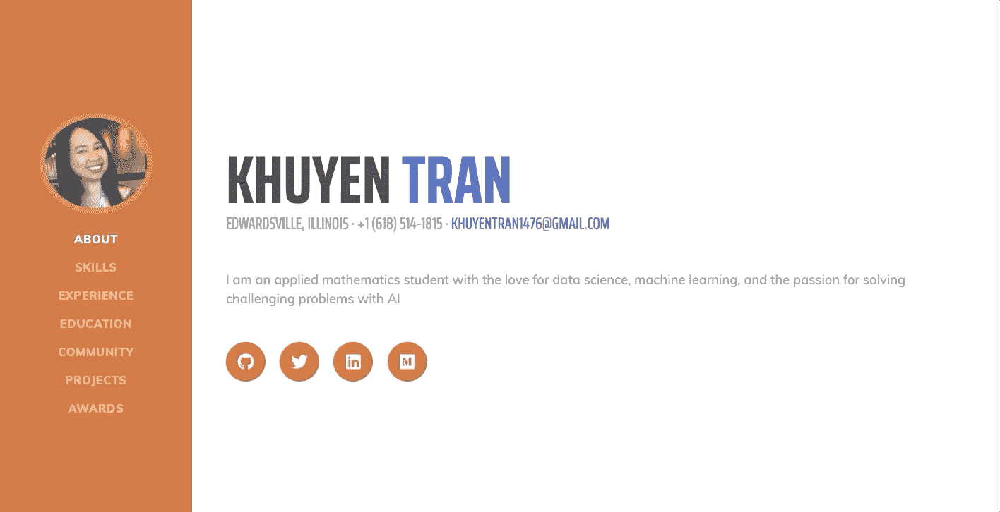
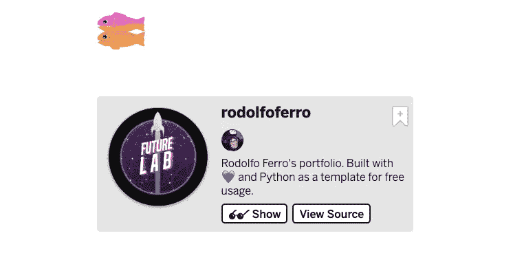
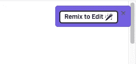
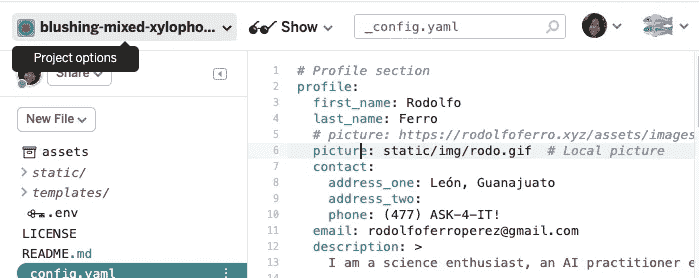
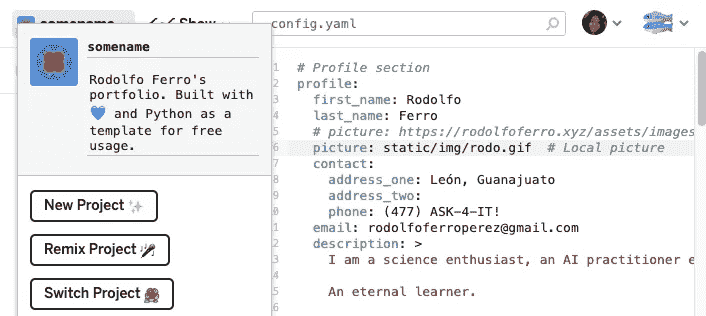
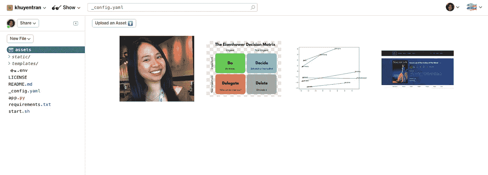
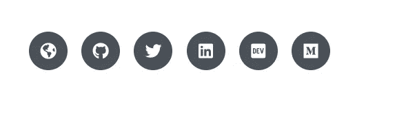
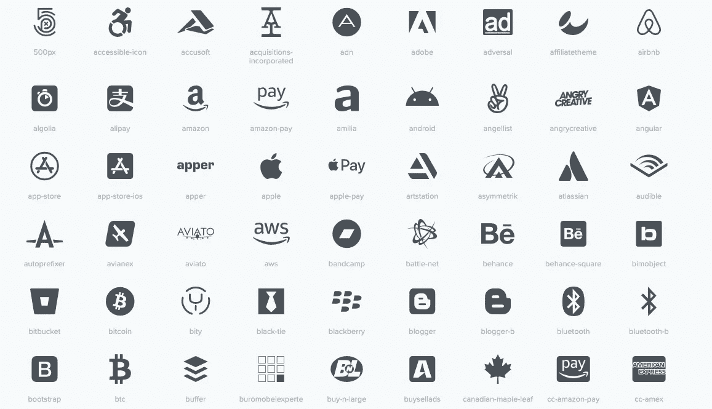
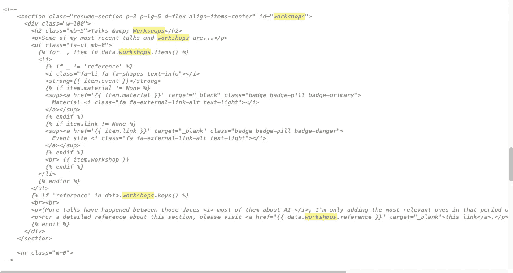
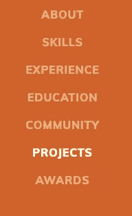

# 如何在 10 分钟内为您的数据科学产品组合创建一个优雅的网站

> 原文：<https://towardsdatascience.com/how-to-create-an-elegant-website-for-your-data-science-portfolio-in-10-minutes-577f77d1f693?source=collection_archive---------15----------------------->

## 你需要做的就是编辑

# 动机

如果简历是展示你的经验和项目的唯一来源，那么你在求职中已经落后于许多其他候选人了。为什么？因为你需要把你所有的宝贵经验、课程、技能、社团活动、证书和奖励都限制在一张纸上！当你取得更多成就时，你会犹豫是否要修改你的简历，因为修改格式、字数等需要很多工作。因此，有一个网站来展示你的背景和技能是很重要的。

“是的，我知道网站很重要，但当我使用 Wordpress 或其他网站构建工具时，我发现有许多步骤需要设置，所以我决定甚至不尝试，而是坚持使用我的简历”

如果这是你的想法，如果你知道你可以在 10 分钟内创建一个像这样的[投资组合](https://khuyentran.glitch.me/)会怎么样？

只需几个步骤，你就能拥有一个展示你潜在雇主的专业网站。

# 从 Glitch 访问模板

首先从 Glitch [这里](https://glitch.com/~rodolfoferro)进入模板。创建一个免费帐户，然后单击查看源代码。

点按页面最右边的“重新混合”进行编辑

将左上角的名称更改为您希望网站使用的名称。给你的网站命名最好的方法就是你的名字。

现在您可以通过 somename.glitch.me 访问您的网站！您现在需要做的就是更改`_config.yaml`部分的信息。重新运行网站以查看更改。

# 编辑信息

有八个部分可用

1.  **简介**:

*   你的名字，联系方式和你是谁的简短描述，你对什么有热情，你目前的任务。换句话说，简短的自我介绍。
*   您可以通过将自己的照片拖到网站上或点击`assets`部分中的上传资产来插入您的图像

2.**社交**

*   你的社交媒体和网站的链接。最棒的是它们用可点击的图标显示出来！

3.**体验**

您对职位、公司、时间段、描述和链接等相关信息的体验。

4.**社区**

你对你的学校、工作或周围的社区有什么贡献？这里是你可以展示你的领导技能的部分

5.**工具**

这部分展示你的技能。更好的是，用图标显示它们。如果有一些你正在寻找的其他技能不在图标列表中，在 [Font Awesome](https://fontawesome.com/icons?d=gallery&s=brands) 上找到更多图标。你需要做的就是找到你想要的图标，并在`tools`部分插入名字。

如果你找不到你想要的图标，你可以在 extra_skills 部分添加。

6.**车间**:

在这里，您可以展示您参加过或发表过的与数据科学相关的研讨会和活动。记下你参加过的研讨会能给你的简历带来巨大的变化。

7.**项目**

一份数据科学简历不能缺少项目。对于招聘人员来说，看到你做了什么以及你是如何做到的是很重要的。如果您的链接太长，您可以使用[稍微缩短 URL。您还可以附加标签和图像，为您的项目添加可视化效果](http://app.bitly.com/)

附加图像的快速修复，以便显示您在资源中插入的图像。转到`templates/index.html,`这里是构建网站的 html 代码。放心吧！你不需要熟悉 html。你需要做的就是从``注释掉。对 html 中出现工作室的另一部分做同样的事情。

现在你再也看不到车间部分了。整洁！

# 结论

我希望你能看到为你的作品集创建一个专业网站是多么容易。现在，当向潜在雇主或招聘人员介绍自己时，你可以**自信地与他们分享你的网站**。如果你的投资组合里还没有很多东西，不要着急！当你在网站上看到你的成就时，你会有动力去取得更多。注意微小的成就。**随着时间的推移，即使是一件小事也很重要。**

我喜欢写一些基本的数据科学概念，并尝试不同的算法和数据科学工具。你可以在 [LinkedIn](https://www.linkedin.com/in/khuyen-tran-1401/) 和 [Twitter](https://twitter.com/KhuyenTran16) 上和我联系。

如果你想查看我写的所有文章的代码，请点击这里。在 Medium 上关注我，了解我的最新数据科学文章，例如:

 [## 当生活不给你喘息的机会，如何学习数据科学

### 我努力为数据科学贡献时间。但是发现新的策略使我能够提高我的学习速度和…

towardsdatascience.com](/how-to-learn-data-science-when-life-does-not-give-you-a-break-a26a6ea328fd)  [## 高效 Python 代码的计时

### 如何比较列表、集合和其他方法的性能

towardsdatascience.com](/timing-the-performance-to-choose-the-right-python-object-for-your-data-science-project-670db6f11b8e)  [## 字典作为 If-Else 的替代

### 使用字典创建一个更清晰的 If-Else 函数代码

towardsdatascience.com](/dictionary-as-an-alternative-to-if-else-76fe57a1e4af)  [## 如何找到和 Python 很好的搭配

### 给定个人偏好，如何匹配使得总偏好最大化？

towardsdatascience.com](/how-to-match-two-people-with-python-7583b51ff3f9)  [## 用这 6 个小窍门提高你的效率

### 并控制您的阵列

towardsdatascience.com](/boost-your-efficiency-with-these-6-numpy-tricks-29ca2fe81ecd)