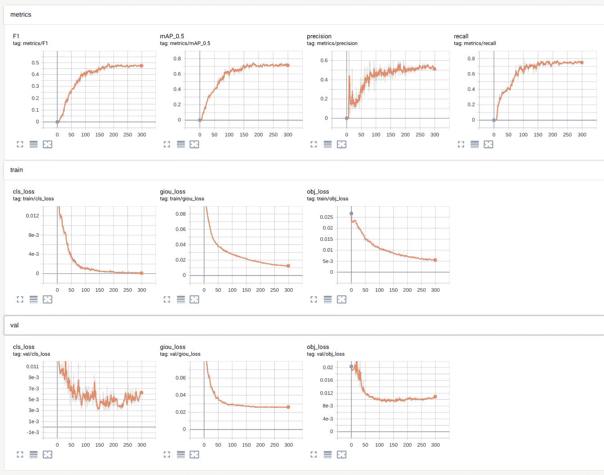

# 如何使用 Yolov5 创建一个端到端的对象检测器？

> 原文：<https://towardsdatascience.com/how-to-create-an-end-to-end-object-detector-using-yolov5-35fbb1a02810?source=collection_archive---------10----------------------->


## 是的，Yolov5 在这里

Ultralytics 最近在围绕其名称的争议中推出了 YOLOv5。作为背景，YOLO 的前三个版本(你只看一次)是由约瑟夫·雷德蒙创作的。在此之后，Alexey Bochkovskiy 在 darknet 上创建了 YOLOv4，它比以前的迭代拥有更高的平均精度(AP)和更快的结果。

现在，Ultralytics 发布了 YOLOv5，AP 相当，推理时间比 YOLOv4 更快。这让许多人不禁要问:一个新版本是否有理由获得与 YOLOv4 相似的精确度？无论答案是什么，这都是检测社区发展速度的一个明显标志。


[来源](https://github.com/ultralytics/yolov5) : Ultralytics Yolov5

自从他们[首次移植 YOLOv3](https://github.com/ultralytics/yolov3) 以来，Ultralytics 已经使使用 Pytorch 创建和部署模型变得非常简单，所以我渴望尝试 YOLOv5。事实证明，Ultralytics 进一步简化了这个过程，结果不言自明。

***在本文中，我们将使用 YOLOv5 创建一个检测模型，从创建我们的数据集并对其进行注释，到使用他们卓越的库进行训练和推理。*** 本帖重点介绍 YOLOv5 的实现，包括:

*   创建玩具数据集
*   注释图像数据
*   创建项目结构
*   培训 YOLOv5

# 创建自定义数据集

如果您有图像数据集，可以放弃第一步。由于我没有图像，我正在从开放图像数据集(OID)下载数据，这是获取可用于分类和检测的带注释图像数据的绝佳资源。请注意，为了便于学习，我们不会使用 OID 提供的注释，而是创建自己的注释。

## 1.OIDv4 下载图像:

为了从开放的图像数据集中下载图像，我们首先克隆 [OIDv4_ToolKit](https://github.com/EscVM/OIDv4_ToolKit) 并安装所有需求。

```
git clone [https://github.com/EscVM/OIDv4_ToolKit](https://github.com/EscVM/OIDv4_ToolKit)
cd [OIDv4_ToolKit](https://github.com/EscVM/OIDv4_ToolKit)
pip install -r requirements.txt
```

我们现在可以使用这个文件夹中的`main.py`脚本来下载图像以及多个类的标签。

下面我正在下载板球和足球的数据来创建我们的自定义数据集。也就是说，我们将创建一个足球和板球数据集，学习任务是检测这些球。

```
python3 main.py downloader --classes Cricket_ball  Football --type_csv all -y --limit 500
```

以下命令创建一个名为“OID”的目录，其结构如下:


OID 目录结构。我们将只取图像文件(。jpg ),而不是标签，因为我们将手动注释以创建我们的自定义数据集，尽管如果不同的项目需要，我们可以使用它们。

在我们继续之前，我们需要将所有图像复制到同一个文件夹中，以便从头开始我们的标记练习。您可以选择手动完成，但也可以使用递归 glob 函数以编程方式快速完成:

```
import os
from glob import globos.system("mkdir Images")
images = glob(r'OID/**/*.jpg', recursive=True)
for img in images:
    os.system(f"cp {img} Images/")
```

## 2.用超级标签标记图像

我们将使用名为 Hyperlabel 的工具来标记我们的图像。过去，我使用过很多工具来创建注释，比如 labelimg、labelbox 等等。但从未遇到过如此简单且过于开源的工具。唯一的缺点是你不能在 Linux 上使用这个工具，只能在 Mac 和 Windows 上使用，但是我想这对我们大多数人来说都没问题。


1.创建项目，2，设置标签，3。添加本地图像数据源，4。给…作注解

这个工具最好的部分是它提供的各种输出格式。因为我们想获得 Yolo 的数据，所以我们将关闭 Yolo 格式，并在注释完成后导出它。但是如果您想获得 JSON 格式(COCO)或 XML 格式(Pascal VOC)的注释，您也可以选择使用这个工具。


5.出口

以 Yolo 格式导出实际上是为我们的每个图像创建一个. txt 文件，其中包含图像的 class_id、x_center、y_center、宽度和高度。它还创建了一个名为`obj.names`的文件，这有助于将 class_id 映射到类名。例如:


图像、其注释和 obj.names 文件

请注意，在注释文件中，坐标从 0 缩放到 1。另外，请注意，根据从 0 开始的`obj.names` 文件，板球的 class_id 为 0，足球的 class _ id 为 1。我们用它创建了一些其他的文件，但是我们不会在这个例子中使用它们。

一旦我们完成了这些，我们就基本上设置好了我们的自定义数据集，我们只需要重新排列其中的一些文件，以便在以后训练模型时进行后续的训练和验证分割。数据集目前是一个文件夹，如下所示，包含图像和注释:

```
dataset
    - 0027773a6d54b960.jpg  
    - 0027773a6d54b960.txt
    - 2bded1f9cb587843.jpg
    - 2bded1f9cb587843.txt
    --
    --
```

# 设置项目

为了训练我们的自定义对象检测器，我们将使用 Ultralytics 的 Yolov5。我们从克隆存储库和安装依赖项开始:

```
git clone [https://github.com/ultralytics/yolov5](https://github.com/ultralytics/yolov5) # clone repo
cd yolov5
pip install -U -r requirements.txt
```

然后，我们开始创建自己的名为 training 的文件夹，在其中保存我们的自定义数据集。

```
!mkdir training
```

我们首先将自定义数据集文件夹复制到这个文件夹中，并使用简单的`train_val_folder_split.ipynb`笔记本创建训练验证文件夹。下面的代码只是创建一些训练和验证文件夹，并用图像填充它们。

```
import glob, os
import random# put your own path here
dataset_path = 'dataset'# Percentage of images to be used for the validation set
percentage_test = 20!mkdir data
!mkdir data/images
!mkdir data/labels
!mkdir data/images/train
!mkdir data/images/valid
!mkdir data/labels/train
!mkdir data/labels/valid# Populate the folders
p = percentage_test/100
for pathAndFilename in glob.iglob(os.path.join(dataset_path, "*.jpg")):  
    title, ext = os.path.splitext(os.path.basename(pathAndFilename))
    if random.random() <=p :
        os.system(f"cp {dataset_path}/{title}.jpg data/images/valid")
        os.system(f"cp {dataset_path}/{title}.txt data/labels/valid")
    else:
        os.system(f"cp {dataset_path}/{title}.jpg data/images/train")
        os.system(f"cp {dataset_path}/{title}.txt data/labels/train")
```

运行之后，您的`data`文件夹结构应该如下所示。它应该有两个目录`images`和`labels`。


我们现在必须向`training`文件夹添加两个配置文件:

**1。Dataset.yaml:** 我们创建一个文件“`dataset.yaml`”，它包含训练和验证图像的路径以及类。

```
# train and val datasets (image directory or *.txt file with image paths)
train: training/data/images/train/
val: training/data/images/valid/# number of classes
nc: 2# class names
names: ['Cricketball', 'Football']
```

**2。在创建我们的网络时，我们可以使用从小到大的多个模型。例如，`yolov5/models` 目录下的`yolov5s.yaml`文件是 7M 参数的小型 Yolo 模型，`yolov5x.yaml`是 96M 参数的最大 Yolo 模型。对于这个项目，我将使用有 50M 参数的`yolov5l.yaml`。我们首先将文件从`yolov5/models/yolov5l.yaml`复制到 training 文件夹，并根据我们的项目需求将`nc`的类数改为 2。**

```
# parameters
nc: 2  # change number of classes
depth_multiple: 1.0  # model depth multiple
width_multiple: 1.0  # layer channel multiple
```

# 火车

此时，我们的培训文件夹如下所示:


一旦我们完成了上述步骤，我们就可以开始训练我们的模型了。这就像运行下面的命令一样简单，在这里我们提供配置文件和各种其他参数的位置。您可以在`train.py`文件中查看不同的其他选项，但这些选项是我发现值得注意的。

```
# Train yolov5l on custom dataset for 300 epochs
$ python train.py --img 640 --batch 16 --epochs 300--data training/dataset.yaml --cfg training/yolov5l.yaml --weights ''
```

在这种情况下，在单个 GPU 上运行 PyTorch 版时，有时可能会出现错误:

```
# Train yolov5l on custom dataset for 300 epochs
$ python train.py --img 640 --batch 16 --epochs 300--data training/dataset.yaml --cfg training/yolov5l.yaml --weights '' --device 0
```

一旦开始训练，您可以通过检查自动创建的文件`train_batch0.jpg`来检查训练是否已经设置，该文件包含第一批的训练标签和`test_batch0_gt.jpg`，该文件包含测试图像的基本事实。他们就是这样找我的。


左:train_batch0.jpg，右:test_batch0_gt.jpg

# 结果

要使用 tensorboard 在浏览器中查看`localhost:6006`的训练结果，请在另一个终端选项卡中运行此命令

```
tensorboard --logdir=runs
```

以下是各种验证指标。在训练结束时，这些指标也会保存在文件`results.png`中。



# 预测

Ultralytics Yolov5 提供了许多不同的方法来检查新数据的结果。

要检测一些图像，您只需将它们放入名为`inference/images`的文件夹中，并根据验证 AP 使用最佳权重运行推理:

```
python detect.py --weights weights/best.pt
```


结果

您还可以使用 detect.py 文件在视频中进行检测:

```
python detect.py --weights weights/best.pt --source inference/videos/messi.mp4 --view-img --output inference/output
```

在这里，我指定我想使用`— view-img`标志来查看输出，我们将输出存储在位置 inference/output。这将在这个位置创建一个`.mp4`文件。令人印象深刻的是，网络可以看到球，在这里做出推断的速度，以及从未观察到的数据的惊人准确性。


还有，这是梅西…..

您也可以通过将`--source`指定为 0 来将网络摄像头用作信号源。您可以查看`detect.py`文件中的各种其他选项。

# 结论

***在这篇文章中，我谈到了如何使用自定义数据集创建一个 Yolov5 对象检测模型。我喜欢 Ultralytics 让创建对象检测模型变得如此简单的方式。***

此外，他们提供的查看模型结果的各种方式使它成为我很长时间以来看到的一个完整的包。

如果你想自己尝试定制数据集，你可以在 [Kaggle](https://www.kaggle.com/mlwhiz/detection-footballvscricketball) 下载带注释的数据，在 [Github](https://github.com/MLWhiz/data_science_blogs/tree/master/yolov5CustomData) 下载代码。

如果想详细了解各种 ***物体检测技术，运动估计，视频中的物体跟踪等*** 。，在此推荐这门关于计算机视觉[深度学习](https://coursera.pxf.io/7mKnnY)的优秀课程。如果你想知道更多关于物体检测领域这些年是如何发展的，你也可以看看我上一篇关于物体检测的[文章。](/a-hitchhikers-guide-to-object-detection-and-instance-segmentation-ac0146fe8e11)

谢谢你的阅读。将来我也会写更多初学者友好的帖子。在 [**媒体**](https://medium.com/@rahul_agarwal) 关注我或者订阅我的 [**博客**](http://eepurl.com/dbQnuX) 了解他们。一如既往，我欢迎反馈和建设性的批评，可以通过 Twitter [@mlwhiz](https://twitter.com/MLWhiz) 联系到我

这个故事在这里首次发表[。](https://lionbridge.ai/articles/create-an-end-to-end-object-detection-pipeline-using-yolov5/)