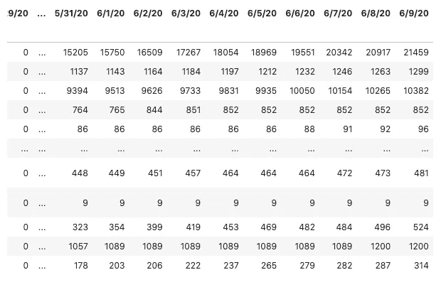

# 如何在 Jupyter 中创建交互式下拉列表

> 原文：<https://towardsdatascience.com/how-to-create-an-interactive-dropdown-in-jupyter-322277f58a68?source=collection_archive---------15----------------------->

## 用下拉菜单更新图表


[杰瑞米·托马斯](https://unsplash.com/@jeremythomasphoto?utm_source=medium&utm_medium=referral)在 [Unsplash](https://unsplash.com?utm_source=medium&utm_medium=referral) 上拍照

```
**Table of Contents**[**Introduction**](#b6ac)1\. [Libraries](#0ba4)
2\. [Data Setup for the Dropdown](#9ef9)
3\. [Multiple Plot Function](#bd3b)
4\. [Interactive Dropdown Menu](#b2ef)
5\. [All the Code](#14d0)
6\. [Using for Other Datasets](#6829)[**Conclusion**](#08ef)
```

# 介绍

在上一篇文章的[中，我写了如何使用 Plotly.express 和 Mapbox 创建气泡图。气泡图可以在一张地图上显示不同大小的所有数据。](/how-to-create-an-attractive-bubble-map-5cf452c244e9)

在这篇文章中，我将写一个使用下拉菜单的交互式图表。

当您有一系列数据集并希望将一个数据集与其他数据集分开时，此方法非常有用。

我在这篇文章中使用的是 CSSEGISandData 的新冠肺炎 Github repo。

# 图书馆

```
import pandas as pd
import numpy as np
import plotly.graph_objects as go
```

[pandas](https://pandas.pydata.org/) 是一个快速、强大、灵活且易于使用的开源数据分析和操作工具。Numpy 是用 Python 进行科学计算的基础包。 [Plotly](https://plotly.com/) 是一个交互式的开源 Python 图形库。

# 下拉列表的数据设置

让我们开始准备数据集。我们将使用[时间序列数据](https://github.com/CSSEGISandData/COVID-19/blob/master/csse_covid_19_data/csse_covid_19_time_series/time_series_covid19_confirmed_global.csv)，你可以在这里找到原始数据[。](https://raw.githubusercontent.com/CSSEGISandData/COVID-19/master/csse_covid_19_data/csse_covid_19_time_series/time_series_covid19_confirmed_global.csv)

创建一个变量`confirmed_global`，使用 Panda 的 read_csv 将数据存储到`covid19_confirmed`中。我们将索引列设置为国家/地区，并显示数据帧。

```
# confirmed_global
confirmed_global='https://raw.githubusercontent.com/CSSEGISandData/COVID-19/master/csse_covid_19_data/csse_covid_19_time_series/time_series_covid19_confirmed_global.csv'covid19_confirmed=pd.read_csv(confirmed_global,index_col='Country/Region')display(covid19_confirmed)
```


(图 1)covid 19 _ 已确认。作者图片

有 266 行。这在索引中有`Country/Region`，在标签上有`Lat`、`Long`和日期。

我们将从数据帧中提取最新的日期。我们[转置](https://pandas.pydata.org/pandas-docs/stable/reference/api/pandas.DataFrame.transpose.html)数据集，covid19_confirmed(图 1)，使用`T`并显示最后 5 行。Pandas 的转置通过将行写成列来反映数据帧的主对角线，反之亦然。

```
display(covid19_confirmed.T.tail())
```


(图 2)covid 19 _ 已确认。T.tail()。作者图片

转置的数据帧在索引中有日期，在标签中有国家名称。

我们在索引栏的末尾找到了最新的日期。我们可以使用`index.values[-1]`提取最新的日期。

```
confirmed_latest = covid19_confirmed.T.index.values[-1]
display(confirmed_latest)
```

输出:“2010 年 6 月 9 日”

有多行具有相同的`Country/Region`。


(图 3)covid 19 _ 已确认。作者图片

我们可以在上面的图 3 中找到澳大利亚的 8 行。

我们通过`Country/Region`将它们分组在一起，并计算总和。

```
df_grouped_conf=covid19_confirmed.groupby('Country/Region').sum()display(df_grouped_conf.head(10))
```

这是前 10 行。


(图 4) df_grouped_conf。作者图片

以前我们有 266 行，现在我们有 142 行。澳大利亚有一排。

`df_grouped_conf`(图 4)的末尾是最新的日期(本例中为 6/9/20)。



(图 5) df_grouped_conf。作者图片

我们将使用`ascending=False`按照这个值`confirmed_latest`对数据帧进行排序。我们使用`head(10)`选择前 10 个国家，并删除`Lat`和`Long`列。我们在最后使用`T`转置数据帧。

```
df_confirmed=df_grouped_conf.sort_values(confirmed_latest,ascending=False).head(10).drop(['Lat', 'Long'],axis=1).T
```


(图 6)df _ 确认。作者图片

[](/how-to-run-jupyter-notebook-on-docker-7c9748ed209f) [## 如何在 Docker 上运行 Jupyter 笔记本

### 不再有 Python 环境和包更新

towardsdatascience.com](/how-to-run-jupyter-notebook-on-docker-7c9748ed209f) [](/how-to-create-an-attractive-bubble-map-5cf452c244e9) [## 如何在 Jupyter 中创建一个有吸引力的气泡图

### 从 Github repo 抓取数据的分步指南

towardsdatascience.com](/how-to-create-an-attractive-bubble-map-5cf452c244e9) 

# 多重绘图功能

我们可以在这里找到其他情节性的下拉示例[。](https://plotly.com/python/dropdowns/)

我们创建了一个名为 multi_plot 的函数。这需要两个变量:

*   `df`:以国家为列，以行为日期的数据框
*   `addAll`:布尔型。True 在下拉按钮中显示全部。全部一次显示所有国家。我们设置默认的`True`。

我们创建一个`plotly.graph_objects`的[人物](https://plotly.com/python-api-reference/generated/plotly.graph_objects.Figure.html)的实例。

我们使用 for 循环来迭代通过`df.columns.to_list()`获得的县名。

`df.columns.to_list()`返回一个列表，['美国'，'巴西'，'俄罗斯'，…]。

在迭代中，我们[向图中添加一个轨迹](https://plotly.com/python-api-reference/generated/plotly.graph_objects.Figure.html#plotly.graph_objects.Figure.add_trace)。您可以使用`plotly.graph_objects.Scatter`或`plotly.graph_objects.Bar`进行跟踪，我们将使用`Scatter`。

我们定义了`x`、`y`和`name`。`name`参数设置一个`trace name`。`trace name`显示为图例项并处于悬停状态。

```
def multi_plot(df, title, addAll = True):
    fig = go.Figure() for column in df.columns.to_list():
        fig.add_trace(
            go.Scatter(
                x = df.index,
                y = df[column],
                name = column
            )
        )
    // continue
```

我们定义一个字典`button_all`和函数`create_layout_button`，在`[update_layout](https://plotly.com/python-api-reference/generated/plotly.graph_objects.Figure.html?highlight=update_layout#plotly.graph_objects.Figure.update_layout)`中使用。`update_layout`更新图形布局的属性并返回图形对象。

在`fig.update_layout()`方法中，我们使用`updatemenus`，它是`plotly.graph_objects.layout.Updatemenu`实例的元组。

我们还将`yaxis_type="log"`设置为在 y 轴上显示对数刻度，并将`height`设置为 400px。

```
 // continue 
    button_all = dict(label = 'All',
                      method = 'update',
                      args = [{'visible':    df.columns.isin(df.columns),
                               'title': 'All',
                               'showlegend':True}]) def create_layout_button(column):
        return dict(label = column,
                    method = 'update',
                    args = [{'visible': df.columns.isin([column]),
                             'title': column,
                             'showlegend': True}]) fig.update_layout(
        updatemenus=[go.layout.Updatemenu(
            active = 0,
            buttons = ([button_all] * addAll) +  list(df.columns.map(lambda column: create_layout_button(column)))
            )
        ],
         yaxis_type="log"       
    )
    # Update remaining layout properties
    fig.update_layout(
        title_text=title,
        height=800

    )

    fig.show()
```

# 交互式下拉菜单

最后一部分是使用 multi_plot 函数。

```
multi_plot(df_confirmed, title="Logarithmic COVID-19 time series total confirmed by country")
```


交互式下拉菜单

# 所有的代码

# 用于其他数据集

[CSSEGISandData 的新冠肺炎 Github repo](https://github.com/CSSEGISandData/COVID-19/) 还有两个数据集。您可以使用相同的代码创建其他图形。

你可以在这里看到现场直播。

```
[https://raw.githubusercontent.com/CSSEGISandData/COVID-19/master/csse_covid_19_data/csse_covid_19_time_series/time_series_covid19_deaths_global.csv](https://raw.githubusercontent.com/CSSEGISandData/COVID-19/master/csse_covid_19_data/csse_covid_19_time_series/time_series_covid19_deaths_global.csv')
```


Covid19 时间序列全球死亡

```
[https://raw.githubusercontent.com/CSSEGISandData/COVID-19/master/csse_covid_19_data/csse_covid_19_time_series/time_series_covid19_recovered_global.csv](https://raw.githubusercontent.com/CSSEGISandData/COVID-19/master/csse_covid_19_data/csse_covid_19_time_series/time_series_covid19_recovered_global.csv')
```


Covid19 时序全球复苏

# 结论

你可能会发现 Plotly 有太多的参数，有时令人困惑。但是[示例代码](https://plotly.com/python/dropdowns/)提供了各种示例，您可以将其用于您的数据科学项目。

**通过** [**成为**](https://blog.codewithshin.com/membership) **会员，可以完全访问媒体上的每一个故事。**


[https://blog.codewithshin.com/subscribe](https://blog.codewithshin.com/subscribe)

[](/how-to-create-a-grouped-bar-chart-with-plotly-express-in-python-e2b64ed4abd7) [## 如何用 Python 中的 Plotly Express 创建分组条形图

### Python melt 函数将数据帧从宽到长格式化

towardsdatascience.com](/how-to-create-a-grouped-bar-chart-with-plotly-express-in-python-e2b64ed4abd7) [](/how-to-create-an-animated-choropleth-map-with-less-than-15-lines-of-code-2ff04921c60b) [## 如何用不到 15 行代码创建一个动画的 Choropleth 地图

### 在 Jupyter 上使用 Python 中的 Plotly Express

towardsdatascience.com](/how-to-create-an-animated-choropleth-map-with-less-than-15-lines-of-code-2ff04921c60b) [](/how-to-create-an-animated-bar-chart-in-jupyter-9ee1de8d0e80) [## 如何在 Jupyter 中创建动画条形图

### 使用 Plotly Python 显示最新美国失业率的数据可视化

towardsdatascience.com](/how-to-create-an-animated-bar-chart-in-jupyter-9ee1de8d0e80)