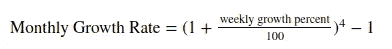

# 如何用 Python 创建一个交互式创业成长计算器

> 原文：<https://towardsdatascience.com/how-to-create-an-interactive-startup-growth-calculator-with-python-d224816f29d5?source=collection_archive---------44----------------------->

## 使用 Python 为您的创业构建实用的度量


泰勒·弗兰塔在 [Unsplash](https://unsplash.com?utm_source=medium&utm_medium=referral) 上拍摄的照片

# 动机

如果你正计划创建一家创业公司或者已经有了一家，对你的跑道和你需要达到的增长率有一个现实的预期将帮助你调整你的方法，以防止你的创业公司耗尽资金。作为一个数据爱好者，你可以使用 Python 创建一个简单的计算器来实现这个目标。

从上图中可以看出:

*   蓝色区域是剩余的现金
*   紫色线是月收入
*   橙色线是所有收入的累计总和

如果你的增长率是每月 0%，你的初创公司将在 2021 年 6 月耗尽现金。如果增长率是每月 30%，你的创业公司将在 2021 年 8 月耗尽现金。

如果您想创建一个类似于 [this](https://datapane.com/khuyen/reports/startup_finance_report_523fc74c/) 的计算器，只需克隆这个 [repo](https://github.com/datapane/gallery/tree/master/startup-calculator) 。有关安装、设置和代码解释的说明，请参见下文。

# 为计算器设置

要创建这个计算器，你只需要一些基本的信息和简单的工具来创建一个创业成长计算器:

## 参数:

*   你在银行里有多少现金
*   `forecast_length_years`:图表上显示的年数
*   `weekly_growth`:你目前的周增长率
*   `initial_revenue`:初始收入
*   `monthly_burn`:每月费用
*   `cash_injection`:现金注入(即 R & D，筹资)(可选)
*   `cash_injection_offset`(可选)

## 工具:

*   [Altair](https://altair-viz.github.io/):Python 的可视化库工具，可以快速构建漂亮的可视化效果
*   [Datapane](https://datapane.com/) :一个 Python 库，可以轻松部署您的可视化脚本

要安装上面的两个库，只需使用

```
pip3 install datapane
```

就是这样。现在我们已经准备好创建我们的创业成长计算器了！

# 制造计算器

## 导入参数

从导入相关库开始

```
import pandas as pd
import requests
import datetime
import numpy as np
import altair as alt
import datapane as dp
```

参数的输入值

然后我们根据周增长率计算月增长率。



## 假设没有增长，创建数据框架

在创建基于增长率变化的图形之前，让我们简化问题，先创建没有增长率的图形。

这将创建一个如下所示的表格

## 用 Altair 可视化

在创建图表之前，让我们考虑一下我们希望图表做什么:

*   收入根据创业公司所处的时期和每月的增长而变化。
*   当月的累计金额根据上月的收入总额而变化
*   每月的现金总额根据收入和收入前的现金总额而变化。

这给了我们一个想法来创建这样一个脚本:

# 使用数据面板部署计算器

厉害！我们为计算器创建了一个表格和一个图表。剩下的步骤就是部署这个计算器。有了 Datapane，这个任务再简单不过了！

从在 [Datapane 的网站](https://datapane.com/)上注册一分钟开始。登录后，您将获得您帐户的 API 令牌。复制并粘贴到您的终端登录，然后重新启动您的 Jupyter 笔记本。

```
datapane login --server=[https://datapane.com/](https://datapane.com/) --token='yourtoken'
```

或者，你可以像这样把它添加到你的 Jupyter 笔记本的开头

```
!datapane login --server=[https://datapane.com/](https://datapane.com/) --token='yourtoken'
```

将我们的表格和图表部署为报告就像这样简单！

这样的网站会自动为你创建！[https://data pane . com/khu yen/reports/startup _ finance _ report _ 22717 d80/](https://datapane.com/khuyen/reports/startup_finance_report_22717d80/)

在分享您刚刚创建的令人惊叹的计算器之前，让我们添加一些描述，让您的读者或用户更好地了解这个计算器是关于什么的。这可以用`dp.Markdown`轻松完成！

现在我们有了[一个优雅的网站](https://datapane.com/khuyen/reports/startup_finance_report_523fc74c/),供你的创业计算器使用，随时准备与你的队友分享！


# 结论

恭喜你！你刚刚学会了如何用[牵牛星](https://altair-viz.github.io/)和[数据面板](https://datapane.com/)为你的创业成长创建一个计算器。这是基于简单的概念、创建图表的少量代码以及部署表格和图表的最少代码完成的！我鼓励你看看这两个神奇的工具，以了解更多的方法来创建类似的图表和报告。

简单地分叉[这个 repo](https://github.com/datapane/gallery/tree/master/startup-calculator) 来玩代码并根据需要调整参数。

我喜欢写一些基本的数据科学概念，并尝试不同的算法和数据科学工具。你可以在 LinkedIn 和 T2 Twitter 上与我联系。

星[这个回购](https://github.com/khuyentran1401/Data-science)如果你想检查我写的所有文章的代码。在 Medium 上关注我，了解我的最新数据科学文章，例如:

[](/how-to-create-interactive-and-elegant-plot-with-altair-8dd87a890f2a) [## 如何用 Altair 创建交互式剧情

### 在 5 行简单的 Python 代码中利用您的数据分析

towardsdatascience.com](/how-to-create-interactive-and-elegant-plot-with-altair-8dd87a890f2a) [](/convex-hull-an-innovative-approach-to-gift-wrap-your-data-899992881efc) [## 凸包:包装数据的创新方法

### 如何利用包装算法实现数据可视化

towardsdatascience.com](/convex-hull-an-innovative-approach-to-gift-wrap-your-data-899992881efc) [](/how-to-visualize-social-network-with-graph-theory-4b2dc0c8a99f) [## 如何用图论可视化社交网络

### 找出《权力的游戏》中的影响者

towardsdatascience.com](/how-to-visualize-social-network-with-graph-theory-4b2dc0c8a99f) [](/how-to-create-a-drop-down-menu-and-a-slide-bar-for-your-favorite-visualization-tool-3a50b7c9ea01) [## 如何为你最喜欢的可视化工具创建下拉菜单和滑动条

### 使用 Python Widget，您可以用 3 行代码升级可视化

towardsdatascience.com](/how-to-create-a-drop-down-menu-and-a-slide-bar-for-your-favorite-visualization-tool-3a50b7c9ea01) [](/how-to-match-two-people-with-python-7583b51ff3f9) [## 如何找到和 Python 很好的搭配

### 给定个人偏好，如何匹配使得总偏好最大化？

towardsdatascience.com](/how-to-match-two-people-with-python-7583b51ff3f9) [](/how-to-organize-your-data-science-articles-with-github-b5b9427dad37) [## 如何用 Github 组织你的数据科学文章

### 被新信息淹没？现在，您可以轻松地跟踪文章并为其创建自定义注释

towardsdatascience.com](/how-to-organize-your-data-science-articles-with-github-b5b9427dad37)